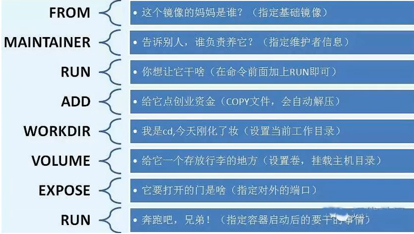

# Docker

# 1.Image

1.构建镜像

~~~shell
docker build -t ImageName:[tag] .
~~~

2.显示镜像

~~~shell
docker images
~~~

3.搜索镜像

~~~shell
docker search mysql
~~~

4.拉取镜像

~~~shell
docker pull mysql
docker pull mysql:5.7
~~~

5.删除镜像

~~~shell
docker rmi -f ID
docker rmi -f ID1 ID2 ID3
~~~

6.提交镜像

~~~shell
docker commit -a="作者" -m="提交信息" ID 镜像名：[tag]
~~~

# 2.Container

1.新建容器

~~~shell
docker run --name="mysql" image
#后台运行
docker run -d imageName 
#交互式运行，进入容器内部查看内容
docker run -it imageName 
#指定容器端口（小写p）
docker run -p 8080:3677 
docker run -p 3677
#随机指定端口（大写P）
docker run -P imageName
#挂载到本地卷(绝对路径)
docker run -p 9564:9000 --name testProject -v path:/app ImageName:tag
~~~

2.查询主机

~~~shell
#列出所有容器（正在运行和过去运行）
docker ps -a
~~~

3.退出容器

~~~shell
#容器直接停止并退出
exit
#容器不停止，退出
ctrl+P+Q
~~~

4.删除容器

~~~shell
#删除容器
docker rm ID
#强制删除
docker rm -f ID
#删除所有容器
docker ps -a -q
~~~

5.启动和停止容器操作

~~~shell
#启动容器
docker start ID
#重启容器
docker restart ID
#停止容器
docker stop ID
#强制停止当前容器
docker kill ID
~~~

6.查看日志

~~~shell
docker logs -tf ID
~~~

7.进入容器内部

~~~shell
docker attach ID
~~~

8.创建文件

~~~shell
cd /home/
touch test.java
~~~

9.拷贝文件到主机

~~~~shell
docker cp ID:/home/test.java /home(主机路径)
~~~~

# 3.DockerFile

1.编写dockerfile

~~~shell
FROM        # 基础镜像，一切从这里开始构建
MAINTAINER    # 镜像是谁写的：姓名+邮箱
RUN            # 镜像构建的时候需要运行的命令
ADD            # 步骤：tomcat镜像，这个tomcat压缩包！添加内容
WORKDIR        # 镜像的工作目录
VOLUME        # 挂载的目录
EXPOSE        # 暴露端口配置
CMD            # 指定这个容器启动的时候要运行的命令，只有最后一个会生效，可被替代
ENTRYPOINT    # 指定这个容器启动的时候要运行的命令，可以追加命令
ONBUILD        # 当构建一个被继承DockerFile这个时候就会运行ONBUILD的指令。触发指令。
COPY        # 类似ADD，将我们文件拷贝到镜像中
ENV            # 构建的时候设置环境变量！
~~~

示例

~~~dockerfile
FROM centos：7
MAINTAINER xxx<xxx@qq.com>
ENV MYPATH /sur/local
WORKDIR &MYPATH
RUN yum -y install vim
RUN yum -y install net-tools
EXPOSE 80
CMD echo &MYPATH
CMD echo "----end----"
CMD /bin/bash
~~~

-
