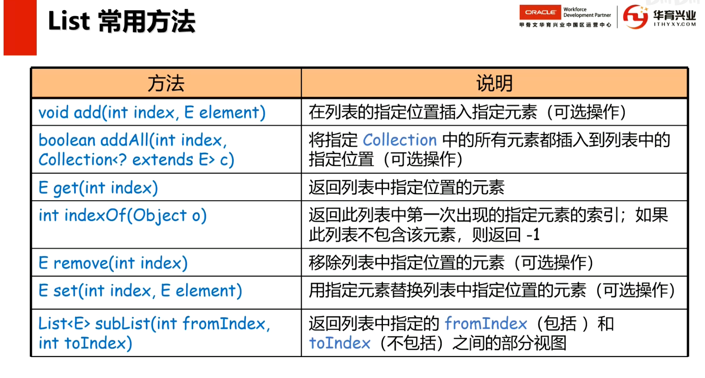
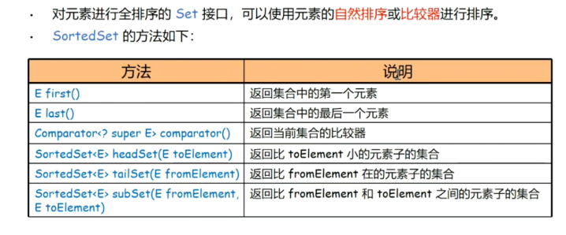
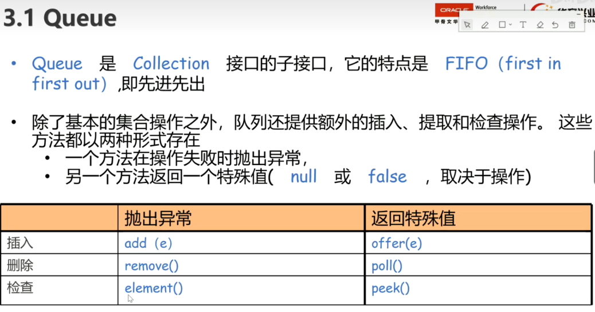
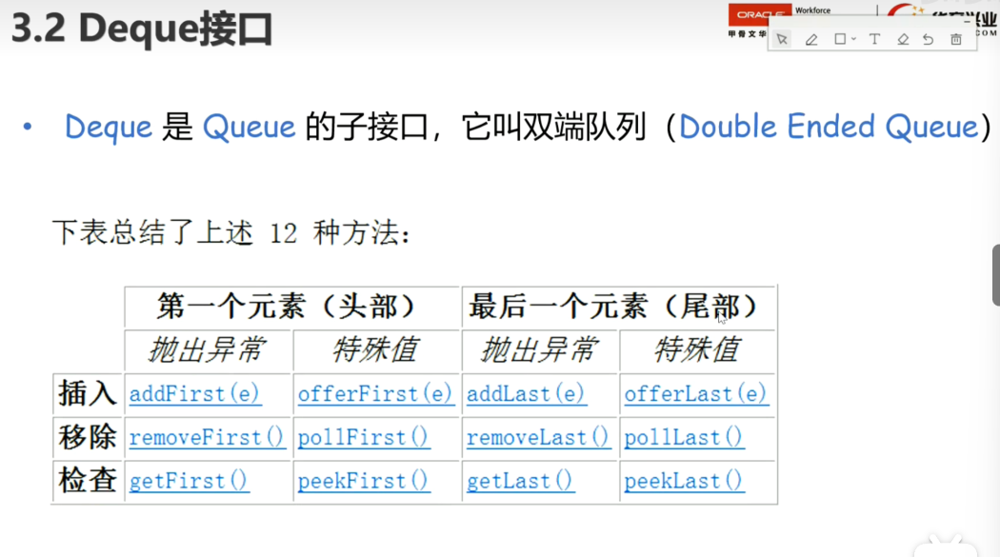
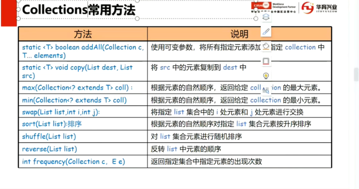
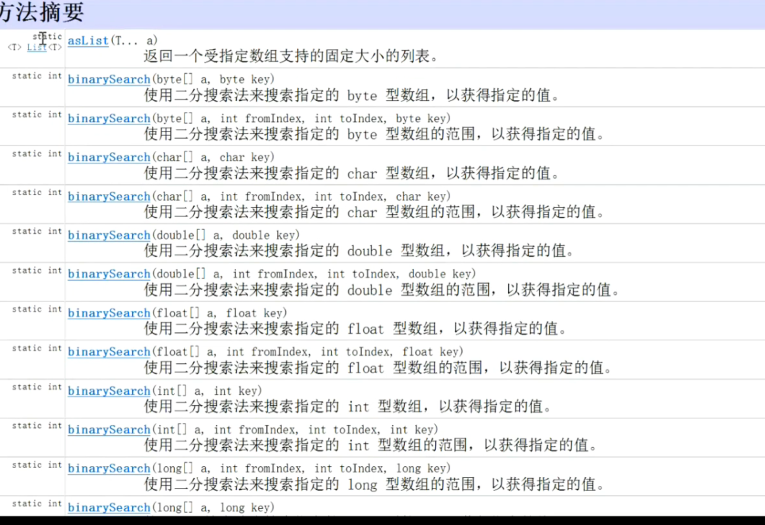
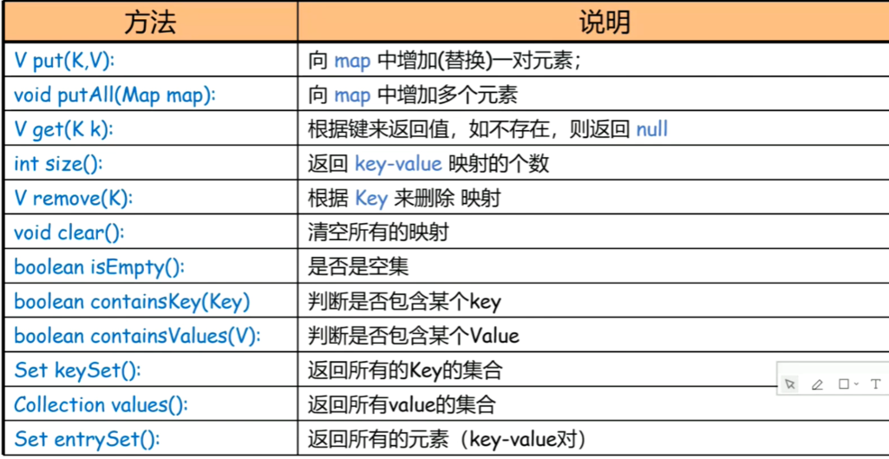
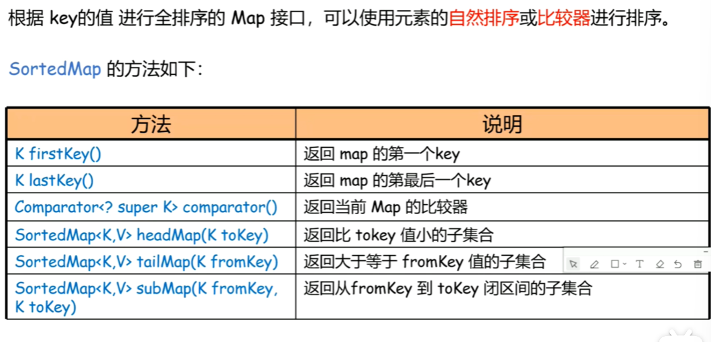

# 1.集合框架

## 1集合

**集合**：数组

**集合框架**：Java提供许多集合类（ArrayList，LinkList），接口（Collection，List，Map，Set）和算法类（Collections，Arrays），作为一个整体

~~~properties
集合框架里有两个顶层接口，所有的集合类都是这两个接口的实现类型：

Collection：储存元素

Map：key-value
~~~

## 2.Collection接口

### 1.**List**：有序

#### 1.1.ArrayList

#### 1.2.LinkList

~~~java
List<Integer> list=new ArraList<Integer>();
~~~

### 2.**Set**：无序，不可重复

#### 2.1HashSet

~~~java
Set<Integer> set=new HashSet<Integer>();
while(set.size()<5){
    set.add(r.nextInt(32)+1);
}
~~~

##### 2.1.1Iterator迭代器

~~~java
Set<String> set=new HashSet<String>();
Iterater<String> ite=set.iterator();
while(ite.hasNext()){
    String s=ite.next();//取但不删
    if(s.startWith("jack")){
        ite.remove();//删除
    }
}
~~~

#### 2.2.LinkedHashSet

按存入顺序进行排列，元素不可重复

~~~java
LinkedHashSet<String> set=new LinkedHashSet<String>();
~~~

#### 2.3.TreeSet

##### 2.3.1.**SortedSet**是**Set**的一个子接口

~~~java
//局部比较
SortedSet<String> set=new TreeSet<String>(new Comparator<String>(){
    public int compara(String o1,String o2){
        return o1.length()-o2.length==0?o1.comparaTo(o2):o1.length()-o2.length();
    }
});
System.out.println(set.headSet("james"));

~~~

##### 2.3.2.**TreeSet**是**SortedSet**的一个实现类，内部是一个**树结构**

~~~java
Set<String> set=new TreeSet<String>();//自然排序
Set<String> set=new TreeSet<String>(new Comparator<String>(){
    public int compara(String o1,String o2){
        return o1.length()-o2.length==0?o1.comparaTo(o2):o1.length()-o2.length();
    }
});//手动排序
~~~

### 3.**Queue**：先进先出

#### 3.1Queue

~~~java
QUeue<String> que=new LinkList<String>();
que.offer("张飞");
que.pool();//去出并删除，空返回NULL
que.remove();//取出不删除,空报错
~~~

#### 3.2Deque

~~~java
Deque<String> deque=new LinkList<String>();
~~~

#### 3.3PriorityQueue

有优先级的队列

~~~java
public class Customer implemnets Comparable<Customer>{
    int level;
    String name;
    public int comparaTo(Customer o){
        return this.level-o.level;
    }
}

PriorityQueue<Customer> ps=new PriorityQueue<Customer>();
ps.add(new Customer("张飞"，1))；
while(!ps.isEmpty()){
    System.out.println(ps.pool());
}
~~~

## 3.Collections算法类

###  1.Collections（集合）

~~~java
Collections.sort(list);
Collections.reverse(list);
Collections.shuffle(list);
Collections.binarySearch(list);
~~~

###  2.Arrays（数组）

~~~java
List<String> names=Arrays.asList("andy","adams");
int[] array={3,5,6,8,4};
int[] a=Arrays.copyOf(array,3);
~~~

## 4.Comparable接口

类**内部**比较器

~~~java
public class Student implements Comparable<student>{
    String name;
    int age;
    int score;
    public int compareTo(Student o){
        if(o.score==this.score){
            return this.age-o.age;
}else{
            return this.score-o.score;
    }
}
       
}//先实现接口
List<Student> list=new ArrayList<Student>();
Collections.sort(list);
~~~

## 5.Comparator接口

自定义**外部**比较器

~~~java
Collections.sort（names,new Comparator<String>(){
    public int compara(String o1,String o2){
        if(o1.length()!=o2.length()){
            return o1.length()-o2.length();
        }
        return o1.comparaTo(o2);
    }
}）;
~~~

## 6.Map接口

### 6.1HashMap

~~~java
Map<Integer,String> map=new HashMap<Interger,String>();
map.put(1,"james");//增
map.get(3);        //查
map.remove(2);     //删
map.containsKey(3);

Map<String,Integer[]> worldCup=new HashMap<String,Integer[]>();
worldCup.put("巴西",new Integer[]{1934,1994,1966});

//遍历集合
Set <Integer> set=map.keySet();         //key的集合
Collection<String> col=map.values();    //values的集合
Set<Entry<Integer,String>> es=map.entrySet();//key-value集合
for(Entry<Integer,String>e:es){
    System.out.println(e.getKey()+e.getValue());
}

~~~

### 6.2TreeMap

#### 6.2.1**SortedMap**接口

#### 6.2.2**TreeMap**两种排序

##### 1.自然排序

~~~java
TreeMap<Integer,String> tm=new TreeMap<Integer,String>();
tm.put(1,"james");
System.out.println(tm.headMap(3));
~~~

##### 2.手动排序

~~~properties
传入一个comparator对象，负责对key排序
~~~

# 2.内部类及转型

## 2.1转型

~~~java
	//向下转型  小到大
	//parrot p=(parrot)a;
	
	//判断
	//if(a instanceof parrot){}	
~~~

## 2.2内部类

~~~java
	//1.静态内部类 只能调用静态属性 
	public class A{
		static int a=7;
		static class B{
			public void getB() {
				System.out.println(a);
			}
		}
	}
	A.B b=new A.B（）；
	b.getB();
	//2.成员内部类
	public class A{
	 int a=7;
	  class B{
		public void getB() {
			System.out.println(a);
		}
	}
    }
    A a=new A();
    A.B b=A.new B();
	//3.方法内部类  在方法里定义类 在方法里实例化内部类 ，再调用或操作即可
	//4.匿名内部类 定义一个类 继承接口或者抽象类 c.connect(new Usb(){巴拉巴拉})
~~~

# 3.多线程

## 1.进程与线程

~~~properties
进程：一个程序运行的过程，是动态的。
线程：一个进程里包含多个线程，各个线程之间是划分时间片由CPU进行
~~~

