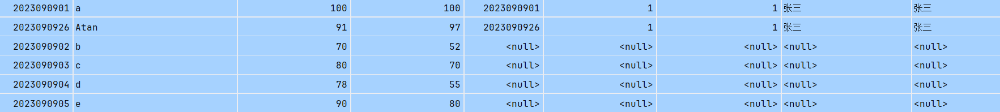

# Myabtis

## 1.基础配置

### 1.1连接数据库

使用xml写基础配置文件mybatis-config.xml，对数据库进行连接配置

~~~xml
<?xml version="1.0" encoding="UTF-8" ?>
<!DOCTYPE configuration
  PUBLIC "-//mybatis.org//DTD Config 3.0//EN"
  "http://mybatis.org/dtd/mybatis-3-config.dtd">
<configuration>
  <environments default="development">
    <environment id="development">
      <transactionManager type="JDBC"/>
      <dataSource type="POOLED">
        <property name="driver" value="com.mysql.cj.jdbc.Driver"/>
        <property name="url" value="jdbc:mysql://localhost:3306/student_score"/>
        <property name="username" value=""/>
        <property name="password" value=""/>
      </dataSource>
    </environment>
  </environments>
  <mappers>
    <mapper resource="TestMapper.xml"/>
</mappers>

</configuration>
~~~

然后对读取数据库的方式进行配置TsetMapper.xml，这样就不需要直接在代码中写sql语句

~~~xml
<?xml version="1.0" encoding="UTF-8" ?>
<!DOCTYPE mapper
        PUBLIC "-//mybatis.org//DTD Mapper 3.0//EN"
        "http://mybatis.org/dtd/mybatis-3-mapper.dtd">
<mapper namespace="TestMapper">
    <select id="selectStudent" resultType="com.tsAdmin.entity.Student">
        select * from student_score
    </select>
    <select id="selectStudentByName" parameterType="String" resultType="com.tsAdmin.entity.Student">
    SELECT * FROM student_score WHERE name = #{name}
    </select>
</mapper>
~~~

随后可以用SqlSessionFactory，SqlSession，来select数据库中的数据

~~~java
public class Main {
    public static void main(String[] args) throws FileNotFoundException {
        SqlSessionFactory sqlSessionFactory = new SqlSessionFactoryBuilder().build(new FileInputStream("src/main/resources/mybatis-config.xml"));
        try (SqlSession sqlSession = sqlSessionFactory.openSession(true)) {
            List<Student> list = sqlSession.selectList("selectStudent");
            list.forEach(System.out::println);
            Student st=sqlSession.selectOne("selectStudentByName","t");
            System.out.println(st);
        }
    }
}
~~~

### 1.2简化配置

打包工具为一个类，每次使用时只需调用一个类

~~~java
public class MybatisUtil {
    //在类加载时就进行创建
    private static SqlSessionFactory sqlSessionFactory;
    static {
        try {
            sqlSessionFactory = new SqlSessionFactoryBuilder().build(new FileInputStream("src/main/resources/mybatis-config.xml"));
        } catch (FileNotFoundException e) {
            e.printStackTrace();
        }
    }

    /**
     * 获取一个新的会话
     * @param autoCommit 是否开启自动提交（跟JDBC是一样的，如果不自动提交，则会变成事务操作）
     * @return SqlSession对象
     */
    public static SqlSession getSession(boolean autoCommit){
        return sqlSessionFactory.openSession(autoCommit);
    }
}
~~~

改进版可以引入接口来连接映射文件TestMapper.xml，然后直接调用接口实现类来操作

~~~java
try (SqlSession sqlSession = MybatisUtil.getSession(true)) {
            TestMapper mapper = sqlSession.getMapper(TestMapper.class);
            mapper.selectStudent().forEach(System.out::println);
            System.out.println(mapper.selectStudentByName("t"));
        }
~~~

### 1.3定义别名

在mybatis-config.xml文件中可以对返回类型定义别名以简化配置

~~~xml
<!-- 需要在environments的上方 -->
<typeAliases>
    <typeAlias type="com.test.entity.Student" alias="Student"/>
</typeAliases>
~~~

Plus版本可以直接扫描一个包然后对所有类进行别名，但是默认是**小写**

~~~xml
<typeAliases>
    <package name="com.test.entity"/>
</typeAliases>
~~~

也可以为类单独写别名，用注解实现

~~~java
@Data
@Alias("lbwnb")
public class Student {
    private int sid;
    private String name;
    private String sex;
}
~~~

## 2.增删改查

对于数据库中列名与属性不相同情况可以在配置文件TestMapper.xml中进行映射

~~~xml
<resultMap id="Test" type="Student">
    <result column="sid" property="sid"/>
    <result column="sex" property="name"/>
    <result column="name" property="sex"/>
</resultMap>
~~~

当类中存在多个构造方法时程序会报错，此时可以指定使用某个构造方法，有几个参数就要写几列

~~~xml
<resultMap id="test" type="Student">
    <constructor>
        <arg column="sid" javaType="Integer"/>
        <arg column="name" javaType="String"/>
    </constructor>
</resultMap>
~~~

### 2.1配置设置参数

数据库名可以通过配置文件修改为**驼峰命名**，比如`my_test`映射为`myTest`，类中为`myTest`，数据库中有下划线

~~~xml
<settings>
    <setting name="mapUnderscoreToCamelCase" value="true"/>
</settings>
~~~

### 2.2条件查询

输入条件获取查询后的结果

~~~xml
    <select id="selectStudentByName" parameterType="String" resultMap="result">
    SELECT * FROM student_score WHERE name = #{name}
    </select>
~~~

### 2.3增加数据

~~~xml
<insert id="addStudent" parameterType="com.tsAdmin.entity.Student">
    INSERT INTO student_score (id, name, score_one, score_two)
    VALUES (#{id}, #{name}, #{score_one}, #{score_two})
</insert>
~~~

注意在Student类中可以使用注解来实现get，set，链式调用等

~~~java
@Data
//链式开启
@Accessors(chain=true)
public class Student {
    int id;
    String name;
    int score_one;
    int score_two;
}
~~~

### 2.4删除数据

~~~xml
<delete id="deleteStudent">
    DELETE FROM student_score WHERE id = #{id}
</delete>
~~~

### 2.5更新数据

~~~xml
<update id="updateStudent" parameterType="student">
    UPDATE student_score SET name = #{name}, score_one = #{score_one}, score_two = #{score_two}
    WHERE id = #{id}
</update>
~~~

## 3.复杂查询

### 3.1一对多查询

数据库表的内连接

~~~sql
select *, teacher.name as tname from student inner join teach on student.sid = teach.sid
                              inner join teacher on teach.tid = teacher.tid where teach.tid = #{tid}
~~~

1. **`SELECT \*, teacher.name AS tname`**:
   - `SELECT *`: 选择所有列。
   - `teacher.name AS tname`: 从 `teacher` 表中选择 `name` 列，并将其重命名为 `tname`。
2. **`FROM student`**:
   - 主查询表是 `student`。
3. **`INNER JOIN teach ON student.sid = teach.sid`**:
   - 将 `student` 表与 `teach` 表进行内连接，连接条件是 `student.sid`（学生ID）等于 `teach.sid`（教学记录中的学生ID）。
4. **`INNER JOIN teacher ON teach.tid = teacher.tid`**:
   - 将 `teach` 表与 `teacher` 表进行内连接，连接条件是 `teach.tid`（教学记录中的教师ID）等于 `teacher.tid`（教师ID）。
5. **`WHERE teach.tid = #{tid}`**:
   - 过滤条件，只选择 `teach.tid` 等于 `#{tid}` 的记录。`#{tid}` 是一个占位符，通常用于预编译的SQL语句中，实际值会在执行时传入。

在TestMapper中引入如下设置，即可调用方法实现一对多查询，前提需要新建Teacher类

~~~xml
<select id="getTeacherByTid" resultMap="asTeacher">
        select *, teacher.name as tname from student_score inner join teach on student_score.id = teach.sid
        inner join teacher on teach.tid = teacher.tid where teach.tid =1
</select>

<resultMap id="asTeacher" type="Teacher">
    <id column="tid" property="tid"/>
    <result column="tname" property="name"/>
    使用colection作为集合实现一对多映射
    <collection property="studentList" ofType="Student">
        <id property="id" column="id"/>
        <result column="name" property="name"/>
        <result column="score_one" property="score_one"/>
        <result column="score_two" property="score_two"/>
    </collection>
</resultMap>
~~~

~~~java
@Data
public class Teacher {
    int tid;
    String name;
    List<Student> studentList;
}
~~~

### 3.2多对一查询

数据库表的左连接，针对没有的字段也可以创建null

~~~sql
    select *, teacher.name as tname from student_score left join teach on student_score.id = teach.sid
                                                       left join teacher on teach.tid = teacher.tid
~~~

输出结果如下所示

配置如下所示，使用association进行多对一映射

~~~xml
<select id="selectStudent" resultType="student">
            select *, teacher.name as tname from student_score left join teach on student_score.id = teach.sid
            left join teacher on teach.tid = teacher.tid
    where teach.tid=1
</select>

<resultMap id="test2" type="Student">
    <id column="id" property="id"/>
    <result column="name" property="name"/>
    <result column="score_one" property="score_one"/>
        <result column="score_two" property="score_two"/>
    <association property="teacher" javaType="Teacher">
        <id column="tid" property="tid"/>
        <result column="tname" property="name"/>
    </association>
</resultMap>
~~~

## 4.事物操作

如果不设置自动提交，就需要手动提交

~~~java
//自动提交
SqlSession sqlSession = MybatisUtil.getSession(true);
//手动提交
session.commit();
~~~

当然也可以设置手动取消提交

~~~java
//回滚操作
session.rollback();
~~~

## 5.动态SQL

可以加上各类条件判断，满足条件就可以直接拼接

~~~xml
<select id="selectStudent" resultType="student">
            select * from student_score where id = #{id}
            <if test="id%2==0">
                and score_one > 60
            </if>
</select>
~~~

还提供了choose，when，othervise，choose类似Java中的switch

~~~xml
<select id="selectStudent" resultType="student">
            select * from student_score where id = #{id}
            <choose>
                <when test="id %2== 0">
                    and id = #{id}
                </when>
                <when test="name != null">
                    and name = #{name}
                </when>
                <otherwise>
                    and score_one = #{score_one}
                </otherwise>
            </choose>
 </select>
~~~

## 6.缓存机制

**连续两次**查询同样的数据时，Mybatis不会两次访问数据库，而是会将第一次查询结果放入缓存中，第二次直接从**缓存**中取出来。

如果进行删除，插入等操作，**一级缓存**会被清空，因此会两次访问数据库。

Mybatis默认只启动本地一级缓存，可以通过xml配置开启**全局二级缓存**

~~~xml
<cache/>
~~~

官方文档配置如下

~~~xml
<cache
  eviction="FIFO"
  flushInterval="60000"
  size="512"
  readOnly="true"/>
~~~

还需要在全局配置中引入settings，这样**全局**开启任意一个mapper中的二级缓存配置

~~~xml
  <settings>
    <setting name="cacheEnabled" value="true"/>
  </settings>
~~~

也可以在规则中禁止使用二级缓存，同时每次清空缓存

~~~xml
<delete id="deleteStudent",usecache="false"，flushCache=“true”>
    DELETE FROM student_score WHERE id = #{id}
</delete>
~~~

## 7.使用注解开发

之前的方法是需要先配置**映射规则**Testmapper.xml，然后**绑定到接口**TestMapper.java上，直接调用接口实现类来完成操作，为了简化操作，推荐省略xml，使用**注解**开发。

~~~java
@Insert("insert into student(name, sex) values(#{name}, #{sex})")
int addStudent(Student student);
~~~

同时需要修改全局配置中的映射器

~~~xml
<mappers>
    <package name="cmo.tsAdmin.mapper"/>
</mappers>
~~~

### 7.1自定义映射

~~~java
@Results({
        @Result(id = true，column = "sid", property = "sid"),
        @Result(column = "sex", property = "name"),
        @Result(column = "name", property = "sex")
})
@Select("select * from student")
List<Student> getAllStudent();
~~~

### 7.2复杂查询

一对多查询

~~~java
@Results({
        @Result(id = true, column = "tid", property = "tid"),
        @Result(column = "name", property = "name"),
        @Result(column = "tid", property = "studentList", many =
            @Many(select = "getStudentByTid")
        )
})
@Select("select * from teacher where tid = #{tid}")
Teacher getTeacherBySid(int tid);

@Select("select * from student inner join teach on student.sid = teach.sid where tid = #{tid}")
List<Student> getStudentByTid(int tid);
~~~

在这个注解中，`tid` 被用作两个不同的 `column`：

- 第一个 `@Result` 注解将查询结果中的 `tid` 列映射到 `Teacher` 对象的 `tid` 属性。
- 第三个 `@Result` 注解将查询结果中的 `tid` 列作为参数传递给 `getStudentByTid` 方法，以获取与该教师相关的学生列表。

同理，@Result也提供了@One子注解来实现一对一的关系表示，类似于之前的assocation标签：

~~~java
@Results({
        @Result(id = true, column = "sid", property = "sid"),
        @Result(column = "sex", property = "name"),
        @Result(column = "name", property = "sex"),
        @Result(column = "sid", property = "teacher", one =
            @One(select = "getTeacherBySid")
        )
})
@Select("select * from student")
List<Student> getAllStudent();
~~~

如果还想用xml辅助，就可以用以下注解，在xml中写Map就行

~~~java
@ResultMap("test")
@Select("select * from student")
List<Student> getAllStudent();
~~~

### 7.3多构造方法

如果有多个构造方法，也可以使用注解指定构造方法

~~~java
@ConstructorArgs({
        @Arg(column = "sid", javaType = int.class),
        @Arg(column = "name", javaType = String.class)
})
@Select("select * from student where sid = #{sid} and sex = #{sex}")
Student getStudentBySidAndSex(@Param("sid") int sid, @Param("sex") String sex);
~~~

当构造方法中存在两个及以上参数会出错，因为Mybatis不知道哪个是哪个，可以使用@param注解来指定参数

~~~java
@Select("select * from student where sid = #{sid} and sex = #{sex}")
Student getStudentBySidAndSex(@Param("sid") int sid, @Param("sex") String sex);
~~~

Ps：如果是一个是基本数据类型，一个是引用对象类型呢

~~~java
@Insert("insert into student(sid, name, sex) values(#{sid}, #{name}, #{sex})")
int addStudent(@Param("sid") int sid, @Param("student")  Student student);
~~~

Mybatis无法识别name，sex属性是哪个，解决方法就是指定属性

~~~java
@Insert("insert into student(sid, name, sex) values(#{sid}, #{student.name}, #{student.sex})")
int addStudent(@Param("sid") int sid, @Param("student")  Student student);
~~~

### 7.4缓存

通过注解配置缓存设置

~~~java
@CacheNamespace(readWrite = false)
public interface MyMapper {

    @Select("select * from student")
    //单独设置属性
    @Options(useCache = false)
    List<Student> getAllStudent();
~~~

