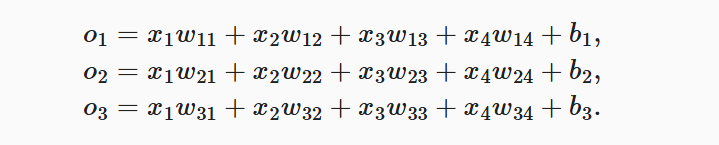
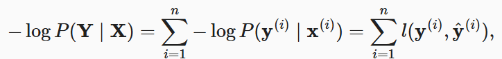
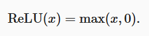

# DeepLearning

## 1.预备知识

### 1.1数据操作

#### 1.1.1基础操作

**切片操作**

**数据处理操作如下**：

~~~python
#定义行向量
x = torch.arange(12) 
#形状
x.shape    
#检查大小
x.numel()
#更改形状 x.reshape(-1,4)代表自动计算
X = x.reshape(3, 4)
#提供列表转换成张量
torch.tensor([[2, 1, 4, 3], [1, 2, 3, 4], [4, 3, 2, 1]])
~~~

输出：

~~~python
tensor([ 0,  1,  2,  3,  4,  5,  6,  7,  8,  9, 10, 11])

torch.Size([12])

12

tensor([[ 0,  1,  2,  3],
        [ 4,  5,  6,  7],
        [ 8,  9, 10, 11]])

tensor([[2, 1, 4, 3],
        [1, 2, 3, 4],
        [4, 3, 2, 1]])
~~~

**可以定义全零或全一向量**

~~~python
torch.zeros((2, 3, 4))
torch.ones((2, 3, 4))
~~~

~~~python
tensor([[[0., 0., 0., 0.],
         [0., 0., 0., 0.],
         [0., 0., 0., 0.]],

        [[0., 0., 0., 0.],
         [0., 0., 0., 0.],
         [0., 0., 0., 0.]]])

tensor([[[1., 1., 1., 1.],
         [1., 1., 1., 1.],
         [1., 1., 1., 1.]],

        [[1., 1., 1., 1.],
         [1., 1., 1., 1.],
         [1., 1., 1., 1.]]])
~~~

**也可以定义随机张量**

~~~python
torch.randn(3, 4)
~~~

~~~python
tensor([[-0.0135,  0.0665,  0.0912,  0.3212],
        [ 1.4653,  0.1843, -1.6995, -0.3036],
        [ 1.7646,  1.0450,  0.2457, -0.7732]])
~~~

#### 1.1.2运算符

标准运算符都可以用

~~~python
x = torch.tensor([1.0, 2, 4, 8])
y = torch.tensor([2, 2, 2, 2])
x + y, x - y, x * y, x / y, x ** y  # **运算符是求幂运算
~~~

~~~python
(tensor([ 3.,  4.,  6., 10.]),
 tensor([-1.,  0.,  2.,  6.]),
 tensor([ 2.,  4.,  8., 16.]),
 tensor([0.5000, 1.0000, 2.0000, 4.0000]),
 tensor([ 1.,  4., 16., 64.]))
~~~

还可以连接张量，指定dim维度信息即可

~~~python
X = torch.arange(12, dtype=torch.float32).reshape((3,4))
Y = torch.tensor([[2.0, 1, 4, 3], [1, 2, 3, 4], [4, 3, 2, 1]])
torch.cat((X, Y), dim=0), torch.cat((X, Y), dim=1)
~~~

~~~python
(tensor([[ 0.,  1.,  2.,  3.],
         [ 4.,  5.,  6.,  7.],
         [ 8.,  9., 10., 11.],
         [ 2.,  1.,  4.,  3.],
         [ 1.,  2.,  3.,  4.],
         [ 4.,  3.,  2.,  1.]]),
 tensor([[ 0.,  1.,  2.,  3.,  2.,  1.,  4.,  3.],
         [ 4.,  5.,  6.,  7.,  1.,  2.,  3.,  4.],
         [ 8.,  9., 10., 11.,  4.,  3.,  2.,  1.]]))
~~~

还可以判断是否相等与求合

~~~python
X == Y
X.sum()
~~~

~~~python
tensor([[False,  True, False,  True],
        [False, False, False, False],
        [False, False, False, False]])

tensor(66.)
~~~

#### 1.1.3广播机制

对于两个形状不一样的张量，例如

~~~python
a = torch.arange(3).reshape((3, 1))
b = torch.arange(2).reshape((1, 2))
a, b
~~~

~~~python
(tensor([[0],
         [1],
         [2]]),
 tensor([[0, 1]]))
~~~

这两个张量进行运算时因为维度信息不同，会使用广播法则，沿着数组中长度为1的轴进行广播，矩阵`a`将复制列， 矩阵`b`将复制行，然后再按元素相加。

~~~python
a + b
~~~

~~~python
tensor([[0, 1],
        [1, 2],
        [2, 3]])
~~~

#### 1.1.4内存节省

使用id()函数，类似指针

~~~python
before = id(Y)
Y = Y + X
id(Y) == before
~~~

~~~python
False
~~~

原地操作

~~~python
before = id(X)
X += Y
id(X) == before
~~~

~~~python
True
~~~

#### 1.1.5转换成其他Python对象

Numpy->tensor

~~~python
A = X.numpy()
B = torch.tensor(A)
type(A), type(B)
~~~

~~~python
(numpy.ndarray, torch.Tensor)
~~~

将大小为1的张量转换为Python标量，可以使用item函数或者Python内置函数

~~~python
a = torch.tensor([3.5])
a, a.item(), float(a), int(a)
~~~

~~~python
(tensor([3.5000]), 3.5, 3.5, 3)
~~~

### 1.2数据预处理

#### 1.2.1读取数据集

举一个例子，创建一个人工数据集，存储在CSV（逗号分隔值）文件中

~~~python
import os

os.makedirs(os.path.join('..', 'data'), exist_ok=True)
data_file = os.path.join('..', 'data', 'house_tiny.csv')
with open(data_file, 'w') as f:
    f.write('NumRooms,Alley,Price\n')  # 列名
    f.write('NA,Pave,127500\n')  # 每行表示一个数据样本
    f.write('2,NA,106000\n')
    f.write('4,NA,178100\n')
    f.write('NA,NA,140000\n')
~~~

导入pandas包并调用read_csv函数。该数据集有四行三列，其中每行描述了房间数量（“NumRooms”）、巷子类型（“Alley”）和房屋价格（“Price”）

~~~python
# 如果没有安装pandas，只需取消对以下行的注释来安装pandas
# !pip install pandas
import pandas as pd

data = pd.read_csv(data_file)
print(data)
~~~

~~~python
   NumRooms Alley   Price
0       NaN  Pave  127500
1       2.0   NaN  106000
2       4.0   NaN  178100
3       NaN   NaN  140000
~~~

#### 1.2.2处理缺失值

**NaN**代表缺失值，采用**插值法**和**删除法**用于处理缺失数据，其中插值法用一个替代值弥补缺失值，而删除法则直接忽略缺失值，这是考虑插值法。

通过位置索引iloc，将data分为inputs和outputs，其中前者为`data`的前两列，而后者为`data`的最后一列。 对于`inputs`中缺少的数值，我们用同一列的均值替换“NaN”项。

~~~python
inputs, outputs = data.iloc[:, 0:2], data.iloc[:, 2]
inputs = inputs.fillna(inputs.mean())
print(inputs)
~~~

~~~python
   NumRooms Alley
0       3.0  Pave
1       2.0   NaN
2       4.0   NaN
3       3.0   NaN
~~~

对于`inputs`中的类别值或离散值，我们将“NaN”视为一个类别。 由于“巷子类型”（“Alley”）列只接受两种类型的类别值“Pave”和“NaN”， `pandas`可以自动将此列转换为两列“Alley_Pave”和“Alley_nan”。 巷子类型为“Pave”的行会将“Alley_Pave”的值设置为1，“Alley_nan”的值设置为0。 缺少巷子类型的行会将“Alley_Pave”和“Alley_nan”分别设置为0和1。

~~~python
inputs = pd.get_dummies(inputs, dummy_na=True)
print(inputs)
~~~

~~~python
   NumRooms  Alley_Pave  Alley_nan
0       3.0           1          0
1       2.0           0          1
2       4.0           0          1
3       3.0           0          1
~~~

#### 1.2.3转换成张量格式

~~~python
import torch

X = torch.tensor(inputs.to_numpy(dtype=float))
y = torch.tensor(outputs.to_numpy(dtype=float))
X, y
~~~

~~~python
(tensor([[3., 1., 0.],
         [2., 0., 1.],
         [4., 0., 1.],
         [3., 0., 1.]], dtype=torch.float64),
 tensor([127500., 106000., 178100., 140000.], dtype=torch.float64))
~~~

### 1.3线性代数

#### 1.3.1矩阵

**矩阵转置**

~~~python
A.T
~~~

~~~python
tensor([[ 0,  4,  8, 12, 16],
        [ 1,  5,  9, 13, 17],
        [ 2,  6, 10, 14, 18],
        [ 3,  7, 11, 15, 19]])
~~~

#### 1.3.2张量

~~~python
A = torch.arange(20, dtype=torch.float32).reshape(5, 4)
B = A.clone()  # 通过分配新内存，将A的一个副本分配给B
A, A + B
~~~

~~~python
(tensor([[ 0.,  1.,  2.,  3.],
         [ 4.,  5.,  6.,  7.],
         [ 8.,  9., 10., 11.],
         [12., 13., 14., 15.],
         [16., 17., 18., 19.]]),
 tensor([[ 0.,  2.,  4.,  6.],
         [ 8., 10., 12., 14.],
         [16., 18., 20., 22.],
         [24., 26., 28., 30.],
         [32., 34., 36., 38.]]))
~~~

具体而言，两个矩阵的**按元素乘法**称为*Hadamard积*（Hadamard product）（数学符号⊙）。 对于矩阵B∈Rm×n， 其中第i行和第j列的元素是bij。 

~~~python
A * B
~~~

~~~python
tensor([[  0.,   1.,   4.,   9.],
        [ 16.,  25.,  36.,  49.],
        [ 64.,  81., 100., 121.],
        [144., 169., 196., 225.],
        [256., 289., 324., 361.]])
~~~

将张量乘以或加上一个标量不会改变张量的形状，其中张量的每个元素都将与标量相加或相乘。

~~~python
a = 2
X = torch.arange(24).reshape(2, 3, 4)
a + X, (a * X).shape
~~~

~~~python
(tensor([[[ 2,  3,  4,  5],
          [ 6,  7,  8,  9],
          [10, 11, 12, 13]],

         [[14, 15, 16, 17],
          [18, 19, 20, 21],
          [22, 23, 24, 25]]]),
 
 torch.Size([2, 3, 4]))
~~~

#### 1.3.3降维

**求和**

~~~python
x = torch.arange(4, dtype=torch.float32)
x, x.sum()
~~~

~~~python
(tensor([0., 1., 2., 3.]), tensor(6.))
~~~

然后可以指定按行或者按列降维求和，首先是按列，会按列求和`axis=0`

~~~python
A = torch.arange(20, dtype=torch.float32).reshape(5, 4)
A_sum_axis0 = A.sum(axis=0)
A_sum_axis0, A_sum_axis0.shape
~~~

~~~python
(tensor([[ 0.,  1.,  2.,  3.],
         [ 4.,  5.,  6.,  7.],
         [ 8.,  9., 10., 11.],
         [12., 13., 14., 15.],
         [16., 17., 18., 19.]]),

(tensor([ 6., 22., 38., 54., 70.]), torch.Size([5]))
~~~

接下来时按行求和，`axis=1`

~~~python
A_sum_axis1 = A.sum(axis=1)
A_sum_axis1, A_sum_axis1.shape
~~~

~~~python
(tensor([ 6., 22., 38., 54., 70.]), torch.Size([5]))
~~~

求和完成后还可以求均值

~~~python
A.mean(), A.sum() / A.numel()
~~~

~~~python
(tensor(9.5000), tensor(9.5000))
~~~

也可以按行或者按列求均值

~~~python
A.mean(axis=0), A.sum(axis=0) / A.shape[0]
~~~

~~~python
(tensor([ 8.,  9., 10., 11.]), tensor([ 8.,  9., 10., 11.]))
~~~

#### 1.3.4非降维求和

调用cumsum函数求和会直接在原张量中添加一行或一列

~~~python
A.cumsum(axis=0)
~~~

~~~python
tensor([[ 0.,  1.,  2.,  3.],
        [ 4.,  6.,  8., 10.],
        [12., 15., 18., 21.],
        [24., 28., 32., 36.],
        [40., 45., 50., 55.]])
~~~

#### 1.3.5点积

点积就是相同位置的元素乘积的和

~~~python
y = torch.ones(4, dtype = torch.float32)
x, y, torch.dot(x, y)
~~~

~~~python
(tensor([0., 1., 2., 3.]), tensor([1., 1., 1., 1.]), tensor(6.))
~~~

#### 1.3.6矩阵-向量积

矩阵-向量积：`A`的列维数（沿轴1的长度）必须与`x`的维数（其长度）相同。

~~~python
A.shape, x.shape, torch.mv(A, x)
~~~

~~~python
(torch.Size([5, 4]), torch.Size([4]), tensor([ 14.,  38.,  62.,  86., 110.]))
~~~

#### 1.3.7矩阵-矩阵积

~~~python
B = torch.ones(4, 3)
torch.mm(A, B)
~~~

~~~python
tensor([[ 6.,  6.,  6.],
        [22., 22., 22.],
        [38., 38., 38.],
        [54., 54., 54.],
        [70., 70., 70.]])
~~~

### 1.4自动微分

#### 1.4.1反向传播

创建张量并置requires_grad_(True) 

~~~python
x.requires_grad_(True)  # 等价于x=torch.arange(4.0,requires_grad=True)
x.grad  # 默认值是None
~~~

现在计算y，做函数的值的和张量

~~~python
y = 2 * torch.dot(x, x)
~~~

~~~python
tensor(28., grad_fn=<MulBackward0>)
~~~

接下来反向传播计算梯度

~~~python
y.backward()
x.grad
~~~

~~~python
tensor([ 0.,  4.,  8., 12.])
~~~

接下来完整流程（**非标量变量反向传播**）

~~~python
# 在默认情况下，PyTorch会累积梯度，我们需要清除之前的值
x.grad.zero_()
y = x.sum()
y.backward()
x.grad
~~~

#### 1.4.2分离计算

反向传播计算偏导数将y视为一个常量而不是x^2、

~~~python
x.grad.zero_()
y = x * x
u = y.detach()
z = u * x

z.sum().backward()
x.grad == u
~~~

~~~python
tensor([True, True, True, True])
~~~

由于记录了y的计算结果，可以随后在y上调用反向传播，得到y=x*x关于x的导数

~~~python
x.grad.zero_()
y.sum().backward()
x.grad == 2 * x
~~~

~~~python
tensor([True, True, True, True])
~~~

#### 1.4.3控制流的梯度计算

~~~python
def f(a):
    b = a * 2
    #范数
    while b.norm() < 1000:
        b = b * 2
    if b.sum() > 0:
        c = b
    else:
        c = 100 * b
    return c
~~~

~~~python
a = torch.randn(size=(), requires_grad=True)
d = f(a)
d.backward()
~~~

对于任何`a`，存在某个常量标量`k`，使得`f(a)=k*a`，其中`k`的值取决于输入`a`，因此可以用`d/a`验证梯度是否正确。

~~~python
a.grad == d / a
~~~

~~~python
True
~~~

### 1.5概率

导包

~~~python
%matplotlib inline
import torch
#概率相关的包
from torch.distributions import multinomial
from d2l import torch as d2l
~~~

创建概率向量与投掷结果

~~~python
fair_probs = torch.ones([6]) / 6
#创建一个多项式分布抽样器（次数，概率）
multinomial.Multinomial(1, fair_probs).sample()
~~~

~~~python
tensor([0., 0., 1., 0., 0., 0.])
~~~

用for循环实现多次投掷太慢了，可以直接抽取多个样本

~~~python
multinomial.Multinomial(10, fair_probs).sample()
~~~

## 2.线性神经网络

矢量化导入包

~~~python
%matplotlib inline
import math
import time
import numpy as np
import torch
from d2l import torch as d2l
~~~

### 2.1线性回归

#### 2.1.1创建数据集

我们使用线性模型参数w=[2,−3.4]⊤、b=4.2 和噪声项ϵ生成数据集及其标签：
$$
y=Xw+b+c
$$
ϵ可以视为模型预测和标签时的潜在观测误差。 在这里我们认为标准假设成立，即ϵ服从均值为0的正态分布。 为了简化问题，我们将标准差设为0.01。 下面的代码生成合成数据集。

~~~python
def synthetic_data(w, b, num_examples):  #@save
    """生成y=Xw+b+噪声"""
    #标准正态分布
    X = torch.normal(0, 1, (num_examples, len(w)))
    #矩阵乘法
    y = torch.matmul(X, w) + b
    #行向量变列向量
    y += torch.normal(0, 0.01, y.shape)
    return X, y.reshape((-1, 1))

true_w = torch.tensor([2, -3.4])
true_b = 4.2
features, labels = synthetic_data(true_w, true_b, 1000)
~~~

~~~python
features: tensor([1.4632, 0.5511])
label: tensor([5.2498])
~~~

#### 2.1.2读取数据集

定义一个函数打乱数据集中的样本并以小批量的方式获取数据集

~~~python
def data_iter(batch_size, features, labels):
    #样本大小
    num_examples = len(features)
    #新建索引列表
    indices = list(range(num_examples))
    # 这些样本是随机读取的，没有特定的顺序
    random.shuffle(indices)
    #以batch_size为步长迭代
    for i in range(0, num_examples, batch_size):
        #按索引切片并转换成tensor
        batch_indices = torch.tensor(
            indices[i: min(i + batch_size, num_examples)])
        #生成器生成小批量数据，两个张量根据索引获取张量数据
        yield features[batch_indices], labels[batch_indices]
~~~

**简洁实现**

~~~python
#is_train=True是否希望打乱
def load_array(data_arrays, batch_size, is_train=True):  #@save
    """构造一个PyTorch数据迭代器"""
    #*表示解包操作，会将多个张量拼接成一个数据集
    dataset = data.TensorDataset(*data_arrays)
    #创建数据迭代器，迭代数据
    return data.DataLoader(dataset, batch_size, shuffle=is_train)

batch_size = 10
data_iter = load_array((features, labels), batch_size)
~~~

#### 2.1.3初始化模型参数

从均值为0、标准差为0.01的正态分布中采样随机数来初始化权重， 并将偏置初始化为0。

~~~python
w = torch.normal(0, 0.01, size=(2,1), requires_grad=True)
b = torch.zeros(1, requires_grad=True)
~~~

#### 2.1.4定义模型

~~~python
def linreg(X, w, b):  #@save
    """线性回归模型"""
    return torch.matmul(X, w) + b
~~~

在PyTorch中，全连接层在`Linear`类中定义。 值得注意的是，我们将两个参数传递到`nn.Linear`中。 第一个指定输入特征形状，即2，第二个指定输出特征形状，输出特征形状为单个标量，因此为1。

~~~python
# nn是神经网络的缩写
from torch import nn
#（X,w）->y
net = nn.Sequential(nn.Linear(2, 1))
~~~

对于初始参数也可以定义

~~~python
#第一层权重参数，均值为0，方差为0.01的标准正态
net[0].weight.data.normal_(0, 0.01)
#第一层偏置参数，初始化为0
net[0].bias.data.fill_(0)
~~~

#### 2.1.5定义损失函数

~~~python
def squared_loss(y_hat, y):  #@save
    """均方损失"""
    return (y_hat - y.reshape(y_hat.shape)) ** 2 / 2
~~~

**简化操作**

~~~python
loss = nn.MSELoss()
~~~

#### 2.1.6定义优化函数

~~~python
#模型参数集合，学习速率，批次大小
def sgd(params, lr, batch_size):  #@save
    """小批量随机梯度下降"""
    #禁用梯度计算操作，节省内存防止出错，不妨碍已经计算的梯度
    with torch.no_grad():
        for param in params:
            param -= lr * param.grad / batch_size
            param.grad.zero_()
~~~

**简化操作**

我们要指定优化的参数 （可通过`net.parameters()`从我们的模型中获得）以及优化算法所需的超参数字典。 小批量随机梯度下降只需要设置`lr`值，这里设置为0.03。

~~~python
trainer = torch.optim.SGD(net.parameters(), lr=0.03)
~~~

#### 2.1.7训练

遍历所有张量->计算损失->反向传播->更新参数->使用整体真实数据集打印损失

~~~python
lr = 0.03
num_epochs = 3
net = linreg
loss = squared_loss

for epoch in range(num_epochs):
    for X, y in data_iter(batch_size, features, labels):
        l = loss(net(X, w, b), y)  # X和y的小批量损失
        # 因为l形状是(batch_size,1)，而不是一个标量。l中的所有元素被加到一起，
        # 并以此计算关于[w,b]的梯度
        l.sum().backward()
        sgd([w, b], lr, batch_size)  # 使用参数的梯度更新参数
    with torch.no_grad():
        train_l = loss(net(features, w, b), labels)
        print(f'epoch {epoch + 1}, loss {float(train_l.mean()):f}')
~~~

~~~python
epoch 1, loss 0.042790
epoch 2, loss 0.000162
epoch 3, loss 0.000051
~~~

**简化操作**

~~~python
num_epochs = 3
for epoch in range(num_epochs):
    for X, y in data_iter:
        l = loss(net(X) ,y)
        trainer.zero_grad()
        l.backward()
        trainer.step()
    l = loss(net(features), labels)
    print(f'epoch {epoch + 1}, loss {l:f}')
~~~

### 2.2softmax回归

分类问题，采用独热编码热编码是一个向量，它的分量和类别一样多。 类别对应的分量设置为1，其他所有分量设置为0。 在我们的例子中，标签y将是一个三维向量， 其中(1,0,0)对应于“猫”、(0,1,0)对应于“鸡”、(0,0,1)对应于“狗”。

对于每个可能的**输出类别**，都有自己独特的特征参数：

引入softmax，获得对应的概率：

概率最高的就是选择的类别。

**对数似然**：

将估计值与实际值进行比较：

根据最大似然估计，最大化P(Y|X)

损失函数使用**交叉熵损失**：

**损失函数梯度**：

### 2.3softmax实现

首先定义函数获取和读取Fashion-MNIST数据集。

~~~python
def load_data_fashion_mnist(batch_size, resize=None):  #@save
    """下载Fashion-MNIST数据集，然后将其加载到内存中"""
    trans = [transforms.ToTensor()]
    if resize:
        trans.insert(0, transforms.Resize(resize))
    trans = transforms.Compose(trans)
    mnist_train = torchvision.datasets.FashionMNIST(
        root="../data", train=True, transform=trans, download=True)
    mnist_test = torchvision.datasets.FashionMNIST(
        root="../data", train=False, transform=trans, download=True)
    return (data.DataLoader(mnist_train, batch_size, shuffle=True,
                            num_workers=get_dataloader_workers()),
            data.DataLoader(mnist_test, batch_size, shuffle=False,
                            num_workers=get_dataloader_workers()))
~~~

然后**导入库**

~~~python
import torch
from IPython import display
from d2l import torch as d2l

batch_size = 256
train_iter, test_iter = d2l.load_data_fashion_mnist(batch_size)
~~~

**初始化模型参数**，因为数据集中的图片时`28*28*1`格式，因此将输入定义为784，权重构成784*10的矩阵

~~~python
num_inputs = 784
num_outputs = 10

W = torch.normal(0, 0.01, size=(num_inputs, num_outputs), requires_grad=True)
b = torch.zeros(num_outputs, requires_grad=True)
~~~

简化操作：

~~~python
# 输入展平，输出将784->10
net = nn.Sequential(nn.Flatten(), nn.Linear(784, 10))
# 初始化权重参数，方差为0.01
def init_weights(m):
    if type(m) == nn.Linear:
        nn.init.normal_(m.weight, std=0.01)

net.apply(init_weights);
~~~

**定义softmax操作**：回想一下，实现softmax由三个步骤组成：

1. 对每个项求幂（使用`exp`）；
2. 对每一行求和（小批量中每个样本是一行），得到每个样本的规范化常数；
3. 将每一行除以其规范化常数，确保结果的和为1。

在查看代码之前，我们回顾一下这个表达式：

~~~python
def softmax(X):
    X_exp = torch.exp(X)
    partition = X_exp.sum(1, keepdim=True) #按行求和，保持原维度
    return X_exp / partition  # 这里应用了广播机制
~~~

**定义模型**：

~~~python
def net(X):
    return softmax(torch.matmul(X.reshape((-1, W.shape[0])), W) + b)
~~~

**定义损失函数**：

~~~python
def cross_entropy(y_hat, y):#y_hat是预测概率，y是真实数据标签
    return - torch.log(y_hat[range(len(y_hat)), y])

cross_entropy(y_hat, y)
~~~

例如：

~~~python
y = torch.tensor([0, 2])
y_hat = torch.tensor([[0.1, 0.3, 0.6], [0.3, 0.2, 0.5]])
y_hat[[0, 1], y]
~~~

输出：

~~~python
tensor([0.1000, 0.5000])
~~~

简化操作：

~~~python
#不汇总，返回每个数据的损失
loss = nn.CrossEntropyLoss(reduction='none')
~~~

**分类精度**：正确/总体样本

首先定义一个工具类

~~~python
class Accumulator:  #@save
    """在n个变量上累加"""
    def __init__(self, n):
        self.data = [0.0] * n

    #zip表示按位置匹配，*arg表示可变数量的参数
    def add(self, *args):
        self.data = [a + float(b) for a, b in zip(self.data, args)]

    def reset(self):
        self.data = [0.0] * len(self.data)

    def __getitem__(self, idx):
        return self.data[idx]
~~~

~~~python
def evaluate_accuracy(net, data_iter):  #@save
    """计算在指定数据集上模型的精度"""
    if isinstance(net, torch.nn.Module):
        net.eval()  # 将模型设置为评估模式
    metric = Accumulator(2)  # 正确预测数、预测总数
    with torch.no_grad():
        for X, y in data_iter:
            metric.add(accuracy(net(X), y), y.numel())
    return metric[0] / metric[1] #计算概率
~~~

**训练**：

~~~python
def train_epoch_ch3(net, train_iter, loss, updater):  #@save
    """训练模型一个迭代周期（定义见第3章）"""
    # 将模型设置为训练模式
    if isinstance(net, torch.nn.Module):
        net.train()
    # 训练损失总和、训练准确度总和、样本数
    metric = Accumulator(3)
    for X, y in train_iter:
        # 计算梯度并更新参数
        y_hat = net(X)
        l = loss(y_hat, y)
        if isinstance(updater, torch.optim.Optimizer):
            # 使用PyTorch内置的优化器和损失函数
            updater.zero_grad()
            l.mean().backward()
            updater.step()
        else:
            # 使用定制的优化器和损失函数
            l.sum().backward()
            updater(X.shape[0])
        metric.add(float(l.sum()), accuracy(y_hat, y), y.numel())
    # 返回训练损失和训练精度
    return metric[0] / metric[2], metric[1] / metric[2]
~~~

定义一个工具类用来画图

~~~python
class Animator:  #@save
    """在动画中绘制数据"""
    def __init__(self, xlabel=None, ylabel=None, legend=None, xlim=None,
                 ylim=None, xscale='linear', yscale='linear',
                 fmts=('-', 'm--', 'g-.', 'r:'), nrows=1, ncols=1,
                 figsize=(3.5, 2.5)):
        # 增量地绘制多条线
        if legend is None:
            legend = []
        d2l.use_svg_display()
        self.fig, self.axes = d2l.plt.subplots(nrows, ncols, figsize=figsize)
        if nrows * ncols == 1:
            self.axes = [self.axes, ]
        # 使用lambda函数捕获参数
        self.config_axes = lambda: d2l.set_axes(
            self.axes[0], xlabel, ylabel, xlim, ylim, xscale, yscale, legend)
        self.X, self.Y, self.fmts = None, None, fmts

    def add(self, x, y):
        # 向图表中添加多个数据点
        if not hasattr(y, "__len__"):
            y = [y]
        n = len(y)
        if not hasattr(x, "__len__"):
            x = [x] * n
        if not self.X:
            self.X = [[] for _ in range(n)]
        if not self.Y:
            self.Y = [[] for _ in range(n)]
        for i, (a, b) in enumerate(zip(x, y)):
            if a is not None and b is not None:
                self.X[i].append(a)
                self.Y[i].append(b)
        self.axes[0].cla()
        for x, y, fmt in zip(self.X, self.Y, self.fmts):
            self.axes[0].plot(x, y, fmt)
        self.config_axes()
        display.display(self.fig)
        display.clear_output(wait=True)
~~~

最后定义整体训练函数

~~~python
def train_ch3(net, train_iter, test_iter, loss, num_epochs, updater):  #@save
    """训练模型（定义见第3章）"""
    animator = Animator(xlabel='epoch', xlim=[1, num_epochs], ylim=[0.3, 0.9],
                        legend=['train loss', 'train acc', 'test acc'])
    for epoch in range(num_epochs):
        train_metrics = train_epoch_ch3(net, train_iter, loss, updater)
        test_acc = evaluate_accuracy(net, test_iter)
        animator.add(epoch + 1, train_metrics + (test_acc,))
    train_loss, train_acc = train_metrics
    #断言，判断是否满足条件
    assert train_loss < 0.5, train_loss
    assert train_acc <= 1 and train_acc > 0.7, train_acc
    assert test_acc <= 1 and test_acc > 0.7, test_acc
~~~

然后定义小批量随机梯度下降来**优化模型的损失**

~~~python
lr = 0.1

def updater(batch_size):
    return d2l.sgd([W, b], lr, batch_size)
~~~

简化：

~~~python
updater = torch.optim.SGD(net.parameters(), lr=0.1)
~~~

接下来可以开始训练

~~~python
num_epochs = 10
train_ch3(net, train_iter, test_iter, cross_entropy, num_epochs, updater)
~~~

**预测**：

~~~python
def predict_ch3(net, test_iter, n=6):  #@save
    """预测标签（定义见第3章）"""
    for X, y in test_iter:
        break
    #获取标签
    trues = d2l.get_fashion_mnist_labels(y)
    preds = d2l.get_fashion_mnist_labels(net(X).argmax(axis=1))
    #打印
    titles = [true +'\n' + pred for true, pred in zip(trues, preds)]
    d2l.show_images(
        X[0:n].reshape((n, 28, 28)), 1, n, titles=titles[0:n])

predict_ch3(net, test_iter)
~~~

## 3.多层感知机

### 3.1多层感知机

由于线性模型可能会出错，因此在网络中加入隐藏层，对隐藏层增加激活函数从而更接近实际输出

**激活函数**：

ReLU函数：

sigmoid函数：

tanh函数：

### 3.2手动实现多层感知机

**导入库**

~~~python
import torch
from torch import nn
from d2l import torch as d2l

batch_size = 256
train_iter, test_iter = d2l.load_data_fashion_mnist(batch_size)
~~~

**初始化模型参数**

~~~python
num_inputs, num_outputs, num_hiddens = 784, 10, 256
#定义形状并缩小一百倍，防止参数爆炸
W1 = nn.Parameter(torch.randn(
    num_inputs, num_hiddens, requires_grad=True) * 0.01)
b1 = nn.Parameter(torch.zeros(num_hiddens, requires_grad=True))
W2 = nn.Parameter(torch.randn(
    num_hiddens, num_outputs, requires_grad=True) * 0.01)
b2 = nn.Parameter(torch.zeros(num_outputs, requires_grad=True))

params = [W1, b1, W2, b2]
~~~

**模型**

~~~python
def net(X):
    #自动计算，-1只保存第一个维度(32, 1, 28, 28)->(32, 784)
    X = X.reshape((-1, num_inputs))
    H = relu(X@W1 + b1)  # 这里“@”代表矩阵乘法
    return (H@W2 + b2)

#简化版本
net = nn.Sequential(nn.Flatten(),
                    nn.Linear(784, 256),
                    nn.ReLU(),
                    nn.Linear(256, 10))

def init_weights(m):
    if type(m) == nn.Linear:
        nn.init.normal_(m.weight, std=0.01)

net.apply(init_weights);
~~~

**损失函数**

~~~python
loss = nn.CrossEntropyLoss(reduction='none')
~~~

**训练**

~~~python
num_epochs, lr = 10, 0.1
updater = torch.optim.SGD(params, lr=lr)
d2l.train_ch3(net, train_iter, test_iter, loss, num_epochs, updater)	
~~~

### 3.3训练与验证

**验证数据集**：一般是一半的训练数据集作为验证模型好坏的依据，如果不好那就换一个模型接着验证

**测试数据集**：只用一次，不能用来调超参数，例如未来的考试

### 3.4丢弃法

- **丢弃法**将一些**输出项随机置0**来控制模型复杂度
- 常作用在多层感知机的**隐藏层输出**上
- **丢弃概率**是控制模型复杂度的超参数

**初始化丢弃函数**

~~~python
import torch
from torch import nn
from d2l import torch as d2l

def dropout_layer(X, dropout):
    assert 0 <= dropout <= 1
    # 在本情况中，所有元素都被丢弃
    if dropout == 1:
        return torch.zeros_like(X)
    # 在本情况中，所有元素都被保留
    if dropout == 0:
        return X
    #生成与X形状一样的0-1均匀分布的张量
    mask = (torch.rand(X.shape) > dropout).float()
    return mask * X / (1.0 - dropout)
~~~

**定义模型参数**

~~~python
num_inputs, num_outputs, num_hiddens1, num_hiddens2 = 784, 10, 256, 256
~~~

**定义模型**：

丢弃法应用于每个**隐藏层**的输出，在**激活函数**之后，常见的方法是对靠近输入层的隐藏层设置较低的丢弃概率

~~~python
dropout1, dropout2 = 0.2, 0.5

class Net(nn.Module):
    def __init__(self, num_inputs, num_outputs, num_hiddens1, num_hiddens2,
                 is_training = True):
        super(Net, self).__init__()
        self.num_inputs = num_inputs
        self.training = is_training
        self.lin1 = nn.Linear(num_inputs, num_hiddens1)
        self.lin2 = nn.Linear(num_hiddens1, num_hiddens2)
        self.lin3 = nn.Linear(num_hiddens2, num_outputs)
        self.relu = nn.ReLU()

    def forward(self, X):
        H1 = self.relu(self.lin1(X.reshape((-1, self.num_inputs))))
        # 只有在训练模型时才使用dropout
        if self.training == True:
            # 在第一个全连接层之后添加一个dropout层
            H1 = dropout_layer(H1, dropout1)
        H2 = self.relu(self.lin2(H1))
        if self.training == True:
            # 在第二个全连接层之后添加一个dropout层
            H2 = dropout_layer(H2, dropout2)
        out = self.lin3(H2)
        return out

net = Net(num_inputs, num_outputs, num_hiddens1, num_hiddens2)
~~~

简化版本：

~~~python
net = nn.Sequential(nn.Flatten(),
        nn.Linear(784, 256),
        nn.ReLU(),
        # 在第一个全连接层之后添加一个dropout层
        nn.Dropout(dropout1),
        nn.Linear(256, 256),
        nn.ReLU(),
        # 在第二个全连接层之后添加一个dropout层
        nn.Dropout(dropout2),
        nn.Linear(256, 10))

def init_weights(m):
    if type(m) == nn.Linear:
        nn.init.normal_(m.weight, std=0.01)

net.apply(init_weights);
~~~

**训练和测试**：

~~~python
num_epochs, lr, batch_size = 10, 0.5, 256
loss = nn.CrossEntropyLoss(reduction='none')
train_iter, test_iter = d2l.load_data_fashion_mnist(batch_size)
trainer = torch.optim.SGD(net.parameters(), lr=lr)
d2l.train_ch3(net, train_iter, test_iter, loss, num_epochs, trainer)
~~~

### 3.5分布偏移

训练集与测试集的分布不同，导致模型效果变差

1. **协变量偏移**：训练用数学题，测试用语文题，X改变但是评分标准（Y|X）没变
2. **标签偏移**：题目X不变，但是分数Y萎了，导致本来能及格现在不能及格。
3. **概念偏移**：本来是对的现在错了，概念改变。

## 4.深度学习计算

### 4.1层和块

自定义块

~~~python
import torch
from torch import nn
from torch.nn import functional as F

class MLP(nn.Module):
    # 用模型参数声明层。这里，我们声明两个全连接的层
    def __init__(self):
        # 调用MLP的父类Module的构造函数来执行必要的初始化。
        # 这样，在类实例化时也可以指定其他函数参数，例如模型参数params（稍后将介绍）
        super().__init__()
        self.hidden = nn.Linear(20, 256)  # 隐藏层
        self.out = nn.Linear(256, 10)  # 输出层

    # 定义模型的前向传播，即如何根据输入X返回所需的模型输出
    def forward(self, X):
        # 注意，这里我们使用ReLU的函数版本，其在nn.functional模块中定义。
        return self.out(F.relu(self.hidden(X)))
~~~

块里面可以有多个层或块

~~~python
class MySequential(nn.Module):
    def __init__(self, *args):
        super().__init__()
        for idx, module in enumerate(args):
            # 这里，module是Module子类的一个实例。我们把它保存在'Module'类的成员
            # 变量_modules中。_module的类型是OrderedDict
            self._modules[str(idx)] = module

    def forward(self, X):
        # OrderedDict保证了按照成员添加的顺序遍历它们
        for block in self._modules.values():
            X = block(X)
        return X
~~~

### 4.2参数管理

~~~python
import torch
from torch import nn

net = nn.Sequential(nn.Linear(4, 8), nn.ReLU(), nn.Linear(8, 1))
X = torch.rand(size=(2, 4))
net(X)
~~~

#### 4.2.1参数访问

通过索引访问

~~~python
print(net[2].state_dict())
~~~

~~~python
OrderedDict([('weight', tensor([[-0.0427, -0.2939, -0.1894,  0.0220, -0.1709, -0.1522, -0.0334, -0.2263]])), ('bias', tensor([0.0887]))])
~~~

知道名字之后即可通过名字访问

~~~python
print(type(net[2].bias))
print(net[2].bias)
print(net[2].bias.data)
~~~

~~~python
<class 'torch.nn.parameter.Parameter'>
Parameter containing:
tensor([0.0887], requires_grad=True)
tensor([0.0887])
~~~

也可以一次访问所有参数

~~~python
#*表示解包，拆开打印
print(*[(name, param.shape) for name, param in net[0].named_parameters()])
print(*[(name, param.shape) for name, param in net.named_parameters()])
~~~

~~~python
('weight', torch.Size([8, 4])) ('bias', torch.Size([8]))
('0.weight', torch.Size([8, 4])) ('0.bias', torch.Size([8])) ('2.weight', torch.Size([1, 8])) ('2.bias', torch.Size([1]))
~~~

衍生出Plus版本的访问方式

~~~python
net.state_dict()['2.bias'].data
~~~

~~~python
tensor([0.0887])
~~~

如果多个块嵌套，那么也可以通过索引方式访问

~~~python
def block1():
    return nn.Sequential(nn.Linear(4, 8), nn.ReLU(),
                         nn.Linear(8, 4), nn.ReLU())

def block2():
    net = nn.Sequential()
    for i in range(4):
        # 在这里嵌套
        net.add_module(f'block {i}', block1())
    return net

rgnet = nn.Sequential(block2(), nn.Linear(4, 1))
print(rgnet)
~~~

~~~python
Sequential(
  (0): Sequential(
    (block 0): Sequential(
      (0): Linear(in_features=4, out_features=8, bias=True)
      (1): ReLU()
      (2): Linear(in_features=8, out_features=4, bias=True)
      (3): ReLU()
    )
    (block 1): Sequential(
      (0): Linear(in_features=4, out_features=8, bias=True)
      (1): ReLU()
      (2): Linear(in_features=8, out_features=4, bias=True)
      (3): ReLU()
    )
    (block 2): Sequential(
      (0): Linear(in_features=4, out_features=8, bias=True)
      (1): ReLU()
      (2): Linear(in_features=8, out_features=4, bias=True)
      (3): ReLU()
    )
    (block 3): Sequential(
      (0): Linear(in_features=4, out_features=8, bias=True)
      (1): ReLU()
      (2): Linear(in_features=8, out_features=4, bias=True)
      (3): ReLU()
    )
  )
  (1): Linear(in_features=4, out_features=1, bias=True)
)
~~~

索引访问

~~~python
rgnet[0][1][0].bias.data
~~~

~~~python
tensor([ 0.1999, -0.4073, -0.1200, -0.2033, -0.1573,  0.3546, -0.2141, -0.2483])
~~~

#### 4.2.2参数初始化

**内置初始化**

~~~python
def init_normal(m):
    if type(m) == nn.Linear:
        nn.init.normal_(m.weight, mean=0, std=0.01)
        nn.init.zeros_(m.bias)
net.apply(init_normal)
net[0].weight.data[0], net[0].bias.data[0]
~~~

~~~python
(tensor([-0.0214, -0.0015, -0.0100, -0.0058]), tensor(0.))
~~~

**自定义初始化**

~~~python
def my_init(m):
    if type(m) == nn.Linear:
        print("Init", *[(name, param.shape)
                        for name, param in m.named_parameters()][0])
        nn.init.uniform_(m.weight, -10, 10)
        m.weight.data *= m.weight.data.abs() >= 5

net.apply(my_init)
net[0].weight[:2]
~~~

我们始终可以直接设置参数

~~~python
net[0].weight.data[:] += 1
net[0].weight.data[0, 0] = 42
net[0].weight.data[0]
~~~

#### 4.2.3参数绑定

定义一个稠密层，然后使用它的参数设置另一个层的参数。

稠密层的梯度会加在一起。

~~~python
# 我们需要给共享层一个名称，以便可以引用它的参数
shared = nn.Linear(8, 8)
net = nn.Sequential(nn.Linear(4, 8), nn.ReLU(),
                    shared, nn.ReLU(),
                    shared, nn.ReLU(),
                    nn.Linear(8, 1))
net(X)
# 检查参数是否相同
print(net[2].weight.data[0] == net[4].weight.data[0])
net[2].weight.data[0, 0] = 100
# 确保它们实际上是同一个对象，而不只是有相同的值
print(net[2].weight.data[0] == net[4].weight.data[0])
~~~

~~~python
tensor([True, True, True, True, True, True, True, True])
tensor([True, True, True, True, True, True, True, True])
~~~

### 4.3自定义层

要实现基础层类并实现前向传播功能

~~~python
import torch
import torch.nn.functional as F
from torch import nn

class CenteredLayer(nn.Module):
    def __init__(self):
        super().__init__()

    def forward(self, X):
        return X - X.mean()
    
#然后可以使用
net = nn.Sequential(nn.Linear(8, 128), CenteredLayer())
~~~

### 4.4读写文件

**加载和保存张量**

~~~python
import torch
from torch import nn
from torch.nn import functional as F

x = torch.arange(4)
torch.save(x, 'x-file')
~~~

~~~python
tensor([0, 1, 2, 3])
~~~

**加载和保存模型参数**：代码很难序列化，每次保存的实际上是参数

~~~python
class MLP(nn.Module):
    def __init__(self):
        super().__init__()
        self.hidden = nn.Linear(20, 256)
        self.output = nn.Linear(256, 10)

    def forward(self, x):
        return self.output(F.relu(self.hidden(x)))

net = MLP()
X = torch.randn(size=(2, 20))
Y = net(X)
~~~

接下来保存模型参数

~~~python
torch.save(net.state_dict(), 'mlp.params')
~~~

然后读取参数

~~~python
clone = MLP()
clone.load_state_dict(torch.load('mlp.params'))
clone.eval()
~~~

~~~python
MLP(
  (hidden): Linear(in_features=20, out_features=256, bias=True)
  (output): Linear(in_features=256, out_features=10, bias=True)
)
~~~

由于参数一样，所以输入相同的X时，计算结果相同。

~~~python
Y_clone = clone(X)
Y_clone == Y
~~~

~~~python
tensor([[True, True, True, True, True, True, True, True, True, True],
        [True, True, True, True, True, True, True, True, True, True]])
~~~

## 5.卷积神经网络

### 5.1填充与步幅

**填充**：填充行列0，减少数据丢失，增加输出维度

**步幅**：滑动大小，减少输出维度，可以指定两个方向的滑动

### 5.2多输入多输出通道

当有多个输入通道时，可以设置多个**卷积核**然后将运算结果**相加**得到单通道输出

~~~python
import torch
from d2l import torch as d2l

def corr2d_multi_in(X, K):
    # 先遍历“X”和“K”的第0个维度（通道维度），再把它们加在一起
    return sum(d2l.corr2d(x, k) for x, k in zip(X, K))
~~~

如果想输出多个通道，那么可以设置**多个三维卷积核**，最后输出多个通道。

~~~python
def corr2d_multi_in_out(X, K):
    # 迭代“K”的第0个维度，每次都对输入“X”执行互相关运算。
    # 最后将所有结果都叠加在一起
    return torch.stack([corr2d_multi_in(X, k) for k in K], 0)
~~~

~~~python
#生成三个卷积核堆叠
K = torch.stack((K, K + 1, K + 2), 0)
K.shape
~~~

1*1卷积层类似一个**全连接层**

### 5.3池化层 

用来保留主要特征，增强鲁棒性，分为**最大池化**和**平均池化**，都有步长和填充等操作。

~~~python
X = torch.arange(16, dtype=torch.float32).reshape((1, 1, 4, 4))
#按维度拼接，非拼接维度必须相同
X = torch.cat((X, X + 1), 1)
pool2d = nn.MaxPool2d(3, padding=1, stride=2)
pool2d(X)
~~~

### 5.4卷积神经网络LeNet

