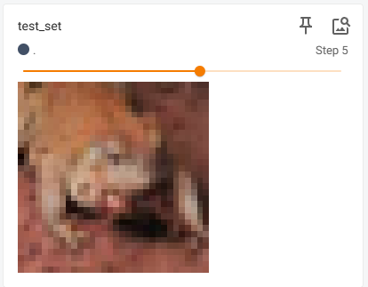
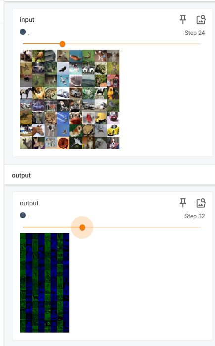

# Pythorch

## 1.DataSet

导入数据集，可以将图片数据导入

~~~python
from torch.utils.data import Dataset
from PIL import Image
import os

#导入数据集

class MyData(Dataset):

    def __init__(self, root_dir,label_dir):
        self.root_dir = root_dir
        self.label_dir = label_dir
        self.path = os.path.join(self.root_dir,self.label_dir)
        self.img_path = os.listdir(self.path)

    def __getitem__(self, idx):
        img_name=self.img_path[idx]
        img_item_path=os.path.join(self.path,img_name)
        img=Image.open(img_item_path)
        label = self.label_dir
        return img,label

    def __len__(self):
        return len(self.img_path)

root_dir="DataSet/train"
ants_image_dir="ants_image"
ants_label_dir="ants_label"

dataset=MyData(root_dir,ants_image_dir)

~~~

使用**控制台**可以显示图片

~~~bash
img,lable=dataset[1]
img.show()
~~~

## 2.Tensorboard

将训练数据集的结果可视化展示

### 2.1 scalar

导入标题，数据纵坐标和训练次数横坐标

~~~python
from torch.utils.tensorboard import SummaryWriter
#设置日志位置
writer = SummaryWriter("logs")
#添加图像
#writer.add_image()

#添加标量，三个数据分别是标题，数据y，步数x
#writer.add_scalar()
for i in range(100):
    writer.add_scalar("y=2x",2*i,i)

writer.close()
~~~

使用终端命令显示

~~~bash
tensorboard --logdir=logs
~~~

还可以更改端口

~~~bash
tensorboard --logdir=logs --port=6007
~~~

效果如下：

### 2.2 image

添加图片，首先需要构建环境，选择一张图片然后使用**控制台**查看图片类型

~~~python
from PIL import Image
image_path="Data/train/ants_image/0013035.jpg"
img = Image.open(image_path)
print(type(img))
~~~

查到图片类型为<class 'PIL.JpegImagePlugin.JpegImageFile'>，并非所需**tensor**类型，因此使用**numpy**类型进行转换，需要安装**opencv**

~~~bash
pip install opencv-python
~~~

然后进行转换

~~~python
import numpy as np
img_array=np.array(img)
~~~

接着可以使用add_image方法，注意一共四个参数，最后一个指定格式，需要判断是什么格式（HWC）

~~~python
from torch.utils.tensorboard import SummaryWriter
import numpy as  np
from PIL import Image
#可视化工具

writer = SummaryWriter("logs")
image_path="Data/train/ants_image/0013035.jpg"
img_PIL=Image.open(image_path)
img_array=np.array(img_PIL)

writer.add_image("test",img_array,1,dataformats="HWC")

writer.close()
~~~

## 3.Transforms

### 3.1 ToTensor

Transforms类似一个工具包，可以将图片转换成需要的格式（Tensor）

将图片转换成Tensor类型，首先需要引入**transforms**，然后使用**Image**打开图片，实例化**ToTensor**类，最后进行转换

~~~python
from torchvision import transforms
from PIL import Image

image_path="Data/train/ants_image/0013035.jpg"
img=Image.open(image_path)

tensor_trans = transforms.ToTensor()
tensor_image= tensor_trans(img)

print(tensor_image)
~~~

结果如下所示

~~~properties
tensor([[[0.3137, 0.3137, 0.3137,  ..., 0.3176, 0.3098, 0.2980],
         [0.3176, 0.3176, 0.3176,  ..., 0.3176, 0.3098, 0.2980],
         [0.3216, 0.3216, 0.3216,  ..., 0.3137, 0.3098, 0.3020],
         ...,
         [0.3412, 0.3412, 0.3373,  ..., 0.1725, 0.3725, 0.3529],
         [0.3412, 0.3412, 0.3373,  ..., 0.3294, 0.3529, 0.3294],
         [0.3412, 0.3412, 0.3373,  ..., 0.3098, 0.3059, 0.3294]],

        [[0.5922, 0.5922, 0.5922,  ..., 0.5961, 0.5882, 0.5765],
         [0.5961, 0.5961, 0.5961,  ..., 0.5961, 0.5882, 0.5765],
         [0.6000, 0.6000, 0.6000,  ..., 0.5922, 0.5882, 0.5804],
         ...,
         [0.6275, 0.6275, 0.6235,  ..., 0.3608, 0.6196, 0.6157],
         [0.6275, 0.6275, 0.6235,  ..., 0.5765, 0.6275, 0.5961],
         [0.6275, 0.6275, 0.6235,  ..., 0.6275, 0.6235, 0.6314]],

        [[0.9137, 0.9137, 0.9137,  ..., 0.9176, 0.9098, 0.8980],
         [0.9176, 0.9176, 0.9176,  ..., 0.9176, 0.9098, 0.8980],
         [0.9216, 0.9216, 0.9216,  ..., 0.9137, 0.9098, 0.9020],
         ...,
         [0.9294, 0.9294, 0.9255,  ..., 0.5529, 0.9216, 0.8941],
         [0.9294, 0.9294, 0.9255,  ..., 0.8863, 1.0000, 0.9137],
         [0.9294, 0.9294, 0.9255,  ..., 0.9490, 0.9804, 0.9137]]])
~~~

最后可以直接进行添加

~~~python
from torch.utils.tensorboard import SummaryWriter
from torchvision import transforms
from PIL import Image

from TensonBoard import writer

image_path="Data/train/ants_image/0013035.jpg"
img=Image.open(image_path)

writer = SummaryWriter("logs")
tensor_trans = transforms.ToTensor()
tensor_image= tensor_trans(img)

writer.add_image("Tensor_img",tensor_image)

print(tensor_image)
~~~

结果如下所示：

### 3.2  Normalize

规划一个**tensor**类型图片，给出均值和标准差，根据公式
$$
input=（input-mean）/std
$$
得到规划后的图片与原来不同，需要传入每个通道的均值和标准差，一般是三个通道

~~~python
from torch.utils.tensorboard import SummaryWriter
from torchvision import transforms
from PIL import Image

writer=SummaryWriter("logs")
image_path="Data/train/ants_image/0013035.jpg"
img=Image.open(image_path)

#ToTensor
trans_totensor = transforms.ToTensor()
img_tensor =trans_totensor(img)
#Normalize
trans_norm = transforms.Normalize(mean=[0.485,0.456,0.406],std=[0.229,0.224,0.225])
img_norm = trans_norm(img_tensor)#需要传入Tensor类型的图片

writer.add_image("Normalize_img",img_norm)
writer.close()
~~~

结果如下：

### 3.3 Resize

按照参数缩放**PIL**类型图片，需要给出高度和宽度；如果只给出一个参数，就会自动匹配最小的边

~~~python
from torch.utils.tensorboard import SummaryWriter
from torchvision import transforms
from PIL import Image

writer=SummaryWriter("logs")
image_path="Data/train/ants_image/0013035.jpg"
img=Image.open(image_path)

#ToTensor
trans_totensor = transforms.ToTensor()
img_tensor =trans_totensor(img)

#Resize
print(img.size)
trans_resize = transforms.Resize((512,512))
img_resize = trans_resize(img)
#PIL -> Tensor
img_resize = trans_totensor(img_resize)
print(img_resize.size)

writer.add_image("Resize",img_resize)
writer.close()
~~~

结果如下：明显缩小

### 3.4 Compose

多个变换组合成单一变化，相当于整合，传入一个列表，上一个输出是下一个输入，PIL -> PIL -> Tensor

~~~python
from torch.utils.tensorboard import SummaryWriter
from torchvision import transforms
from PIL import Image

writer=SummaryWriter("logs")
image_path="Data/train/ants_image/0013035.jpg"
img=Image.open(image_path)

#ToTensor
trans_totensor = transforms.ToTensor()
img_tensor =trans_totensor(img)

#Resize
print(img.size)
trans_resize = transforms.Resize((512,512))
img_resize = trans_resize(img)

#Compose
trans_resize_2=transforms.Resize(512)
trans_compose = transforms.Compose([trans_resize_2,trans_totensor])
#PIL -> PIL -> Tensor
img_resize_2 = trans_compose(img)

writer.add_image("Compose",img_resize_2)
writer.close()
~~~

## 4.torchvision

### 4.1 Dataset_Transforms

从torchvision.datasets.CIFAR10上拉取训练集和测试集，然后使用**Compose**进行类型转换，转换成**Tensor**类型

~~~python
import torchvision
#转换
dataset_transforms = torchvision.transforms.Compose([
    torchvision.transforms.ToTensor()
])
#拉取数据集
trains_set = torchvision.datasets.CIFAR10(root="./data", train=True, transform= dataset_transforms,download=True)
test_set = torchvision.datasets.CIFAR10(root="./data", train=False, transform= dataset_transforms,download=True)

print(trains_set[0])
~~~

之后可以显示数据集，利用Tesnsorboard进行显示

~~~python
import torchvision
from torch.utils.tensorboard import SummaryWriter

from TensonBoard import writer

dataset_transforms = torchvision.transforms.Compose([
    torchvision.transforms.ToTensor()
])

trains_set = torchvision.datasets.CIFAR10(root="./data", train=True, transform= dataset_transforms,download=True)
test_set = torchvision.datasets.CIFAR10(root="./data", train=False, transform= dataset_transforms,download=True)

#print(trains_set[0])

writer = SummaryWriter("TorchBoard")
for i in range (10):
    img,target = test_set[i]
    writer.add_image("test_set", img, i)

writer.close()
~~~

结果如图所示：

### 4.2 DataLoader

加载数据集到神经网络

~~~python
import torchvision
from torch.utils.data import DataLoader

test_data = torchvision.datasets.CIFAR10(root="./data", train=False, transform= torchvision.transforms.ToTensor(),download=True)
#train表示是否训练
#transforms使用torchvision自带的ToTensor方法

test_loader = DataLoader(test_data, batch_size=4, shuffle=True,num_workers=0,drop_last=False)
#`test_data`: 数据集对象，这里是CIFAR-10测试集。
#`batch_size=4`: 每个批次加载4个样本。
#`shuffle=True`: 在每个epoch开始时打乱数据。
#`num_workers=0`: 数据加载时使用的子进程数，0表示使用主进程。
#`drop_last=False`: 如果数据集大小不能被`batch_size`整除，是否丢弃最后一个不完整的批次，False表示不丢弃。

#测试数据集中第一张图片及其标签
img,target =  test_data[0]
#打印蹄片张量数据
print(img.shape)
print(target)
~~~

使用循环加入来打印数据集

~~~python
step= 0
for data in test_loader:
    imgs,targets = data
    print(imgs.shape)
    print(targets)
    step +=1
~~~

使用Tensorboard展示数据集

~~~python
writer = SummaryWriter("dataloader")
step= 0
for data in test_loader:
    imgs, targets = data
    #注意输入格式是否匹配
    writer.add_image("test_loader1", imgs, step,dataformats="NCHW")
    step += 1

writer.close()
~~~

结果如图所示：

## 5.Neural Network

### 5.1 Module

定义一个神经网络，实例化后进行各项操作，下只展示简单操作，因为多的我还不会

~~~python
import torch
from torch import nn

class Net(nn.Module):
    def __init__(self, *args, **kwargs) -> None:
        super().__init__(*args, **kwargs)

    def forward(self, x):
        return x+1

net=Net()
x=torch.tensor(1.0)
print(net(x))
~~~

### 5.2 Convolution Layer

对矩阵进行卷积操作，矩阵维数可选，下面只演示二维矩阵卷积操作并输出卷积结果

- 定义原矩阵和卷积矩阵
- 使用reshape进行格式转换，将张量转换为四维格式
- 使用functional进行卷积，注意**stride**是位移，**padding**是填充，默认是0

~~~python
import torch
import torch.nn.functional as F

#原矩阵
input = torch.tensor([[1,2,0,3,1],
                      [0,1,2,3,1],
                      [1,2,1,0,0],
                      [5,2,3,1,1],
                      [2,1,0,1,1]])

#卷积矩阵
kernel = torch.tensor([[1,2,1],
                       [0,1,0],
                       [2,1,0]])

#格式转换
input = torch.reshape(input, (1,1,5,5))
kernel = torch.reshape(kernel, (1,1,3,3))

#卷积
#stride是位移，可以是元组，也可以是整数（表示横纵方向的位移一样）
output = F.conv2d(input, kernel, stride=1, padding=0)
#padding是填充，可以是元组，也可以是整数（表示横纵方向的填充一样,默认是0）
output1 = F.conv2d(input, kernel, stride=1, padding=1)

print(output)
print(output1)
~~~

输出如下：

~~~bash
tensor([[[[10, 12, 12],
          [18, 16, 16],
          [13,  9,  3]]]])
tensor([[[[ 1,  3,  4, 10,  8],
          [ 5, 10, 12, 12,  6],
          [ 7, 18, 16, 16,  8],
          [11, 13,  9,  3,  4],
          [14, 13,  9,  7,  4]]]])
~~~

接下来是卷积实战，将图片进行卷积操作，注意选择正确的包，torch.nn.Conv2d

- 使用dataset导入数据集，这里使用测试集，并且转换成Tensor格式
- 使用dataloader将数据集打包成可迭代对象，64为一组
- 构造神经网络类，初始化方法中将输入通道，输出通道，卷积格式和位移，填充给出
- 构造forward方法用来返回卷积结果
- TensorBoard中接受三个通道，但是输出为6个，需要进行简单的格式转换

~~~python
import torch
import torchvision.datasets
from torch.nn import Conv2d
from torch.utils.data import DataLoader
from torch.utils.tensorboard import SummaryWriter
from torch import nn

dataset = torchvision.datasets.CIFAR10(root='./data', train=False, transform=torchvision.transforms.ToTensor(),
                                       download=True)

dataloader = DataLoader(dataset, batch_size=64)

class Net(nn.Module):
    def __init__(self):
        super(Net, self).__init__()
        # 3 input image channel, 6 output channels, 3x3 square convolution
        self.conv1 = Conv2d(3, 6, 3, 1, 0)

    def forward(self, x):
        x = self.conv1(x)
        return x

net = Net()

writer = SummaryWriter('logs')

step = 0
for data in dataloader:
    imgs,targets = data
    output = net(imgs)
    #torch.Size([64, 3, 32, 32])
    writer.add_images('input', imgs, step)
    #torch.Size([64, 6, 30, 30]) -> torch.Size([xxx, 3, 30, 30])
    output = torch.reshape(output, (-1, 3, 30, 30))
    writer.add_images('output', output, step)

    step += 1

writer.close()
~~~

输出结果如下图所示：

