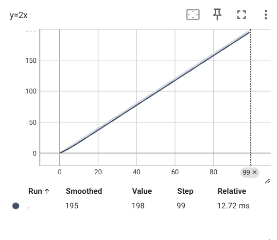
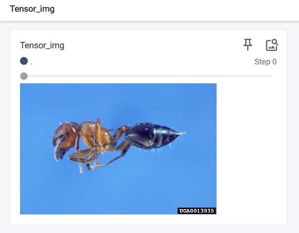
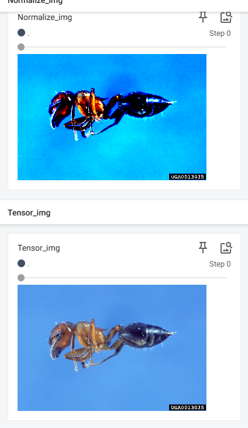
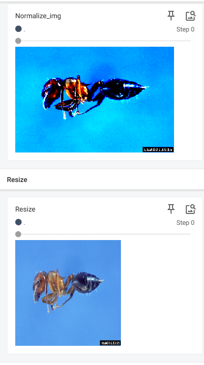

# Pythorch

## 1.DataSet

导入数据集，可以将图片数据导入

~~~python
from torch.utils.data import Dataset
from PIL import Image
import os

#导入数据集

class MyData(Dataset):

    def __init__(self, root_dir,label_dir):
        self.root_dir = root_dir
        self.label_dir = label_dir
        self.path = os.path.join(self.root_dir,self.label_dir)
        self.img_path = os.listdir(self.path)

    def __getitem__(self, idx):
        img_name=self.img_path[idx]
        img_item_path=os.path.join(self.path,img_name)
        img=Image.open(img_item_path)
        label = self.label_dir
        return img,label

    def __len__(self):
        return len(self.img_path)

root_dir="DataSet/train"
ants_image_dir="ants_image"
ants_label_dir="ants_label"

dataset=MyData(root_dir,ants_image_dir)

~~~

使用**控制台**可以显示图片

~~~bash
img,lable=dataset[1]
img.show()
~~~

## 2.Tensorboard

将训练数据集的结果可视化展示

### 2.1 scalar

导入标题，数据纵坐标和训练次数横坐标

~~~python
from torch.utils.tensorboard import SummaryWriter
#设置日志位置
writer = SummaryWriter("logs")
#添加图像
#writer.add_image()

#添加标量，三个数据分别是标题，数据y，步数x
#writer.add_scalar()
for i in range(100):
    writer.add_scalar("y=2x",2*i,i)

writer.close()
~~~

使用终端命令显示

~~~bash
tensorboard --logdir=logs
~~~

还可以更改端口

~~~bash
tensorboard --logdir=logs --port=6007
~~~

效果如下：

### 2.2 image

添加图片，首先需要构建环境，选择一张图片然后使用**控制台**查看图片类型

~~~python
from PIL import Image
image_path="Data/train/ants_image/0013035.jpg"
img = Image.open(image_path)
print(type(img))
~~~

查到图片类型为<class 'PIL.JpegImagePlugin.JpegImageFile'>，并非所需**tensor**类型，因此使用**numpy**类型进行转换，需要安装**opencv**

~~~bash
pip install opencv-python
~~~

然后进行转换

~~~python
import numpy as np
img_array=np.array(img)
~~~

接着可以使用add_image方法，注意一共四个参数，最后一个指定格式，需要判断是什么格式（HWC）

~~~python
from torch.utils.tensorboard import SummaryWriter
import numpy as  np
from PIL import Image
#可视化工具

writer = SummaryWriter("logs")
image_path="Data/train/ants_image/0013035.jpg"
img_PIL=Image.open(image_path)
img_array=np.array(img_PIL)

writer.add_image("test",img_array,1,dataformats="HWC")

writer.close()
~~~

## 3.Transforms

### 3.1 ToTensor

Transforms类似一个工具包，可以将图片转换成需要的格式（Tensor）

将图片转换成Tensor类型，首先需要引入**transforms**，然后使用**Image**打开图片，实例化**ToTensor**类，最后进行转换

~~~python
from torchvision import transforms
from PIL import Image

image_path="Data/train/ants_image/0013035.jpg"
img=Image.open(image_path)

tensor_trans = transforms.ToTensor()
tensor_image= tensor_trans(img)

print(tensor_image)
~~~

结果如下所示

~~~properties
tensor([[[0.3137, 0.3137, 0.3137,  ..., 0.3176, 0.3098, 0.2980],
         [0.3176, 0.3176, 0.3176,  ..., 0.3176, 0.3098, 0.2980],
         [0.3216, 0.3216, 0.3216,  ..., 0.3137, 0.3098, 0.3020],
         ...,
         [0.3412, 0.3412, 0.3373,  ..., 0.1725, 0.3725, 0.3529],
         [0.3412, 0.3412, 0.3373,  ..., 0.3294, 0.3529, 0.3294],
         [0.3412, 0.3412, 0.3373,  ..., 0.3098, 0.3059, 0.3294]],

        [[0.5922, 0.5922, 0.5922,  ..., 0.5961, 0.5882, 0.5765],
         [0.5961, 0.5961, 0.5961,  ..., 0.5961, 0.5882, 0.5765],
         [0.6000, 0.6000, 0.6000,  ..., 0.5922, 0.5882, 0.5804],
         ...,
         [0.6275, 0.6275, 0.6235,  ..., 0.3608, 0.6196, 0.6157],
         [0.6275, 0.6275, 0.6235,  ..., 0.5765, 0.6275, 0.5961],
         [0.6275, 0.6275, 0.6235,  ..., 0.6275, 0.6235, 0.6314]],

        [[0.9137, 0.9137, 0.9137,  ..., 0.9176, 0.9098, 0.8980],
         [0.9176, 0.9176, 0.9176,  ..., 0.9176, 0.9098, 0.8980],
         [0.9216, 0.9216, 0.9216,  ..., 0.9137, 0.9098, 0.9020],
         ...,
         [0.9294, 0.9294, 0.9255,  ..., 0.5529, 0.9216, 0.8941],
         [0.9294, 0.9294, 0.9255,  ..., 0.8863, 1.0000, 0.9137],
         [0.9294, 0.9294, 0.9255,  ..., 0.9490, 0.9804, 0.9137]]])
~~~

最后可以直接进行添加

~~~python
from torch.utils.tensorboard import SummaryWriter
from torchvision import transforms
from PIL import Image

from TensonBoard import writer

image_path="Data/train/ants_image/0013035.jpg"
img=Image.open(image_path)

writer = SummaryWriter("logs")
tensor_trans = transforms.ToTensor()
tensor_image= tensor_trans(img)

writer.add_image("Tensor_img",tensor_image)

print(tensor_image)
~~~

结果如下所示：

### 3.2  Normalize

规划一个**tensor**类型图片，给出均值和标准差，根据公式
$$
input=（input-mean）/std
$$
得到规划后的图片与原来不同，需要传入每个通道的均值和标准差，一般是三个通道

~~~python
from torch.utils.tensorboard import SummaryWriter
from torchvision import transforms
from PIL import Image

writer=SummaryWriter("logs")
image_path="Data/train/ants_image/0013035.jpg"
img=Image.open(image_path)

#ToTensor
trans_totensor = transforms.ToTensor()
img_tensor =trans_totensor(img)
#Normalize
trans_norm = transforms.Normalize(mean=[0.485,0.456,0.406],std=[0.229,0.224,0.225])
img_norm = trans_norm(img_tensor)#需要传入Tensor类型的图片

writer.add_image("Normalize_img",img_norm)
writer.close()
~~~

结果如下：

### 3.3 Resize

按照参数缩放**PIL**类型图片，需要给出高度和宽度；如果只给出一个参数，就会自动匹配最小的边

~~~python
from torch.utils.tensorboard import SummaryWriter
from torchvision import transforms
from PIL import Image

writer=SummaryWriter("logs")
image_path="Data/train/ants_image/0013035.jpg"
img=Image.open(image_path)

#ToTensor
trans_totensor = transforms.ToTensor()
img_tensor =trans_totensor(img)

#Resize
print(img.size)
trans_resize = transforms.Resize((512,512))
img_resize = trans_resize(img)
#PIL -> Tensor
img_resize = trans_totensor(img_resize)
print(img_resize.size)

writer.add_image("Resize",img_resize)
writer.close()
~~~

结果如下：明显缩小

### 3.4 Compose

多个变换组合成单一变化，相当于整合，传入一个列表，上一个输出是下一个输入，PIL -> PIL -> Tensor

~~~python
from torch.utils.tensorboard import SummaryWriter
from torchvision import transforms
from PIL import Image

writer=SummaryWriter("logs")
image_path="Data/train/ants_image/0013035.jpg"
img=Image.open(image_path)

#ToTensor
trans_totensor = transforms.ToTensor()
img_tensor =trans_totensor(img)

#Resize
print(img.size)
trans_resize = transforms.Resize((512,512))
img_resize = trans_resize(img)

#Compose
trans_resize_2=transforms.Resize(512)
trans_compose = transforms.Compose([trans_resize_2,trans_totensor])
#PIL -> PIL -> Tensor
img_resize_2 = trans_compose(img)

writer.add_image("Compose",img_resize_2)
writer.close()
~~~

## 4.torchvision

