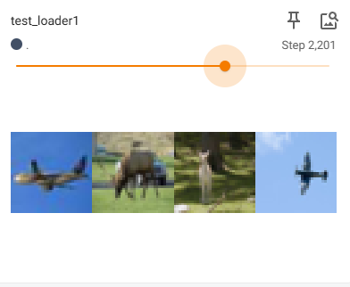

# Pythorch

## 1.DataSet

导入数据集，可以将图片数据导入

~~~python
from torch.utils.data import Dataset
from PIL import Image
import os

#导入数据集

class MyData(Dataset):

    def __init__(self, root_dir,label_dir):
        self.root_dir = root_dir
        self.label_dir = label_dir
        self.path = os.path.join(self.root_dir,self.label_dir)
        self.img_path = os.listdir(self.path)

    def __getitem__(self, idx):
        img_name=self.img_path[idx]
        img_item_path=os.path.join(self.path,img_name)
        img=Image.open(img_item_path)
        label = self.label_dir
        return img,label


    def __len__(self):
        return len(self.img_path)

root_dir="DataSet/train"
ants_image_dir="ants_image"
ants_label_dir="ants_label"

dataset=MyData(root_dir,ants_image_dir)

~~~

使用**控制台**可以显示图片

~~~bash
img,lable=dataset[1]
img.show()
~~~

## 2.Tensorboard

将训练数据集的结果可视化展示

### 2.1 scalar

导入标题，数据纵坐标和训练次数横坐标

~~~python
from torch.utils.tensorboard import SummaryWriter
#设置日志位置
writer = SummaryWriter("logs")
#添加图像
#writer.add_image()

#添加标量，三个数据分别是标题，数据y，步数x
#writer.add_scalar()
for i in range(100):
    writer.add_scalar("y=2x",2*i,i)


writer.close()
~~~

使用终端命令显示

~~~bash
tensorboard --logdir=logs
~~~

还可以更改端口

~~~bash
tensorboard --logdir=logs --port=6007
~~~

效果如下：


### 2.2 image

添加图片，首先需要构建环境，选择一张图片然后使用**控制台**查看图片类型

~~~python
from PIL import Image
image_path="Data/train/ants_image/0013035.jpg"
img = Image.open(image_path)
print(type(img))
~~~

查到图片类型为<class 'PIL.JpegImagePlugin.JpegImageFile'>，并非所需**tensor**类型，因此使用**numpy**类型进行转换，需要安装**opencv**

~~~bash
pip install opencv-python
~~~

然后进行转换

~~~python
import numpy as np
img_array=np.array(img)
~~~

接着可以使用add_image方法，注意一共四个参数，最后一个指定格式，需要判断是什么格式（HWC）

~~~python
from torch.utils.tensorboard import SummaryWriter
import numpy as  np
from PIL import Image
#可视化工具

writer = SummaryWriter("logs")
image_path="Data/train/ants_image/0013035.jpg"
img_PIL=Image.open(image_path)
img_array=np.array(img_PIL)

writer.add_image("test",img_array,1,dataformats="HWC")

writer.close()
~~~

## 3.Transforms

### 3.1 ToTensor

Transforms类似一个工具包，可以将图片转换成需要的格式（Tensor）

将图片转换成Tensor类型，首先需要引入**transforms**，然后使用**Image**打开图片，实例化**ToTensor**类，最后进行转换

~~~python
from torchvision import transforms
from PIL import Image

image_path="Data/train/ants_image/0013035.jpg"
img=Image.open(image_path)

tensor_trans = transforms.ToTensor()
tensor_image= tensor_trans(img)

print(tensor_image)
~~~

结果如下所示

~~~properties
tensor([[[0.3137, 0.3137, 0.3137,  ..., 0.3176, 0.3098, 0.2980],
         [0.3176, 0.3176, 0.3176,  ..., 0.3176, 0.3098, 0.2980],
         [0.3216, 0.3216, 0.3216,  ..., 0.3137, 0.3098, 0.3020],
         ...,
         [0.3412, 0.3412, 0.3373,  ..., 0.1725, 0.3725, 0.3529],
         [0.3412, 0.3412, 0.3373,  ..., 0.3294, 0.3529, 0.3294],
         [0.3412, 0.3412, 0.3373,  ..., 0.3098, 0.3059, 0.3294]],

        [[0.5922, 0.5922, 0.5922,  ..., 0.5961, 0.5882, 0.5765],
         [0.5961, 0.5961, 0.5961,  ..., 0.5961, 0.5882, 0.5765],
         [0.6000, 0.6000, 0.6000,  ..., 0.5922, 0.5882, 0.5804],
         ...,
         [0.6275, 0.6275, 0.6235,  ..., 0.3608, 0.6196, 0.6157],
         [0.6275, 0.6275, 0.6235,  ..., 0.5765, 0.6275, 0.5961],
         [0.6275, 0.6275, 0.6235,  ..., 0.6275, 0.6235, 0.6314]],

        [[0.9137, 0.9137, 0.9137,  ..., 0.9176, 0.9098, 0.8980],
         [0.9176, 0.9176, 0.9176,  ..., 0.9176, 0.9098, 0.8980],
         [0.9216, 0.9216, 0.9216,  ..., 0.9137, 0.9098, 0.9020],
         ...,
         [0.9294, 0.9294, 0.9255,  ..., 0.5529, 0.9216, 0.8941],
         [0.9294, 0.9294, 0.9255,  ..., 0.8863, 1.0000, 0.9137],
         [0.9294, 0.9294, 0.9255,  ..., 0.9490, 0.9804, 0.9137]]])
~~~

最后可以直接进行添加

~~~python
from torch.utils.tensorboard import SummaryWriter
from torchvision import transforms
from PIL import Image

from TensonBoard import writer

image_path="Data/train/ants_image/0013035.jpg"
img=Image.open(image_path)

writer = SummaryWriter("logs")
tensor_trans = transforms.ToTensor()
tensor_image= tensor_trans(img)

writer.add_image("Tensor_img",tensor_image)

print(tensor_image)
~~~

结果如下所示：


### 3.2  Normalize

规划一个**tensor**类型图片，给出均值和标准差，根据公式
$$
input=（input-mean）/std
$$
得到规划后的图片与原来不同，需要传入每个通道的均值和标准差，一般是三个通道

~~~python
from torch.utils.tensorboard import SummaryWriter
from torchvision import transforms
from PIL import Image

writer=SummaryWriter("logs")
image_path="Data/train/ants_image/0013035.jpg"
img=Image.open(image_path)

#ToTensor
trans_totensor = transforms.ToTensor()
img_tensor =trans_totensor(img)
#Normalize
trans_norm = transforms.Normalize(mean=[0.485,0.456,0.406],std=[0.229,0.224,0.225])
img_norm = trans_norm(img_tensor)#需要传入Tensor类型的图片

writer.add_image("Normalize_img",img_norm)
writer.close()
~~~

结果如下：


### 3.3 Resize

按照参数缩放**PIL**类型图片，需要给出高度和宽度；如果只给出一个参数，就会自动匹配最小的边

~~~python
from torch.utils.tensorboard import SummaryWriter
from torchvision import transforms
from PIL import Image

writer=SummaryWriter("logs")
image_path="Data/train/ants_image/0013035.jpg"
img=Image.open(image_path)

#ToTensor
trans_totensor = transforms.ToTensor()
img_tensor =trans_totensor(img)

#Resize
print(img.size)
trans_resize = transforms.Resize((512,512))
img_resize = trans_resize(img)
#PIL -> Tensor
img_resize = trans_totensor(img_resize)
print(img_resize.size)

writer.add_image("Resize",img_resize)
writer.close()
~~~

结果如下：明显缩小


### 3.4 Compose

多个变换组合成单一变化，相当于整合，传入一个列表，上一个输出是下一个输入，PIL -> PIL -> Tensor

~~~python
from torch.utils.tensorboard import SummaryWriter
from torchvision import transforms
from PIL import Image

writer=SummaryWriter("logs")
image_path="Data/train/ants_image/0013035.jpg"
img=Image.open(image_path)

#ToTensor
trans_totensor = transforms.ToTensor()
img_tensor =trans_totensor(img)


#Resize
print(img.size)
trans_resize = transforms.Resize((512,512))
img_resize = trans_resize(img)

#Compose
trans_resize_2=transforms.Resize(512)
trans_compose = transforms.Compose([trans_resize_2,trans_totensor])
#PIL -> PIL -> Tensor
img_resize_2 = trans_compose(img)

writer.add_image("Compose",img_resize_2)
writer.close()
~~~

## 4.torchvision

### 4.1 Dataset_Transforms

从torchvision.datasets.CIFAR10上拉取训练集和测试集，然后使用**Compose**进行类型转换，转换成**Tensor**类型

~~~python
import torchvision
#转换
dataset_transforms = torchvision.transforms.Compose([
    torchvision.transforms.ToTensor()
])
#拉取数据集
trains_set = torchvision.datasets.CIFAR10(root="./data", train=True, transform= dataset_transforms,download=True)
test_set = torchvision.datasets.CIFAR10(root="./data", train=False, transform= dataset_transforms,download=True)

print(trains_set[0])
~~~

之后可以显示数据集，利用Tesnsorboard进行显示

~~~python
import torchvision
from torch.utils.tensorboard import SummaryWriter

from TensonBoard import writer

dataset_transforms = torchvision.transforms.Compose([
    torchvision.transforms.ToTensor()
])

trains_set = torchvision.datasets.CIFAR10(root="./data", train=True, transform= dataset_transforms,download=True)
test_set = torchvision.datasets.CIFAR10(root="./data", train=False, transform= dataset_transforms,download=True)

#print(trains_set[0])

writer = SummaryWriter("TorchBoard")
for i in range (10):
    img,target = test_set[i]
    writer.add_image("test_set", img, i)

writer.close()
~~~

结果如图所示：


### 4.2 DataLoader

加载数据集到神经网络

~~~python
import torchvision
from torch.utils.data import DataLoader

test_data = torchvision.datasets.CIFAR10(root="./data", train=False, transform= torchvision.transforms.ToTensor(),download=True)
#train表示是否训练
#transforms使用torchvision自带的ToTensor方法

test_loader = DataLoader(test_data, batch_size=4, shuffle=True,num_workers=0,drop_last=False)
#`test_data`: 数据集对象，这里是CIFAR-10测试集。
#`batch_size=4`: 每个批次加载4个样本。
#`shuffle=True`: 在每个epoch开始时打乱数据。
#`num_workers=0`: 数据加载时使用的子进程数，0表示使用主进程。
#`drop_last=False`: 如果数据集大小不能被`batch_size`整除，是否丢弃最后一个不完整的批次，False表示不丢弃。

#测试数据集中第一张图片及其标签
img,target =  test_data[0]
#打印蹄片张量数据
print(img.shape)
print(target)
~~~

使用循环加入来打印数据集

~~~python
step= 0
for data in test_loader:
    imgs,targets = data
    print(imgs.shape)
    print(targets)
    step +=1
~~~

使用Tensorboard展示数据集

~~~python
writer = SummaryWriter("dataloader")
step= 0
for data in test_loader:
    imgs, targets = data
    #注意输入格式是否匹配
    writer.add_image("test_loader1", imgs, step,dataformats="NCHW")
    step += 1

writer.close()
~~~

结果如图所示：



## 5.Neural Network

### 5.1 Module

定义一个神经网络，实例化后进行各项操作，下只展示简单操作，因为多的我还不会

~~~python
import torch
from torch import nn

class Net(nn.Module):
    def __init__(self, *args, **kwargs) -> None:
        super().__init__(*args, **kwargs)

    def forward(self, x):
        return x+1

net=Net()
x=torch.tensor(1.0)
print(net(x))
~~~

### 5.2 Convolution Layer

对矩阵进行卷积操作，矩阵维数可选，下面只演示二维矩阵卷积操作并输出卷积结果

- 定义原矩阵和卷积矩阵
- 使用reshape进行格式转换，将张量转换为四维格式
- 使用functional进行卷积，注意**stride**是位移，**padding**是填充，默认是0

~~~python
import torch
import torch.nn.functional as F

#原矩阵
input = torch.tensor([[1,2,0,3,1],
                      [0,1,2,3,1],
                      [1,2,1,0,0],
                      [5,2,3,1,1],
                      [2,1,0,1,1]])

#卷积矩阵
kernel = torch.tensor([[1,2,1],
                       [0,1,0],
                       [2,1,0]])

#格式转换
input = torch.reshape(input, (1,1,5,5))
kernel = torch.reshape(kernel, (1,1,3,3))

#卷积
#stride是位移，可以是元组，也可以是整数（表示横纵方向的位移一样）
output = F.conv2d(input, kernel, stride=1, padding=0)
#padding是填充，可以是元组，也可以是整数（表示横纵方向的填充一样,默认是0）
output1 = F.conv2d(input, kernel, stride=1, padding=1)

print(output)
print(output1)
~~~

输出如下：

~~~bash
tensor([[[[10, 12, 12],
          [18, 16, 16],
          [13,  9,  3]]]])
tensor([[[[ 1,  3,  4, 10,  8],
          [ 5, 10, 12, 12,  6],
          [ 7, 18, 16, 16,  8],
          [11, 13,  9,  3,  4],
          [14, 13,  9,  7,  4]]]])
~~~

接下来是卷积实战，将图片进行卷积操作，注意选择正确的包，torch.nn.Conv2d

- 使用dataset导入数据集，这里使用测试集，并且转换成Tensor格式
- 使用dataloader将数据集打包成可迭代对象，64为一组
- 构造神经网络类，初始化方法中将输入通道，输出通道，卷积格式和位移，填充给出
- 构造forward方法用来返回卷积结果
- TensorBoard中接受三个通道，但是输出为6个，需要进行简单的格式转换

~~~python
import torch
import torchvision.datasets
from torch.nn import Conv2d
from torch.utils.data import DataLoader
from torch.utils.tensorboard import SummaryWriter
from torch import nn

dataset = torchvision.datasets.CIFAR10(root='./data', train=False, transform=torchvision.transforms.ToTensor(),
                                       download=True)

dataloader = DataLoader(dataset, batch_size=64)


class Net(nn.Module):
    def __init__(self):
        super(Net, self).__init__()
        # 3 input image channel, 6 output channels, 3x3 square convolution
        self.conv1 = Conv2d(3, 6, 3, 1, 0)

    def forward(self, x):
        x = self.conv1(x)
        return x


net = Net()

writer = SummaryWriter('logs')

step = 0
for data in dataloader:
    imgs,targets = data
    output = net(imgs)
    #torch.Size([64, 3, 32, 32])
    writer.add_images('input', imgs, step)
    #torch.Size([64, 6, 30, 30]) -> torch.Size([xxx, 3, 30, 30])
    output = torch.reshape(output, (-1, 3, 30, 30))
    writer.add_images('output', output, step)

    step += 1

writer.close()
~~~

输出结果如下图所示：


### 5.3Pooling Layer

使用池化层可以将显著降低神经网络中的训练量，相关参数如下：

- **kernel_size**：卷积层大小
- **stride**：位移大小，默认是kernel_size
- **padding**：填充大小
- **dilation**：降低数据集的关键，通过设置可以将卷积层映射时间隔对应数值
- **ceil_mode**：True为向上取整，接受该区域；False为向下取整，不接受该区域

下面是示例代码，使用tensor数据将获得最大线池：

~~~python
import torch
from torch import nn

input = torch.tensor([[1,2,0,3,1],
                      [0,1,2,3,1],
                      [1,2,1,0,0],
                      [5,2,3,1,1],
                      [2,1,0,1,1]],dtype=torch.float32)

input = torch.reshape(input, (-1,1,5,5))
#-1：自动计算该维度的大小，以确保总元素数量不变。
#1：通道数，表示单通道（例如灰度图像）。
#5：高度，表示重塑后的张量的高度为5。
#5：宽度，表示重塑后的张量的宽度为5
print(input.shape)

class Net(nn.Module):
    def __init__(self):
        super(Net, self).__init__()
        self.maxPool = nn.MaxPool2d(kernel_size=3,ceil_mode=True)

    def forward(self, input):
        input= self.maxPool(input)
        return input

net=Net()
output=net(input)
print(output)
~~~

结果如下：

~~~bash
torch.Size([1, 1, 5, 5])
tensor([[[[2., 3.],
          [5., 1.]]]])
~~~

接下来是小小实战篇，现在导入数据集进行实验，将图片进行最大池化，代码如下：

~~~python
import torch
import torchvision
from torch import nn
from torch.nn import MaxPool2d
from torch.utils.data import DataLoader
from torch.utils.tensorboard import SummaryWriter

dataset = torchvision.datasets.CIFAR10(root='../data', train=False, transform=torchvision.transforms.ToTensor(),download=True)

dataloader = DataLoader(dataset, batch_size=64)

class Net(nn.Module):
    def __init__(self):
        super(Net, self).__init__()
        self.maxPool = nn.MaxPool2d(kernel_size=3,ceil_mode=True)

    def forward(self, input):
        input= self.maxPool(input)
        return input

net=Net()

writer = SummaryWriter('../logs_maxpool')
step = 0
for data in dataloader:
    imgs,targets = data
    writer.add_images('input', imgs,step)
    output = net(imgs)
    writer.add_images('output', output, step)
    step+=1

writer.close()
~~~

结果如下所示：


明显感觉处理后的图片变得模糊，但是保留原始数据特征，大大减小工作量

### 5.4 Non-linear Activations

非线性变换，主要提高模型泛化能力，使得模型能更加贴合实际需求，以下仅展示sigmoid方法的使用

~~~python
import torch
import torchvision
from torch import nn
from torch.utils.data import DataLoader
from torch.utils.tensorboard import SummaryWriter

dataset = torchvision.datasets.CIFAR10(root='../data', train=False,
                                       transform=torchvision.transforms.ToTensor(),download=True)

dataloader = DataLoader(dataset, batch_size=64)

class R_net(nn.Module):
    def __init__(self):
        super(R_net, self).__init__()
        self.sigmoid = nn.Sigmoid()

    def forward(self, input):
        input= self.sigmoid(input)
        return input

net=R_net()

writer = SummaryWriter('../logs_relu')
step = 0
for data in dataloader:
    imgs,targets = data
    writer.add_images('input', imgs,step)
    output = net(imgs)
    writer.add_images('output', output, step)
    step+=1

writer.close()
~~~

以下为结果：


### 5.5 Linear

线性层通过使用矩阵乘法并加上偏置项，将数据特征最终映射到输出空间

- 首先打印imgs.shape获取图片大小
- 使用nn.linear将数据转换
- 使用torch.reshape进行转换
- 还可以使用**torch.flatten**进行平铺转换

~~~python
import torch
import torchvision
from torch.utils.data import DataLoader
from torch import nn

dataset = torchvision.datasets.CIFAR10(root="../data", train=False, transform=torchvision.transforms.ToTensor(), download=True)

dataloader = DataLoader(dataset=dataset, batch_size=64)

class Net (nn.Module):
    def __init__(self):
        super(Net, self).__init__()
        self.linear=nn.Linear(in_features=196608,out_features=10)

    def forward(self, input):
        output = self.linear(input)
        return output

net = Net()

for data in dataloader:
    imgs, targets = data
    print(imgs.shape)
    output = torch.reshape(imgs, (1,1,1,-1))
    #output = torch.flatten(imgs)
    #torch.Size([64, 3, 32, 32])
	#torch.Size([196608])
	#torch.Size([10])
    print(output.shape)
    output = net(output)
    print(output.shape)
~~~

输出结果如下：

~~~properties
torch.Size([64, 3, 32, 32])
torch.Size([1, 1, 1, 196608])
torch.Size([1, 1, 1, 10])
torch.Size([64, 3, 32, 32])
torch.Size([1, 1, 1, 196608])
torch.Size([1, 1, 1, 10])
torch.Size([64, 3, 32, 32])
torch.Size([1, 1, 1, 196608])
torch.Size([1, 1, 1, 10])
torch.Size([64, 3, 32, 32])
torch.Size([1, 1, 1, 196608])
torch.Size([1, 1, 1, 10])
torch.Size([64, 3, 32, 32])
torch.Size([1, 1, 1, 196608])
torch.Size([1, 1, 1, 10])
......
~~~

### 5.6 Sequential

Sequential指一种容器模块，用来集合神经网络中的多层计算

以下图为例，进行多层卷积/池化计算


**Ps**：注意第一步卷积后并未改变其尺寸，需根据公式计算Stride和padding
$$
H_{out} = \left\lfloor \frac{H_{in} + 2 \times \text{padding}[0] - \text{dilation}[0] \times (\text{kernel\_size}[0] - 1) - 1}{\text{stride}[0]} + 1 \right\rfloor 
$$
代入数据计算得stride=1，padding=2

代码如下：

- 使用Sequential进行集合化，简化代码结构
- 使用torch.ones创建初始化数据

~~~python
import torch
from torch import nn
from torch.nn import Sequential, Conv2d, MaxPool2d, Flatten, Linear


class Test(nn.Module):
    def __init__(self):
        super(Test, self).__init__()
        self.model1 = Sequential(
            Conv2d(in_channels=3,out_channels=32,kernel_size=5,padding=2),
            MaxPool2d(2),
            Conv2d(in_channels=32,out_channels=32,kernel_size=5,padding=2),
            MaxPool2d(2),
            Conv2d(in_channels=32,out_channels=64,kernel_size=5,padding=2),
            MaxPool2d(2),
            Flatten(),
            Linear(in_features=64*4*4,out_features=64),
            Linear(in_features=64,out_features=10)
        )

    def forward(self, input):
        output = self.model1(input)
        return output

model = Test()
print(model)
input = torch.ones((64,3,32,32))
output = model(input)
print(output.shape)
~~~

结果如下：

~~~bash
Test(
  (model1): Sequential(
    (0): Conv2d(3, 32, kernel_size=(5, 5), stride=(1, 1), padding=(2, 2))
    (1): MaxPool2d(kernel_size=2, stride=2, padding=0, dilation=1, ceil_mode=False)
    (2): Conv2d(32, 32, kernel_size=(5, 5), stride=(1, 1), padding=(2, 2))
    (3): MaxPool2d(kernel_size=2, stride=2, padding=0, dilation=1, ceil_mode=False)
    (4): Conv2d(32, 64, kernel_size=(5, 5), stride=(1, 1), padding=(2, 2))
    (5): MaxPool2d(kernel_size=2, stride=2, padding=0, dilation=1, ceil_mode=False)
    (6): Flatten(start_dim=1, end_dim=-1)
    (7): Linear(in_features=1024, out_features=64, bias=True)
    (8): Linear(in_features=64, out_features=10, bias=True)
  )
)
torch.Size([64, 10])
~~~

### 5.7 Loss Function

- L1loss

绝对值误差，可以用平均数也可以用求和

~~~python
import  torch
from torch import nn
from torch.nn import L1Loss

inputs= torch.tensor([1,2,3],dtype=torch.float32)
target = torch.tensor([1,2,5],dtype=torch.float32)
#绝对值误差
loss = L1Loss()
resut = loss(inputs,target)

print(resut)
#tensor(0.6667)
~~~

- MSEloss

均方差误差，平方后取平均

~~~python
import  torch
from torch import nn
from torch.nn import L1Loss

inputs= torch.tensor([1,2,3],dtype=torch.float32)
target = torch.tensor([1,2,5],dtype=torch.float32)
#均方误差
loss_mse = nn.MSELoss()
result_mse = loss_mse(inputs,target)

print(result_mse)
#tensor(1.3333)
~~~

- CrossEntropyLoss 

交叉熵误差，计算预测概率分布与真实概率分布的误差

`CrossEntropyLoss` 期望输入的形状为 `(N,     C)`，其中 `N`是批量大小，`C`是类的数量。 ，所以一般要进行格式转换，例如：

~~~python
x=torch.tensor([0.1,0.2,0.3])
x=torch.reshape(x,(1,3))
~~~

下为示例代码：

~~~python
import  torch
from torch import nn
from torch.nn import L1Loss

x=torch.tensor([0.1,0.2,0.3])
y=torch.tensor([1])
x=torch.reshape(x,(1,3))
loss_cross = nn.CrossEntropyLoss()
resut_cross = loss_cross(x,y)
print(resut_cross)
#tensor(1.1019)
~~~

通过神经网络多层迭代，最后输出交叉熵

~~~python
from torch import nn
from torch.nn import Conv2d, Sequential, MaxPool2d, Flatten, Linear
import torchvision
from torch.utils.data import DataLoader

dataset = torchvision.datasets.CIFAR10(root="../data", train=False, transform= torchvision.transforms.ToTensor(),download=True)

dataloader = DataLoader(dataset=dataset, batch_size=4)

class Test(nn.Module):
    def __init__(self):
        super(Test, self).__init__()
        self.model1 = Sequential(
            Conv2d(in_channels=3,out_channels=32,kernel_size=5,padding=2),
            MaxPool2d(2),
            Conv2d(in_channels=32,out_channels=32,kernel_size=5,padding=2),
            MaxPool2d(2),
            Conv2d(in_channels=32,out_channels=64,kernel_size=5,padding=2),
            MaxPool2d(2),
            Flatten(),
            Linear(in_features=64*4*4,out_features=64),
            Linear(in_features=64,out_features=10)
        )

    def forward(self, input):
        output = self.model1(input)
        return output

loss = nn.CrossEntropyLoss()
model = Test()
for data in dataloader:
    imgs, targets = data
    output = model(imgs)
    result_loss = loss(output,targets)
    print(result_loss)
~~~

输出为：

~~~bash
Files already downloaded and verified
tensor(2.2567, grad_fn=<NllLossBackward0>)
tensor(2.4100, grad_fn=<NllLossBackward0>)
tensor(2.3432, grad_fn=<NllLossBackward0>)
tensor(2.2962, grad_fn=<NllLossBackward0>)
......
~~~

最后提一嘴，交叉熵可以进行反向传播，即找到该点所在梯度(**grad**)，然后选择合适优化器再找到最小误差，下面是反向传播，至于为什么没有优化器，因为下一节要讲。

~~~python
    result_loss = loss(output,targets)
    result_loss.backward()
~~~

## 6.Optimizer

优化器优化梯度找到最优解，主要就是每轮先归零，然后计算，然后更新，下面是示例代码：

~~~python
#沿用上一小节的神经网络
loss = nn.CrossEntropyLoss()
model = Test()
#训练速度为0.01
optim =torch.optim.SGD(model.parameters(),lr=0.01)

for data in dataloader:
    imgs, targets = data
    output = model(imgs)
    result_loss = loss(output,targets)
    #梯度清零
    optim.zero_grad()
    #计算梯度
    result_loss.backward()
    #更新参数
    optim.step()
    print(result_loss)
~~~

由代码执行结果可知，一轮学习效果并不显著，因此进行多轮循环：

~~~python
loss = nn.CrossEntropyLoss()
model = Test()
optim =torch.optim.SGD(model.parameters(),lr=0.01)
for i in range(15):
    running_loss = 0.0
    for data in dataloader:
        imgs, targets = data
        output = model(imgs)
        result_loss = loss(output,targets)
        #梯度清零
        optim.zero_grad()
        #计算梯度
        result_loss.backward()
        #更新参数
        optim.step()
        running_loss += result_loss
    print(running_loss)
~~~

执行效果如下所示：

~~~bash
Files already downloaded and verified
tensor(4944.0220, grad_fn=<AddBackward0>)
tensor(4031.8301, grad_fn=<AddBackward0>)
tensor(3591.5593, grad_fn=<AddBackward0>)
tensor(3255.7888, grad_fn=<AddBackward0>)
tensor(2955.4282, grad_fn=<AddBackward0>)
tensor(2669.7776, grad_fn=<AddBackward0>)
tensor(2382.5964, grad_fn=<AddBackward0>)
tensor(2115.8455, grad_fn=<AddBackward0>)
tensor(1900.5393, grad_fn=<AddBackward0>)
tensor(1718.2169, grad_fn=<AddBackward0>)
tensor(1574.7793, grad_fn=<AddBackward0>)
tensor(1475.2067, grad_fn=<AddBackward0>)
tensor(1337.7804, grad_fn=<AddBackward0>)
tensor(1370.9921, grad_fn=<AddBackward0>)
tensor(1191.4083, grad_fn=<AddBackward0>)
~~~

## 7.Torchvision Models

### 7.1 ImageNet

pytorch提供许多训练好的网络模型，本处以ImageNet为例：

~~~python
import torchvision
from torch import nn
#屏蔽的原因是这玩意一百四十个G，比黑神话还大，没辙
# train_data = torchvision.datasets.ImageNet(root="../Data_image_net", train=False,
#                                            transform=torchvision.transforms.ToTensor(), download=True)

vgg16_false = torchvision.models.vgg16(pretrained=False)
vgg16_true = torchvision.models.vgg16(pretrained=True)

print(vgg16_false)
print(vgg16_true)
~~~

结果如图所示


- 其中第一个是未训练的模型，使用的随机参数，需要经过训练才可以使用

- 第二个是训练后的模型，使用已经训练好的数据

网络模型还支持修改神经网络，可以修改参数或者添加层数，支持各种各样的修改

~~~python
vgg16_true.classifier.add_module("new", nn.Linear(in_features=1000, out_features=10))

vgg16_false.classifier[6] = nn.Linear(in_features=4096, out_features=10)

vgg16_false.classifier=nn.Sequential(*list(vgg16_false.classifier.children())[:-1],nn.Linear(in_features=4096,out_features=10))
~~~

### 7.2 Model Save

**方式一**：模型结构+参数

~~~python
import torch
import torchvision

vgg16 = torchvision.models.vgg16(pretrained=True)
#保存方式1 模型结构+模型参数
torch.save(vgg16, "vgg16.method1.pth")
#使用方法 文件路径
model = torch.load("vgg16.method1.pth")
~~~

**Ps**：加载模型时需要将模型类移过来，比较麻烦

**方式二**：模型参数(**官方推荐**)

```python
import torch
import torchvision

vgg16 = torchvision.models.vgg16(pretrained=True)
#保存方式2 模型参数
torch.save(vgg16.state_dict(), "vgg16.method2.pth")
#使用方式
vgg16 = torchvision.models.vgg16(pretrained=False)
vgg16.load_state_dict(torch.load("vgg16.method2.pth"))
```

## 8.Completed Model

集合上述所有知识所形成的基本的模型框架以及展示效果

- 准备数据集
- 加载数据集
- 引入模型
- 损失函数
- 优化器
- 设置参数
- 训练步骤->训练，梯度下降，打印结果
- 测试步骤->忽视梯度，计算准确率，添加数据
- 保存模型

~~~python
import torch
import torchvision
from torch import nn
from torch.utils.data import DataLoader
from torch.utils.tensorboard import SummaryWriter

from model import *

#准备数据集
train_data = torchvision.datasets.CIFAR10(root='../data', train=True, download=True,
                                          transform=torchvision.transforms.ToTensor())

#准备测试数据集
test_data = torchvision.datasets.CIFAR10(root='../data', train=False, download=True,
                                         transform=torchvision.transforms.ToTensor())

#利用dataloader加载数据集
train_dataloader = DataLoader(train_data, batch_size=64)
test_dataloader = DataLoader(test_data, batch_size=64)

#创建网络模型
net = Net()

#损失函数
loss_fn = nn.CrossEntropyLoss()

#优化器
learning_rate = 1e-2
optimizer = torch.optim.SGD(net.parameters(), lr=learning_rate)

#设置训练网络的一些参数
#记录训练的次数
total_train_step = 0
#记录测试的次数
total_test_step = 0
#训练的轮数
epochs = 10

#添加tensorboard
writer = SummaryWriter('../logs_train')

for i in range(epochs):
    print("-----第{}轮训练-----".format(i+1))

    #训练步骤
    for data in train_dataloader:
        imgs, targets = data
        output = net(imgs)
        loss = loss_fn(output, targets)

        optimizer.zero_grad()
        loss.backward()
        optimizer.step()

        #逢100次打印一次
        total_train_step += 1
        if total_train_step % 100 == 0:
            print("训练次数：{}, Loss:{}".format(total_train_step, loss.item()))
            writer.add_scalar("train_loss", scalar_value=loss.item(), global_step=total_train_step)

    #测试步骤
    total_test_loss = 0
    total_accuracy = 0
    with torch.no_grad():
        for data in test_dataloader:
            imgs, targets = data
            output = net(imgs)
            loss = loss_fn(output, targets)
            total_test_loss += loss
            #计算准确率
            accuracy = (output.argmax(1)==targets).sum()
            total_accuracy += accuracy

    print("整体测试集上的Loss:{}".format(total_test_loss))
    writer.add_scalar("test_loss", scalar_value=total_test_loss, global_step=total_test_step)
    writer.add_scalar("test_accuracy", scalar_value=total_accuracy/len(test_data), global_step=total_test_step)
    total_test_step += 1

    #torch.save(net.state_dict(),"net_{}.pth".format(i))
    torch.save(net,"net_{}.pth".format(i+1))

writer.close()
~~~

结果之一如下，至于为什么是之一，因为懒得跑了


因为模型很大，所以可以用GPU跑，一般将**模型**，**数据**，**损失函数**进行cuda

~~~python
#创建网络模型
net = Net()
net = net.cuda()

#损失函数
loss_fn = nn.CrossEntropyLoss()
loss_fn = loss_fn.cuda()

#训练步骤
for data in train_dataloader:
    imgs, targets = data
    imgs = imgs.cuda()
    targets = targets.cuda()
    output = net(imgs)
    loss = loss_fn(output, targets)

    optimizer.zero_grad()
    loss.backward()
    optimizer.step()
~~~

除了cuda方法，还有to方法，先定义设备，然后选择设备

~~~python
device = torch.device("cuda:0")
#创建网络模型
net = Net()
net = net.to(device)

#损失函数
loss_fn = nn.CrossEntropyLoss()
loss_fn = loss_fn.to(device)

#训练步骤
for data in train_dataloader:
    imgs, targets = data
    imgs = imgs.to(device)
    targets = targets.to(device)
    output = net(imgs)
    loss = loss_fn(output, targets)

    optimizer.zero_grad()
    loss.backward()
    optimizer.step()
~~~

## 9.Prctice

设计一个完整的模型用来测试

~~~python
import torch
import torchvision
from PIL import Image
from torch import nn

image_path = "../data/airplane.jpg"
image = Image.open(image_path)
print(image)


transform = torchvision.transforms.Compose([torchvision.transforms.Resize((32, 32)),
                                            torchvision.transforms.ToTensor()])

image = transform(image)
print(image.shape)

class Net(nn.Module):
    def __init__(self):
        super(Net, self).__init__()
        self.model = nn.Sequential(
            nn.Conv2d(3, 32, 5, stride=1, padding=2),
            nn.MaxPool2d(2),
            nn.Conv2d(32, 32, 5, stride=1 ,padding=2),
            nn.MaxPool2d(2),
            nn.Conv2d(32, 64, 5, stride=1, padding=2),
            nn.MaxPool2d(2),
            nn.Flatten(),
            nn.Linear(64*4*4, 64),
            nn.Linear(64, 10)
        )

    def forward(self, x):
        return self.model(x)

#如果没有指定再GPU上运行，需要指定map_location=torch.device('cpu')
model = torch.load("net_29_gpu.pth",map_location=torch.device('cpu'))
image = torch.reshape(image, (1, 3, 32, 32))
model.eval()
with torch.no_grad():
    outputs = model(image)
print(outputs)

print(outputs.argmax(dim=1))
~~~

