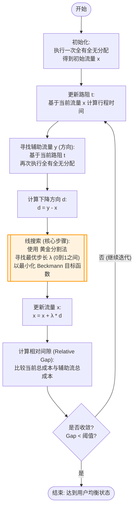

```mermaid
flowchart TD
    Start([开始]) --> Init["初始化:<br/>执行一次全有全无分配<br/>得到初始流量 x"]
    
    Init --> UpdateCost["更新路阻 t:<br/>基于当前流量 x 计算行程时间"]
    
    UpdateCost --> AuxFlow["寻找辅助流量 y (方向):<br/>基于当前路阻 t<br/>再次执行全有全无分配"]
    
    AuxFlow --> Direction["计算下降方向 d:<br/>d = y - x"]
    
    Direction --> LineSearch[["线搜索 (核心步骤):<br/>使用 黄金分割法<br/>寻找最优步长 λ (0到1之间)<br/>以最小化 Beckmann 目标函数"]]
    
    LineSearch --> UpdateX["更新流量 x:<br/>x = x + λ * d"]
    
    UpdateX --> CalcGap["计算相对间隙 (Relative Gap):<br/>比较当前总成本与辅助流总成本"]
    
    CalcGap --> CheckConv{是否收敛?<br/>Gap < 阈值?}
    
    CheckConv -- 否 (继续迭代) --> UpdateCost
    CheckConv -- 是 --> End([结束: 达到用户均衡状态])
    
    %% 样式调整
    style LineSearch fill:#fff3e0,stroke:#ff9800,stroke-width:2px
```

