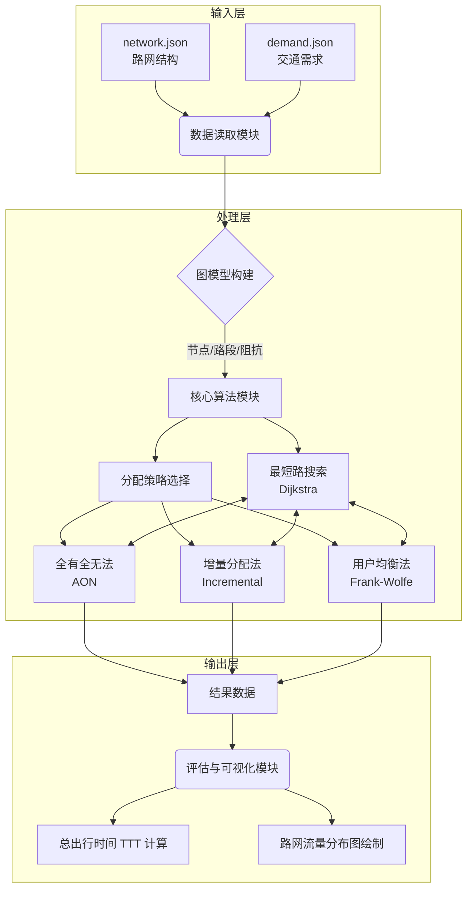

```mermaid
graph TD
    subgraph 输入层
        A[network.json<br>路网结构] --> C(数据读取模块)
        B[demand.json<br>交通需求] --> C
    end

    subgraph 处理层
        C --> D{图模型构建}
        D -->|节点/路段/阻抗| E[核心算法模块]
        
        E --> F[最短路搜索<br>Dijkstra]
        E --> G[分配策略选择]
        
        G --> H[全有全无法<br>AON]
        G --> I[增量分配法<br>Incremental]
        G --> J[用户均衡法<br>Frank-Wolfe]
        
        F <--> H
        F <--> I
        F <--> J
    end

    subgraph 输出层
        H & I & J --> K[结果数据]
        K --> L(评估与可视化模块)
        L --> M[总出行时间 TTT 计算]
        L --> N[路网流量分布图绘制]
    end
```
