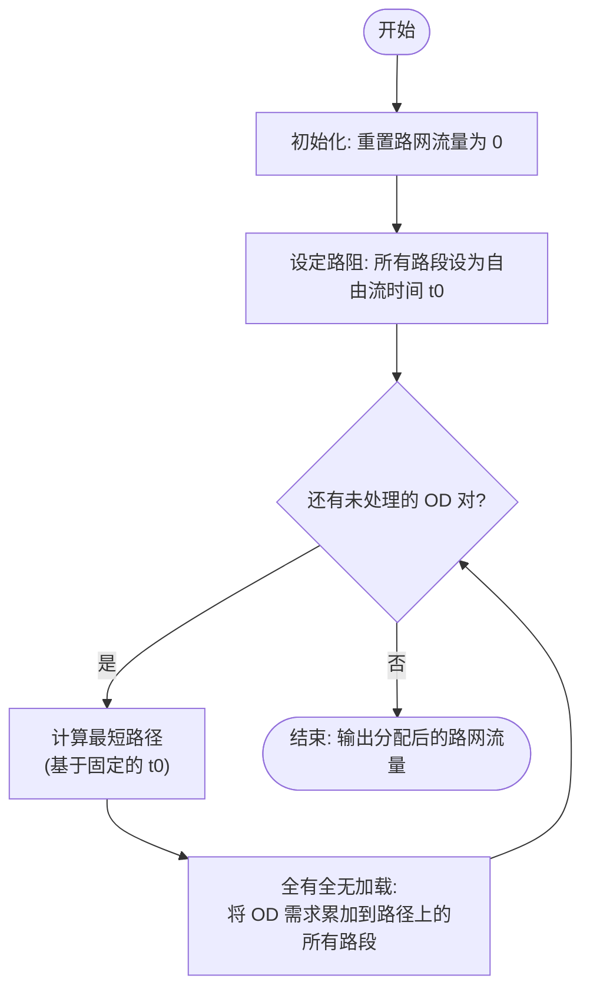

```mermaid
flowchart TD
    Start([开始]) --> Init["初始化: 重置路网流量为 0"]
    
    Init --> SetCost["设定路阻: 所有路段设为自由流时间 t0"]
    
    SetCost --> Loop{还有未处理的 OD 对?}
    
    Loop -- 是 --> FindPath["计算最短路径<br/>(基于固定的 t0)"]
    
    FindPath --> Assign["全有全无加载:<br/>将 OD 需求累加到路径上的所有路段"]
    
    Assign --> Loop
    
    Loop -- 否 --> End([结束: 输出分配后的路网流量])
```

