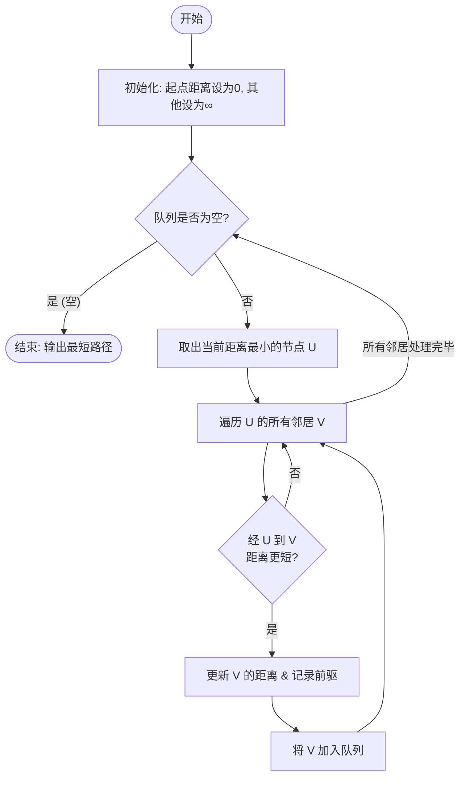

```mermaid
flowchart TD
    Start([开始]) --> Init[初始化: 起点距离设为0, 其他设为∞]
    Init --> Loop{队列是否为空?}
    
    Loop -- 是 (空) --> End([结束: 输出最短路径])
    Loop -- 否 --> Pop[取出当前距离最小的节点 U]
    
    Pop --> Neighbors[遍历 U 的所有邻居 V]
    Neighbors --> Relax{经 U 到 V<br/>距离更短?}
    
    %% 松弛成功
    Relax -- 是 --> Update[更新 V 的距离 & 记录前驱]
    Update --> Push[将 V 加入队列]
    Push --> Neighbors
    
    %% 松弛失败
    Relax -- 否 --> Neighbors
    
    %% 邻居遍历结束回主循环
    Neighbors -- 所有邻居处理完毕 --> Loop
```

