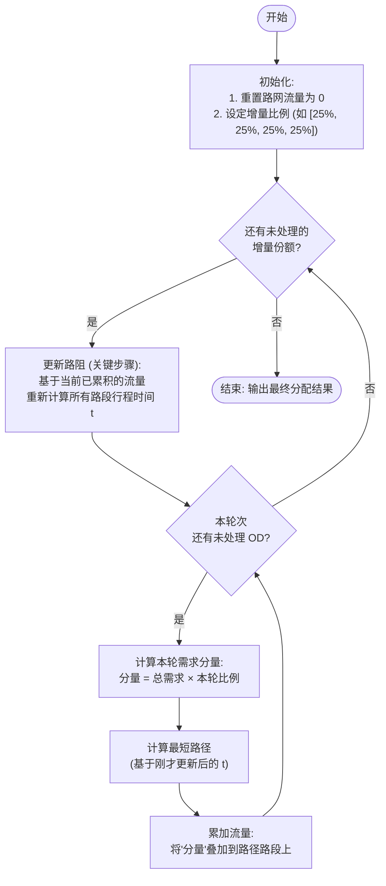

```mermaid
flowchart TD
    Start([开始]) --> Init["初始化:<br/>1. 重置路网流量为 0<br/>2. 设定增量比例 (如 [25%, 25%, 25%, 25%])"]
    
    Init --> LoopSteps{还有未处理的<br/>增量份额?}
    
    %% 核心区别点：在每一轮分配开始前更新路阻
    LoopSteps -- 是 --> UpdateCost["更新路阻 (关键步骤):<br/>基于当前已累积的流量<br/>重新计算所有路段行程时间 t"]
    
    UpdateCost --> LoopOD{本轮次<br/>还有未处理 OD?}
    
    LoopOD -- 是 --> CalcPart["计算本轮需求分量:<br/>分量 = 总需求 × 本轮比例"]
    
    CalcPart --> FindPath["计算最短路径<br/>(基于刚才更新后的 t)"]
    
    FindPath --> Assign["累加流量:<br/>将'分量'叠加到路径路段上"]
    
    Assign --> LoopOD
    
    %% 内层循环结束，回到外层
    LoopOD -- 否 --> LoopSteps
    
    %% 外层循环结束
    LoopSteps -- 否 --> End([结束: 输出最终分配结果])
```

