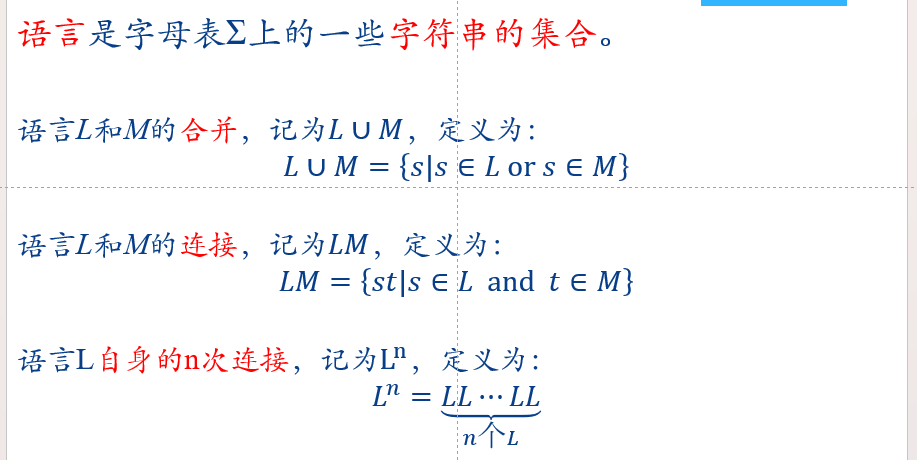
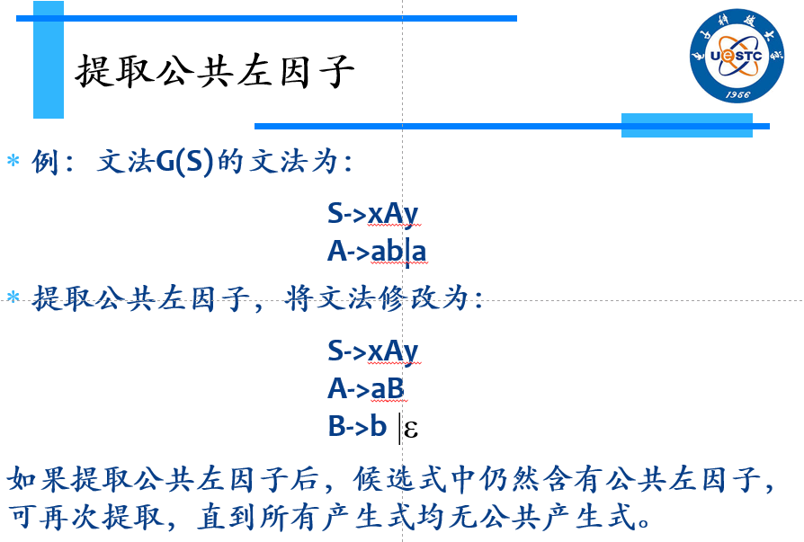
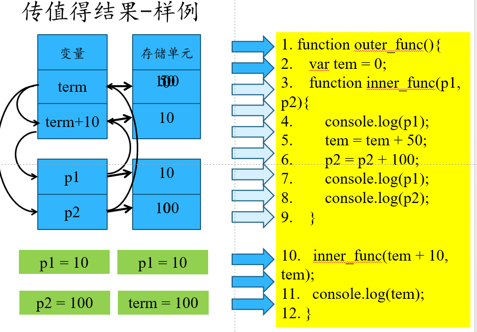

# 编译原理

## 1.编译器

**编译程序**：将源程序完整地转换成机器语言或者汇编语言程序，然后再处理、执行的程序。

**词法分析**：从左至右逐个字符地对源程序进行扫描，产生一个个单词符号，将字符串形式的源程序转换成单词符号串形式的源程序

**语法分析**：语法分析是对词法分析输出的**字符单元**，按照**语法规则**进行判断，对能构成正确句子的单词流，给出相应的**语法树**；对不能构成正确句子的单词流，判定其出现了**语法错误**，并作出相应的处理。

**语义分析**：语义分析是审查源程序有无**语义错误**，为代码生成阶段收集信息。

**属性文法**：为上下文无关文法中的文法符号赋予一定属性，以便描述与文法符号相关的信息，利用这些信息为每个产生式规则配上语义子程序，在语义子程序中进行属性计算工作

**语法制导翻译**：为语言的文法规则配上相应的语义子程序，在语法分析过程中，当某规则被用来**扩展一个文法非终结符**或被用来**规约可规约串**，执行相应的语义子程序，完成属性计算和中间代码生成

**中间代码**：语义明确形式简单，与机器指令形式类似的内部表达式

## 2.实现简单编译器

### 2.1高级语言定义

**语句**：赋值语句，循环语句，条件语句

**表达**：算数表达式，布尔表达式，逻辑表达式

**变量：**

**词法分析器**：用于识别标识符，关键字，运算符，分界符，常量等，不可拆分的语法成分，称为终结符

（可拆分的如语句，表达式，称为非终结符。）

**语言**：是一定的群体用来进行信息交流的工具。

**语义规则**：

### 2.2词法分析

**画状态转移图**

从左至右逐个字符地对源程序进行扫描，产生一个个单词符号，将字符串形式的源程序转换成但此符号串形式的源程序

### 2.3语法分析

语法分析是对词法分析输出的**字符单元**，按照**语法规则**进行判断，对能构成正确句子的单词流，给出相应的**语法树**；对不能构成正确句子的单词流，判定其出现了**语法错误**，并作出相应的处理。

**语法分析方法**：从语义规则出发（**推导**）和从源程序（**规约**）出发

### 2.4语义分析

语义分析是审查源程序有无**语义错误**，为代码生成阶段收集信息。

**类型检查**：根据数据对象的类型和操作是否一致展开一致性检查，包括**静态检查**和**动态检查**

**静态检查**：编译时进行，保证程序正确                             **动态检查**：运行时进行，效率低

语言按类型分无类型语言，弱类型语言（自动转换，js），强类型语言（先定义再使用如Java，c++）

### 2.5中间代码生成

**三地址代码**

一元运算类赋值语句：x=op y

二元运算类赋值语句：x=y op z

复制类赋值语句：s = y

条件跳转语句：if x rop y goto L或者if a goto L

无条件跳转语句： goto L

**目标代码**

## 3.词法分析

### 3.1单词识别

单词识别是对照符号编码表来转换成类别编号

### 3.2状态转换图

节点用圆圈表示，状态之间用箭头连接，写上可能出现的输入字符或字符类，有一个为初态，**至少一个终态**（双圈，对应return（C，VAL））。

### 3.3正则表达式

**字母表**：一个有限的符号集合

**串**：字母表中符号的一个有穷序列

**串S的长度**：记作|s|，指s中出现的符号的次数

**空串**：长度为0的串，记作 ε

**闭包**：用a*来表示由0个或者多个a构成的串

**正闭包**：用a+表示由一个或者多个a构成的串

**语言**：给定字母表上的一个任意的可数的串的集合

### 3.4有限状态自动机

***M=(Q,* Σ**, ***δ, q0***, **F)**

Q：状态的非空集合 0 1 2 3 4等

**Σ**：输入字符串的集合 a b等

**δ**：映射，如果没有后继状态就空着

q0：初始状态

F：结束状态  

**NFA**：非确定状态 （a可能到s0，s1）              **DFA**：确定状态（每个路径都确定）

先造NFA，再造DFA

### 3.5NFA转DFA

首先找开始状态划分到一个集合，记为A，针对每个状态输入a,b获得下一个状态集合B,C。反复如此知道所有集合都被输入过a，b

最后得到DFA

### 3.6最简DFA

首先划分成终态和非终态，然后每个集合里的每个状态都要输入a,b来检查，只有后继状态完全一样的才可以划分到同一个集合中

## 4.语法分析

### 4.1语言和文法

1.**文法**是一种描述语言的语法的形式规则

2.文法G是一个四元组G=(VT, VN, S, P)，分别是（终结符，非终结符，开始符号，产生式具有形式α→β。其中 α, β∈ (V_T∪VN)*）

3.**一些约定**：终结符用小写字母，非终结符用大写字母，开始符号仅有一个，产生式左边至少由一个非终结符

4.如果从开始符号经过一部或者多步替换，使得则称α是G的一个**句型**，如果α中只含有终结符，那称α是G的一个**句子**。由G的所有句子组成的集合称为**语言**L(G)，如果L(G1)=L(G2)，则称文法G1和G2是**等价**的，即不同的文法可以产生相同的语言，同一语言可以用不同的文法来描述。

5.**文法分类**

0型文法：P的每一个产生式的左部至少含有一个非终结符的文法，又叫**短语结构文法**。

1型文法：在0型文法的基础上，P的每个产生式α→β还满足|α|≤|β|，(S→ε)除外的文法。又叫**上下文有关文法**。

2型文法：P的每个产生式具有A→β的文法，其中A∈V_N，β∈(VT∪V_N )^∗，又叫**上下文无关文法**。

3型文法：P中每个产生式具有A→αB，A→α的文法，其中A、B∈VN，α∈〖VT〗^∗，又叫**正规文法**或右线性文法

6.**文法的推导和规约**

若有一个符号串*v**、**w*满足：*v = γαδ, w =*  *γβδ,* 则称 *v*应用产生式

α → β 可直接产生 *w*， 即*v*可直接推导出*w*。即 *v* ⇒ *w*

也可以称 *w*可直接规约为*v*。

如果每一步都是对当前举行的**最左边非终结符**进行替换，称为**最左推导**，相应规约称为**最右规约**，反之则称为最右推导和最左规约，并且称**最右推导**是**规范推导**，**最左规约**是**规范规约**，如果每一步推导都由**规范推导**产生的句型称为**规范句型**。

### 4.2语法分析分类和错误处理方式

1.自上而下分析法，找到最左推导序列，使得从S出发最左推导，叶子节点从左到右连接刚好是右边。

2.自下而上的语法分析，从右边出发，按照最左规约，直至文法开始符号S。

**处理方式**：忽略方式，删除符号，插入符号，在产生式适当位置添加相应的错误信息。

### 4.3回溯分析法

自顶向下如果遇到多个可匹配的产生式，选择一个如果不合适回溯到上一步，直至所有都尝试过或者找到正确的，效率低，不常用

**引起回溯的原因**：公共左因子，左递归，空产生式

**消除回溯**：提取公共左因子，消除左递归

左递归的两种形式

消除直接左递归，改为等价右递归

消除间接左递归，带入得到直接左递归

### 4.4 FIRST集

FIRST集是由**α**的所有可能推导出来的字符串的开头终结符及可能的**ε**组成的集合

即所有都空才能有空

### 4.5 FOLLOW集

**FOLLOW(A)**是在文法的所有句型中紧跟在A后的终结符及可能的#组成的集合。

### 4.6SELECT集

非终结符的**非空FIRST集**，**终结符**，空的话就是**左边的FOLLOW集**

### 4.7LL(1)文法

保证SELECT集不能有重合，详见**4.6**

### 4.8确定语法分析方法

**递归下降分析法：**在不含有左递归的文法G中，为每个非终结符构造一个子程序，每个子程序的函数体按照非终结符的产生式分情况展开。遇到终结符则进行匹配，遇到非终结符则调用相应的非终结符的子程序。

该方法需要满足**LL(1)文法**才能构成递归下降分析器

**预测分析法：**预测分析器的控制程序在任何时候均根据**下推栈的栈顶符号**和**当前的输入符号**决定下一步应采取的动作。将这些所有可能的动作用表格形式展示。

**预测分析表的构造：**

**1**、对每一个产生式A→α执行第二步和第三步；

**2**、对每个终结符a∈**FIRST**(α)，把**A→α**加到 **M[A, a]**中。

**3**、若**ε∈FIRST**(α)，**∀**b∈**FOLLOW**(A，则把**A→α**（A→ε）加到M[A, b]中。

**4**、把所有未定义的M[A, a]标上“出错标志”

5.带有同步化信息的预测分析表见下面

**预测分析错误处理**

因此出现了**带有同步化信息的预测分析表**

## 4.自下而上的语法分析

**基本思想**：从输入串开始，逐步进行“规约”，直到文法的开始符号。即从构造语法树的末端开始。直至根节点

**主要方法**：LR分析法，从左至右扫描，自下而上规约

### 4.1自下而上分析法

短语：树的叶子节点构成的集合

直接短语：高度为2的子树叶子节点

句柄：最左直接短语

**输入为101的语法分析树**

### 4.2LR(0)分析法

**LR文法肯定不是二义的**

**LR(0)项目：**右部某位置标有圆点的产生式称为相应 文法的一个LR(0)项目

  **构造分析表**

首先拓广文法，接着构造状态转换图，然后填表，s表示移入，r表示规约，acc表示结束

构造过程中可能产生**移入/规约**冲突或者**规约/规约**冲突，因此需要SLR分析法

### 4.3.SLR文法

与LR(0)文法类似，但是当发生冲突时选择**冲突项**的**FOLLOW集**，判断是否规约，同时只有在FOLLOW集中的元素才能规约，不能所有的都规约成一个状态。

### 4.4LR分析法错误处理

1.插入，删除或者修改

2.构造错误处理分析表

## 5.语义分析和中间代码生成

### 5.1语义分析概述

语义分析是审查源程序有无语义错误，为代码生成阶段收集信息。

**符号表**：是一种供编译器用于保存有关源程序构造的各种信息的数据结构（将信息从声明的地方传递到实际使用的地方）

### 5.2语义分析分类

**静态语义**分析基本功能有：类型检查、控制流检查、唯一性检查、关联名字检查、名字的作用域分析等等。

**动态语义**：程序单位描述的计算，例如：除零溢出错误、数组下标越界、无效的指针等。

### 5.3语义分析方法

**语法制导翻译：**不生成抽象语法树，直接生成中间代码，适用于文法简单的语言

**抽象语法树：**生成抽象语法树再生成中间代码

### 5.3属性文法

**1.综合属性和继承属性**：综合属性由子节点或自己（**产生式左部**），继承属性由父节点或兄弟节点或自己决定的（**产生式右部**）

终结符只有综合属性（由词法分析器提供），非终结符都可以有，但文法开始符号的所有继承属性用于属性计算前的初始值

**2.属性计算方法**

**树遍历的属性计算方法**：假设树已经建立，并且树中已带有开始符号的继承属性和终结符的综合属性，一般以深度优先的方法遍历树

**一遍扫描的处理方法**：在语法分析的同时计算属性值，而不是先构造语法树。因为处理方法与语法分析器相互作用，因此与**所采用的语法分析方法**和**属性的计算次序**有关

**3.S属性文法**

如果一个属性文法只含有综合属性，则成为S属性文法

由于只含有综合属性，因此可以用**自下而上**进行计算（LR）。

**4.L属性文法**

即右边的只依赖于左边，L属性文法允许一次遍历就计算出所有的属性值，因此可以用**自上而下（LL1）**

**依赖图**

### 5.4语义子程序

**在语法分析过程**中，每当一个产生式用于匹配或进行归约时，就调用该产生式所对应的语义子程序

语义子程序的核心就是**生成中间代码**

### 5.5中间代码形式

逆波兰式

括号左入右找，运算符压住小的，一样的也不行

抽象语法树（**将表达式翻译**，**和输入为101的不一样**）

DAG（无循环有限图）

三元式

四元式

### 5.6源程序组成单元

**关键字：**表示语句性质，反应语句结构

**标识符：**表示程序中各种实体，如变量名，常量名等

标识符的类型反映了标识符的语义特征属性，是翻译语句。因此需要记录在符号表中。

### 5.7类型表达式

1.基本类型是类型表达式

2.类型名是类型表达式

3.类型标识符array（N，T），pointer（T）,record((N×T)×(N×T))是类型表达式

### 5.8中间代码生成（四元式）

## 6.代码优化和目标代码生成

### 6.1代码优化的要求与原则

**要求**：等价变化，提高代码的运行速度，减少代码的占用空间

**原则**：等价原则，有效原则，合算原则

### 6.2代码优化种类

1.与机器有关：寄存器优化，指令优化，处理机优化

2.与机器无关：基本块优化（删除公共子表达式，复写传播，改变计算次序，删除无用赋值，代数变换），循环优化（代码外提，强度削弱，删除归纳变量）。

### 6.3基本块优化

**基本块划分**

**入口语句**：第一个语句，跳转语句以及下一个语句

**删除公共子表达式**

**复写传播**

**删除无用代码**

不可到达代码，死变量（仅被定义没有被引用），死代码，死块

**代数恒等变换**

合并已知量：a = 3*4+y; 可用 a = 12+y; 替换

代数化简：如 i = - (-i)

变量的重新组合：如a=b+c；e=b+d+c;可以替换为a=b+c；e=a+d。

改变计算次序：如果交换后不影响基本块的执行，好处在于寄存器分配过程可能减少访存次数。

**构造DAG**

DAG可用于简化基本块，重排基本块的计算顺序

### 6.4循环优化

**循环基本性质**：具有唯一头节点（入度为0）；具有强连通性。

**必经节点**：起始节点到达某一个节点的所有有向边路径都必须经过的节点。

**不变运算**：无论循环代码执行多少次结果均不改变的运算。

**代码外提**：将不变运算的代码放到循环外执行。具体操作是建立一个新节点，放到入口节点之前。

​					不变运算必须是循环所有出口的必经节点，并且循环中其他地方不能再定值，也不能引用

**删除归纳变量**：基本归纳变量是循环中I仅有唯一的I = I ± C的形式的赋值，其中C为循环不变量；如果I是循环中的一个基本归纳变量，变量J在循环中的定值总可化为I的同一线性函数的形式：J= C1*I±C2，其中C1，C2是循环不变量，则称J是归纳变量，并称J与I同族。

如果循环中有两个或者两个以上的同族归纳变量，则可以只用其中一个代替基本归纳变量，其余删除。

### 6.5目标代码生成

**寄存器分配**：图着色算法，线性扫描算法

线性扫描冲突了放到内存中

## 7.运行时存储空间组织 

### 7.1存储空间划分

**静态存储**：简单全局变量，全局数组，全局结构体

**栈**：过程函数调用，局部变量

**堆**：动态数据

### 7.2运行时环境

函数的活动：函数的一次执行称为函数的一次活动。需要**可执行代码**和**存放所需信息的数据结构**

程序运行对应一个**活动记录树**，可以用**栈**来跟踪各个活动记录。

### 7.3活动记录

过程一次执行所需的信息用**一块连续的存储区**来管理，称为**活动记录**。

**内容**：    返回地址

​		动态链接（控制链，指向调用单元最新的活动记录，调用的），

​		静态链接（访问链，指向**非局部变量**所在的活动记录，直接父类），

​		现场保护，

​		参数个数（调用单元传递给被调用单元的参数个数），

​		形式单元（被调用单元的形式参数），

​		局部变量，

​		临时变量。

**嵌套过程**：

### 7.4堆

需要就分配，不需要就释放

**分配方式：**定长块方式（分成长度**相等**的块，每次释放了插入头部，下次从头分配），变长块方式（分配不同长度的块，先看能否合并，不能合并再将空闲块链成一个链表，下回从中找到**需要**的块）

### 7.5参数传递

传值调用（不改），得结果调用（最后改），传地址调用（只改自己的），传名调用（都会跟着改）

