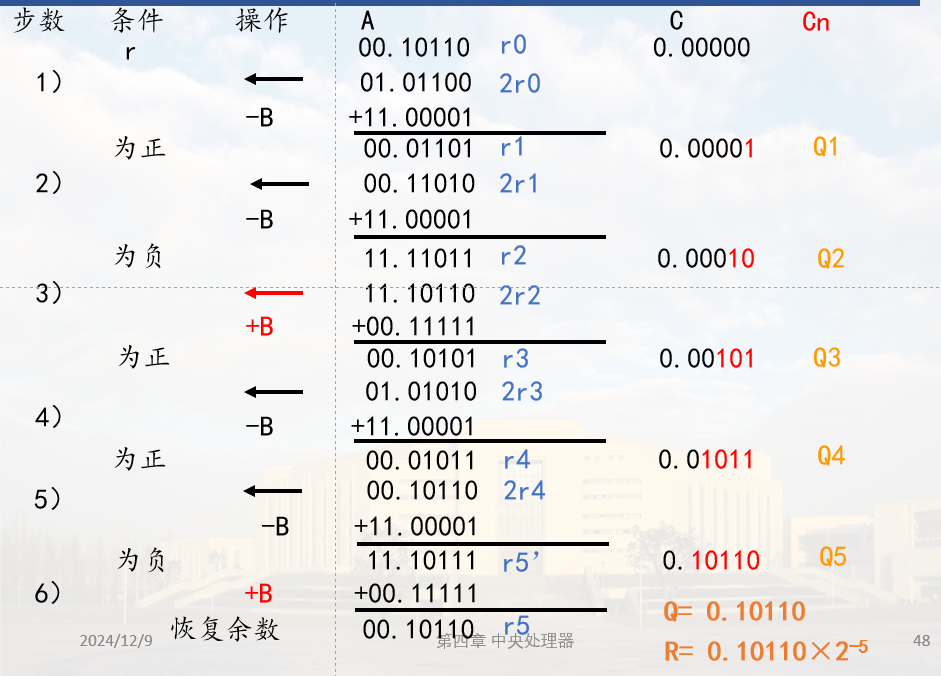
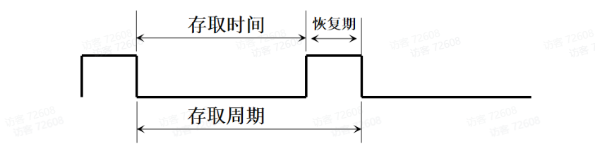

# 计组

## 1.概论

### 1.1冯.诺依曼体制？存储程序方式？

体制：1.采用**二进制**形式表示数据和指令

​	    2.采用**存储程序**方式工作（核心）

​	    3.硬件系统包含五大部件：**运算器，控制器，存储器，输入设备，输出设备**

存储程序方式：1.根据问题**事先编织程序**

​			   2.事先将**程序和数据存入计算机**，计算机工作时按**一定顺序**从存储器取出指令

​			   3.启动程序后，计算机**自动连续运行**程序。

### 1.2控制流？数据流？

 1.**控制流**：控制计算机工作的信息，即指令或命令。

 2.**数据流**：计算机加工处理的对象，即数值和非数值数据（例如用数字代码表示数据，字符，命令，状态。）

​	传统的冯•诺依曼机采用**控制流**驱动方式：按指令序列依次读取指令，根据指令所包含的控制信息对数据进行处理，在执行过程中，始终由指令流驱动计算机工作。

​	数据流驱动方式是对传统冯•诺依曼机工作方式的根本改变：只要数据准备好，有关指令就可以并行执行，如数据流计算机。

### 1.3模拟信号？数字信号？数字信号有哪两种？

| 电信号   | 定义                       | 实例                                                         |
| -------- | -------------------------- | ------------------------------------------------------------ |
| 模拟信号 | 在时间和幅度上**连续**变化 |  |
| 数字信号 | 在时间或空间上**断续**变化 |  |

数字信号分为**电平信号**和**脉冲信号**

| 数字信号 | 定义                                                         | 实例                                                         |
| -------- | ------------------------------------------------------------ | ------------------------------------------------------------ |
| 电平信号 | 利用电平的高低状态表示不同的代码                             |  |
| 脉冲信号 | 利用脉冲的有无表示不同代码 脉冲的**边沿**可以进行**定时操作** |  |

### 1.5基本字长？

CPU一次能处理的数据位数

### 1.6CPU主频？时钟频率？

**主频**：CPU内核的工作频率。CPU主频=外频×倍频系数，外频也叫基频，系统时钟频率

**时钟频率**：计算机工作的基准时钟信号

### 1.7数据通路宽度？数据传输率？

**宽度**：数据总线一次能**并行传送**的数据位数

**传输率**：数据总线每秒传送的数据量，也称带宽。

## 2.计算机中信息表示

### 2.1 一个数值型数据的完整表示需三个方面？

|   数的组合规则   |       进位计数制       |
| :--------------: | :--------------------: |
| 小数点位置的确定 | 数的定点表示和浮点表示 |
|    符号的选择    |   带符号数的代码表示   |

###  2.2权、基数？

**基数**：每个数位中所允许使用的数码个数

**权**：与所在数位相关的常数，表示该进位计数制中，数符“1”在该数位所代表的值

### 2.3真值？机器数的定义？分类？

**真值**：正负符号加数的绝对值表示数的真值，如+0.1001

**机器数**：计算机内部使用，将数符一起数字化的数，一般用原码，反码，补码，移码

### 2.4扩展操作码：根据条件计算指令条数？

### 2.5IEEE754短浮点数格式表示？

## 3.第三章CPU

### 3.1CPU内部各寄存器的功能？

| 分类             | 名称                | 作用                                           |
| ---------------- | ------------------- | ---------------------------------------------- |
| 暂存数据的寄存器 | 通用寄存器          | 可编程，R0，R1                                 |
|                  | 暂存器              | 不可编程，C暂存源，D暂存目的                   |
| 程序控制的寄存器 | 指令寄存器IR        | 异步置入，先取指令，置入IR，然后译码           |
|                  | 程序计数器PC        | 提供下一条指令地址，取指后自动修改             |
|                  | 程序状态字寄存器PSW | 进位，溢出，中断标志等                         |
| 主存接口寄存器   | 地址寄存器MAR       | 访存地址由MAR经地址总线送往主存                |
|                  | 数据缓冲寄存器MDR   | 内总线到MDR同步打入 系统总线到MDR异步置入 |

### 3.2数据通路结构？

### 3.3何谓同步控制方式，何谓异步控制？有何主要特征？应用场合？

| 分类     | 特征                                 | 优缺点                                                       | 应用          |
| -------- | ------------------------------------ | ------------------------------------------------------------ | ------------- |
| 同步控制 | 各项操作与统一的时序信号同步         | 时序关系简单， 时序划分规整， 控制简单； 时间安排不合理 | CPU或设备内部 |
| 异步控制 | 没有统一节拍划分，存在申请，响应关系 | 时间安排紧凑合理； 控制复杂                             | 系统总线      |

### 3.4何谓主从设备，试举例说明。

**主设备**：申请并掌握总线权的设备。

**从设备**：响应主设备请求的设备。

根据主从设备的请求信号，回答信号以及设备自身定时的关系，异步应答分三类

**不互锁**

**半互锁**

**全互锁**

### 3.5同步控制中如何引入异步应答的，试举例说明.

扩展同步控制：即同步方式中引入了应答机制。

**以固定时钟周期作为时序基础**，引入应答思想

例如： 8088最大模式，用一根总线请求/应答线实现总线权的转移

### 3.6指令？指令系统？

**指令**：按照某种规律有序排列的，能被CPU识别、执行的二进制代码序列

**指令系统**：一台计算机所能执行的全部指令的集合（计算机软硬件之间的界面）

### 3.7地址码？寻址方式？地址结构？

**地址码**：指令中用于指示操作数或者操作数地址的二进制代码

**寻址方式：**

1.显地址：在指令代码中明确给出了主存储器单元地址码或者寄存器号。

2.隐地址：地址以隐含的方式约定，在指令中不给出地址码

大致可将众多的寻址方式归纳为以下四大类，其它的寻址方式则是它们的变型或组合。

① 立即寻址。在读取指令时也就从指令之中获得了操作数，即操作数包含在指令中。

② 直接寻址类。直接给出主存地址或寄存器编号，从CPU内或主存单元内读取操作数。

③ 间接寻址类。先从某寄存器中或主存中读取地址，再按这个地址访问主存以读取操作数。

④ 变址类。指令给出的是形式地址（不是最终地址），经过某种变换（例如相加、相减、高低位地址拼接等），才获得有效地址，据此访问主存储器以读取操作数。

**地址结构**：

1.减少地址数目：隐地址

2.减少地址码位数：寄存器型寻址

### 3.8何谓隐式I/O指令？其主要特点是什么？

统一编址时, 设备接口中的寄存器视为一个存储单元，采用通用的数据**传送指令**实现**I/O操作**，又称为隐式I/O指令

**特点**：地址码本身可区分存储单元地址和IO端口地址，不影响标志寄存器的内容。

### 3.9主机调用外围设备，外设编制可采用那几种方式？ 

**1.对外围设备单独编址**

设备级：每个外围设备分配一个**设备码**，接口中设置**有限个寄存器**，指令中给出设备码并指明寄存器

寄存器级：为接口中有关寄存器分配一种I/O端口地址

**2.外围设备与主存统一编址**

统一编址到寄存器级，每个外围设备接口中的一个寄存器视作一个主存单元，分配一个存储单元地址（总线地址）

### 3.10组合逻辑控制，微程序控制思想的基本要点是什么？

**组合逻辑控制**

1.综合、化简产生微命令的条件，生成相应逻辑式，并用组合逻辑电路实现。

2.执行指令时，由组合逻辑电路发出所需的微命令控制有关操作。

**微程序控制**

1.将控制器控制一步操作所需的**微命令**以代码形式编成微指令，若干微指令组合成一段微程序。

2.将指令系统对应的所有微程序事先存入CPU内的控制存储器（只读）

3.执行指令时取出微程序，每条微指令译码得到所需**控制信号**（微命令）

### 3.11判断下面叙述是否正确，说明理由：串行加法器中的进位链是串行进位链，并行加法器中的进位链只有并行进位链。

加法器的运算速度不仅与**全加器的运算速度**有关，更主要的因素是取决于**进位传递速度**

### 3.12组合逻辑控制器、微程序控制器有何区别？

| 分类           | 定义                     | 优点                                                         | 缺点                                                         | 应用                                       |
| -------------- | ------------------------ | ------------------------------------------------------------ | ------------------------------------------------------------ | ------------------------------------------ |
| 组合逻辑控制器 | 直接由硬连逻辑产生微命令 | 控制信号产生快                                               | 1.设计不规整，难以实现设计自动化 2.不易修改或扩展       | 高速计算机 小规模计算机               |
| 微程序控制器   | 软件代码                 | 1.设计规整，设计效率高 2.易于修改，扩展指令功能 3.结构简洁，可靠性高 4.系列机性价比高 | 1.速度慢（访存频繁） 2.执行效率不高（未发挥数据通路本身具有的并行能力） | 速度要求不高功能复杂的机器，特别适合系列机 |

### 3.13组合逻辑控制器、微程序控制器的时序系统是如何划分的？

**时序信号**：周期、节拍、脉冲等频率型信号序列。

**时序系统**：用来产生时序信号的部件称为时序系统或时序发生器，由一个**振荡器**和一组**计数分频器**组成

**时钟周期**：CPU一步操作（一次数据传送）时间。

**总线周期**：完成一次主存或I/O端口访问的时间，通常包括若干时钟周期（节拍），模型机的一个总线周期中只包含一个时钟周期。

**工作周期**：指令周期的一个操作阶段，包含多个总线周期，比如取指令，取目的操作数等。

**指令周期**：从取指到完成指令所需的全部时间，包括若干机器周期。

| 分类           | 时序系统                                     |
| -------------- | -------------------------------------------- |
| 组合逻辑控制器 | 工作周期（机器周期），时钟周期（节拍），脉冲 |
| 微程序控制器   | 微周期，工作脉冲（同步定时）                 |

### 3.14微命令、微操作、微指令、微指令周期、微程序？

**微命令**：计算机中用来控制微操作的控制命令称为微命令（EMAR）

**微指令**：执行一步操作所需的微命令序列（M—MDR—C）

**微操作**：对应一条微指令，微操作是动作，微指令是编码

**微程序**：一系列微指令（取源操作数）

**微指令周期**：读取一条微指令并执行对应的操作所用的时间。

## #计算题：

### 1.溢出判断

### 2.原码一位乘法、原码不恢复余数除法。

乘法

除法

### 3.常用的加法器进位链结构有哪几种？

1.一位全加器结构

2.全加器逻辑函数表达式

| 并行加法器进位链分类             | 进位表达式                                                   | 特点                                                         |
| -------------------------------- | ------------------------------------------------------------ | ------------------------------------------------------------ |
| 串行进位链                       | Cn = Gn + PnCn-1                                             | 结构简单，运算速度较慢                                       |
| 并行进位链                       | Cn = Gn + PnGn-1+ … + Pn…P1C0                                | 运算速度快，进位结构复杂                                     |
| 分组进位 组内并行，组间串行 |  |  |

## #设计题：

### 1.CPU的逻辑组成（模型机框图）

（1）CPU的逻辑组成→模型机框图；

（2）CPU内每个寄存器的作用；

（3）总线的分类及定义；

（4）控制器的分类及区别；

### 2.CPU的指令流程

（1）指令类型：MOV指令、双操作数算数逻辑运算指令、单操作数算数逻辑运算指令、转移/返回指令、转子指令；

（2）核心是寻址方式：立即寻址、R、(R)、—(R)、(R)+、@(R)+、X(R)；

### 3.操作时间表的安排（微命令的安排）：

（1）CPU数据通路操作：按照数据的流向分成**四段**

ALU输入选择→AUL功能选择→移位器功能选择→分配脉冲（打入到寄存器中的脉冲）；

（2）与访问主存有关的微命令。

## 4.第四章存储系统

### 4.1主存、缓存、外存？

| 分类 | 内容                                                         | 特点                         |
| ---- | ------------------------------------------------------------ | ---------------------------- |
| 主存 | 能由CPU直接访问，存放当前CPU需要执行的程序和处理的数据。 要求能随机访问，工作速度块，具有一定的存储容量 | 存取速度较快，容量有限       |
| 缓存 | 程序即将要使用的程序和数据，作为贮存中当前活跃信息的副本     | 速度最快，容量很小，成本很高 |
| 外存 | 长期保存但暂不使用的大量程序与数据 分为**联机外存**和**脱机外存** | 速度慢，容量大，成本低       |

**优点**：层次清晰，便于设计实现和系统调度管理，提高存储系统性能

**缺点**：结构复杂，管理和控制复杂，硬件成本高。

### 4.2高速缓存Cache用来存放什么内容？设置它的主要目的是什么？

**内容**：当前急需使用的程序和数据，作为主存活跃区的副本

**目的**：缓解主存与CPU速度不匹配的问题

**替换算法**：最不经常使用，近期最久未使用，随即替换

**读操作**：

1.旁路式读（CPU同时向主存和Cache发都命令，Cache命中读Cache，中断读主存命令；Cache未命中则直接访问主存）

2.通过式读（CPU先向Cache发读命令，Cache命中则读cache；未命中再将读命令送主存）

**写操作**：通写（Cache与CPU同时写），回写（只修改Cache并对该块加标志，直到该块替换出去才写入主存）

### 4.3存储介质？

| 存储介质分类分类 | 内容                                                         | 应用        |
| ---------------- | ------------------------------------------------------------ | ----------- |
| 半导体存储器     |  | 主存，Cache |
| 磁表面存储器     | 利用磁层上不同方向的磁化区域表示信息，容量大，速度慢 磁带，磁盘等 | 外存        |
| 光盘存储器       | 利用光斑的有无表示信息，容量大，速度慢 | 外存        |

### 4.4何谓随机存取？何谓顺序存取？何谓直接存取？请各试举一例。

| 访问方式分类    | 特点                                                         | 应用        | 指标                                   |
| --------------- | ------------------------------------------------------------ | ----------- | -------------------------------------- |
| 随机存取（RAM） | 按地址随机访问任一存储单元，所需时间相同，与地址无关。分为RWM与ROM | 主存，Cache | 无                                     |
| 顺序存取（SAM） | 信息按顺序存放，访问时间与信息存放位置有关。分为**等待操作**和**读/写操作**两步 | 磁带        | 平均等待时间，数据传输率               |
| 直接存取（DAM） | 访问时读/写部件直接指向一个小区域，再顺序查找，访问时间与数据位置有关，分为**定位（寻道）操作**，**等待（旋转）操作**，**读/写操作** | 磁盘        | 平均定位时间，平均等待时间，数据传输率 |

### 4.5静态存储器SRAM、动态存储器DRAM存储原理？

**存储元**：能够表示一位二进制0，1两种状态，并且具有记忆功能的物理器件。

**存储单元**：若干存储元构成一个存储单元。

| 存储原理分类                | 原理                                                     | 刷新                                                         |
| --------------------------- | -------------------------------------------------------- | ------------------------------------------------------------ |
| 静态存储器SRAM（静态MOS型） | 依靠**双稳态电路**内部交叉反馈的机制存储信息（六管单元） | 不需要刷新                                                   |
| 动态存储器DRAM（动态MOS型） | 依靠**电容**存储电荷的原理存储信息 （四管单元）     | 电容会漏电，因此每隔一段时间需要对**存1**的电容重新充电，称为**刷新** |

### 4.6动态刷新分为哪几种情况，各有什么特点？

**刷新间隔**：模型机刷新间隔**2ms**，大多数DMAR要求在2ms-64ms期间一定对所有单元刷新。

**刷新方法**：各动态芯片可同时刷新，片内按行刷新。

**刷新周期**：刷新一行所用时间。（存取周期）

**刷新周期数**：刷新一块芯片所需的刷新周期数由**芯片矩阵的行数**决定。

**访问主存**：

| 分类     | 定义                                                         | 应用               |
| -------- | ------------------------------------------------------------ | ------------------ |
| 集中刷新 | 2ms内计中安排所有刷新周期 | 实时要求不高的场合 |
| 分散刷新 | 各刷新周期分散安排在存取周期中 | 用在低速系统中     |
| 异步刷新 | 各刷新周期分散安排在2ms内，每隔一段时间刷新一行 | 用在大多数计算机中 |

### 4.7刷新、重写的区别？

| 动态MOS存储单元 | 特点                                                         |
| --------------- | ------------------------------------------------------------ |
| 四管单元        | 保持原状态需要定期向**电容**补充电荷 读出时**非破坏性读出**，读出过程即实现**刷新** |
| 单管单元        | **破坏性读出**，读出后需要**重写**                           |

**刷新**：动态存储单元，需要补充电荷以保持原来的信息。

**重写**：破坏性读出后重写，以恢复原来的信息。

### 4.8全地址译码方式？部分地址译码方式？

**全地址译码**：全部地址信号都使用，高位地址信号作为译码器的输入

**部分地址译码**：仅使用地址总线的一部分信号线与存储器连接，高位地址信号的一部分作为片选译码信号。

### #4.9半导体存储器逻辑设计：(地址分配、片选逻辑、逻辑框图)，片选逻辑采用全/部分译码方式。

### #4.10主存的校验方法

奇校验：使整个校验码（包括有效信息位和校验位）中1的个数为奇数

偶校验：使整个校验码（包括有效信息位和校验位）中1的个数为偶数

### 4.11存储器的技术指标

1.存取时间

从存储器收到读写命令，到存储器读出（写入）信息所需要的时间，TA。

2.存取周期

存储器做连续访问操作过程中一次完整的存取操作所需的全部时间，TM    (通常TM>TA)。

3.数据传输率

## 5.I/O子系统

### 5.1系统总线上一般包含哪三组信息？

数据信息，地址信息，控制信息

**定义**：能为多个部件**分时共享**的一组**公共的**信息传送线路及相应的**控制逻辑**

**特点**：分时，共享特定时刻只允许一个部件传送数据到总线上。

**实体**：一组传送线与相应控制逻辑（CPU内设置控制逻辑、设置总线控制器）。

| 分类             | 划分                                                         | 示例                                                         |
| ---------------- | ------------------------------------------------------------ | ------------------------------------------------------------ |
| 按功能(层次)划分 | 1.片内总线（CPU内） 2.局部总线（CPU与主存） 3.系统总线（功能部件） 4.外总线 |  |
| 时序控制方式     | 同步总线：由**统一时序**控制总线传送操作 异步总线：以**异步应答**方式传送 扩展同步总线：以时钟周期为基础，允许总线周期中时钟数可变 |  |
| 数据传送格式     | 并行总线：同时传送各位信息 串行总线：分时逐位传送信息   | CPU内总线：同步、并行 系统总线：同步异步扩展同步，并行 外总线：异步，并行串行 |

| 总线仲裁分类 | 特点                                                         | 示例                                                         |
| ------------ | ------------------------------------------------------------ | ------------------------------------------------------------ |
| 集中式仲裁   | 链式查询：优先级固定，越近越高                               |  |
|              | 计数器定时查询：点到谁就有控制权，优先级灵活，优先次序可用程序控制 |  |
|              | 独立请求：通过专用请求信号线                                 |  |
| 分布式仲裁   | 各个设备有仲裁电路，自行判断是否能获得总线权 优点：防止总线时间浪费 缺点：信号线复杂 |  |

### 5.2接口

**概念**：主机与外设之间的连接逻辑，控制外设的I/O操作。（外设不标准，种类可变，因此必须在总线与外设之间设置一些部件，具有缓冲，转换等功能）

**功能**：

1.寻址：接收CPU送来的地址码，选择接口中的寄存器。

2.数据缓冲：实现主机与外设的速度匹配，缓冲深度与传送的数据量有关。

3.预处理：串并格式转换，数据通路宽度转换，电平转换。

4.控制逻辑：对CPU发来的控制命令进行解释，产生相应的操作命令发送给设备；将设备状态信息通过总线传给CPU。

| 分类            | 分类             | 特点                                                         | 适用场合                                                   |
| --------------- | ---------------- | ------------------------------------------------------------ | ---------------------------------------------------------- |
| 数据传送格式    | 并行接口         | 接口与系统总线，接口与外设均**并行**传送数据 数据各位同时传送。 | 设备本身**并行**工作 距离主机**较近**                 |
|                 | 串行接口         | 接口与系统总线**并行**，与外设**串行**传送 数据**逐位分行传送** | 设备本身**串行**工作 距离主机**较远** 减少传送线 |
| 时序控制方式    | 同步接口         | 接口与系统总线的信息传送由**统一时序信号**控制               |                                                            |
|                 | 异步接口         | 接口与系统总线的传送采用**异步应答**方式                     |                                                            |
| I/O传送控制方式 | 直接程序传送接口 | 无条件直接程序传送 程序查询传送                         |                                                            |
|                 | 中断接口         | 1.初始化，设置工作方式，送屏蔽字，中断号高位 2.发启动命令（送命令字），启动设备 3.设备完成工作，请求中断 4.中断控制器汇集各中断请求，判优，向CPU送INT，并形成中断号 5.CPU响应INT，发 6.中断控制器送出中断号 7.CPU执行**中断隐指令**操作，进入服务程序 |                                                            |
|                 | DMA接口          | 接受初始化信息（外设寻址信息）——初始化 向DMA控制器发请求——传送前外设准备好 传送数据——传送期间 |                                                            |

### 5.3程序传送方式及接口

|          分类          | 优点                                            | 缺点                                                         | 应用场合                                |
| :--------------------: | ----------------------------------------------- | ------------------------------------------------------------ | --------------------------------------- |
| 无条件直接程序传送方式 | I/O操作通过软件方式，控制软件简单，接口电路简单 | 应用受限                                                     |                                         |
|    程序查询传送方式    | 控制简单，硬件开销小                            | 1.外设准备期间，CPU查询等待，**并行程度低 **2.CPU不能响应来自外部的随机请求，**时效性差** | 对CPU效率要求不高的场合或诊断，调试过程 |

### 5.4中断方式定义、实质、特点？

**定义**：CPU**暂时中止现行程序**的执行，转去执行为某个**随机**事态服务的**中断处理程序**，处理完毕后**自动恢复原程序**的执行。

**实质**：程序切换（一条指令结束时切换，保证程序的完整性）

**方法**：保存断点，保护现场，恢复现场，返回断点。

**特点**：随机性

**适用**：程序切换花费一定时间，适合中低速I/O操作与随机事件

​	随机发生的事态（按键，故障）

​	有意调用（调用打印机）

​	随机插入的事态（软中断指令可插入程序任何位置）

| 分类       | 特点                                             |
| ---------- | ------------------------------------------------ |
| 硬中断     | **硬件**请求信号引发中断                         |
| 软中断     | **软中断指令**引发中断                           |
| 内中断     | 中断源来自主机**内部**（除法错误、溢出、软中断） |
| 外中断     | 中断源来自主机**外部**（打印机等外设）           |
| 可屏蔽中断 | 可通过**屏蔽字屏蔽**，关中断时不响应请求         |
| 非屏蔽中断 | **不受屏蔽字影响**，请求的响应与开/关中断无关    |
| 向量中断   | 由**硬件**提供中断服务程序入口地址               |
| 非向量中断 | 由**软件**提供中断服务程序入口地址               |

### 5.5中断向量、中断向量表、向量地址？

**中断类型码**：每个中断源对应的编号。

**中断向量**：中断服务程序的入口地址（还可包含状态字）

**中断向量表**：按中断类型码的顺序存放各中断向量，在一段连续的存储区（8086中断向量表位于内存最低1KB，地址范围00000H~003FFH）

**向量地址**：访问中断向量表内部的中断向量所需的存储单元地址

​		模型机中：向量地址=中断号+2

​		IBM PC向量表：向量地址=中断号*4

### 5.6何谓向量中断？何谓非向量中断？各有何优点和缺点？

**向量中断**：由**硬件**根据**中断类型号**产生向量地址，查询**中断向量表**，获取中断服务程序的入口地址

**非向量中断**：响应时先转向**中断查询程序**，通过**软件查询方式**确定中断源，获取相应的中断服务程序入口地址

### 5.7单级中断、多重中断？ 

**中断处理主要任务**：CPU执行中断服务程序

| 分类     | 定义                                                      | 流程                                                         |
| -------- | --------------------------------------------------------- | ------------------------------------------------------------ |
| 单极中断 | CPU响应后只处理一个中断源的请求，处理完毕才能响应新的请求 |  |
| 多重中断 | 中断服务过程中允许响应处理更高级的中断请求                |  |

### 5.8中断总结

1.**随机性**特点

2.外设工作期间，CPU可**并行**工作

3.外中断全流程：外设提出**中断请求与传递**，中断控制器汇集中断请求，**中断判优**，发INT到CPU，**中断响应**，进入中断周期，保存断点，获取中断服务程序入口地址，转**中断服务程序**，完成数据输入输出，**中断返回**

4.**中断周期的任务**：该周期为一个过渡周期，任务是保存断点，获取中断服务程序入口地址

### 5.9转子与中断调用的相似、区别？

**相同点**：主机与I/O设备都是并行工作

**不同点**：

1.子程序是**预先安排好的**，程序中断是**随即发生的**。

2.调用子程序是为**主程序**服务的，而中断程序为**外设和其他事件**服务。

3.子程序由**调用指令**给出目标地址，中断通过**隐指令**获得中断服务程序的入口地址。

4.子程序执行受**主程序或上层程序**控制，中断服务程序一般与被中断现行程序**无关。**

5.一般不存在同时调用多个子程序情况，但可能发生多个外设同时向CPU发出中断服务请求。

### 5.10DMA方式定义、实质、特点，流程？

**定义：**直接存储器访问，依靠硬件在主存与外围设备之间传送数据，不需要CPU的干预，传送结束通过中断方式通知CPU。

**分类**：单路型DMA控制器，选择型DMA控制器，多路型DMA控制器

**实质：**总线权的切换

**特点：**随机性；并行性；处理简单批量高速数据传送。

​	响应随机请求

​	不影响CPU程序的执行，仅占用总线、无程序切换

​	大批量数据的简单传送

**功能**：

- 接收初始化信息（传送方向、主存首地址、交换量）——**初始化**
- 接收外设DMA请求，判优，向CPU申请总线控制权——**传送前**
- 接管总线权，发地址、读/写命令——**传送期间**

**应用：**主存与高速I/O外设间的简单数据传送（磁盘调用，DRAM自动刷新）

​	实时高速数据采集（实时音频，视频采集）

**流程：**

### 5.11程序直传方式，中断方式，DMA方式之间的区别？

**程序直传**：依靠CPU直接执行相关I/O程序来实现数据的输入和输出，需要等待外设准备好，CPU不能并行工作

**中断方式**：可以直接发请求中断程序，主机响应后与设备交换信息，可以处理异常，靠程序（指令执行结束才响应）

**DMA方式**：优先级高于中断方式，处理大批量数据，靠硬件（指令周期内任一存取周期结束响应）

### 5.12中断请求信号经过中断控制器8259A后（通过其内的IRR,IMR,ISR的设置），判断能否继续向CPU送出中断请求信号？

IRR：中断请求寄存器

ISR：中断服务寄存器

IMR：中断屏蔽寄存器

上图中，不发INT请求的例子ISR表示当前程序优先级为D3，IRR有两个中断请求D2和D4，其中IMR把D2屏蔽了，只剩下D4，优先级比D3低，所以不发INT请求

8086/8088**中断系统**

