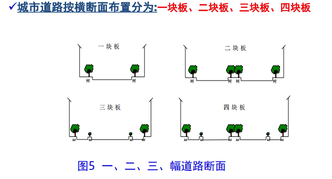
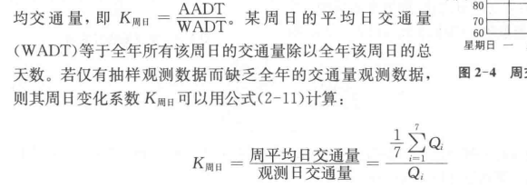
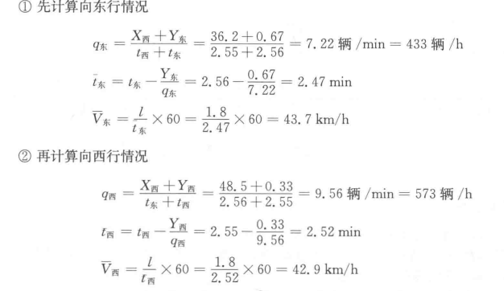
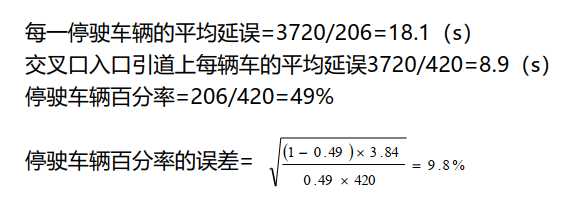

# 交通工程学

## 1.绪论

### 1.1交通工程学定义

是研究道路交通中**人、车、路及环境**之间的关系，探讨道路交通运行规律，研究**交通规划**、**设计**、**管理**和**控制**的**理论**、**方法**及有关**设施、设备、法律和法规**等，使道路交通更加**安全、高效、便捷、 舒适、经济**的一种学科。

### 1.2交通工程学的研究对象及内容

**研究对象**：人（驾驶人、骑车人、行人、乘客）、车辆（机动车、非机动车）、道路（公路、城市道路）以及交通环境之间的关系

**要素**：规划、设计、管理、土地

**核心**：交通方式

**主要内容**：道路通行能力、道路线性设计以及停车问题

### 1.3交通工程学的特点

系统性：从系统视角认识和解决交通问题

综合性：Engineering、Education、Enforcement、Environment、Energy

交叉性：与多个领域交叉

社会性：社会生活的方方面面

前瞻性：经济发展，道路先行

动态性：**交通流**应以**动态**的方法进行描述；**规划**应该每隔一定的年份进行**更新**

## 2.交通特性

### 2.1驾驶员

**信息处理过程**

1. 首先通过自己的**感官**（眼耳）从外界接受信息，产生**感觉**（视觉和听觉），
2. 然后通过大脑一系列的综合反映产生**知觉**。知觉是对事物的综合认识。
3. 在知觉的基础上，形成所谓“**深度知觉**”，如目测距离、时间等。
4. 最后驾驶员凭借这种深度知觉形成判断。
5. 在这个过程中，起控制作用的是驾驶员的**生理**、**心理素质**和**反应特性**。

**反应特性**：由外界因素刺激而产生的知觉-行为过程

- **感知**：对需要做出反应的刺激的再认识
- **识别**：对刺激的辨别和解释
- **判断**：对刺激做出反应的决策
- **反应**：由决策引起的肢体反应

**反应时间**：驾驶员感知信号，经过**辨认**、**判断**、**采取动作**并**使动作发生效果**所需要的时间。

**视觉机能**：

- **视力**：眼睛分辨**两物点直接最小距离**的能力，根据眼睛的状态和时间不同，分为**静视力**、**动视力**和**夜间视力**。
- **视野**：两眼注视某个目标，注视点**两侧**可以看到的**范围**叫视野，分为**静视野**和**动视野**。
- **视觉适应**：人眼对**周围环境亮度变化**的适应过程，分为**明适应**和**暗适应**
- **色感**：驾驶员对不同**颜色**的感觉是不一样的：**红色**刺激性强，易见性高；**黄色**光亮度最高，反射光强大；**绿色**比较柔和，给人平静感。

### 2.2汽车

**动力性能**

- **最高车速**：在良好水平路段上，汽车所能达到的**最高行驶速度**
- **加速度或加速时间**：**原地起步**加速时间和**超车**加速时间
- **最大爬坡能力**：汽车满载时用1档在良好路面上的最大爬坡度

**制动性能**

- **制动距离**：从踏着制动版开始到汽车停住为止车辆所形式的距离，不包括驾驶员的知觉-反应距离。
- **制动减速度**

### 2.3道路

**分类与等级**

- **公路的技术等级**：高速公路、一二三四级公路（15000/5000-15000/2000-6000/单400双2000）
- **行政等级**：国家干线公路、省自治区直辖市干线公路、县公路、乡镇公路、村道
- **城市道路分类**：快速路、主干路、次干路、支路

**道路网的布局形式**

- **放射形路网**：中心城市与外围郊区、周围城镇
- **三角形路网**：重要城镇之间的直达交通联系
- **并列形路网**：联系一系列城镇、缺少便捷道路连接
- **树杈形路网**：从干线公路上分叉出去的支线公路

**城市路网的布局模式**

- **棋盘形**：网上交通分布均匀，交叉口交通组织容易；非直线系数大、通达性差
- **带形**：有利于公共交通布线和组织，但容易造成纵向主干道交通压力大
- **放射状**：具有带形的优点，缩短到市中心的距离；中心区交通压力大，边缘区交通不方便
- **放射环形**：通达性好、非直线系数小、有利于城市扩展和过境交通分流；不宜将过多的放射线引向市中心，以免造成市中心过分集中

**公路主线的几何特征**

1. **平面线形**：将公路的中心线投影在大地水平面上所得的线形称为平面线形，由直线和曲线构成，包括圆曲线和缓和曲线
2. **纵截面线形**：沿道路中心线纵向垂直剖切一个立面，表达道路沿线起伏变化情况
3. **横截面线形**：垂直于道路中线方向的断面。
4. **行车视距**：
   1. 停车视距：驾驶员发现前方路上有障碍不能绕过而安全停在障碍物前所需的距离
   2. 会车视距：两辆对向行驶的汽车能在同一车道上相遇及时制动并停车所需的安全视距）
   3. 超车视距：双车道路上后车超越前车时，从开始驶离原车道起，至可见对向来车并能超车后安全驶回原车道所需的最短距离

**城市道路的横断面形式**

一块板、二块板、三块板、四块板

**道路交叉口**：道路与道路相交的部分。根据相交道路的**主线标高**是否相等分为**平面交叉**与**立体交叉**

- **平面交叉**：冲突点（分流点、交汇点、冲突点）->扩宽交叉口、在交叉口实行交通管制、对交叉口实行渠化交通、改用立体交叉
- **立体交叉**：分离式与互通式

### 2.4交通量

**定义**：指在**单位时间段**内，通过道路**某一地点**、**某一断面**或**某一条车道**的**交通实体数**。

**时间分布特性**：月变化、周变化、时变化

**空间分布特性**：

- 城乡分布：交通量城市大于郊区，近郊大于远郊，乡村道路最小
- 路段分布：由道路等级、功能、区位等因素决定
- 方向分布：用方向分布系数表示
- 车道分布：与车道的功能、位置、交通管理有关

**流率**：单位时间内通过某断面车辆数

**年、月、周平均日交通量**

**月、周、时变系数**

**高峰小时交通量**：城市道路上**交通量时变图**在上下午各有一个高峰，交通量呈高峰的那个小时称为高峰小时，高峰小时内的交通量称为高峰小时交通量。

**高峰小时系数PHF**

**方向分布系数**
$$
K_\mathrm{D}=\frac{\text{主要行车方向交通量}}{\text{双向交通量}}\times100\%
$$
**设计小时交通量及其应用**

即第30位最高小时交通量（30HV），将一年中测得的8760个小时交通量从大到小排序，排在第30位的小时交通量。

用途：可用公式计算车道数、路幅宽度等设计参数

### 2.5交通流

**特性**：交通流**测量**、**交通流率**特性、**行车速度**特性、**交通流密度**特性

**不同车速的定义**

1. **地点车速**：车辆通过某一地点的**瞬时速度**
2. **行驶速度**：从行驶某一区间所需**时间**及其区间**距离**求得车速
3. **行程车速**：车辆行驶路程与通过该路程所需总时间（包括**延误**）之比
4. **运行车速**：**中等**技术司机在**良好**气候条件、**实际**道路状况和交通条件下能保持的**安全车速**。
5. **临界车速**：道路**理论**通行能力达到**最大**时的车速
6. **设计车速**：在道路交通与气候条件**良好**的情况下仅受**道路物理条件限制**时所能保持的最大安全车速。

**车速分布特性**

**时间平均车速**：在某一时间段内测得通过**道路某断面**各车辆的**地点车速**的**算数平均值**
$$
\overline{V_t}=\frac{1}{n}\sum_{i=1}^nV_i
$$
**空间平均车速**：在**某一特定瞬间**行驶于道路**某一特定长度**内的**全部车辆**的**车速分布平均值**，当**观测长度**一致时，即为地点车速观测值的**调和平均值**。
$$
\overline{V_{s}}=\frac{1}{\frac{1}{n}\sum_{i=1}^{n}\frac{1}{V_{i}}}=\frac{ns}{\sum_{i=1}^{n}t_{i}}
$$
转换方式
$$
\overline{V}_s=\overline{V}_t-\frac{\sigma_t^2}{\overline{V}_t} \qquad
\overline{V}_t=\overline{V}_s+\frac{\sigma_s^2}{\overline{V}_s}
$$
**交通密度定义**：一条车道上车辆的密集程度，即在某一瞬时内，单位长度一条车道车辆数。(空间上)
$$
K=\frac{N}{L}=\frac{Q}{\overline{V_s}}
$$
**占有率**：车辆长度+检测器长度（时间上）
$$
O=\frac{\frac{\sum_i\left(L_i+d\right)}{V_i}}{T}=\frac{1}{T}\sum_i\frac{L_i}{V_i}+\frac{d}{T}\sum_i\frac{1}{V_i}=(L+d)K
$$
**车头间距与车头时距**：相邻两辆车的车头之间的距离称为车头间距；用时间表示车头之间的间隔称为车头时距

## 3.交通调查与数据采集

### 3.1交通调查

**内容**：交通流**要素**调查（交通量、车速、密度）、交通**规划**调查、交通**事故**调查、交通**管理**调查、交通**环境**调查

**方法**：（人工计数法、**浮动车法**、机械计数法）

**交叉口流向流量调查**

- 一般采用**人工观测法**
- 车型分类、车道标记、人流、车流
- 选择高峰小时车流、人流最大的时候观测
- 观测数据的校验

### 3.2车速调查

方法（**地点车速**、**行驶车速和区间速度**）

- **地点车速**：人工测定法、自动测速法
- **行驶车速**：牌照法、流动车法、跟车法

**交通密度调查的方法**

1. **出入量法**：在t时刻AB路段内**现有车辆数**为**初始车辆数**与t时刻内AB路段的车辆数**改变量**之和。
2. **摄影法**：
3. **道路占有率法**：空间与时间

### 3.3延误

**定义**：由**交通阻塞**与**交通管制**引起的**行驶时间损失**。

**延误的调查方法**

1. **行车延误**：跟车法、输入-输出法

   

2. **交叉口延误**：点样本法、抽样追踪法

### 3.4通行能力调查

**定义**：在一定的时段和道路、交通、管制条件下，人和车辆通过**车道**或**道路**上的**一点**或**均匀断面**的**最大小时交通量**。

**内容**：路段**车头时距**调查、信号交叉口**穿越空挡**调查（停车线法和冲突点法）、信号交叉口**饱和流量**确定

### 3.5OD调查

**内容**：人的出行OD调查、车辆OD调查、货流OD调查

**术语定义**：

**调查方法**：**家访**调查；**互联网**方式调查、基于**手机数据**的OD调查

## 4.道路交通流理论

### 4.1交通流特性

**连续流特征**：无外部因素导致交通流周期性中断的设施
$$
Q=\overline{V_s}*K
$$
$$
速度与密度\\V_f为畅行速度，车流密度趋于0，车辆可以畅通前进\\K_j为阻塞密度，车辆密集道无法移动的密度\\
V=V_fln(\frac{K_j}{K})\\
V=V_f(1-\frac{K}{K_j})\\
V=V_fe^{-\frac{K}{K_m}}
$$

$$
流量与密度的关系,标准二次函数\\
Q=KV_f(1-\frac{K}{K_j})
$$

$$
速度与流量之间的关系\\
Q=K_jV(1-\frac{V}{V_f})\\
Q_m=V_mK_m
$$

**间断流特征**：由于外部设备而导致交通流周期性中断的设施

### 4.2跟弛理论

依据、建模及非自由状态的特性

**定义**：运用**动力学方法**，研究在无法超车的单一车道上车辆列队行驶时，**后车跟随前车的行驶状态**的理论

**目的**：试图通过观察各个车辆逐一跟驰的方式来了解**单车道交通流**的特性

**非自由状态行驶车队的特性**：制约性、延迟性、传递性。

**模型**：GM跟驰模型、安全间距模型、优化速度模型、智能驾驶员模型

### 4.3流体模型

**车流波动理论**：把**车流密度**的疏密变化比作**水波**的起伏而抽象为**车流波**，当车流因道路或交通状况改变而引起**密度改变**，在车流中产生车流波的传播。通过分析车流波的传播速度，以寻求车流**流率**和**密度**、**速度**之间的关系。

**波速度及其应用**

### 4.4离散型分布

（泊松、二项、负二项、检验）

连续型分布（负指数分布、移位指数分布、韦布尔分布、爱尔朗分布、检验）的特点、参数及使用条件

### 4.5排队论

**排队**：单指等待服务的顾客

**排队系统**：既包括等待服务的顾客，也包括正在被服务的顾客

**主要参数及应用**（M/M/1系统、M/M/N系统）

- **等待时间**：从顾客到达时起至开始接受服务这段时间
- **忙期**：服务台连续繁忙时期
- **队长**：有**排队顾客数**与**排队系统中顾客数**之分

## 5.道路通行能力与服务水平

### 5.1通行能力

**种类**：基本通行能力、可能通行能力、设计通行能力

**理想条件**：原则上是指对条件更进一步提高也**不能**提高基本通行能力的条件

### 5.2服务水平

**概念**：是交通流中车辆运行的以及驾驶员和乘客所感受的**质量量度**。即道路在某种交通条件下所提供**运行服务**的质量水平。

### 5.3高等级公路

**定义**：一般指**高速公路与城市快速路**，具有**中央分隔带**，上下行每个方向至少有**两个车道**，全部立体交叉，完全控制出入的道路

**组成**：（基本路段、交织段、匝道），各部分通行能力分析计算方法

### 5.4信号交叉口通行能力计算方法

### 5.5环形交叉口通行能力计算方法

### 5.6公共线路通行能力计算方法

### 5.7自行车道通行能力计算方法

### 5.8人行设施通行能力计算方法

## 6.道路交通规划

### 6.1交通规划

**目的**：

1. 使各种交通方式能**协调发展**，**优势互补**
2. 使**道路交通设施布局**能产生最佳社会及经济**效益**
3. 使人和货物的出行能**方便**、**迅速**、**舒适**、**经济**
4. 使道路交通能适应**社会经济发展**的需要

**基本内容**：

- 总体设计
- 现状交通调查及分析
- 交通需求发展预测
- 规划方案设计
- 规划方案评价
- 规划方案调整与优化
- 规划方案实施计划

**交通规划需收集的基础资料**

- 城市社会经济资料
- 城市土地使用资料
- 城市道路交通设施资料
- 城市交通运行与管理资料

### 6.2OD调查

调查步骤、原则等

1. 机构建立
2. 资料准备
3. **交通小区划分**：在保证精度的情况下尽量**减少分区数**；根据规划区域的**用地规模**、**规划布局**的特点来确定；考虑将来**车流在交通网的分布**情况来确定边界；尽量和**现状行政区划**以及**规划中的功能分区**一致
4. **定抽样率**：按**数理统计**的理论与方法进行**样本量选取**；参照国内外经验确定抽样率
5. 人员培训
6. 制定调查的实施计划
7. 典型试验
8. 实地调查

### 6.3交通需求预测方法（四阶段法）

1. **出行生成**：预测各交通区的**出行发生量**和**出行吸引量**
2. **出行分布**：将各交通小区的出行发生量和吸引量换算成各交通区的**OD分布矩阵**
3. **方式划分**：确定出行量中各**交通方式**所占的比例
4. **交通分配**：把各出行方式的**OD矩阵**分配到具体的**交通网络**上

### 6.4路网规划

**一般原理**

**建立在各出行方式出行OD量的基础上**，并以满足**出行需求**为主要目标。一般有如下步骤：

① 在现状交通网络的基础上，根据城市形态及发展趋势确定一个**初始的道路网络方案**；

② **将预测的各方式出行OD量分配至初始路网方案上**，预测每一交叉口、每一路段的**分配交通量**及路段平均车速、交叉口的平均延误；

③ 分析、评价每一路段、每一交叉口的**交通负荷**、**服务水平**及**网络总体评价指标**；

④ 根据**交通质量评价**及**网络总体性能评价**结果， **调整路网规划方案**，返回步骤②， 直到规划方案可行、合理。

**原则**

- 满足**人流、客货车流**的安全畅通，同时反映出**城市**风貌、历史和文化传统，为地上地下工程管线和其它设施提供**空间**，并满足城市**日照通风**与城市**救灾避难**要求。
- 满足**城市交通运输要求**是道路网络系统的首要目标，为达到此目标，规划的道路网络系统必须“**功能分清**，**系统分明**”，为组成一个合理的**交通运输网络**创造条件，使城市各交通区之间有“方便、迅速、安全、经济”的交通联系。
- 按道路在城市中的地位、作用、交通性质、交通速度及交通流量等**指标**，可将道路分为**快速路**、**主干路**、**次干路**及**支路**。 快速路及主干路为**交通性干道**，次干路兼**交通性**和**生活性**两重功能，并以**交通功能**为主，支路一般为生活性道路。

**指标**

- 交通质量服务水平
- 网络方案**交通**质量要求
- 网络方案**环境**质量评价

## 9.交通安全

### 9.1交通事故

**定义**：车辆在道路上的行驶途中因**过错**或**意外**造成的**人身伤亡**或者**财产损失**事件。

- **形态分类**：侧面相撞、翻车、碾压等11类
- **原因分类**：人、车、道路与环境
- **严重程度**：轻微、一般、重大、特大事故

**计算指标**：

1. **绝对指标**：事故起数，死亡人数，受伤人数，直接财产损失
2. **相对指标**：万车事故率，亿车公里事故率，交叉口事故率

**调查的内容**：事故地点、事故处理流程、事故现场照片、信息采集（**事故基本信息**、**车辆信息**、**人员信息**、事故补充、手绘事故现场草图）

**交通事故分析方法**：哈顿矩阵（系统性分析事故致因的**框架**，通过**关联事故事件**与**致因**类别（人为、车辆、道路/环境），识别不同因素在事故**发生前**、**发生时**、**发生后**的影响。）

### 9.2安全预防措施

1. 科学的**交通规划**
2. 改善**道路**设计
3. 加强**交通管理与控制**
4. 提高**汽车**的安全性能
5. 提升道路交通安全**科技支撑能力**
6. 加强交通安全教育**宣传**