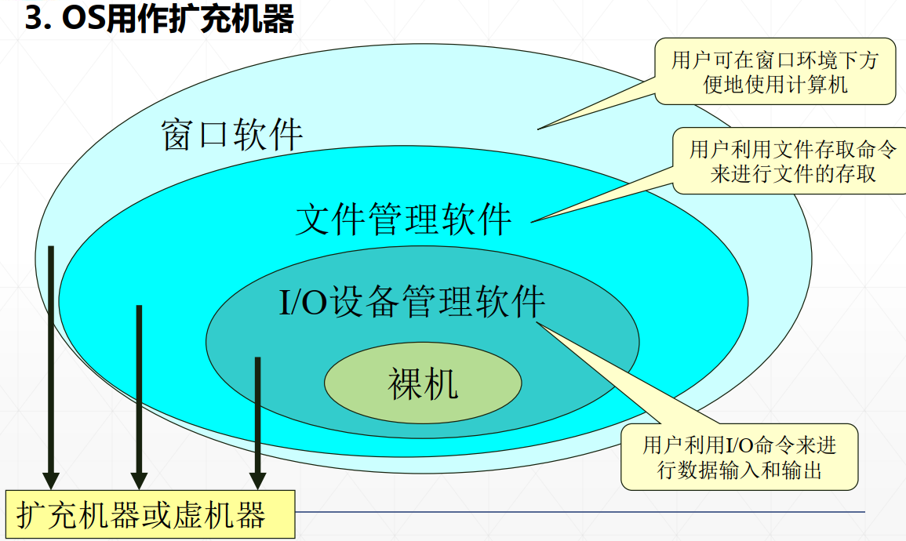
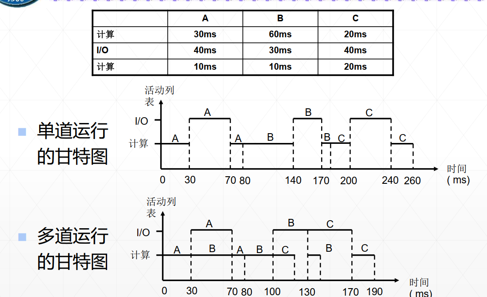
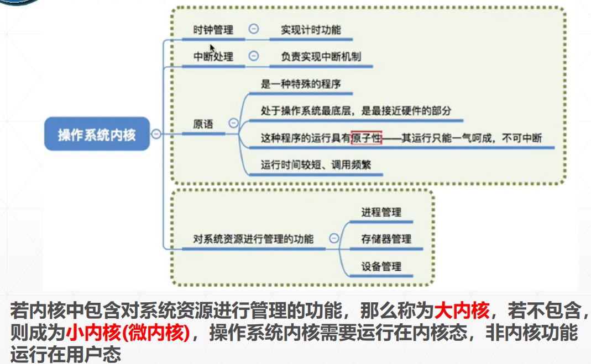
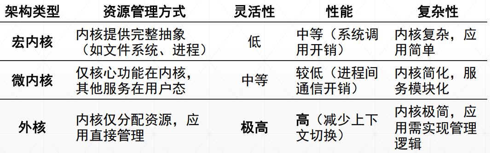
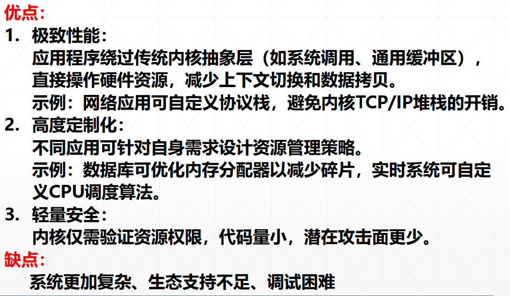
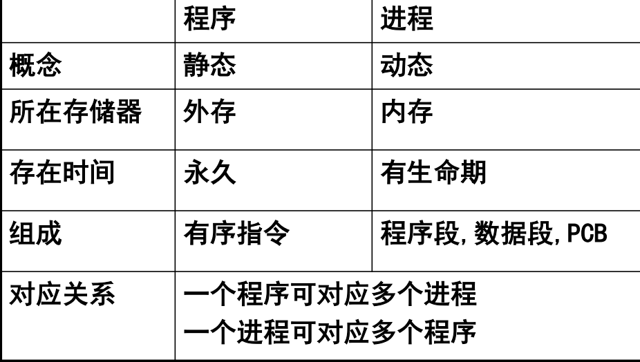
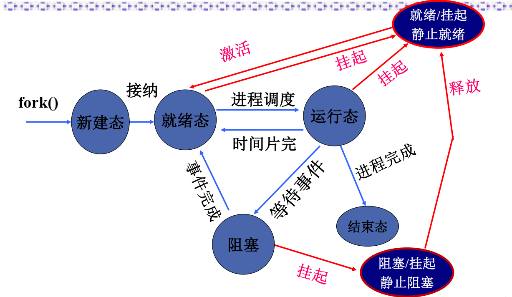
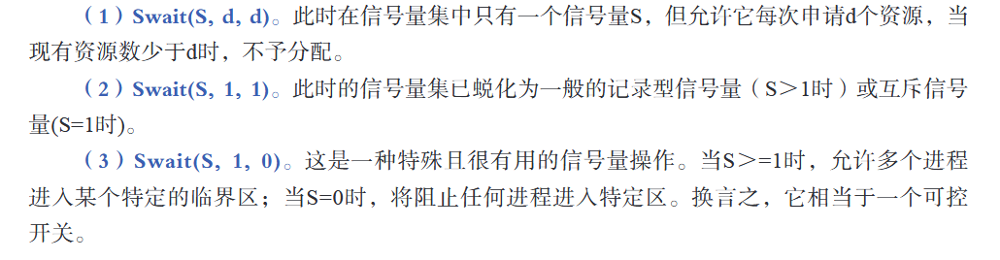
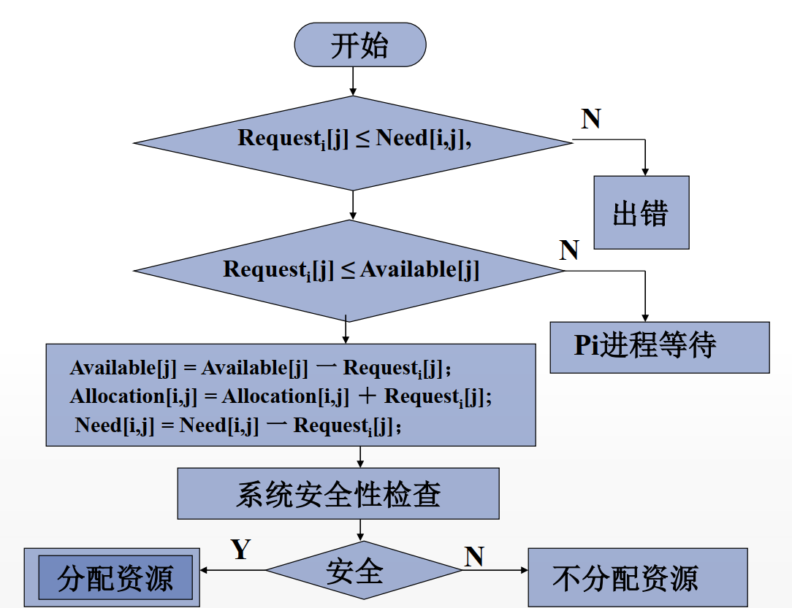
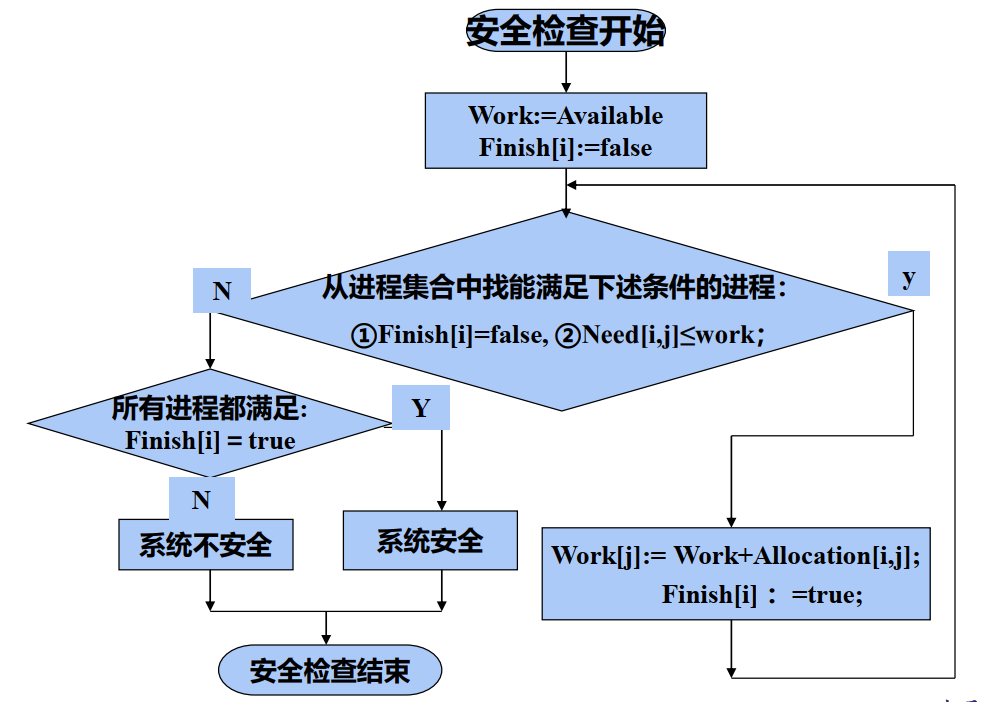

# 操作系统

## 1.第一章

### 1.1操作系统定义

**操作系统定义1**：操作系统是一组**控制**和**管理**计算机**软硬件资源**、合理地对各类**作业**进行**调度**以及**方便用户使用**的程序集合

**操作系统定义2**：·操作系统是位于**硬件层**（HAL)之上，所有其它**系统软件层**之下的一个**系统软件**，使得管理系统中的各种软件和硬件资源得以充分利用，方便用户使用计算机系统

### 1.2操作系统目标和作用

**操作系统的目标**：

1. **方便性**：操作系统使计算机更易于使用。
2. **有效性**：操作系统允许以更有效的方式使用计算机系统资源。
   - 提高系统资源利用率
   - 提高系统的吞吐量
3. **可扩展性**：在操作系统中，允许有效地开发，测试和引进新的系统功能。
4. **开放性**：实现应用程序的可移植性和互操作性，要求具有统一的开放的环境。

**操作系统的作用**：

1. 作为用户与计算机硬件系统之间的接口

   - 计算机用户需要的**用户命令**：由OS实现的所有用户命令所构成的集合被称为OS的**用户接口**或**命令接口**
     - 字符形式
     - 菜单形式
     - 图形形式
   - 应用软件需要的**系统调用**：由OS实现的所有系统调用所构成的集合称为**程序接口**或**应用编程接口API**

2. 作为资源管理者的操作系统

   - 处理机管理，用于分配和控制处理机
   - 存储器管理，主要负责内存的回收与分配
   - I/O设备管理，负责I/O设备的分配与操纵
   - 文件管理，负责文件的存取、共享和保护

   操作系统的任务在**相互竞争**的程序之间**有序**地控制对硬件设备的分配

   对于**多用户系统**，需要管理**共享资源**，以下两种方式实现**多路复用资源**：

   - **在时间上复用**：当一种资源在时间上复用，不同的进程轮流使用它；例如CPU、打印机等
   - **在空间上复用**：每个客户得到资源的一部分；例如内存、磁盘等

3. 作为扩展机器的操作系统

**裸机**：完全无软件的计算机系统

**扩充机器**：覆盖软件的机器称为扩充机器或虚机器

### 1.3OS发展过程

1. **人工操作方式**：未配置操作系统，穿孔卡片输入输出

2. **脱机输入输出方式**：未配置操作系统，在**外围机**控制下实现输入输出，主要解决CPU与设备不匹配矛盾

3. **单道批处理系统**：内存中仅有一道作业，结束或出错才会调用另一个作业

   - **特征**：自动性、顺序性、单道性
   - **优点**：减少人工操作、解决作业自动接续
   - **缺点**：平均周转时间长，咩有交互能力

4. **多道批处理系统**：内存中存放**多道**作业运行

   - **特征**：多道性、无序性、调度性

   - **优点**：提高CPU的利用率，提高内存和I/O设备利用率，增加系统吞吐量

   - **缺点**：平均周转时间长，没有交互能力

   - **需要解决的问题**：

     - **处理机管理**：分配和控制CPU
     - **存储器管理**：内存分配与回收
     - **I/O设备管理**：I/O设备的分配与操纵
     - **文件管理**：文件的存取、共享和保护
     - **作业管理**：如何组织作业运行

     

5. **分时操作系统**：用户需要**人机交互**、**共享主机**、**便于用户上机**

   - **关键问题**：
     - 及时接受：实现多个用户的信息及时接收
     - 及时处理：及时控制作业的运行
   - **实现方法**：
     - 简单分时系统
     - 具有前台和后台的分时系统
     - 多道分时系统
   - **特点**：
     - 多路性：一个主机与多个终端相连
     - 独立性：彼此独立操作、互不干扰
     - 及时性：系统能在很短时间得到回答
     - 交互性：能实现人机对话（**区别于批处理系统**）

6. **实时系统**：计算机及时响应**外部事件的请求**，在规定时间内完成处理、控制所有**实时设备**和**实时任务**协调运行

   - **实时任务类型**：
     - 按是否为**周期性**划分：周期性实时任务、非周期性实时任务
     - 按**截止时间**划分：硬实时任务，软实时任务
   - **特征**：
     - **多路性**：能对多个对象进行控制
     - **独立性**：独立运行，不混淆不破坏
     - **交互性**：仅限于访问系统中某些特定的专用服务程序
     - **可靠性**：高可靠性，具有多级容错防护能力
     - **及时性**：不同系统要求不同，控制对象在截止时间内完成

### 1.4现代操作系统基本特征 

1. **并发性**（最重要）
   - 并发性：多个事件在同一**时间间隔**内发生
   - 并行性：多个事件在同一**时刻**内发生
   - **程序**：静态实体
   - **进程**：进程是程序的**执行过程**,是系统进行**资源分配**和**调度**的一个**独立单位**
   - **线程**：进程内的独立执行代码的实体和**调度**单元
2. 共享性（仅次于并发）
   - **共享**：系统中的资源可供内存中多个**并发执行**的进程共同使用
   - **互斥共享**：把在一段时间内只允许一个进程访问的资源称为**临界资源**（打印机），临界资源可以供给多个进程使用，但**一段时间**内只允许**一个**进程使用
   - **同时访问**：多个任务可以**同时使用**系统中的软硬件资源；多个进程**交替互斥**地使用系统资源（磁盘）
3. 虚拟性
   - **虚拟**：通过某种技术把一个物理实体映射为若干个逻辑上地对应物
   - **时分复用技术**：虚拟处理机分时实现
   - **空分复用技术**：虚拟磁盘技术
4. 异步性
   - **执行结果不确定**，程序不可再现
   - **异步性**，多道程序环境下程序以异步方式执行，每道程序在何时执行、完成都不确定
5. 并发和共享是OS最基本特征；并发性和共享性互为存在条件；虚拟性以并发性和共享性为前提；异步性是并发性和共享性的必然结果

### 1.5操作系统的主要功能

1. **处理机管理**：按照一定的算法把处理及分配给进程，并对其进行有效的管理和控制
   - 进程控制
   - 进程同步与互斥
   - 进程通信
   - 进程调度
2. **存储器管理**：方便用户使用存储器，提高存储器**利用率**以及从逻辑上**扩充内存**
   - 内存分配
   - 内存保护
   - 地址映射
   - 内存扩充
3. **设备管理**：完成用户提出的**I/O请求**；为进程**分配**所需的I/O设备；提高CPU和I/O设备的**利用率**；提高I/O**速度**；方便用户使用I/O设备
   - **缓冲管理**：有效缓和CPU和I/O设备速度不匹配的矛盾，提高CPU利用率
   - **设备分配**：根据I/O请求，分配所需的设备
   - **设备处理**：设备处理程序被称为设备驱动程序
4. **文件管理**：对用户的文件和系统文件进行**管理**，以方便用户使用，并确保文件的**安全性**
   - 文件存储空间的管理
   - 目录管理
   - 文件的读写管理与保护
5. **方便用户使用用户接口**

### 1.6OS结构设计

1. **无结构操作系统**：只注意功能实现与效率，缺乏首尾一致思想

   - 设计出的操作系统庞大又杂乱，缺乏清晰的结构
   - 程序错误很多，调试困难

2. **模块式结构**：

   - **模块之间的关系**：所有各块的实现均可以任意引用其他各块所提供的概念及属性
   - **优点**：提高OS设计的正确性，增强OS的可适应性、加速OS的开发过程
   - **缺点**：对模块互粉以及对接口的规定精确描述很困难；从功能划分模块，未能区别共享资源和独占资源

3. **层次式结构**

   - **层相互关系**：各层的实现不依赖其上层所提供的概念和属性，只依赖下层；每一层军对其上层隐藏下层
   - **考虑因素**：
     - 程序嵌套：通常一个功能并非一个程序，而是若干软件层才能实现
     - 运行频率：将经常活跃的模块放在最接近硬件的层
     - 公共模块：把供多种资源管理程序调用的公共模块设置在最底层，方便调用
     - 用户接口：命令接口、程序接口设置在最高层，直接供用户使用
   - **客户/服务器模式**
     - **优点**：提高系统可扩展性、增强系统可靠性、可移植性好、提供对分布式系统的支持
     - **缺点**：运行效率有所降低（消息传递开销+模式切换开销）
   - **面向对象的程序设计技术OOP**
     - 可修改性和可扩充性
     - 继承性
     - 正确性和可靠性

4. **微内核结构**

   **微内核技术**是指能实现现代OS核心功能的小型内核，更小更精炼，不仅运行在**核心态**，而且开机后常驻内存，不会因为内存紧张而被换出内存

   

   - **内核**：操作系统最基本最核心的部分，实现操作系统内核功能的程序就是**内核程序**（支撑功能（中断处理，时钟管理，原语操作），资源管理功能）
     - **时钟管理**：用时钟中断实现计时功能
     - **原语**：一种特殊的程序，具有原子性，**不可被中断**
     - 时钟管理、中断处理、原语等与**硬件**相关一定在**内核**；进程管理、存储器管理等对**数据结构**操作不涉及硬件，有的操作系统不会放到内核
     - 
   - **外核操作系统**
     - 颠覆传统操作系统设计的架构，将**资源管理**与**资源保护**分离，赋予**应用程序更大的灵活性**和**对硬件的直接控制权**
     - 
     - 

## 2.进程管理

### 2.1程序执行

**顺序执行特征**：

- **顺序性**：处理机的操作严格按照**程序所规定的顺序**执行
- **封闭性**：程序运行时**独占全机资源**，程序一旦开始执行，其执行结果不受外界因素影响
- **可再现性**：只要程序执行时环境和初始条件相同，都将获得**相同的结果**（无论是不是停停走走）

**并发执行特征**：

- **间断性**：由于共享系统资源，形成相互制约关系，导致并发程序具有“**执行-暂停-执行**”这种间断性的规律
- **失去封闭性**：多个程序**共享资源**，资源状态由多个程序改变，程序运行失去封闭性
- **不可再现性**：程序并发执行**失去封闭性**，导致不可再现

### 2.2进程描述

**进程特征**：

1. **结构特征**：为了使程序独立运行，应为之配置一进程控制块**PCB**；由**程序段**、**相关数据段**、**PCB**构成进程实体；所谓创建进程实质上是创建进程实体中的**PCB**，撤销进程同理。
2. **动态性**：进程的实质是**进程实体**的一次执行过程，动态性表现“**由创建而产生，由调度而执行，由撤销而消亡**”
3. **并发性**：多个进程实体同存在**内存**中，且在一段时间内**同时运行**
4. **独立性**：进程实体是一个能**独立运行**、**独立分配资源**和**独立接受调度**的基本单位
5. **异步性**：进程按各自独立的、不可预知的速度向前推进，按**异步方式**运行

**进程与程序的主要区别**：

**进程基本状态及转换**：

1. **进程转状态**：

   - **就绪状态**：进程分配到除CPU以外的所有必要资源，一旦得到CPU便可立即执行
   - **执行状态**：进程获得CPU，程序正在执行
   - **阻塞状态**：正在执行的进程由于发生某件事而暂时无法执行，放弃处理机处于暂停状态（读磁盘）
   - 新建状态：进程被创建，但未被OS接纳为可执行进程，**程序在辅存中**，**PCB在内存中**
   - 终止状态：因停止被OS从执行状态释放
   - **挂起状态**：使执行的进程暂停执行、静止下来（**换到外存中**）

   

2. 多个进程竞争内存资源解决办法

   - 采用交换技术：换出一部分进程到外存，腾出内存空间
   - 采用虚拟存储技术：每个进程只能装入一部分程序和数据

3. **进程控制块**：常驻**内存**，是**进程存在**的唯一标识

   - **作用**：
     - 作为**独立运行基本单位**的标志
     - 能实现**间断性**运行方式
     - 提供**进程管理**所需的信息
     - 提供**进程调度**所需的信息
     - 实现与**其他进程**的同步与通信
   - **信息**：
     - **进程标识符PID**：内部标识符（系统），外部标识符（用户）
     - **处理机状态**：寄存器，PSW，PC，栈指针
     - **进程调度信息**：进程状态，优先级，阻塞原因
     - **进程控制信息**：程序和数据的地址、进程同步和通信机制、资源清单
   - **组织方式**：
     - **线性方式**：所有PCB组织在一张线性表中，该表的首地址放在专用区域
     - **链接方式**：把具有同一状态的PCB用其中的链接字连接成一个队列，排成**就绪队列**，若干个**阻塞队列**以及**空白队列**
     - **索引方式**：根据所有进程的状态建立几张索引表

### 2.3进程控制

**进程控制**是进程管理中最基本的功能，其负责**进程的创建**、**进程的中止**、**进程的阻塞与唤醒**，进程控制一般是由OS内核中的**原语**来实现。

1. 进程创建
   - **事件**
     - **用户登录**：登陆成功为用户创建一个基础南横，插入到就绪队列
     - **作业调度**：多道批处理系统当作业调度程序按照一定算法调度到某个作业会将他们装入内存，创建进程并插入到就绪队列
     - **提供服务**：用户程序提出某种请求，系统创建一个进程为用户
     - **应用请求**：用户自己创建新进程使得并发执行完成特定任务
   - **步骤**
     - 申请空白PCB
     - 为新进程分配资源
     - 初始化进程控制块：初始化标识信息，初始化处理机状态信息，初始化处理机控制信息
     - 将新进程插入就绪队列
2. 进程的终止
   - **事件**
     - 正常结束
     - 异常结束：越界错、保护错、指令错、特权指令错、运行超时、算术错
     - 外界干预：操作员或OS干预、父进程请求、父进程中止
   - **步骤**
     - 根据被终止进程的**标识符**，从PCB集合中检索出该进程的PCB，并读出该进程的状态
     - 若被终止进程正处于**执行状态**，则立即中止该进程的执行，并置**调度标志**为真，以指示该进程被终止后应重新调度
     - 若该进程还有**子孙进程**，中止其所有子孙进程，防止其成为不可控的进程
     - 将被中止进程所拥有的全部资源或归还给其**父进程**，或归还给**系统**
     - 将被终止进程的**PCB**从所在**队列**中移出，等待其他程序来搜索信息
3. 进程的阻塞与唤醒
   - **事件**
     - **向系统请求共享资源失败**
     - **等待某种操作完成**
     - **新数据尚未到达**
     - **等待新任务的到达**
   - **阻塞过程**（block()）
     - 正在执行的程序发生上述事件由于无法继续执行，于是进程通过调用**阻塞原语**block()把自己阻塞
     - 把进程控制块中的现行状态由“**执行**”改为“**阻塞**”，并将PCB插入阻塞队列
     - 转**调度程序**进行重新调度，将处理机分配给另一就绪程序，并进行切换
   - **唤醒过程**(wakeup())
     - 把被阻塞的进程从等待该事件的**阻塞队列**中移除，将其PCB中现行状态由**阻塞**改为**就绪**
     - 将该PCB插入到就绪队列中
4. 进程的挂起与激活
   - **进程挂起**（suspend（））
     - 检查被挂起进程的状态，若处于**活动就绪**状态，将其改为**静止就绪**
     - 对于**活动阻塞**状态的进程，改为**静止阻塞**
   - **进程激活**（active（））
     - 先将进程从外存调入内存，检查进程的现行状态
     - 若是**静止就绪**，改为**活动就绪**；若是**静止阻塞**，改为**活动阻塞**

### 2.4进程同步

**主要任务**：使并发执行的进程之间有效地共享资源和相互合作，从而使程序的执行具有可再现性

**分类**：同步关系（直接制约，保证进程之间操作的先后次序的约束）；互斥关系（间接制约，强调对共享资源的互斥访问）

**临界资源**：一次只允许一个进程访问的资源

**临界区**：每个进程中访问临界资源的那段代码称为临界区

**遵循规则**：空闲让进，忙则等待，有限等待，让权等待

**解决临界区互斥的方法**

1. ​	硬件同步机制（硬件为每个临界区上一个锁）**关中断**、利用**Test-and-Set**指令实现互斥、利用**swap**指令实现进程互斥
   - **优点**
     - 适用于任意数目的进程，再单处理器或多处理器上
     - 简单，容易验证其正确性
     - 可以支持进程内存在多个临界区，只需为每个临界区设置一个布尔变量
   - **缺点**
     - 等待耗费CPU事件，不能实现**让权等待**
     - 可能**饥饿**，从等待进程中随机选一个进临界区，有的进程可能一直选不上
2. 信号量机制（从进程管理者角度解决互斥问题）
   - **整型信号量**：S.value>0，标识某资源的数目，也称为资源信号量
   - **记录型信号量**：如果S.value<0，则其绝对值标识等待队列中的进程个数
     - **优点**：简单，表达能力强
     - **缺点**：不够安全，PV操作使用不当会出现死锁；只能用于共享一个临界资源
   - **AND型信号量**：将所有资源分配给进程，只要有一个没用完，其他也不准分配
   - **信号量集**：每次分配时采用**信号量集**控制，分配多个资源
   
   

### 2.5进程通信

**定义**：进程之间的信息交换

**分类**：

- **低级通信**：效率低；通信对用户不透明
- **高级通信**：直接利用**操作系统**所提供的一组通信命令，高效地传送大量数据地通信方式，效率高，通信对用户透明

**高级通信机制分类**：

1. **共享存储系统**：基于**共享数据结构**或**共享存储区**的通信方式
2. **消息传递服务**：将通信数据封装在**消息**中，利用OS提供的一组通信命令（原语）进行消息传递，目前最流行
   - **直接通信方式**：发送进程利用OS提供的发送原语直接发消息给目标进程
   - **间接通信方式**：发送进程与接收进程通过共享中间体（信箱）进行消息发送与接受
3. **管道通信**：连接一个读进程和一个写进程实现通信的一个共享文件夹（管道）
   - 互斥：一个进程对管道操作其他进程必须等待
   - 同步：当进程把一定数量的数据写入管道后便**睡眠**，知道读进程取走数据后再唤醒
   - 确定对方是否存在：只有确定对方存在才能进行通信
4. 客户机-服务器系统：套接字、远程过程调用和远程方法调用

**消息通信的实现方法**：

1. 直接通信方法：发送进程利用OS所提供的发送命令（原语）直接把消息发送给目标进程
2. 间接通信方法：进程之间使用**信箱**的通信方式
   - **优点**：在**读写时间**上的随机性
   - **邮箱分类**：私有信箱。公有信箱。共享信箱。
   - **关系**：一对一，一对多（广播），多对一（客户/服务器），多对多

### 2.6线程与线程控制

**定义**：进程内的独立执行代码的实体和**调度**单元

**属性**：轻型实体；独立调度和分派的基本单位；可并发执行；共享进程资源

**与进程的区别**

1. **调度**：线程作为**调度和分派**的基本单位；进程作为**资源**拥有的基本单位
2. **并发性**：多个线程之间可并发执行
3. **拥有资源**：线程自己只有一点资源，但是可以访问进程的资源
4. **独立性**：线程必须依赖于进程存在
5. **系统开销**：线程切换、同步和通信都无需**系统内核**的干预
6. **支持多处理机系统**：一个进程分为多个线程分配到**多个处理机**上并行执行，加速

**线程控制块TCB**

- 线程标识符
- 寄存器：PC，PSW，R
- 线程运行状态
- 优先级
- 线程专有存储器
- 信号屏蔽
- 栈指针：核心栈，用户栈

多线程OS中的**进程**属性：

1. 进程是一个可拥有资源的基本单位
2. 多个线程可并发执行
3. 进程已不是可执行的实体

**线程实现方式**

1. **用户级线程**：用户线程仅存在用户空间，对线程的创建、撤销等功能**无需内核**来实现
   - **优点**
     - 线程切换不调用内核
     - 调度是应用程序特定的，可选择不同的调度方法
     - 可运行在任何操作系统上，只需要线程库
   - **缺点**
     - 当线程执行一个系统调用时，该线程机器所属进程内的所有线程都会被阻塞
     - 多线程应用不能利用多处理机进行多重处理
2. **内核支持线程**：无论时用户进程中的线程还是系统进程中的线程，他们的创建、撤销等都是依靠内核完成
   - **优点**
     - **多处理**系统中，内核能同时调度同一进程中的多个线程**并行执行**
     - 如果进程中一个**线程阻塞**，内核可以调度该进程或其他进程中的**其他线程**占有处理器
     - 内核支持线程具有很小的数据结构与堆栈，线程切换**开销小**
     - 内核本身可以采用**多线程技术**，提高效率
   - **缺点**
     - 对于**用户的线程切换开销比较大**，在同一进程中，从一个线程切换到另一个线程需要从**用户态到内核态再到用户态**，因为用户进程的线程在用户态中运行，线程的管理和调度在内核中实现
3. **区别**
   - **内核支持**：用户级线程通过**应用程序**完成线程的创建调度，可以在一个不支持线程的OS中实现；内核级线程由**内核**完成，需要内核支持
   - **处理机分配**：在**多处理机系统**中，对纯粹的用户级线程无法享用多处理机带来的多重处理又优势
   - **调度和线程执行时间**：对**内核支持线程**，内核调度单位是**线程**，而对于只支持**用户级线程**的系统，其系统调度单位是**进程**，相同条件先内核支持级线程通常会获得更多的**CPU执行时间**
   - **切换速度**：用户级更快
   - **系统调用**：用户会阻塞，内核不会

## 3.处理机调度与死锁

**调度目的**：对**CPU资源**进行合理的分配使用，以提高**处理机利用率**，并使各用户**公平**地得到处理机资源

**共同目标**：资源利用率；公平性；平衡性；策略强制执行

### 3.1处理机调度层次

| **调度类型** | 实现                 | **调度对象**         | **主要功能**                                                 | **运行频率**       | **适用系统**               | **调度目标**                                   |
| :----------- | :------------------- | :------------------- | :----------------------------------------------------------- | :----------------- | :------------------------- | :--------------------------------------------- |
| **高级调度** | 作业管理程序         | 作业                 | 将作业调入内存，创建进程、分配资源并插入就绪队列。           | 几分钟一次（最低） | 多道批处理系统             | 平衡系统负载，**提高资源利用率**。             |
| **中级调度** | 内存管理中地对换进程 | 挂起进程             | 将暂时不能运行的进程调至外存（挂起），在条件满足时重新调入内存并修改为就绪状态。 | 介于高/低级之间    | 通用系统（需内存对换功能） | 提高**内存利用率**和**系统吞吐量**。           |
| **低级调度** | 分派程序             | 就绪进程（内核进程） | 从就绪队列中选择进程分配CPU执行，由分派程序完成处理机切换。  | 10ms~100ms（最高） | 交互式系统                 | 确保**公平性**、**实时性**及**系统响应速度**。 |

1. **批处理系统目标**
   - **平均周转时间短**：外存队列等待+就绪队列等待+CPU执行时间+等待I/O操作时间
   - **系统吞吐量高**：指单位时间内系统所完成地作业数，选择短作业
   - **处理机利用率高**：选择计算量大的作业
2. **分时系统**
   - **保证响应时间快**：键盘输入+处理+显示
   - **保证均衡性**：系统**响应时间的快慢**应与**用户请求服务的复杂性**相适应
3. **实时系统**
   - **保证满足截止时间的要求**：任务必须开始执行的最迟时间
   - **保证可预测性**

### 3.2作业与作业调度和进程调度

**作业**：程序+数据+作业说明书

**作业控制块JCB**：保存系统对作业进行管理和调度的全部信息

**作业调度主要任务**：

- 根据JCB中的信息，检查系统中的资源能否**满足作业需求**
- 按照一定的**调度算法**从外存的作业后备队列中选取某些作业**调入内存**，并为它们创建进程和分配必要资源
  - **接纳多少个作业**：取决于多道程序度，标识允许多少个作业同时在内存中运行
  - **接纳哪些作业**：取决于采用的调度算法
- 将新创建的进程排在就绪队列上等待调度

**进程调度的原因**：

- 正在执行的进程**运行完毕**，或因发生某些事件而**无法继续运行**
- 正在执行的进程因某种原因而**阻塞**
- 引入时间片系统中**时间片**用完
- 抢占调度方式，就绪队列中有**优先级**更高的进程，或优先级更高的进程进入就绪队列

**抢占式进程的原则**：

- **优先级原则**：允许优先级高的新到进程抢占当前进程的处理机
- **短进程优先**：允许新到的短进程抢占当前长进程的处理机
- **时间片原则**：各进程按时间片轮转运行时，当前进程的一个时间片用完后立即停止，重新调度

### 3.3调度算法

**批处理系统**：FCFS、SJF、高响应比、多级队列

**分时系统**：轮转、多级队列、优先级

**实时系统**：硬（最早截止时间）、软（最低松弛度、优先级倒置）

1. **短作业优先SJF**：
   - **优点**：降低作业平均等待时间；提高吞吐量；缩短进程周转时间
   - **缺点**：必须知道作业的运行时间；对长作业不利；未考虑作业紧迫程度
2. **优先级调度算法**：抢占式与非抢占式（进程类型，进程对资源的需求，用户要求）
3. **响应比优先**：（等待时间+要求服务时间）/要求服务时间
4. **多级反馈队列调度**：
   - 设置多个就绪队列，每个队列**时间片**递增
   - 每个队列采用FCFS算法（多级队列不一定用FCFS，可任意）
   - 按队列优先级调度
5. 为什么多级反馈能满足用户需求
   - **终端型**：其提交的作业大都属于**较小**的**交互型作业**，系统只要使这些作业在**第一队列**规定时间内完成即可
   - **短批处理用户**：如果作业在**第一队列**执行一个时间片即可完成，便可获得与**终端作业**一样的响应时间；对于稍长批处理用户，其作业通常只需在**第二队列**和第三队列各执行一个时间片即可，响应时间较短
   - **长批处理用户**：依此在第1,2...n队列中运行，然后按照**轮转**方式运行，用户不必担心作业长期得不到处理

### 3.4实时调度

1. **必要条件**

   - **提供必要信息**
     - 就绪时间：该任务成为就绪状态的起始时间
     - 开始截止时间或完成截至时间
     - 处理时间
     - 资源要求
     - 优先级
   - **系统处理能力强**
     - （处理时间/周期时间）求合小于1
   - **采用抢占式调度机制**
   - **具有快速切换机制**
     - 对外部中断的快速响应能力
     - 快速的任务分派能力

2. **实时调度算法分类**

   - **实时任务性质**：硬实时和软实时

   - **调度方式**：抢占式和非抢占式

   - 非抢占式调度算法：非抢占式RR调度算法、非抢占式优先级调度算法

     抢占式调度算法：基于**时钟中断**的抢占式优先级调度算法、立即抢占的优先级调度算法

     **最早截至时间优先算法**：非抢占式应用于非周期，抢占式应用于周期

     **最低松弛度优先算法**：松弛度=周期时间-处理时间

     **优先级倒置**：动态优先级继承，P3占用资源且继承P1优先级别

### 3.5死锁

**定义**：如果一组进程中的每个进程都在等待仅由该组进程中的**其他进程**才能引发的事件发生，那么该组进程是死锁的（不能运行、释放资源、被唤醒）

多个进程在运行过程中因**竞争资源**而造成的一种**僵局**，若无外力作用，他们都无法向前推进

**安全状态**：系统能按照某种进程顺序，如<P1,P2,...,Pn>，依此为n个进程**分配其所需资源**，直至其**最大需求**，使每个个进程都可以**顺利完成**

1. **资源问题**
   - 可重用资源：不允许共享；请求-->使用-->释放；单元数目相对固定（打印机）
   - 消耗性资源：数目变化；允许不断创建；进程与其一对多（消息）
   - 可抢占性资源：CPU；内存
   - 不可抢占资源：打印机、光盘刻录、磁带机
2. **死锁产生原因**
   - 竞争资源：不可抢占资源的竞争、可消耗资源的竞争
   - 进程间推进顺序非法
3. **死锁产生必要条件**
   - 互斥条件：资源非共享，进程互斥
   - 请求和保持条件：进程请求，保持原有资源占用
   - 不可抢占条件：资源不可抢占
   - 循环等待条件：循环依赖
4. **处理方法**
   - 预防死锁
   - 避免死锁
   - 检测死锁
   - 解除死锁

### 3.6预防与避免

**死锁预防**：通过破坏产生死锁的一个或几个必要条件来预防死锁

1. 破坏请求和保持条件
   - 进程在开始运行前需一次性申请全部资源，此后不会再申请
     - 优点：简单、易于实现且安全
     - 缺点：资源被严重浪费，发生饥饿现象
   - 进程只获得运行初期所需的资源，运行过程中逐步释放然后申请。
     - 提高设备利用率，减少进程发生饥饿的概率
2. 破坏不可抢占条件：当申请不满足，需要释放已占用资源，全是缺点
   - 实现起来**复杂**且要付出很大代价
   - 资源被迫释放可能导致**前期段工作失效**
   - 进程前后两次运行的**信息不连续**
   - 进程执行被**无限推迟**，延长进程周转时间，增加系统开销，降低吞吐量
3. 破坏循环等待条件
   - **资源按线性排队**：所有进程资源申请必须按照序号递增次序提出
     - 优点：资源利用率和系统吞吐量都有明显改善
     - 缺点：限制新类型设备的增加；
     - 进程使用资源顺序与系统规定顺序不同，造成资源浪费；
     - 限制用户简单自主编程

**死锁避免**：在**资源动态分配过程**中，用某种方法防止系统进入**不安全状态**

1. 限制条件

   - 必须**预先声明**每个进程所需的**资源总量**
   - 进程之间**相互独立**，执行顺序取决于**系统安全**，而非进程间的同步要求
   - 系统必须提供**固定数量的资源**供进程使用

2. 数据结构

   - **可利用资源量**Available：m个元素的数组，每个元素代表可用的资源数
   - **最大需求**Max：n*m矩阵，Max[i,j]表示进程i需要的资源j最大数目
   - **分配矩阵**Allocation：n*m矩阵，表示系统已分配的资源
   - **需求矩阵**：n*m矩阵，表示还需要的资源数

3. 银行家算法

   - 定义Request向量，Request_i[j]=K表示进程i请求K个j资源

   

4. 安全性算法

   - **安全状态**：系统按照某种进程推进顺序，为每个进程**分配其所需的资源**，满足每个进程对**资源的最大需求**，进而使每个进程都可顺利完成的一种系统状态

   - **工作向量**Work：表示系统可提供给进程的各类资源数目，初始化为Available
   - **Finish**：开始时Finish[i]=false;当有足够资源分配给进程时再令其为true

   

   

###  3.7死锁的检测与解除

**死锁定理**：当且仅当系统某状态S所对应的**资源分配图**是**不可完全化简**的，则S是死锁状态

**死锁解除**

1. **剥夺资源**：从其他进程剥夺足够数量资源给死锁
2. **撤销进程**：完全撤销或者逐步撤销

## 4.存储器管理

### 4.1存储器的层次结构

寄存器，主存（高速缓存、主存、磁盘缓存），辅存（磁盘，可移动存储介质）

**存储器管理的目的和功能**：

1. **主存储器的分配和管理**：按用户要求把适当的存储空间分配给相应的作业。应具有如下功能：
   1. **记住每个存储区域的状态**：哪些是已分配的，哪些是可以用作分配的
   2. **实施分配**：在系统程序或用户申请时，按所需量给予分配；修改响应的分配记录表
   3. **接收系统或用户释放的存储区域**：相应的修改记录表
2. **提高主存储器的利用率**：使多道程序能动态共享主存，最好能共享主存中的信息
3. **扩充主存容量**：借助于虚拟存储器或其它自动覆盖技术为用户提供比主存更大的地址空间
4. **存储保护**：确保各道用户作业都在所分配的存储区内操作，互不干扰。不能用**特权指令**，必须由**硬件**提供保护，并由**软件**配合实现。

**存储分配**：解决多道作业之间共享主存的问题。

1. **直接指定方式**：编写程序或者编译源程序时，对一个作业的所有信息确定在主存中的实际位置。**用户感到不便**，**存储空间利用低效**
2. **静态分配方式**：只有当**装配程序**对其进行装入时才确定他们在主存中的位置，从而生成可执行程序
   - 作业装入必须分配全部存储量，没有足够空间不能装入作业
   - 作业在退出系统前一直占用存储空间
   - 不能搬家，也不能申请存储量
3. **动态分配方式**：作业在存储空间中的位置也是在装入时确定，但是执行过程可以修改空间大小。
   - 执行过程可申请附加空间，当不再需要时也可以归还给系统
   - 存储区域大小是可变的，允许作业在内存中搬家

**地址空间**：程序用来**访问信息**所用地址单元的集合， 是逻辑（相对） 地址的集合， 由**编译程序**生成。  

**存储空间**：主存中**物理单元**的集合。 这些单元的编号称**物理地址**或绝对地址。 存储空间的大小是由**主存的实际容量**决定的。  

### 4.2程序的装入和链接

1. **编译**：**编译程序**将源程序生成为目标一级的模块
2. **链接**：**目标模块**是完整的二进制代码，但是包含对其他模块的引用，因此需要链接成一个**装入模块**（能被装入并执行的完备的机器级程序），由**链接程序**实现。
3. **装入**：由**装入程序**将**装入模块**装入内存中并执行

根据存储空间的**分配**方式，将装入模块装入内存可采用三种方式：

1. **绝对装入方式**：根据装入模块中的地址将程序和数据装入内存，无需更改
2. **可重定位装入方式**：经编译后得到目标模块的**相对地址**，装入内存时相对地址经修改得到正确的物理地址
   - **静态重定位**：地址变换是在装入内存时一次性完成，以后不能更改。
     - **优点**：不需要硬件支持，可以装入有限多道程序
     - **缺点**：程序需要占据连续内存空间，装入内存后不能移动，不易实现共享
   - **动态重定位**（动态运行时装入方式）：把地址转换推迟到程序执行时进行。在**硬件地址变换机构**支持下，随着对每条**指令**或**数据**的访问**自动进行地址变换**，故称为**动态重定位**。  （重定位寄存器RR）
     - **优点**：主存的使用更加灵活有效（不一定要用连续区域）。几个作业共享一程序段的单个副本比较容易。无需用户考虑覆盖结构，系统负责全部存储管理
     - **缺点**：需要附加硬件支持；实现存储器管理的软件比较复杂

**链接程序的功能**：将经过**编译**后所得到的一组**目标模块**以及它们所需要的**库函数**，装配成一个完整的**装入模块**。 根据链接时间的不同，可把链接分成三种：

1. **静态链接**：**程序运行之前**将各目标模块及库函数链接成一个完整的装入模块（可执行文件），以后不再拆开。（将相对地址修改，变换外部调用符号）
2. **装入时动态链接**：目标模块装入内存时边装入边链接
   - **便于软件版本修改和更新**：只需要修改各个目标模块而不用将装入模块拆开
   - **便于实现目标模块共享**：可以将一个目标模块连接到几个应用模块中
   - **缺点**：进程在执行期间装入模块时不变的；每次运行时装入模块是相同的，但是有些可能不会用
3. **运行时动态链接**：将目标模块的链接推迟到执行时才进行。加快程序的装入过程，节省大量内存空间

### 4.3连续分配存储管理方式

**连续分配**：为用户程序分配一个**连续的内存空间**（程序空间本来就是连续的；用连续的内存装入连续的程序，减少**管理工作**的难度）

1. **单一连续分配方式**：用户区只有一个程序，适用于单用户单任务的OS
   - **优点**：易于管理
   - **缺点**：对要求内存空间少的程序造成内存浪费；程序全部装入，很少使用程序的部分也占用内存
2. **固定分区分配**：划分成若干固定大小的区域，数据结构为**分区表**
   - **优点**：易于实现，开销小
   - **缺点**：内碎片造成浪费；分区数目固定，限制并发执行程序数目；存储空间利用率太低（动态的算法复杂，回收分区时系统开销大）
   - 为提高利用率采用**动态式分区**方案，**数目固定大小可变**和**数目大小都可变**
     - **基于顺序搜索**：最佳适应算法BF，最坏适应算法WF，首次适应算法FF，循环首次适应算法NF
     - **基于索引搜索**：快速适应算法QF，伙伴系统
   - 分配内存要用**size**，回收内存四种情况
3. **可重定位分区分配**：修改**重定位寄存器**实现进程移动，将小分区合并成大分区

### 4.4基本分页存储管理

**页**：将一个用户进程的地址空间划分成若干大小相等的区域称为页，从0开始编号

**块**：内存空间划分成若干个与页大小相等的区域称为块，也从0开始编号

**离散分配优点**：没有外零头，仅小于一个页面的内零头

**基本分页存储管理**：把每个作业全部装入内存后才能运行，不具有实现虚拟存储器的功能

- **一次性**：全部装入内存后才能运行
- **驻留性**：作业装入内存后就一直留在内存中，直到作业结束

**实现分页存储管理的数据结构**：页表，作业表，空闲块表

**页表寄存器PTR**：记录当前运行的进程的页表在内存中的**始址**和**页表长度**（平时在PCB中，运行时在PTR）

1. 根据逻辑地址,计算出页号和页内偏移量；
2. 从PTR中得到页表首址， 然后检索页表，查找指定页面对应的页框号；
3. 用页框号乘以页面大小获得其对应的起始地址， 并将其送入物理地址的高端。
4. 将页内偏移量送入物理地址低端， 形成完整的物理地址。

**快表TLB**：为提高地址变换速度，为进程页表设置的高速缓冲存储器（因为两次访存），专门保存**当前进程最近访问过的一组页表项**

**访问内存有效时间EAT**：从进程发出指定逻辑地址的访问**请求**，经过**地址变换**，再到内存中**找到**对应的物理单元并**取出**数据所花费的总时间。

**离散分配法**：二级页表只是解决了**大页表无需大片连续存储空间**问题，但并未解决**用较少内存去存放大页表**问题，有关此类问题的成功解决方案放在**虚拟存储器管理**中。

**反置页表IPT**：为主存中每个**物理块**建立一个页表项并按照块号排序，包括正在访问该物理块的**进程标识**、**页号**以及**特征位**。使用Hash表来检索。

**对换**：把内存中暂时不能运行的进程或暂时不用的数据换到外存上，把已经具备运行条件的进程或数据换入内存。对换是**系统行为**，是提高内存利用率的有效措施。用于**多道程序系统**或**小型分时系统**。

**外存**分为文件区和对换区，文件区**离散分配**，对换区**连续分配**（首次适应、循环首次适应、最佳适应）。

**换出**：阻塞或睡眠（优先级低到高），就绪（优先级低到高），有线选择驻留时间长的

**换入**：从PCB集合中找就绪且换出（换出时间最长的）；根据进程大小申请内存，大的先执行换出再换入；还有就重复第一步，直到没有就绪且换出或无法获得足够内存空间。

### 4.5分段式存储管理

**好处**：方便编程、分段共享、分段保护、动态链接、动态增长

**分段**：作业地址空间按逻辑信息的完整性被划分成若干个段，每段由段名，从0开始编址。

**可重入代码**：允许多个进程同时访问，但是不允许任何进程修改的代码

**分段共享**：通过两个作业段表的相应表目都指向COS过程的同一物理副本来实现的。（**一个公共过程不一定也无需赋相同的段号**）

**分页**：没有外零头，内零头小；

**分段**：符合模块化思想，每个分段都具备完整功能；方便代码共享和保护，没有内零头，存在外零头

**段页式存储管理**：先将用户程序分段，每段内再划分成若干页，每段有段号，段内部的页有连续的页号

### 4.6虚拟存储器

**常规存储器管理方式特征**：严重降低内存利用率，减少系统吞吐量

- **一次性**：要求将一个作业全部装入内存，大作业无法运行，限制作业的并发执行程度
- **驻留性**：作业装入内存后一直驻留到作业完成，有些不用的数据浪费内存空间。

**逻辑扩充**：覆盖（一次性），对换（驻留性），虚拟存储

**程序执行的局部性原理**：在较短时间段内程序的执行仅限于某个部分；相应的访问存储空间也局限于某个区域

- **时间局限性**：由于循环操作导致重复访问
- **空间局限性**：程序访问某个存储单元，其附近的也可能被访问。

**虚存实现的理论依据是什么**：程序执行的局部性原理

**如何将程序划分成部分**：分页或者分段

**虚拟存储器**：指具有请求调入功能和置换功能，能从逻辑上对内存容量加以扩充的一种存储器系统。 逻辑容量由内存和外存之和决定。指令中表示地址的字长。（请求分页存储管理、请求分段存储管理、请求段页式存储管理）

- **多次性**：一个作业被分成多次调入内存
- **对换性**：作业的运行过程中进行对换
- **虚拟性**：从逻辑上扩充内存容量

### 4.7请求分页存储管理

**原理**：作业运行时，只将当前的**一部分**装入内存其余的放在辅存，一旦发现访问的页不在主存中，则发出**缺页中断**，由OS将其从**辅存**调入主存，如果内存**无空块**，则根据某种算法**选择一个页淘汰**以便装入新的页面。

为实现**请求调页**、**页面置换**，系统需提供硬件支持：

1. **请求分页的页表机制**：页描述子（状态位是否在内存、访问位、修改位、外存地址）
2. **缺页中断机构**：缺页中断要求在**指令执行中间**得到服务而不是**指令之间**。提供硬件寄存器保存状态，还需要特殊的返回指令
3. **地址变换机构**：在**分页系统地址变换机构**的基础上，为实现**虚拟存储器**而增加某些功能形成的。

为**进程**分配**物理块**涉及：最小物理块数确定、物理块的分配策略、物理块的分配算法

1. **最小物理块数确定**：能保证进程正常运行所需的最小物理块数，若少于该值进程无法运行。（直接2间接3）
2. **物理块分配策略**：固定分配局部置换、可变分配全局置换、可变分配局部置换
   - **固定分配局部置换**：为每个进程分配一定数目物理块不再改变
     - 平均分配算法、按比例分配算法、考虑优先权分配算法（分两部分按比例和优先权，或者全部优先）
   - **可变分配全局置换**：先分配一定数目物理块，OS本身也有空闲物理块队列
   - **可变分配局部置换**：当发生缺页只允许从该进程在内存中的页面选择一个换出

1.系统应该在**何时**把一个页面装入内存？

- **预调页**：预计不久后会访问的页面预先调入内存（成功率只有50%）
- **请求调页**：仅当进程执行过程中检查页表发现相应页面不存在才装入（磁盘I/O启动频率较高，系统开销大）

2.从**何处**调入页面？

- **对换区**：系统有足够的对换区空间
- **文件区、对换区**：系统缺少足够对换区，凡是不会被修改的文件，都直接从文件区调入
- **UNIX方式**：凡是未运行过的页面都从文件区调入，曾经运行过但是被调出的从对换区调入

3.页面调入**过程**？

4.**缺页率**

**页面置换算法**：选择内存中哪个或哪些物理页面被置换，把未来不再使用或者一段时间不再使用的页面调出

- **最佳置换算法OPT**：主存中**永远不再需要**和主存中**最长时间不需要**访问的页面（向后）。
- **先进先出置换算法**：总是选择作业中驻留时间最长的一页淘汰（某些情况下会发生物理块增多但是缺页次数增加或减少，称为Belady现象）
- **最近最久未使用LRU**：选择最近一段时间内最久不用的页面淘汰（向前）
  - **寄存器**：记录进程在内存中各页使用情况（最高位为1，最小的就是最久未使用）
  - **栈**：保存当前进程使用的各个页面的页面号
- **最少使用LFU**：记录访问次数，淘汰最少访问的
- **简单Clock置换算法/最近未使用NRU**：被访问时访问位为1；置换程序循环检查，如果是0就换出，是1就置为0，暂不换出
- **改进Clock算法**：在最近没有被使用、在内存中没有被修改的页面。根据访问位A和修改位M分四类（00）

### 4.8抖动与工作集

**抖动**：系统花费大量时间把程序和数据**频繁地换入和换出内存**而不是执行用户指令，处理机利用率急剧下降

**分类**：局部抖动，全局抖动

**根本原因**：选择的页面或段不恰当（进程分配的物理块太少、置换算法选择不当、全局置换致使抖动传播）

**根本手段**：给进程分配足够多的帧

**工作集模型**：计算一个局部的宽度（帧数）

**抖动的预防**：采用局部置换策略、引入工作集的算法、L=S准则（缺页之间的平均时间=平均缺页服务时间）、选择暂停的进程

### 4.9请求分段存储管理方式

**原理**：程序运行前只需先调入若干个分段便可启动，当段不在时请求OS调入内存

为实现**请求调段**、**分段置换**两大功能，系统必须提供的**硬件支持**

1. **请求分段的段表机制**：状态位（存在）、访问位、修改位、外存地址、增补位（是否允许扩展）
2. **缺段中断机制**：与缺页差不多
3. **地址变换机构**：

**分段的共享**：配置共享段表（共享进程计数、存取控制字段、段号）

**共享段的分配与回收**：第一个请求要为共享段分配物理区并增加表项；回收则消除进程的表项以及count-1

**分段保护**：越界检查、存取控制检查、环保护机构（低编号优先级高）

## 5.输入输出系统

### 5.1I/O系统简介

**设备管理的对象**：主要是I/O设备

**设备管理的基本任务**：完成用户提出的I/O请求，提高I/O速率以及改善I/O设备的利用率

**设备管理的主要功能**：缓冲区管理、设备分配、设备处理、虚拟设备及现实设备独立性

I/O**系统基本功能**：设备分配、设备映射、设备驱动、I/O缓冲区的管理

**通用设备管理分层模型**：用户软件层、设备独立性软件、设备驱动程序、中断处理程序、设备硬件

**设备控制器**：依赖CPU，直接操作硬件设备

I/O**通道**：独立于CPU，管理多个控制器的数据传输

## 5.2中断处理程序和设备驱动程序

**中断源**：引起中断发生的**事件**

**中断请求**：中断源向CPU发送的请求中断**信号**

**中断响应**：CPU收到中断请求后转到相应事件处理过程的**过程**

**中断屏蔽**：中断请求产生后系统**有选择地封锁**一部分中断而允许另一部分仍得到响应。

**主要工作**：进行进程上下文切换、对处理中断信号源进行测试、读取设备状态和修改进程状态

**设备驱动程序**对I/O设备的控制方式

1. **轮询**的可编程I/O方式：busy置为1再不断循环测试busyR
2. **中断**的可编程I/O方式：CPU不不必一直等待，可以并行工作R
3. 直接存储其访问**DMA**：直接将数据块传送到内存，不必CPU的干预Y
4. **I/O通道**控制方式：成组传输数据块Y

### 5.3与设备无关的I/O软件

**设备独立性**：应用程序独立于具体使用的物理设备。引入**逻辑设备**和**物理设备**概念

- **设备分配时的灵活性**：以逻辑名称来请求设备
- **易于实现I/O重定向**：I/O设备可以更换，不必更改应用程序

必须在**驱动程序**之上再设置**设备独立性软件**，功能如下：

1. **执行所有设备的共有操作**：对独立设备的回收、对设备进行保护等
2. **向用户层或文件层软件提供统一接口**

**用户层的I/O软件**：提高了I/O速度、将独占设备改造为共享设备、实现虚拟设备功能

### 5.4磁盘系统及磁盘调度

**提高磁盘I/O速度的主要途径**：选择性能好的磁盘、采用好的磁盘调度算法、设置磁盘高速缓存、采用容量磁盘系统-磁盘冗余阵列

**磁盘访问时间**：寻道时间(m*n+s)、旋转延迟时间、传输时间b/(rN)

**磁盘调度算法**：先来先服务FCFS、最短寻道时间SSTF、扫描算法SCAN、循环扫描算法CSCAN

## 6.文件系统

### 6.1文件系统概述

**定义**：操作系统中的各类**文件**、**管理文件的软件**、以及**管理文件所涉及到的数据结构**等信息的集合。

- 有效管理文件的存储空间
- 管理文件目录
- 完成文件的读写操作
- 实现文件共享与保护
- 为用户提供**交互式命令接口**和**程序调用接口**

**数据项**：基本数据项（描述一个对象的某种属性字符集）、组合数据项

**记录**：一组相关数据项的集合，描述对象再某方面的属性

**文件**：有结构文件中由若干相关记录构成、无结构文件被看成一个字符流

**文件系统管理的对象**：文件、目录、磁盘存储空间

### 6.2文件的物理结构

**文件结构**：逻辑结构（用户观察到的文件组织形式）、物理结构（文件在外存上的存储组织形式）

**文件物理结构考虑**：如何有效利用外存空间、如何提高文件的访问速度

1. **连续分配（顺序）**：为每个文件分配一组相邻的盘块
   - **优点**：顺序访问容易，顺序访问速度快
   - **缺点**：要求有连续的存储空间，必须事先知道文件的长度，大文件不利于存储空间有效利用
2. **链接分配（链接）**：多个离散盘块链接成一个链表。隐式（在目录中含有指向文件第一个和最后一个盘块的指针），显式（把指针显式放在内存的文件分配表FAT）
   - **优点**：无外部碎片，无需知道文件大小，可动态分配空闲盘块，方便文件增删改查
   - **缺点**：不支持搞笑随机/直接访问，仅适合顺序存取；需为指针分配空间；可靠性较低；FAT占用较大内存
3. **索引分配（索引）**：单级索引分配索引块存储索引，多级，混合（10+1+2+3）
   - **优点**：支持直接访问、基于数据块的分区能消除外部碎片
   - **缺点**：大文件索引多，一个索引块容纳不了；小文件使用索引块利用率低

### 6.3文件存储空间的管理

1. **空闲分区表**：为空闲分区建表，适合可变大小分区的连续分配方式（首次适应、最佳适应）
2. **空闲链表法**：空闲盘块链，空闲盘区链适合非连续存储文件
3. **位示图**：用0.1表示盘块是否使用，组成二维的图（大文件位示图太大）
4. **成组链接法**：栈底存放空闲信息，到栈底需要把信息复制到另一个栈，然后再分配

### 6.4文件目录

**目录管理**：实现按名存取、提高对目录的检索速度、文件共享、允许文件重名

文件控制块**FCB**：描述和控制文件的数据结构

**目录项**：构成文件目录的项，就是FCB，要么FCB存储全部目录信息，要么存储部分信息，其余保存在索引节点

**文件目录**：文件控制块的有序集合（单级目录、两级目录、层次目录包括树形和共享的无循环图）

- **单级目录**：所有用户的全部目录放在一起
  - **优点**：简单且能实现按名存取
  - **缺点**：查找速度慢、不允许重名、不便于实现文件共享
- **两级目录**：每个用户一个目录，系统为所有用户再来一个目录
  - **优点**：提高检索效率、简单的文件共享、一定程度解决重名问题
  - **缺点**：不便用户文件的逻辑分类；
- **多级目录**：树型，每个文件都有唯一路径名，设置当前目录

**目录文件**：实现对文件目录的管理，通常将文件目录以文件的形式保存在外存

**目录查询方法**：线性检索和Hash方法（冲突就将Hash值加上一个与**目录长度互质**的**常数**）

### 6.5文件的共享和控制

**文件共享的有效控制**：同时存取、存取权限

1. **利用链接目录项实现法**：在文件目录项中设置链接指针，指向共享文件的目录项
2. **利用索引节点实现法**：文件信息放在索引节点，文件目录只设置文件名及指向索引节点的指针
3. **利用符号链实现法**：B创建一个Link类型文件F，实现B能共享C的F

## 7.Linux

