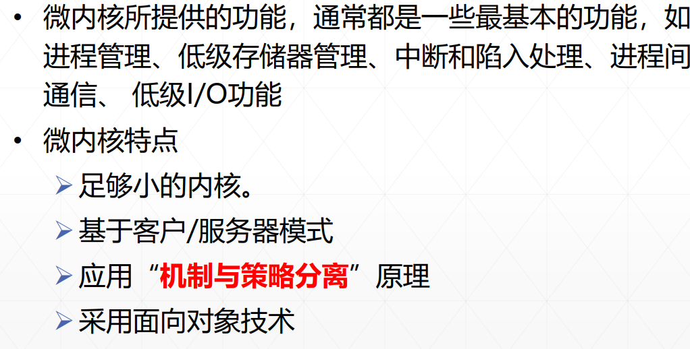

# 操作系统

## 1.第一章

### 1.1操作系统定义

**操作系统定义1**：操作系统是一组控制和管理计算机软硬件资源、合理地对各类作业进行调度以及方便用户使用的程序集合

**操作系统定义2**：·操作系统是位于硬件层（HAL)之上，所有其它系统软件层之下的一个**系统软件**，使得管理系统中的各种软件和硬件资源得以充分利用，方便用户使用计算机系统

### 1.2操作系统目标和作用

**操作系统的目标**：

1. **方便性**：操作系统使计算机更易于使用。
2. **有效性**：操作系统允许以更有效的方式使用计算机系统资源。
   - 提高系统资源利用率
   - 提高系统的吞吐量
3. **可扩展性**：在操作系统中，允许有效地开发，测试和引进新的系统功能。
4. **开放性**：实现应用程序的可移植性和互操作性，要求具有统一的开放的环境。

**操作系统的作用**：

1. 作为用户与计算机硬件系统之间的接口

   - 计算机用户需要的**用户命令**：由OS实现的所有用户命令所构成的集合被称为OS的用户接口或命令接口
     - 字符形式
     - 菜单形式
     - 图形形式
   - 应用软件需要的**系统调用**：由OS实现的所有系统调用所构成的集合称为**程序接口**或**应用编程接口API**

2. 作为资源管理者的操作系统

   - 处理机管理，用于分配和控制处理机
   - 存储器管理，主要负责内存的回收与分配
   - I/O设备管理，负责I/O设备的分配与操纵
   - 文件管理，负责文件的存取、共享和保护

   操作系统的任务在**相互竞争**的程序之间**有序**地控制对硬件设备的分配

   对于**多用户系统**，需要管理**共享资源**，以下两种方式实现**多路复用资源**：

   - **在时间上复用**：当一种资源在时间上复用，不同的进程轮流使用它；例如CPU、打印机等
   - **在空间上复用**：每个客户得到资源的一部分；例如内存、磁盘等

3. 作为扩展机器的操作系统

**裸机**：完全无软件的计算机系统

**扩充机器**：覆盖率软件的机器称为扩充机器或虚机器

### 1.3OS发展过程

1. **人工操作方式**：未配置操作系统，穿孔卡片输入输出

2. **脱机输入输出方式**：未配置操作系统，在**外围机**控制下实现输入输出，主要解决CPU与设备不匹配矛盾

3. **单道批处理系统**：内存中仅有一道作业，结束或出错才会调用另一个作业

   - **特征**：自动性、顺序性、单道性
   - **优点**：减少人工操作、解决作业自动接续
   - **缺点**：平均周转时间长，咩有交互能力

4. **多道批处理系统**：内存中存放**多道**作业运行

   - **特征**：多道性、无序性、调度性

   - **优点**：提高CPU的利用率，提高内存和I/O设备利用率，增加系统吞吐量

   - **缺点**：平均周转时间长，没有交互能力

   - **需要解决的问题**：

     - **处理机管理**：分配和控制CPU
     - **存储器管理**：内存分配与回收
     - **I/O设备管理**：I/O设备的分配与操纵
     - **文件管理**：文件的存取、共享和保护
     - **作业管理**：如何组织作业运行

     

5. **分时操作系统**：用户需要**人机交互**、**共享主机**、**便于用户上机**

   - **关键问题**：
     - 及时接受：实现多个用户的信息及时接收
     - 及时处理：及时控制作业的运行
   - **实现方法**：
     - 简单分时系统
     - 具有前台和后台的分时系统
     - 多道分时系统
   - **特点**：
     - 多路性：一个主机与多个终端相连
     - 独立性：彼此独立操作、互不干扰
     - 及时性：系统能在很短时间得到回答
     - 交互性：能实现人机对话（**区别于批处理系统**）

6. **实时系统**：计算机及时响应外部事件的请求，在规定时间内完成处理，控制所有实时设备和实时任务协调运行

   - **实时任务类型**：
     - 按是否为**周期性**划分：周期性实时任务、非周期性实时任务
     - 按**截止时间**划分：硬实时任务，软实时任务
   - **特征**：
     - **多路性**：能对多个对象进行控制
     - **独立性**：独立运行，不混淆不破坏
     - **交互性**：仅限于访问系统中某些特定的专用服务程序
     - **可靠性**：高可靠性，具有多级容错防护能力
     - **及时性**：不同系统要求不同，控制对象在截止时间内完成

### 1.4现代操作系统基本特征 

1. **并发性**（最重要）
   - 并发性：多个事件在同一**时间间隔**内发生
   - 并行性：多个事件在同一**时刻**内发生
   - **程序**：静态实体
   - **进程**：系统中能**独立运行**并作为**资源分配**的基本单位，由一组**机器指令**、**数据**和**堆栈**等组成的独立运行的活动实体
   - **线程**：作为**独立运行**和**调度**的基本单位
2. 共享性（仅次于并发）
   - **共享**：系统中的资源可供内存中多个**并发执行**的进程共同使用
   - **互斥共享**：把在一段时间内只允许一个进程访问的资源称为**临界资源**（打印机），临界资源可以供给多个进程使用，但**一段时间**内只允许**一个**进程使用
   - **同时访问**：多个任务可以**同时使用**系统中的软硬件资源；多个进程**交替互斥**地使用系统资源（磁盘）
3. 虚拟性
   - **虚拟**：通过某种技术把一个物理实体映射为若干个逻辑上地对应物
   - **时分复用技术**：虚拟处理机分时实现
   - **空分复用技术**：虚拟磁盘技术
4. 异步性
   - **执行结果不确定**，程序不可再现
   - **异步性**，多道程序环境下程序以异步方式执行，每道程序在何时执行、完成都不确定

### 1.5操作系统的主要功能

1. **处理机管理**：按照一定的算法把处理及分配给进程，并对其进行有效的管理和控制
   - 进程控制
   - 进程同步与互斥
   - 进程通信
   - 进程调度
2. **存储器管理**：方便用户使用存储器，提高存储器利用率以及从逻辑上扩充内存
   - 内存分配
   - 内存保护
   - 地址映射
   - 内存扩充
3. **设备管理**：完成用户提出的I/O请求；为进程分配所需的I/O设备；提高CPU和I/O设备的利用率；提高I/O速度；方便用户使用I/O设备
   - **缓冲管理**：有效缓和CPU和I/O设备速度不匹配的矛盾，提高CPU利用率
   - **设备分配**：根据I/O请求，分配所需的设备
   - **设备处理**：设备处理程序被称为设备驱动程序
4. **文件管理**：对用户的文件和系统文件进行管理，以方便用户使用，并确保文件的安全性
   - 文件存储空间的管理
   - 目录管理
   - 文件的读写管理与保护
5. **方便用户使用用户接口**

### 1.6OS结构设计

1. **无结构操作系统**：只注意功能实现与效率，缺乏首尾一致思想

   - 设计出的操作系统庞大又杂乱，缺乏清晰的结构
   - 程序错误很多，调试困难

2. **模块式结构**：

   - **模块之间的关系**：所有各块的实现均可以任意引用其他各块所提供的概念及属性
   - **优点**：提高OS设计的正确性，增强OS的可适应性、加速OS的开发过程
   - **缺点**：对模块互粉以及对接口的规定精确描述很困难；从功能划分模块，未能区别共享资源和独占资源

3. **层次式结构**

   - **层相互关系**：各层的实现不依赖其上层所提供的概念和属性，只依赖下层；每一层军对其上层隐藏下层
   - **考虑因素**：
     - 程序嵌套：通常一个功能并非一个程序，而是若干软件层才能实现
     - 运行频率：将经常活跃的模块放在最接近硬件的层
     - 公共模块：把供多种资源管理程序调用的公共模块设置在最底层，方便调用
     - 用户接口：命令接口、程序接口设置在最高层，直接供用户使用
   - **客户/服务器模式**
     - **优点**：提高系统可扩展性、增强系统可靠性、可移植性好、提供对分布式系统的支持
     - **缺点**：运行效率有所降低（消息传递开销+模式切换开销）
   - **面向对象的程序设计技术OOP**
     - 可修改性和可扩充性
     - 继承性
     - 正确性和可靠性

4. **微内核结构**

   **微内核技术**是指能实现现代OS核心功能的小型内核，更小更精炼，不仅运行在**核心态**，而且开机后常驻内存，不会因为内存紧张而被换出内存

   

   - **内核**：操作系统最基本最核心的部分，实现操作系统内核功能的程序就是**内核程序**
     - **时钟管理**：用时钟中断实现计时功能
     - **原语**：一种特殊的程序，具有原子性，**不可被中断**
     - 时钟管理、中断处理、原语等与**硬件**相关一定在**内核**；进程管理、存储器管理等对**数据结构**操作不涉及硬件，有的操作系统不会放到内核
     - 
   - **外核操作系统**
     - 颠覆传统操作系统设计的架构，将**资源管理**与**资源保护**分离，赋予**应用程序更大的灵活性**和**对硬件的直接控制权**
     - 
     - 

## 2.进程管理

### 2.1程序执行

**顺序执行特征**：

- **顺序性**：处理机的操作严格按照**程序所规定的顺序**执行
- **封闭性**：程序运行时**独占全机资源**，程序一旦开始执行，其执行结果不受外界因素影响
- **可再现性**：只要程序执行时环境和初始条件相同，都将获得**相同的结果**（无论是不是停停走走）

**并发执行特征**：

- **间断性**：由于共享系统资源，形成相互制约关系，导致并发程序具有“**执行-暂停-执行**”这种间断性的规律
- **失去封闭性**：多个程序**共享资源**，资源状态由多个程序改变，程序运行失去封闭性
- **不可再现性**：程序并发执行**失去封闭性**，导致不可再现

### 2.2进程描述

**进程特征**：

1. **结构特征**：为了使程序独立运行，应为之配置一进程控制块**PCB**；由**程序段**、**相关数据段**、**PCB**构成进程实体；所谓创建进程实质上时创建进程实体中的**PCB**，撤销进程同理。
2. **动态性**：进程的实质是**进程实体**的一次执行过程，动态性表现“**由创建而产生，由调度而执行，由撤销而消亡**”
3. **并发性**：多个进程实体同存在**内存**中，且在一段时间内**同时运行**
4. **独立性**：进程实体是一个能**独立运行**、**独立分配资源**和**独立接受调度**的基本单位
5. **异步性**：进程按各自独立的、不可预知的速度向前推进，按**异步方式**运行

**进程与程序的主要区别**：

**进程基本状态及转换**：

1. **进程转状态**：

   - **就绪状态**：进程分配到除CPU以外的所有必要资源，一旦得到CPU便可立即执行
   - **执行状态**：进程获得CPU，程序正在执行
   - **阻塞状态**：正在执行的进程由于发生某件事而暂时无法执行，放弃处理机处于暂停状态（读磁盘）
   - 新建状态：进程被创建，但未被OS接纳为可执行进程，**程序在辅存中**，**PCB在内存中**
   - 终止状态：因停止被OS从执行状态释放
   - **挂起状态**：使执行的进程暂停执行、静止下来（**换到外存中**）

   

2. 多个进程竞争内存资源解决办法

   - 采用交换技术：换出一部分进程到外存，腾出内存空间
   - 采用虚拟存储技术：每个进程只能装入一部分程序和数据

3. **进程控制块**：常驻**内存**，是**进程存在**的唯一标识

   - **作用**：
     - 作为**独立运行基本单位**的标志
     - 能实现**间断性**运行方式
     - 提供**进程管理**所需的信息
     - 提供**进程调度**所需的信息
     - 实现与**其他进程**的同步与通信
   - **信息**：
     - **进程标识符PID**：内部标识符（系统），外部标识符（用户）
     - **处理机状态**：寄存器，PSW，PC，栈指针
     - **进程调度信息**：进程状态，优先级，阻塞原因
     - **进程控制信息**：程序和数据的地址、进程同步和通信机制、资源清单
   - **组织方式**：
     - **线性方式**：所有PCB组织在一张线性表中，该表的首地址放在专用区域
     - **链接方式**：把具有同一状态的PCB用其中的链接字连接成一个队列，排成**就绪队列**，若干个**阻塞队列**以及**空白队列**
     - **索引方式**：根据所有进程的状态建立几张索引表

### 2.3进程控制

