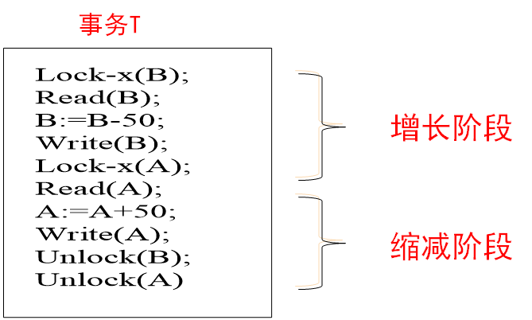

# 数据库

## 1.数据库系统概论

**数据库**：一种依照特定**数据模型**组织、存储和管理数据的文件集合。这些文件一般存放在**外部存储器**中，以便长久保存数据和快速访问。

**数据库特点**：

1. 数据**不重复**存放
2. 支持多个应用**并发访问**
3. 数据结构**独立**于应用程序
4. 对数据的增删改查均由**数据库系统管理软件**进行管理和控制，实现**复杂数据处理**

**数据模型**：描述**事物对象**数据**特征**及其**结构**的形式化表示，包含**数据结构**、**数据操作**、**数据约束**三个部分

1. **数据结构**：描述事物对象的**静态特征**，包括事物对象的数据组成、数据类型、数据性质等。
2. **数据操作**：描述事物对象的**动态特征**，包括数据的增删改查。
3. **数据约束**：描述数据结构中数据之间的**语义联系、制约和依存关系**。

| 分类 | 层次数据模型                                                 | 网状数据模型                             | 关系数据模型                                                 |
| ---- | ------------------------------------------------------------ | ---------------------------------------- | ------------------------------------------------------------ |
| 思想 | 采用“**树**”结构来组织、存储和管理数据。                     | 采用“**网状图**”结构组织、存储和管理数据 | 采用**二维表**结构组存储和管理数据，并以关**联列**实现表之间的联系 |
| 优点 | 1.层次清晰 2.结点更新更容易 3.检索查询效率高       | 1.容易表达数据间的复杂关系 2.冗余小 | 1.数据结构**简单**、操作**灵活** 2.支持**关系**与**集合**运算操作 3.支持广泛使用的**SQL数据库操作语言标准** 4.容易实现与应用程序的独立性 |
| 缺点 | 1.结构单一 2.相同信息多次储存，冗余大 3.不适合具有拓扑空间的数据组织 | 1.结构复杂 2.需要定位指针           | 1.只用于**结构化数据**的组织与存储管理 2.支持的数据类型较**简单** 3.难以支持**非结构化数据**和**复杂数据管理** |

**数据库系统**：一类基于**数据库**进行**数据管理**与**信息服务**的软件系统

1. **用户**：数据库系统系统的使用人员
2. **数据库应用程序**：在**DBMS**支持下对数据库中数据进行**访问处理**的应用程序
3. **数据库管理系统**：一种专门用来**创建**数据库、**管理**数据库、**维护**数据库并提供外部对数据库进行**访问**的软件、
4. **数据库**：依照特定数据模型组织、存储和管理数据的文件集合

**数据库应用结构**：单机用户结构、集中式结构、客户/服务器结构、分布式结构

**数据库生命周期**：需求分析、系统设计、系统实现、系统测试、系统运行与维护

## 2.关系模型

### 2.1相关概念

**实体**：指包含**数据特征的事物对象**在概念模型世界中的抽象名称

**关系**：指具有**关系特征**、用于**存放实体数据**的二维表

**键**：在关系中可以用来**唯一标识元组**的属性列

**外键**：在关联的两个关系这个，它们具有一个或多个相同属性，若关联列在第一个关系中作主键，则在第二个关系中作外键。

**主键作用**：

1. 唯一标识关系表的元组
2. 与关联表的**外键**建立联系，实现**关系表之间连接**
3. 数据库文件使用主键值来**组织关系表的数据存储**
4. 数据库使用主键索引快速**检索数据**

### 2.2关系模型

**关系模型**：一种基于**二维表**结构，存储**数据实体**以及**实体间联系**的数据模型

1. **数据结构**：表
2. **数据操作**：集合运算操作与专门的关系运算操作
3. **数据关系约束**：属性列取值是否唯一、范围

**关系模型完整性**：在关系数据模型中对关系实施的完整性约束

**作用**：消除关系表的元组**重复存储**、保持**关联表**的**数据一致性**、实现**业务数据规则**

1. **实体完整性约束**：在关系表中实施的**主键**取值约束，以保证每个元组被唯一识别（主键不可为空，不可重复）
2. **参照完整性约束**：**关系表**之间的数据约束（关系R中外键F与关系S中主键K关联，则F与K的值必须一致）
3. **用户自定义完整性约束**：用户根据具体业务对数据处理规则所定义的数据约束（列的范围，缺省值）

### 2.3数据库关系运算

**关系代数**：传统集合运算、专门关系运算

1. **选择**：行角度，σ_条件（表名）
2. **投影**：列角度，Π_(列名)（表名）
3. **连接**：按条件连接两个表，常用等值连接和自然连接（自然连接会删除重复列）
4. **除**：先找不同列的象集，再找被除表的投影，再找象集包含投影的就是结果除法必须有公共列并且不能有杂列

## 3.SQL语言

### 3.1概述

| 分类         | 语言                                                         |
| ------------ | ------------------------------------------------------------ |
| 数据定义语言 | CREATE DROP ALTER（库，表）                                  |
| 数据操作语言 | INSERT UPDATE DELETE（表）                                   |
| 数据查询语言 | SELECT                                                       |
| 数据控制语言 | GRANT DENY REVOKE（用户权限）                                |
| 事务处理语言 | BEGIN TRANSACTION//COMMIT//ROLLBACK（事务）                  |
| 游标控制语言 | DECLARE CURSOR-提交游标 FETCH INTO-提交游标数据 CLOSE CURSOR-关闭游标 |

### 3.2数据定义语句

**操作表**

~~~sql
#创建数据库
CREATE DATABASE data;
#修改数据库
ALTER DATABASE data RENAME TO base;
#删除数据库
DROP DATABASE data;
#创建表，列约束
CREATE TABLE Student
(
    StudentID     char(13)         PRIMARY KEY,
    StudentName   varchar(10)      NOT NULL UNIQUE,#唯一值
    StudnetGender char(2) NULL     CHECK(StuntGender IN('男','女')),#可选类型
    BirthDay      date NULL,
    Major         varchar(30) NULL DEFAULT '软件工程',#缺省值
    StudentPhone  char(11) NULL
);
#创建表，表约束，复合主键CONSTRAINT
CREATE  TABLE  Plan
( 
  CourseID  	char(4)  	NOT  NULL,
  TeacherID  	char(4)  	NOT  NULL,
  CourseRoom  	varchar(30),
  CourseTime  	varchar(30),
  Note  		varchar(50),
  CONSTRAINT	CoursePlan_PK	PRIMARY Key(CourseID,TeacherID)#复合主键
);
#表约束，代理主键serial
CREATE  TABLE  Plan
( 
  CoursePlanID	serial		    NOT  NULL,
  CourseID  	char(4)  		NOT  NULL,
  TeacherID  	char(4)  		NOT  NULL,
  CourseRoom  	varchar(30),
  CourseTime  	varchar(30),
  Note  		varchar(50),
  CONSTRAINT	CoursePlan_PK	PRIMARY Key(CoursePlanID)
);
#表约束，定义外键
CREATE  TABLE  Register
( 
  CourseRegID  	serial	        NOT  NULL,
  CoursePlanID  Int  		    NOT  NULL,
  StudentID  	char(13),
  Note  		varchar(30),
  CONSTRAINT	CourseRegID_PK	PRIMARY Key(CourseRegID),
  CONSTRAINT	CoursePlanID_FK	FOREIGN Key(CoursePlanID)
	REFERENCES  Plan(CoursePlanID)
    ON DELETE CASCADE,#级联规则 主表记录删除从表自动删除
  CONSTRAINT	StudentID_FK	FOREIGN KEY(StudentID)
	REFERENCES  Student(StudentID)
    ON DELETE CASCADE
);

#修改表结构
#ADD修改方式
ALTER TABLE Student ADD email varchar(20) NOT NULL;
#DROP修改方式
ALTER TABLE Student DROP COLUMN name;
ALTER TABLE Student DROP CONSTRAINT name;
#RENAME修改方式
ALTER TABLE Student RENAME TO student;
ALTER TABLE Student RENAME name TO sname;
#ALTER修改方式
ALTER TABLE Student ALTER COLUMN name TYPE int;

#删除表结构
DROP TABLE Student;
~~~

**操作索引**

~~~sql
#创建索引
CREATE INDEX br ON STUDENT(birthday);
#修改索引
ALTER INDEX br RENAME TO brrr;
#删除索引
DROP INDEX br;
~~~

### 3.3数据操纵语句

~~~sql
#插入语句
INSERT INTO Student VALUES('20212201012','shuaige','女');
#更新语句
UPDATE Student SET Email='zhaodong@163.com' WHERE StudentName = '赵东';
#删除语句
DELETE FROM Student WHERER StudentName = '张量';
~~~

### 3.4数据查询语句

**单表数据查询**

~~~sql
#从单个表读取指定列
SELECT Major FROM Student;
SELECT DISTINCT Major FROM Student;    #过滤重复数据，自动选择所有列
#从单个表选择指定行
SELECT * FROM Student WHERE StudentGender='男';

#从单个表选择指定行和列
SELECT StudentID,StudentName,StudentGender,Major
FROM Student
Where StudentGender='男';

#where条件自句，BETWEEN...AND限制范围
SELECT * FROM Student WHERE Birthday BETWEEN '2000-01-01' AND '2000-12-30';
#LIKE关键字与通配符限定字符串数据范围 _一个，%一个或读个
SELECT * FROM Student WHERE Email LIKE '%@163.com';

#逻辑运算符增加更多条件(AND,OR,NOT,IN,NOT IN)
SELECT StudentID,StudentName,StudentGerder,Major
FROM Student
Where Major='软件工程' AND StudentGender='男';
#IN条件
SELECT  StudentID, StudentName, StudentGender, Major
FROM  STUDENT
WHERE  Major IN  ('计算机应用');

#排序 ORDER BY关键字，DESC是降序，ASC是升序
#相同了才会按照姓名排序
SELECT * FROM Student ORDER BY Birthday DESC,StudentName ASC;
~~~

**内置函数**

| 聚合函数  | 功能                         |
| --------- | ---------------------------- |
| AVG（）   | 计算结果集指定列数据的平均值 |
| COUNT（） | 计算结果集行数               |
| MIN（）   | 找出结果集指定列数据的最小值 |
| MAX（）   | 找出结果集指定列数据的最大值 |
| SUM（）   | 计算结果集指定列数据的总和   |

~~~sql
#查询学生人数,包括null值行
SELECT COUNT(*) AS 学生人数 FROM Student;
#计算特定列非null值数量
SELECT COUNT(StudentID) AS 有效学生人数 FROM Student;
#多个条件
SELECT MIN(Birthday) AS 最大年龄,MAX (Birthday) AS 最小年龄 FROM Student;
~~~

**分组统计**

~~~sql
#分专业统计学生人数
SELECT Major AS 专业,COUNT (StudenID) AS 学生人数
FROM Student
GROUP BY Major;

#分专业统计表中男生人数，只显示人数多于2的人数
SELECT Major AS 专业,COUNT(StudentID) AS 学生人数
FROM Student
WHERE StudentGender='男'
GROUP BY Major
HAVING COUNT(*)>2;  #对分组后的结果进行过滤
~~~

### 3.5多表关联查询

~~~sql
#子查询，查询计算机学院的老师，教师表与学院表关联
SELECT TeacherID,TeacherName,TeacherTitle
FROM Teacher
WHERE CollegeID IN(SELECT CollegeID FROM College WHERE CollegeName='计算机学院');

#从多个表获取数据不能使用子查询，采用连接关联多表查询
SELECT  B.CollegeName AS 学院名称,  A.TeacherID  AS 编号, A.TeacherName  AS 姓名,  A.TeacherGender  AS 性别,  A. TeacherTitle  AS 职称
FROM  Teacher  AS  A，College  AS  B
WHERE  A.CollegeID=B.CollegeID 
ORDER  BY  B.CollegeName, A.TeacherID;  #默认升序
~~~

内外连接

~~~sql
#内连接
SELECT  B.CollegeName AS 学院名称,  A.TeacherID  AS 编号, A.TeacherName  AS 姓名,  A.TeacherGender  AS 性别,  A. TeacherTitle  AS 职称
FROM  TEACHER  AS  A  JOIN  COLLEGE  AS  B
ON  A.CollegeID=B.CollegeID 
ORDER  BY  B.CollegeName, A.TeacherID;

#外连接，能查到没有学生选择的课程名称和选课人数
SELECT C.CourseName AS 课程名称, T.TeacherName AS 教师, 
COUNT  (R.CoursePlanID)  AS 选课人数
FROM  COURSE  AS  C  JOIN  PLAN  AS  P  
ON  C.CourseID=P.CourseID 
JOIN  TEACHER  AS  T  ON  P.TeacherID=T.TeacherID
LEFT  JOIN  REGISTER  AS  R  ON  P.CoursePlanID=R.CoursePlanID
GROUP  BY C.CourseName, T.TeacherName;
~~~

### 3.4数据控制语句

~~~sql
#GRANT权限授予
GRANT SELECT,INSERT,UPDATE,DELETE ON DataBase_name TO Roles_name;
#REVOKE权限收回
REVOKE DELETE ON DataBase_name FROM Roles_name;
#DENY权限拒绝
DENY DELETE ON ON DataBase_name TO Roles_name;
~~~

### 3.5视图SQL语句

**视图**：通过基础表或其他视图构建的**虚拟表**，本身没有数据，而是使用存储在基础表中的数据。

1. 简化复杂SQL查询操作
2. 提高数据访问安全性
3. 提供数据逻辑独立性
4. 集中展示用户感兴趣的特定数据

~~~sql
#创建视图
CREATE VIEW BasicCourseView AS
SELECT CourseName,CourseCredit,CoursePeriod,TestMethod
FROM COURSE
WHERE CourseType='基础课';

#视图创建后可以像访问关系表一样自由访问
SELECT * FROM BasicCourseView ORDER BY CourseName;

#删除视图
DROP VIEW BasicCurseView;
~~~

## 4.数据库设计

### 4.1数据库设计方案

1. **数据库应用架构设计**：单用户结构、集中式结构、客户/服务器结构和分布式结构
2. **数据库结构模式设计**：概念数据模型、逻辑数据模型和物理数据模型
3. **数据库应用访问方式设计**：直接本地连接接口访问、基于标准接口连接访问。

### 4.2E-R图

**实体基本关系**

**实体继承关系**：

互斥：父类实体只能属于一个子实体

完整：子类实体包括父类的全部

**强弱实体**：弱实体必须只属于一个强实体。

**标识符依赖弱实体**：没有自己的标识符，依赖强实体标识符

**非标识符依赖弱实体**：有自己的标识符

### 4.3数据库建模设计

**E-R模型**到**关系模型**转换原理：

①将每一个**实体**转换成一个**关系表**，实体**属性**转换为关系表的**列**，实体**标识符**转换为关系表的**主键或外键**。

②将实体之间的**联系**转化为关系表之间的**参照完整性约束**。

**弱实体转换关系表原则**：ID依赖的强实体标识符作弱实体的主外键，非ID依赖的只做外键

**实体联系转换**：1-1都行（递归就作自己的外键），1-n中父类主键作子类外键，m-n生成中间表

### 4.4函数依赖

对于一个一个关系R的集合U的两个子集X，Y，如果t[X] = s[X]，则t[Y] = s[Y]。那么称Y函数依赖于X，表示为X→Y。

**完全函数依赖**：如果不存在X’属于X ，使X’→Y，则Y称**完全函数依赖**，否则称Y部分函数依赖。

**函数传递依赖**：Y依赖X，X不依赖Y，Z依赖Y，如果Z依赖X，则称Z对X存在函数传递依赖。

**多值函数依赖**：设U是关系模式R的属性集，X和Y是U的子集，Z=U-X-Y，xyz表示属性集XYZ的值。对于R的关系r，在r中存在元组（x, y1, z1）和（x, y2, z2）时，也存在元组（x, y1, z2）和（x, y2, z1），那么在模式R上存在多值函数依赖。

### 4.5关系规范化范式

**第一范式**：关系表中属性不能再分

**第二范式**：第一范式基础上消除属性**部分**依赖

**第三范式**：第二范式基础上消除属性传递依赖（非主键必须依赖主键）

**巴斯克的范式**：所有函数依赖的决定因子都是候选键

**第四范式**：消除多值函数依赖

**优点**：关系的**规范化程度**越高，关系数据库存储的**冗余数据**越少，可消除的**数据访问异常**越多。

**缺点**：关系规范化程度越高，分解出来的**关系表**越多，实现数据访问时**关联多表效率降低**。

**逆规范化处理**：降低**规范化范式**约束，允许适当的**数据冗余性**，以获取**数据访问性能**

**优点**：增减**冗余列**或**派生列**，多个关系表**合并**成一个关系表

**缺点**：存在**冗余数据**，降低数据库**完整性**，降低数据库**更新**操作的性能

## 5.数据库管理

### 5.1概述

**数据库管理**：保证数据库系统的**正常运行**和**服务质量**必须进行的**系统管理工作**。

1. 保障数据库系统**正常运行**和数据库**存取访问性能**
2. 充分发挥数据库系统的**软硬件处理能力**
3. 确保数据库系统的**安全性**和**用户数据隐私性**
4. 有效管理数据库**用户**及其**角色权限**
5. 解决数据库系统**性能优化**、**系统故障**与**数据损坏**等问题
6. 最大限度发挥数据库对其所属机构的**信息资产作用**

### 5.2存储管理

表空间相当于所有数据的集合；段可以是表、索引、视图；盘区就是一块磁盘空间

**分类**：逻辑存储结构（面向数据库编程用户）；物理存储结构（面向DBA用户即管理员）

从数据库**逻辑**存储结构来看，访问数据库的基本单位是**内存页**；

从数据库**物理**存储结构来看，存取数据文件的基本单位是操作系统**文件块**

**数据文件记录结构**：定长记录与变长记录

1. **定长**：有足够空间再插入；在第一个块头区加上自由链表指针指向第一个空闲，然后以此类推
2. **变长**：分为固定记录与变长记录（字段如何存储）；块中采用**分槽**结构（访问记录）

**数据字典**：存放数据库**元数据**的**系统数据库表**及其**视图**

1. 数据库表、视图的结构数据
2. 系统角色、用户数据
3. 索引数据

### 5.3索引结构

B+树

**哈希表**

### 5.4事务管理

**事务**：指由构成**单个业务处理单元**的一组**数据库访问操作**，要求它们要么都成功执行，要么都不执行

**特性**：ACID（原子性、一致性、隔离性、持续性）

**事务并发执行**：改善系统的**资源利用率**，减少事务执行的**平均等待时间**

~~~sql
#回滚到上一个节点
BEGIN;
INSERT INTO  Course VALUES ('C001', '数据库原理及应用', '学科基础', 4 , 64 , '考试');
INSERT INTO  Course VALUES ('C002', '操作系统基础', '学科基础', 4 , 64 , '考试');
INSERT INTO  Course VALUES ('C003', '数据结构与算法', '学科基础', 4 , 64 , '考试');
SAVEPOINT TempPoint;
INSERT INTO  Course VALUES ('C004', '面向对象程序设计', '学科基础', 3 , 48 , '考试');
INSERT INTO  Course VALUES ('C005', '软件测试', '专业核心', 3 , 48 , '考试');
ROLLBACK TO TempPoint;
COMMIT;

#事务进程中不能使用的SQL语句
#创建数据库 CREATE  DATABASE
#修改数据库 ALTER  DATABASE
#删除数据库 DROP  DATABASE
#恢复数据库 RESTORE  DATABASE
#加载数据库 LOAD  DATABASE
#备份日志文件 BACKUP  LOG
#恢复日志文件 RESTORE  LOG
#授权操作 GRANT
~~~

### 5.5并发控制

1. 支持并发事务处理，使更多用户**并行操作**，提高系统的**并发访问能力**
2. 保证一个事务工作不会对另一个事务工作产生**不合理影响**

**问题**：丢失更新数据、脏数据读取、不可重复读取、数据幻读

**事务调度目的**：使并发事务调度实现的处理结果与**串行化调度处理**的结果一致。

**锁机制**：排他锁定（写锁），共享锁定（读锁，可以累加）

**资源锁定粒度**：数据库、表、页面、行

**资源锁实施方式**：隐式锁定（DBMS缺省执行）、显示锁定（加锁命令显示执行）

**加锁协议**：分为三个级别，越来越严格

1. **一级**：对于修改操作，必须加X锁，直到事务结束才释放（丢失更新数据）
2. **二级**：一级锁基础上，针对并发事务的读操作，必须加共享锁锁定，**读完数据后立即释放**（脏读）
3. **三级**：一级基础上，对于并发读操作，加共享锁锁定，直到事务结束才释放（不可重复读）

| **加锁协议级别** | **排它锁** | **共享锁**                   | **丢失更新** | **脏读** | **不可重复读** |
| ---------------- | ---------- | ---------------------------- | ------------ | -------- | -------------- |
| **一级**         | 全程加锁   | 不加                         | 否           | 是       | 是             |
| **二级**         | 全程加锁   | 开始时加锁，读完数据释放锁定 | 否           | 否       | 是             |
| **三级**         | 全程加锁   | 全程加锁                     | 否           | 否       | 否             |

**两阶段锁定协议**：规定每个事务必须分**两个阶段**提出加锁和解锁申请（增长阶段->获得锁不释放；缩减阶段->释放锁不能获得锁）

1. **并发事务的调度准则**：一个给定的并发事务调度，当且仅当它是可串行化时，才能保证正确调度
2. **保证串行化调度的协议**：二阶段锁定协议

**事务死锁**：基于**锁机制**的并发事务执行中，如果这些事务同时锁定**两个及以上资源**时，可能会出现彼此都不能继续执行的情况。

**防范死锁**：运行用户一次发出当前所需**全部资源**的锁定，使用完成后再释放；规定所有应用程序锁定资源的顺序**完全相同**。

**解决死锁**：发生死锁时**回滚**其中一个事务，并取消它对数据库所作的改动

**事务隔离级别**：使用`SET TRANSCTION`命令实现

### 5.5安全管理

用户，角色，权限管理

~~~sql
#创建用户
CREATE USER  "userA"  WITH
  LOGIN
  NOSUPERUSER
  NOCREATEDB
  NOCREATEROLE
  INHERIT
  NOREPLICATION
  CONNECTION LIMIT -1 #表示没有限制
  PASSWORD '123456';
~~~

~~~sql
#修改用户基本属性
ALTER USER "userA" WITH PASSWORD 'newpassword';
#重命名
ALTER USER "userA" RENAME TO "userB";
#修改用户会话属性
ALTER USER "userA" SET search_path TO 'public';
#将会话属性设置为默认
ALTER USER "userA" RESET search_path;
~~~

~~~sql
#删除用户
DROP USER "userA"
~~~

**权限管理**：`GRANT`、`REVOKE`、`DENY`

~~~sql
#授予权限
GRANT SELECT ON TableName TO "userA";
#收回权限
REVOKE SELECT ON TableName FROM "userA";
#拒绝权限
DENY SELECT ON TableName TO "userA";
~~~

**角色管理**：`GRANT`、`ALTER`、`DROP`

~~~sql
#创建角色
CREATE  ROLE  "Role_Manager"  WITH
 LOGIN
 NOSUPERUSER
 NOCREATEDB
 NOCREATEROLE
 INHERIT
 NOREPLICATION
 CONNECTION LIMIT -1;
#授予权限
GRANT  SELECT,INSERT,UPDATE,DELETE  ON  Department  TO  "Role_Manager";

#修改角色
ALTER ROLE "Role_Manager" WITH CONNECTION LIMIT 3;
ALTER ROLE "Role_Manager" RENAME TO "Manager_Role";
ALTER USER "userA" SET search_path TO 'public';
ALTER ROLE "Role_Manager" RESET search_path;

#删除角色
DROP ROLE "Role_Manager";
~~~

### 5.6数据库备份与恢复

**数据备份**：将数据库当前**数据**和**状态**进行**副本复制**，以便当数据库受到破坏后可以修复。

**备份方式**：完整数据库备份（逻辑）、差异数据库备份、事务日志备份、文件备份（物理）

**按照数据库是否需要停止运行分类**：

1. **热备份**：实现**实时**数据备份，无需**停机**保证业务连续性；实现**复杂**且影响生产系统性能
2. **冷备份**：保证数据备份完整性，不会丢失数据；需要**停机**影响业务连续性，备份期间无法提供服务。

**数据恢复**：当数据库数据丢失或被破坏后，从**备份副本**将数据库从**错误状态**恢复到**某一正确状态**。（事务故障、系统崩溃、存储介质损坏）

1. 通过**备份文件**进行恢复
2. 利用**事务日志**按**前滚**或**回滚**方式进行数据恢复

## 6.数据库编程

### 6.1函数编程

~~~sql
#创建一个计算两数相加的函数
CREATE OR REPLACE FUNCTION add_numbers(a INTEGER, b INTEGER)
RETURNS INTEGER AS $$
DECLARE
  result INTEGER;
BEGIN
  result := a + b;
  RETURN result;
END;
$$ LANGUAGE plpgsql;
~~~

~~~sql
#声明变量
DECLARE
	count INTEGER;
	rec RECORD;  #记录类型，不是真正的数据类型，只是一个占位符
~~~

~~~sql
#条件语句
CREATE OR REPLACE FUNCTION check_number(num INTEGER)
RETURNS TEXT AS $$
DECLARE
  result TEXT;
BEGIN
  IF num > 10 THEN
    result := 'Number is greater than 10';
  ELSE
    result := 'Number is 10 or less';
  END IF;
  RETURN result;
END;
$$ LANGUAGE plpgsql;

#if-elseif-else
CREATE OR REPLACE FUNCTION check_number(num INTEGER)
RETURNS TEXT AS $$
DECLARE
  result TEXT;
BEGIN
  IF num > 10 THEN
    result := 'Number is greater than 10';
  ELSIF num = 10 THEN
    result := 'Number is exactly 10';
  ELSIF num > 0 THEN
    result := 'Number is greater than 0 but less than or equal to 10';
  ELSE
    result := 'Number is 0 or negative';
  END IF;
  RETURN result;
END;
$$ LANGUAGE plpgsql;
~~~

~~~sql
#循环语句
CREATE OR REPLACE FUNCTION count_from_50()
RETURNS VOID AS $$
DECLARE
  count INTEGER := 1;
BEGIN
  LOOP
    count := count + 1;
    CONTINUE WHEN count < 50; #continue 跳过后面语句
    EXIT WHEN count > 100; # exit 退出循环
    RAISE NOTICE 'Count: %', count;
  END LOOP;
END;
$$ LANGUAGE plpgsql;

#for循环
CREATE OR REPLACE FUNCTION print_numbers()
RETURNS VOID AS $$
DECLARE
  count INTEGER;
BEGIN
  FOR count IN 1..10 LOOP
    RAISE NOTICE 'Number: %', count;
  END LOOP;
END;
$$ LANGUAGE plpgsql;

#还能遍历命令结果并操作相应数据
declare 
     rec RECORD ；
 FOR rec IN SELECT sid , sname FROM student LOOP
     raise notice ‘%-,%-’,rec.sid, rec.sname; 
 END LOOP;
~~~

**游标**：一种临时的数据库对象，用来存放从数据库表中查询并返回的数据记录

~~~sql
#未定义的游标
name REFCURSOR;

CREATE OR REPLACE FUNCTION increase_salaries()
RETURNS VOID AS $$
DECLARE
  emp_id INTEGER;
  emp_name TEXT;
  emp_salary NUMERIC;
  emp_record RECORD;
  cursor_for_employees CURSOR FOR SELECT id, name, salary FROM employees;
BEGIN
  -- 打开游标
  OPEN cursor_for_employees;
  -- 循环遍历结果集
  LOOP
    FETCH cursor_for_employees INTO emp_id, emp_name, emp_salary;
    EXIT WHEN NOT FOUND;  -- 如果没有更多行，则退出循环
    -- 为每个员工的薪水增加 10%
    UPDATE employees SET salary = salary * 1.10 WHERE id = emp_id;
    RAISE NOTICE 'Increased salary for % to %.2f', emp_name, emp_salary * 1.10;
  END LOOP;
  -- 关闭游标
  CLOSE cursor_for_employees;
END;
$$ LANGUAGE plpgsql;

#声明带参数
curStudentOne CURSOR (key integer) FOR SELECT * FROM student WHERE SID = key;
~~~

~~~sql
#动态打开游标 OPEN FOR EXCUTE
#传入表的名字 允许编写动态SQL指令
CREATE OR REPLACE FUNCTION fetch_all_from_table(table_name TEXT)
RETURNS VOID AS $$
DECLARE
  curVars1 CURSOR FOR EXECUTE 'SELECT * FROM ' || quote_ident(table_name);
  rec RECORD;
BEGIN
  -- 打开游标以执行动态查询
  OPEN curVars1;
  -- 循环遍历结果集
  LOOP
    -- 从游标中获取数据
    FETCH curVars1 INTO rec;
    EXIT WHEN NOT FOUND;  -- 如果没有更多行，则退出循环
    -- 输出记录信息
    RAISE NOTICE '%', rec;
  END LOOP;
  -- 关闭游标
  CLOSE curVars1;
END;
$$ LANGUAGE plpgsql;

#打开绑定的游标变量
OPEN curStudent('202303030312');
~~~

如果函数既有返回值又有结果集，在代码中定义相关参数即可

~~~java
import org.apache.ibatis.annotations.Param;
import org.apache.ibatis.annotations.SelectProvider;
import java.util.List;
import java.sql.ResultSet;

public interface YourMapper {
    @SelectProvider(type = YourFunctionProvider.class, method = "selectStudents")
    List<Student> fetchStudents(@Param("arg1") String arg1, @Param("result") boolean[] result);
}
}
~~~

### 6.2存储过程

**存储过程**：由一组能完成特定功能的SQL语句集成，把经常重复使用的SQL封装起来**编译**后存储在数据库服务器

~~~sql
CREATE OR REPLACE FUNCTION countRecords ()  #11以后可用CREATE PRECEDURE 
RETURNS integer AS $count$  
declare  
    count integer;  
BEGIN  
   SELECT count(*) into count FROM STUDENT;  
   RETURN count;  
END;  
$count$ LANGUAGE plpgsql;
~~~

在存储过程中调用存储过程

~~~sql
DECLARE
  emp_name VARCHAR(100);
  emp_salary NUMERIC;
BEGIN
  #select  into rec countRecords();  将返回值存入rec
  SELECT emp_name, emp_salary#存储过程中的变量 INTO emp_name, emp_salary#自定义变量
  FROM GetEmployeeInfo(123); -- 假设 123 是员工 ID
  -- 现在，emp_name 和 emp_salary 包含了存储过程返回的结果
  RAISE NOTICE 'Employee Name: %, Salary: %', emp_name, emp_salary;
END;
~~~

删除存储过程

~~~sql
DROP FUNCTION IF EXISTS testFunc();
~~~

| 优点                                                         | 缺点                                                         |
| ------------------------------------------------------------ | ------------------------------------------------------------ |
| 1.减少**网络通信量** 2.**执行速度**更快 3.**适应性**更强 4.降低业务实现与应用程序**耦合** 5.降低开发**复杂性** 6.保护**数据元信息** 7/增强数据库**安全性** | 1.对于复杂的业务逻辑，**过程处理逻辑**比较复杂 2.存储过程参数发生变化，需要修改**代码**以及更新**主程序调用存储过程**的代码 3.**开发调试困难** 4.**可移植性差** |

### 6.3触发器

**定义**：触发器是特殊的**存储过程**，主要由**操作事件**（INSERT、UPDATE、DELETE）触发而**自动执行**。

触发器经常用于加强数据的**完整性约束**和**业务规则**，本身是一个特殊的**事务单位**。

**特点**：与表相关联、自动触发、不能直接调用，也不能传递或接收参数、是事务一部分。

**按照语句分类**：INSERT触发器、DELETE触发器、UPDATE触发器

**按照执行次数分类**：语句级触发器（statement语句为单位执行）、行级触发器（row行为单位执行）

**按照触发时间分类**：BEFORE触发器、AFTER触发器、INSTEAD OF触发器（代替原来的SQL语句）

~~~sql
#创建课程表
CREATE TABLE stu_score
( 
    sid character(10) NOT NULL,
    cid character(10) NOT NULL,
    score numeric(5,1),
    #主键约束
    CONSTRAINT stu_score_pkey PRIMARY KEY (sid, cid)
)

#创建修改记录表
CREATE TABLE audit_score
(   
    username character(20) ,  --用户名
    sid character(10) ,
    cid character(10) ,
    updatetime text ,          --修改的时间
    oldscore numeric(5,1),     --修改前的成绩
    newscore numeric(5,1)      --修改后的成绩
)
~~~

~~~sql
#接下来在成绩表上创建触发器
CREATE TRIGGER score_audit_triger
AFTER INSERT OR UPDATE OR DELETE ON stu_score
FOR EACH ROW EXECUTE PROCEDURE score_audit();
~~~

~~~sql
#修改触发器
ALTER TRIGGER score_audit_trigger ON stu_scoreRENAME TO score_audit_trig;
#删除触发器，级联删除。resetrict是如果有依赖对象存在就拒绝删除
DROP TRIGGER IF EXISTS score_audit_trigON stu_score CASCADE;
~~~

