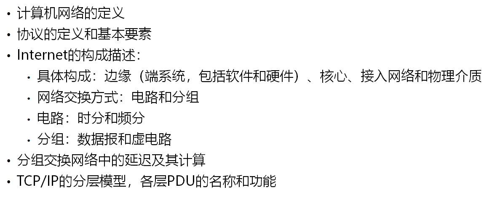
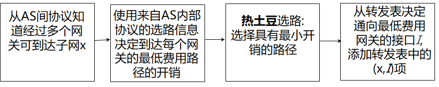
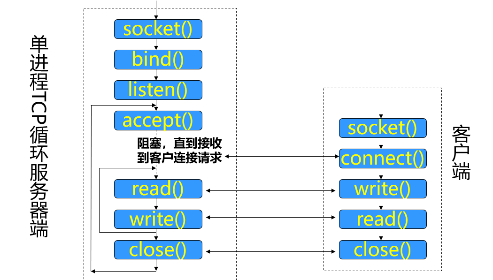
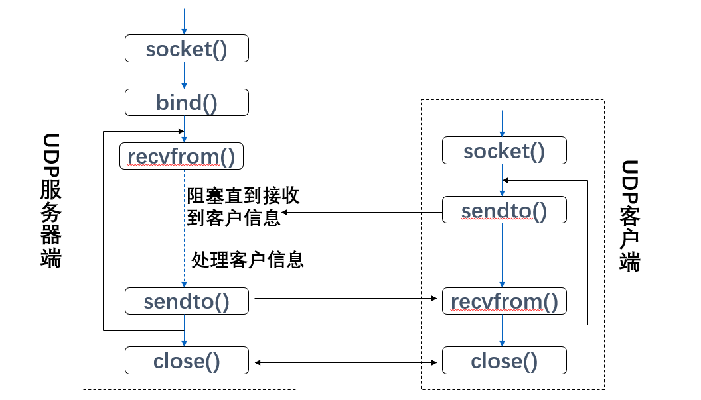
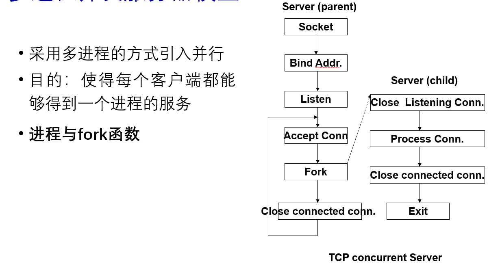

# 计算机网络

## 第一章-概述

**计算机网络**：两台以上具有**独立操作系统**的**计算机**通过某些**介质**连接成的**相互共享软硬件资源**的集合体。

**功能**：连通性、共享性

**Internet**：由数以亿计的**计算互联设备**、**通信链路**、**分组交换**（路由器和交换机）构成。

**提供服务**：提供网路应用基础架构，允许终端系统上运行分布式应用程序，并彼此交换数据；为分布式应用程序提供通信服务接口。

**协议**：定义两个或多个**通信实体**间**交换报文**的格式和次序，以及在**报文发送和接收**或者**其他事件**方面所采取的行动。（控制发送和接收消息）

**基本要素**：语法、语义、同步（时序）

**网络**：相互连接的路由器构成网络，通过以下方式传送数据

1. **电路交换**：每次会话预留沿其路径所需的独占资源。
2. **分组交换**：数据以离散的数据块通过网络来发送
   - **优点**：适合大量的突发数据传输，资源共享，简单，不需要建立连接
   - **缺点**：过度竞争导致分组延迟与丢失，需要可靠数据传输、拥塞控制协议

- 虚电报网络一定是面向连接的
- 数据报网络可以提供面向连接的服务，也可以提供无连接的服务（Internet）

**分组丢失**：分组到达输出链路的速率超过输出链路的容量,产生延迟,甚至丢失。

**分组延迟**：节点处理时延、排队时延、传输时延、传播时延

**吞吐量**：接收端接收到数据的比特速率

**网络吞吐量**：单位时间内整个网络传输数据的速率或分组数

**Internet分层结构**：应用层A，表示层P，会话层S，传输层T，网络层N，数据链路层DL，物理层PL

- **优点**：清楚的**结构**允许我们对**大型复杂系统**定义其**特定部分**，探讨其各部分的**关系**；模块化使系统的维护升级简化
- **缺点**：各层可能重复较低层的功能

| 网际协议栈 | 内容                                   |
| ---------- | -------------------------------------- |
| 应用层     | 支持网络应用，SMTP，FTP                |
| 传输层     | 主机进程之间数据段传送TCP，UDP         |
| 网络层     | 主机间分组传送，主要是IP协议，路由协议 |
| 链路层     | 相邻网络节点的数据帧传送PPP            |
| 物理层     | 物理介质上的比特传送                   |

**实体**: 定义自身功能的硬/软件的集合

**对等实体**: 两台计算机上同一层所属的程序、进程或实体称为该层的对等程序、对等进程或对等实体。

**网络攻击**：植入恶意软件、攻击服务器和网络基础设施、嗅探分组、伪装、修改或删除报文

## 第二章-应用层

**进程**：运行在端系统的程序，同一主机上两个进程通过**内部进程通信机制**进行通信，不同主机通过**交换报文**相互通信。

进程通过他的**套接字**在网络上发送和接收报文，套接字又叫做应用程序接口API，用户通过API对传输层的控制仅限于选择传输协议，设定参数等。

**进程寻址**：IP地址和端口号

**HTTP**：超文本传输协议，Web应用层协议

1. 客户初始化一个与HTTP服务器80端口的TCP连接 (创建套接字)
2. HTTP服务器接受来自客户的TCP连接请求, 建立连接
3. Browser (HTTP client)和Web服务器 (HTTP server) 交换HTTP消息(应用层协议消息)包括HTTP请求和响应消息
4. 最后结束(或叫关闭)TCP连接

**往返时间RTT**：1个小分组从客户主机到服务器再到客户主机所花费的时间

**响应时间**：1个RTT用于建立TCP连接+1个RTT用来HTTP请求/响应+HTML文件传输时间

**非持久与持久HTTP连接**：一个TCP连接上能否传多个对象（1.0/1.1）

**非持久缺点**：每个对象需要两个RTT，OS必须为每个TCP连接分配主机资源，大量客户的并发TCP连接造成服务器的严重负担。

**持久HTTP连接**：服务器发送响应消息后保持连接同一客户/服务器的后续HTTP请求。

- **不带流水线**：客户先响应消息收到才发送新的请求。
- **带流水线**：客户遇到一个引用对象就发送请求消息。

**HTTP2**：减少多对象HTTP请求的延迟（1.1按顺序，小对象可能在大对象后面）

**HTTP3**通过**UDP**增加了安全性，每个对象的错误和拥塞控制

**HTTP报文**：请求和响应报文

**Cookies**：在请求、响应消息中，在用户主机中被浏览器管理，保存在Web站点中的数据库。

**Web缓存（代理服务器）**：代表起始服务器满足HTTP请求。通过条件GET方法证实缓存器中的对象是否最新

- 减少对客户机请求的响应时间。
- 减少内部网络与接入链路上的通信量。
- 能从整体上降低因特网的Web流量。

**FTP**：传输文件到远程主机/从远程主机下载文件（星号）

1. FTP客户首先发起建立1个与FTP服务器端口号21之间的TCP控制连接, 指定TCP作为传输层协议
2. 客户在建立的控制连接上获得身份认证
3. 客户在建立的控制连接上发送命令来浏览远程主机的目录.
4. 当服务器接收到1个文件传输命令时, 在服务器端口号20创建1个与客户的TCP数据连接
5. 1个文件传输后,服务器结束这个TCP数据连接.

**FTP数据连接建立方式**：主动（客户端指定地址和端口号）；被动（客户端请求，服务端返回地址，再传数据）

**邮件**：用户代理；邮件服务器；简单邮件传送协议和邮件接收协议

**SMTP**：用来交换邮件消息的协议。使用持久连接；要求邮件消息必须是7-bit ASCII；SMTP服务器使用CRLF判断邮件消息的结束

**与HTTP比较**：都有ASCLL命令交互，状态码

1. HTTP是拉协议，SMTP是推协议
2. HTTP每个对象封装在它**各自的HTTP响应消息**中发送；SMTP一个邮件内各个对象置于**同一邮件消息**的多目部分发送。

**POP**：邮局协议，身份验证并下载邮件消息

**IMAP**：允许用户像对待本地邮箱那样操纵远程邮箱的邮件

**DNS域名系统**：主机名到IP地址的转换，主机和邮箱服务器别名，负载分配

**冗余服务器**：一个IP地址集合可以对应于同一个规范主机名

**为什么不集中式DNS**：单点故障；巨大访问量；远距离集中式数据库；维护；不可扩展。

**顶级域服务器**：负责顶级域名com、org、net和所有国家的顶级域名uk、fr。

**权威域服务器**：在因特网上具有**公共可访问主机**的每个组织必须提供DNS记录，这些记录将这些**主机名字**映射为**IP地址**。组织机构的权威DNS服务器负责保存这些DNS记录

**CDN内容分发网络**：将内容拷贝存储到CDN节点中。用户向CDN请求内容被定向到附近的拷贝取得内容，如果网络堵塞，可能选择其他的拷贝。

## 第三章-传输层

**传输层协议**：在两个不同主机上运行的应用程序之间提供逻辑通信

**多路分解**：将接收到的数据段传递到正确的套接字

**多路复用**：从多个套接字收集数据，用首部封装数据，然后将报文段传递到网络层

**UDP**：不需要建立连接，减少延迟；简单，在发送者和接收者之间不需要连接状态；很小的数据段首部；没有拥塞控制，UDP能用尽可能快的速度传递

**UDP校验和**：对传输的数据进行差错检测，发送方计算后存入域内，接收方计算后比较

1. 按16bit(2字节)切开，累加并回卷到结果上，最后取反即为校验和
2. 接收方将这些累加后与111111比较

| **RDT1.0** | 可靠信道，没有比特错误                                       |
| ---------- | ------------------------------------------------------------ |
| **RDT2.0** | **差错检测**和**接收方反馈**                                 |
| **RDT2.1** | 反馈消息可能出错，**重发**，通过**分组序号**来区分是新旧分组，先0再1循环 |
| **RDT2.2** | 将NAC换成带序号的ACK，间接回答                               |
| **RDT3.0** | 可能有丢失的信道，导致一直没回复。引入**倒计时计时器**，发送方等待**合理**的确认时间 |

**流水线**：RDT3.0限制物理资源的使用，使用流水线技术允许发送方一次发送**多个报文**

**通用形式**：GBN（一次多个回传）、RN（选择重传，**窗口小于等于序号长度一半**）

**窗口**：允许的连续未确认的报文（一部分已经发送还未收到回复，另一部分还未发送） 

**TCP**：点到点的可靠按序字节流，使用流水线，拥塞和流量控制设置窗口大小。

**MSS**：最大报文段长

**序号Seq**：数据流中第一个字节的序号

**确认号ACK**：希望从另一台主机获取的数据流的编号

**接收方如何处理失序的数据段**：没有明确规定，由编程人员确定

**如何设置TCP超时值**：比RTT长，但是RTT变化

- **太短**：不成熟的超时；不必要的重传
- **太长**：对数据段丢失响应慢

**快速重传**：如果发送方收到一个确认后再收到3个对同样报文段的确认，TCP执行快速重传，在定时器超时之前重发丢失的报文段。

**流量控制**：由接收方在报文中说明剩余窗口大小，控制发送方的流量。

**拥塞控制**：与流量控制不同，网络方面的控制

**表现**：丢失分组（路由器的缓冲区溢出）、长延迟（路由器的缓冲区排队）

**原因和代价**： 时延变长、网络中流入过多分组、分组丢失后上游路由器浪费

**拥塞控制机制**：慢启动、拥塞避免、快速重传

1. 开始时CongWin= 1 MSS，以2的指数方式增加速率，直到丢包或者到达阈值
2. AIMD：发生丢包后CongWin减半，没有丢失CongWin加一个MSS
3. 反应：Reno中超时会将CongWin设置为1；三个重复确认CongWin减半+3 。Taheo中都设置为1
4. 发生丢失事件，阈值设置为丢失前CongWin的一半，最小为2
5. 指数增加转为线性增加：是CongWin达到超时前一半的时候

## 第四章-网络层

**网络层**：面向连接服务在**端系统及网络核心的路由器**中实现，从发送方主机传输**报文段**到接收方主机；发送方主机封装**报文段**为**数据报**；每个主机、路由器上都需要运行网络层协议。不执行连接建立

- **转发**：将分组从路由器的输入端口转移到正确的输出端口，**数据平面**
- **路由**：确定分组从发送方传输到接收方所经过的路径，**控制平面**（传统和SDN）

**服务**：确保交付、具有时延上界的交付、有序分组交付、确保最小带宽、确保最大时延抖动

**因特网网络层的服务**：单一服务、分组定时不保证、分组接收顺序与发送顺序不一定相同、不能保证交付

| 分类              | 特点                                                         | 区别                           | 转发表                       |
| ----------------- | ------------------------------------------------------------ | ------------------------------ | ---------------------------- |
| **虚电路-连接**   | 数据传输之前需要为每个呼叫建立连接 每个分组携带VC标识符 位于路径上的每个路由器会维护经过他的每条连接的状态 链路和路由器的资源可以被分配给VC | 网络功能复杂，端系统设备简单   | 随虚电路的建立和拆除进行更新 |
| **数据报-无连接** | 无呼叫过程 路由器不需要维护端到端连接状态 使用目的主机地址进行分组转发 使用**最长地址前缀匹配** | 网络层服务简单，端系统功能复杂 | 由选路算法动态修改           |

**路由器核心功能**：运行路由算法、将分组从路由器输入链路传送到正确的输出链路

1. 给每个输入端口存放一份转发表拷贝
2. 再每个输入端口本地做出交换决策，无需激活中央选路处理器
3. 避免再路由器中某个单点产生转发处理瓶颈

**交换结构**：内存，总线，纵横式

**包调度**：FCFS、基于优先级调度、RR、加权公平排队

**MTU**：数据链路帧的**数据区**的最大字节数

**IP地址**：分配给主机或路由器接口的标识符

**接口**：主机或路由器与物理链路之间的边界

**IPv4**：将4个字节中的每一个字节分别用十进制数来表示

- **网络号**：指明主机所在网络的编号
- **主机号**：主机在网络中的编号

- **本地回环地址**：127.0.0.1-127.255.255.254，识别主机本身的地址
- **私有地址**：10.x.x.x, 172.16.x.x-172.31.x.x,  192.168.x.x ，局域网使用，公网上不能被路由
- 0.0.0.0：标识不清楚的网络和主机（或者本地地址）
- 255.255.255.255：受限的广播地址，指一个网段内的所有主机

**划分子网**：从主机号借用若干个比特作为子网号，剩下的主机位为主机号。

- 设备接口的IP地址具有相同的网络部分
- 没有路由器介入，物理上能相互到达

**无分类域间路由CIDR**：使用斜线记法，又称为CIDR记法来区分**网络前缀**和**主机号**，将网络前缀都相同的连续的IP地址组成“CIDR地址块”。

**路由聚合**：一个CIDR地址块可以表示分类IP的**多个分类地址**，也叫构造超网

**动态主机配置协议DHCP**：自动从一个DHCP服务器得到IP地址，是应用层协议

**网络地址转换NAT**：对外部网络，本地网络只用一个IP地址

1. 不需要从ISP分配一系列地址，只需要一个IP地址用于所有设备
2. 在本地网络改变设备IP不需要通知外部世界
3. 可以变更ISP不用改变本地网络设备地址
4. 本地网络设备对外部不可见，增加安全性。

**动机**：对外部网络本地网络只用一个IP地址

- 不需要从ISP分配一系列地址，只要一个IP地址用于所有设备
- 在本地网络改变设备的IP地址不需要通知外部世界
- 可以变更ISP，不用改变本地网络的设备地址
- 本地网络内部设备不能被外部世界明确寻址，更加安全

**因特网控制报文协议ICMP**：用于主机路由器之间彼此交流网络层信息，位于IP之上（ICMP消息封装在IP分组）

- **差错报告**：不可到达的主机、网络、端口等
- **请求\应答**：(用于ping,traceroute)

**IPv6**：IPv4地址空间即将用尽；首部格式可以加速处理；改变首部利于QoS要求

**默认路由器**：与主机直接相连的路由器，又叫第一跳路由器。每当主机发送一个分组时，都先传送给它的默认路由器。

**路由算法**：是确定一个分组从源路由器到目的路由器所经路径的算法

- **全局路由算法**：所有路由器拥有完整的网络拓扑信息和链路费用信息。
  - **链路状态路由算法LS**：必须知道网络中每条链路的费用
- **分布式路由算法**：以迭代的、分布式的方式计算最低费用路径。节点只有与其直接相连链路的费用信息：不需拥有所有网络链路费用的完整信息。
  - **距离向量路由算法DV**：每个节点维护到网络中所有其他节点的费用（距离）的估计向量。

| 方面           | LS算法                                                       | DV算法                                                       |
| -------------- | ------------------------------------------------------------ | ------------------------------------------------------------ |
| **消息复杂性** | 必须知道每条链路的费用，一条链路费用变化通知所有节点，复杂性较高 | 仅在直连邻居节点交换报文，只有该链路相连节点最低费用发生改变才传播改变的链路费用 |
| **收敛速度**   | 需要O(nE)个报文和O(n^2)的搜寻，可能会振荡                    | 收敛较慢。可能会遇到选路回环，或计数到无穷的问题。           |
| **健壮性**     | 路由计算基本独立（仅计算自己的转发表），有一定健壮性。       | 一个不正确的计算值会扩散到整个网络。                         |

**自治系统AS**：一个区域内路由器组成集合。

**区域内路由协议**：同一个自治系统的路由器运行相同的路由协议，也叫内部网关协议**IGP**

- **RIP**：路由信息协议
- **OSPF**：开放式最短路径优先（安全，所有OSPF消息都需要认证；允许多个相同开销的路径；每个链路有多个消费尺度用于不同服务类型；单播和多播支持；多播与单播使用同样链路数据库）
- **IGPR**：内部网关路由协议

**BGP**：外部网关协议，主要负责本自治区域和外部的自治区域间的路由可达信息的交换

前缀+属性=路由，两个重要属性：

1. AS-PATH: 包含了前缀的通告已经通告过的那些AS,如 AS 67 AS 17 
2. NEXT-HOP: 指出到达下一个AS的具体AS间边界路由器端口IP（可能存在多条从当前AS到达下一个AS的链路）

路由排除规则：本地偏好、最短AS-PATH、最靠近NEXT-HOP路由器的路由、其他标准

为什么AS内和AS间采用不同的选路协议

- **策略上**：AS间的管理员想控制本AS内产生的通信流怎样选路，以及什么通信流穿过自己的网络；而AS内是单个管理员，不需要策略
- **规模上**：层次路由节省转发表的空间、减少了路由更新的流量
- **性能上**：AS内集中在性能上；AS间策略比性能更重要

**网关路由器**：和其他自治系统内的路由器直接相连的路由器

软件定义网络**SDN**：通过软件编程的形式定义和控制网络，具有**控制平面和转发平面分离**及开**放性可编程**的特点

**核心理念**：希望应用软件可以参与对网络的**控制管理**，满足**上层业务**需求，通过**自动化业务部署**，简化**网络运维**。

**优势**：统一便捷的管理、无缝的版本升级、网络数据可视化、整体的流量调度

## 第五章-链路层

**节点**：主机和路由器。

**链路**：沿着通信路径连接相邻节点的通信信道，分有线和无线

**数据帧**：封装了的数据报

**数据链路层职责**：将数据从一个节点传送到与该节点有物理链路连接的另一个节点

- **封装成帧，链路接入**：封装数据报为数据帧，增加头部、尾部信息，在头部用MAC地址标识源目的MAC地址
- **在相邻节点之间可靠传输数据帧**：无线链路高比特错误率
- **流量控制**：控制发送节点向直接相连的接收节点发送数据帧的频率
- **差错检查**：接收方检测是否出现差错，通知发送方重传或丢弃数据帧
- **错误纠正**：接收方标识和纠正比特错误，不需要请求重传
- **半双工和全双工**：半双工模式链路的两个节点都可以发送数据，但是不能同时发送

**链路层实现位置**：在主机和路由器上实现，主机上主体部分是网络适配器（网卡），实现链路层和物理层功能

| 分类   | 功能                                                         |
| ------ | ------------------------------------------------------------ |
| 发送方 | 封装数据报为数据帧 增加差错检测比特，可靠数据传输，流量控制等功能 |
| 接收方 | 执行检查错误、可靠数据传输、流量控制等功能 抽取数据报，递交给上层 |

**差错检测技术**：奇偶校验、Internet校验和（运输层）、循环冗余校验（链路层）

- **二维奇偶校验**：可以检测并纠正单个比特差错；能检测但不能纠正分组中任意两个比特的差错，用于简单**串口通信**
- **Internet校验和**：分组开销小，检查和位数比较少；差错检测能力弱；适用于**运输层**（差错检测用**软件**实现，检查和方法简单快速，链路层由**适配器**中**专用硬件**实现，采用更强的**CRC**方法）
- **循环冗余检测CRC**：发送方计算一个附加比特R，DR能被G整除一起发送；接收方用G整除DR，能检测小于 r+1 位的突发差错、任何奇数个差错。

**广播**：任何一个节点传输一帧时，信号在信道上广播，其他节点都可以收到一个拷贝。常用于局域网中

**两种网络链路**：

1. **点对点链路**：链路两端各一个节点，一个发送一个接收，如点对点协议PPP
2. **广播链路**：多个节点连接到一个共享的广播信道。

**广播信道要解决的问题**：传统广播电视（一对多单向）、计算机网络（谁什么时候发送）、多路访问问题

**冲突**：两个以上节点同时传输帧，使接收方收不到正确的帧，造成广播信道时间的浪费。

**多路访问协议**：协调多个节点在**共享广播信道**上的运输，避免多个节点**同时使用**信道发生冲突，产生相互干扰

1. **信道划分协议**：把信道划分成小时隙，给节点分配专用的小时隙
2. **随机访问协议**：不划分信道，允许冲突，但是能从冲突中恢复
3. **轮流协议**：通过轮流访问信道避免冲突，要发送的节点越多轮流时间越长

**信道划分协议**：TDMA、FDMA、CDMA

- **时分多路访问**：避免冲突、公平；节点速率有限、效率不高
- **频分多路访问**：避免冲突、公平；节点带宽有限，效率不高
- **码分多路访问**：允许多个节点共存，信号可叠加

**随机访问协议**：ALOHA、载波监听多路访问CSMA协议，带冲突检测的CSMA/CD、带冲突避免的CSMA/CA

- 纯ALOHA：帧已到达立即传输，有冲突p重发或者等一个帧再重发，Np (1-p)^2(N-1) 
- 时隙ALOHA：所有帧和时隙大小相同，节点需同步按帧传输，Np(1-p)^N-1     
  - **优点**：单个活跃节点可以持续以满速率传送帧，具有高分散性: 只需节点的时隙同步，简单
  - **缺点**：冲突，浪费时隙，空闲时隙，节点只有在传输数据包时才能检测到冲突
- **CSMA**：节点发送前监听，减少冲突；但由于传播时延存在还是会出现冲突并造成信道浪费
- CSMA/CD：发送同时进行冲突检测，有冲突立即停止传输，**缩短无效传输时间，提高信道利用率**（以太网会有等待时间）

**轮流协议**：ALOHA和CSMA有**1节点R**，但是没有**M节点R/M**

- **轮询**：主节点邀请从节点依次传送。（轮询开销，延时，单点故障主节点）
- **令牌传递**：控制令牌按节点传送（令牌开销、延时、单点失效）

**局域网LAN**：网络为一个组织所拥有，且地理范围和站点数目有限（多址访问协议、CSMA/CD）

按**拓扑结构**分类：星形网、环形网、总线网、树形网和网状网

1. **星形网**：辐射状连接、中央节点集中式通信控制
   - **优点**：结构简单，访问协议简单，单个节点的故障不会影响整个网络
   - **缺点**：对中央节点的可靠性要求很高，一有故障全网瘫痪
2. **总线结构**：所有站点都在同一根传输线上
   - **优点**：结构简单，易于扩充
   - **缺点**：故障检测比较困难
3. **环形结构**：站点之间首尾连接，数据只能单方向传输、
   - **优点**：适合光纤介质，实时性较强
   - **缺点**：处理不当站点故障会引起全网故障
4. **树形结构**：从星星拓朴演变，像倒挂的树
   - **优点**：星形+降低通信线路成本
   - **缺点**：星形+增加网络复杂性
5. **网状结构**：每个站点都与其他站点直接相连
   - **优点**：利用冗余的连接实现站与站之间的高速传输和高容错性能，提高网络的速度和可靠性
   - **缺点**：关系复杂，建网困难，难以维护

**MAC地址**；链路层地址，用于把数据帧从一个节点传送到另一个节点（同一网络），生产时固化在其ROM中

**与IP区别**：MAC是平面的，同一网卡在任何网络都是相同地址，但是IP地址动态改变

**地址转换**：主机名->IP地址->MAC地址。DNS域名系统，ARP地址解析协议

**以太网**：最著名的有线局域网技术，向网络层提供**无连接服务**和**不可靠服务**，以太网的MAC协议为**CSMA/CD协议**

- 第一个广泛使用的局域网技术
- 简单且便宜
- 版本不断更新，数据速率更高，成本更低

**物理层标准**

**链路层控制技术**

**以太网帧结构**

以太网最大传输单元MTU是1500字节，最小必须是46，不够就填充

以太网：**不可靠的无连接服务**

- **无连接服务**：通信时发送方适配器不需要先和接收方适配器先握手
- **不可靠服务**：接收到的帧可能包含比特差错，没有反馈消息，发送适配器不会重发错误帧，丢失数据的恢复时通过终端传输层的可靠数据传输机制来实现的
- MAC协议：CSMA/CD

**交换机**：链路层设备，支持多节点同时传输，有**交换机转发表**，其中每个条目：(主机的MAC地址，到达主机的端口，时戳)类似于路由表；通过**自学习**建立条目；找不到端口就都发，称为泛洪

**交换方式**：存储转发（缓存整个帧再发），快速分组又称直通交换（识别出目的地址直接转发）

- **存储转发**：具有差错检测功能，转发时延较大，适用于出错率较高的网络
- **快速分组**：不具有差错检测功能，转发时延较小，适用于时延要求高，出错率低的链路

**三层交换机**：二层交换机+基于硬件的路由器

**虚拟局域网VLAN**：将物理局域网（LAN）逻辑划分成多个独立广播域的技术

- **流量隔离**：只能访问分配好的端口
- **动态成员**：端口可以在VLAN之间动态调整
- **VLAN间转发**：通过路由完成（在实际中，厂商会将路由功能和交换功能都整合在一台设备中）

## 第六章-套接字

