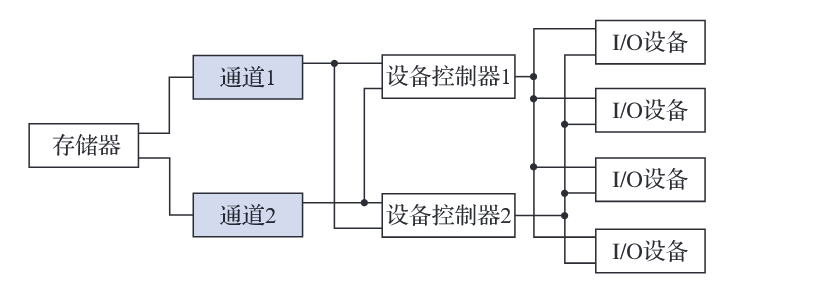

# 第三次作业

## 4.什么是通道?通道经常采用图7-35所示的交叉连接方式,为什么?



**通道**是计算机系统中用于连接主机（CPU和存储器）与I/O设备的一种专用硬件部件，负责管理和控制I/O操作，可以独立于CPU执行I/O指令，减轻CPU的负担，提高系统的并行处理能力，通常与设备控制器配合使用，设备控制器负责直接管理具体的I/O设备，而通道则负责协调多个设备控制器与主机之间的数据传输。

**通道采用交叉连接方式的原因**：

1. **提高可靠性**：交叉连接允许一个通道连接多个设备控制器，同时一个设备控制器也可以连接到多个通道。这种冗余设计在某个通道或设备控制器出现故障时，系统可以通过其他路径继续操作，增强了系统的容错能力。
2. **增加灵活性**：交叉连接使得I/O设备的分配更加灵活。系统可以根据负载情况动态分配通道和设备控制器，优化资源利用率。
3. **提升性能**：通过多条路径并行传输数据，可以减少瓶颈，提高I/O操作的吞吐量。
4. **负载均衡**：交叉连接允许系统在多个通道之间均衡分配I/O任务，避免单个通道过载，从而提升整体性能。

## 6.(考研真题)为什么要有设备驱动程序?用户进程是如何通过设备驱动程序来控制设备工作的?

**一**：设备驱动程序是操作系统内核的一部分，主要作用包括：

1. **硬件抽象**：不同厂商的硬件设备在操作方式、寄存器定义、通信协议等方面各不相同。驱动程序屏蔽了这些底层差异，向操作系统提供统一的接口（如文件I/O、网络协议栈等），使上层应用无需关心硬件细节。
2. **安全隔离**：用户进程不能直接访问硬件，必须通过内核态驱动程序间接控制设备。
3. **功能扩展**：驱动程序可以增强硬件功能、修复硬件缺陷，或提供虚拟设备。
4. **资源管理**：驱动程序负责协调多个进程对设备的共享访问，避免冲突。

**二**：用户进程通过**系统调用（System Call）**访问设备，流程如下（以Linux为例）：

1. **用户进程发起请求**

   - 通过标准接口（如`open()`、`read()`、`ioctl()`）操作设备文件（如`/dev/sda`）。

     ```bash
     int fd = open("/dev/printer", O_WRONLY); // 打开设备文件
     write(fd, buffer, size);                // 写入数据到设备
     ```

2. **内核转发请求**

   - 操作系统将系统调用转换为对**设备驱动程序的调用**。
   - 驱动程序可能属于内核模块（如`printer.ko`），提供`file_operations`结构体（包含`read`、`write`等函数指针）。

3. **驱动程序与硬件交互**

   - **内存映射**：通过`ioremap()`访问设备的寄存器或内存（如GPU显存）。
   - **I/O端口操作**：使用`inb()`/`outb()`等指令与设备通信（如传统硬盘控制器）。
   - **DMA传输**：直接内存访问（DMA）让设备与内存高速交换数据，无需CPU参与（如网卡收包）。
   - **中断处理**：设备完成任务后触发中断，驱动程序在中断服务例程（ISR）中处理数据（如键盘输入）。

4. **返回结果**

   - 驱动程序将操作结果（成功/失败、数据等）返回给内核，内核再传递给用户进程。

## 12.(考研真题)在单缓冲区情况下,为什么系统对一块数据的处理时间为max(C,  T )+M ?

1. **阶段1：设备写入缓冲区（时间T）与CPU处理数据（时间C）并行**
   - 当设备将数据写入缓冲区时（耗时 **T**），CPU可以同时处理**上一块已存入缓冲区的数据**（耗时 **C**）。
   - 两者的操作是并行的，因此这一阶段的耗时取决于较慢的一方，即 **max(C, T)**。
2. **阶段2：缓冲区复制到用户内存（时间M）**
   - 数据从缓冲区复制到用户内存（耗时 **M**）必须**串行执行**，不能与设备写入或CPU处理重叠。
   - 原因：
     - 复制前需要确保设备已完成写入（依赖阶段1）。
     - 复制后CPU才能处理下一块数据（依赖阶段2）。

## 13.进程从外设读入并分析2个数据块的最短时间是多少?


## 15.(考研真题)读取一个4KB的扇区所需的平均时间约为多少?


## 17.分别用FCFS调度算法和SCAN调度算法完成上述请求,写出磁道访问顺序和每次磁头移动的距离,并计算平均移动磁道数。


## 18.试采用FCFS、SSTF和SCAN调度算法,分别计算磁头移动的磁道数。


## 19.请问:这样的高速设备使用的大概是什么样的I/O控制方式?请说出你的推断理由。

**方式**：高速外部存储设备通常使用**DMA控制方式**。

**原因**：DMA方式允许外设与内存直接进行数据传输，无需CPU逐字节干预，大大提高了数据传输效率，非常适合高速设备的大量数据传输需求。同时，DMA减少了CPU的等待时间和中断处理次数，能够更好地满足高速存储设备（如硬盘、高速DVD刻录机）对数据传输速率的要求。