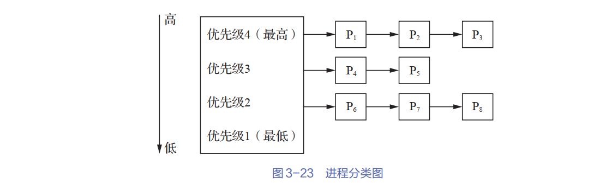

# 第二次作业

## 1．高级调度与低级调度的主要任务是什么？为什么要引入中级调度？  

1. **高级调度**：从外存（后备队列）中选择作业加载到内存，为其创建进程并分配资源（如CPU、内存）。
2. **低级调度**从就绪队列中选择一个进程，分配CPU资源使其执行。

中级调度主要解决以下问题：

1. **内存资源紧张时的负载均衡**：当系统内存不足时，将暂时不运行的进程挂起（换出到外存），腾出内存空间供其他进程使用；当内存空闲或进程需要运行时再换入。
2. **提高多道程序并发度**：通过动态调整内存中的进程数量，平衡系统吞吐量和响应速度。
3. **适应混合负载场景**：例如，在交互式任务突增时，可临时换出部分后台计算任务，确保前台响应性。

## 5．试说明低级调度的主要功能。  

1. **进程选择**：按照某种调度算法（如先来先服务FCFS、短作业优先SJF、时间片轮转RR、优先级调度等）从就绪队列中选择一个进程，将其分配给CPU执行。
2. **上下文切换：在进程切换时，保存当前运行进程的上下文（如寄存器状态、程序计数器等），并恢复新进程的上下文，确保进程能正确继续执行。
3. **CPU分配与回收**：将CPU控制权分配给选中的进程，并在进程执行完毕、时间片用完或发生阻塞（如I/O请求）时回收CPU资源，重新调度。
4. **确保公平性与响应性**：在多任务系统中，通过合理的调度策略平衡不同进程的CPU使用时间，避免某些进程长时间占用CPU（如时间片轮转调度）。
5. **处理进程状态转换**：根据调度结果，更新进程状态（如从就绪态 → 运行态，或从运行态 → 阻塞态/就绪态）。
6. **支持多道程序设计**：通过快速切换多个进程，提高CPU利用率，使多个程序看似“同时”执行（并发）。

## 6． 简述引起进程调度的原因。

**1. 进程主动放弃CPU（自愿调度）**

- 正常终止：进程执行完毕，释放CPU。
- 异常终止：进程因错误（如除零、非法指令）被终止。
- 主动阻塞：进程因等待I/O、信号量、消息等资源，自行进入阻塞状态（如 `read()` 系统调用）。

**2. 进程被动剥夺CPU（强制调度）**

- 时间片用完（分时系统）：进程用完分配的时间片（如Linux的CFS调度器），被迫让出CPU。
- 更高优先级进程就绪（抢占式调度）：如实时系统中高优先级进程抢占当前进程。
- 系统资源紧张：内存不足时，中级调度可能挂起当前进程以换出内存。

**3. 外部事件触发**

- 中断处理：硬件中断（如时钟中断、I/O完成中断）导致当前进程暂停，CPU转去执行中断服务程序（ISR），之后可能调度新进程。
- 系统调用返回：某些系统调用（如 `yield()`）会主动触发调度。

**4. 进程状态变化**

- 阻塞 → 就绪：等待的资源可用（如I/O完成），进程重新就绪，可能因优先级被调度。
- 新进程创建：高级调度加载新作业到内存，可能抢占当前进程。

## 7．在抢占式调度算法中，抢占的原则是什么？ 

1.  **优先级原则**：高优先级进程可抢占低优先级进程，如果一个更高优先级的进程进入就绪队列（如实时任务），调度器会立即抢占当前运行的进程，让高优先级任务先执行。
2. **时间片原则**：时间片用尽时强制切换，在轮转调度中，每个进程分配固定的时间片（如10ms），时间片结束后，即使进程未执行完，也会被抢占并放回就绪队列末尾。
3. **短作业优先抢占**：剩余执行时间更短的进程可抢占，如果一个新到达的进程的剩余执行时间比当前进程更短，调度器会抢占当前进程，优先执行更短的作业。
4.  **外部事件触发**：I/O完成或中断发生，当进程等待的I/O操作完成，或发生硬件中断（如时钟中断），调度器可能决定让更合适的进程运行。

## 12．为什么说多级反馈队列调度算法能较好地满足各方面用户的需求？

多级反馈队列调度算法能较好满足各方面用户需求原因有下：

**1. 适应不同任务类型**

- **交互式进程**：通常较短且需要快速响应，MLFQ通过高优先级队列和较短时间片确保它们被快速执行。
- **CPU密集型进程**：运行时间较长，MLFQ会逐渐降低其优先级，但仍保证它们最终能执行（防止饥饿）。
- **实时任务**：可通过调整优先级使其获得足够的CPU时间。

**2. 动态优先级调整**

- **短任务优先**：新到达的进程默认进入高优先级队列，若快速完成则直接退出，减少平均等待时间。
- **长任务降级**：如果一个进程用完时间片仍未结束，说明它可能是CPU密集型任务，MLFQ会降低其优先级，避免占用太多CPU资源。
- **I/O密集型任务优待**：若进程频繁放弃CPU（如等待I/O），MLFQ会保持或提高其优先级，确保交互式任务快速响应。

**3. 防止饥饿**

- **优先级老化**：长时间未运行的进程会被逐步提升优先级，防止低优先级进程永远得不到执行。
- **周期性地重置优先级**：某些MLFQ实现会定期将所有进程移到最高优先级队列，避免长任务被“饿死”。

## 14.按照调度方式可将实时调度算法分为哪几种？  

1. **抢占式调度**：高优先级任务可随时中断低优先级任务执行（如EDF算法）。
2. **非抢占式调度**：任务一旦运行就必须执行完毕或主动放弃CPU（如协作式调度）。
3. **混合式调度**：在关键时间点允许抢占，其余时间保持非抢占（如TDMA调度）。

## 17.什么是死锁？产生死锁的原因和必要条件是什么？如何预防死锁？  

**1.定义**：多个进程因竞争资源而相互等待，导致所有进程都无法继续执行的状态。

**2.死锁的常见原因**

1. **资源竞争**：多个进程争夺有限的不可共享资源（如打印机、内存）。
2. **进程推进顺序不当**：请求资源的顺序不合理，导致循环等待。
3. **系统资源不足**：资源数量无法满足并发进程的需求。

**3.产生死锁的四个必要条件**（必须同时满足）：

1. **互斥条件**：资源一次只能被一个进程占用，其他进程必须等待。
2. **占有并等待**：进程持有至少一个资源，同时等待获取其他被占用的资源。
3. **非抢占条件**：已分配给进程的资源不能被强制剥夺，只能由进程主动释放。
4. **循环等待**：存在一个进程等待环路，如 P1 等 P2 的资源，P2 等 P3 的资源，P3 等 P1 的资源。

**4.死锁的预防方法**（破坏四个必要条件之一即可）

1. **破坏互斥条件**：允许资源共享（如只读文件），但某些资源（如打印机）无法共享。
2. **破坏占有并等待**：要求进程一次性申请所有所需资源（静态分配），或运行时无资源时才释放已占用资源。
3. **破坏非抢占条件**：允许系统强制回收资源（如优先级更高的进程可抢占资源）。
4. **破坏循环等待**：强制进程按固定顺序申请资源（如所有进程必须先申请资源A，再申请资源B）。

## 19．有５个进程（见表3-2）需要调度执行，若采用非抢占式优先级（短进程优先）调度算法，问这5个进程的平均周转时间是多少？  

| 进程   | 到达时间 | 完成时间 | 周转时间 |
| :----- | :------- | :------- | :------- |
| P1*P*1 | 0.0      | 9.0      | 9.0      |
| P2*P*2 | 0.4      | 16.0     | 15.6     |
| P3*P*3 | 1.0      | 10.0     | 9.0      |
| P4*P*4 | 5.5      | 20.0     | 14.5     |
| P5*P*5 | 7.0      | 12.0     | 5.0      |

平均周转时间 = 9.0+15.6+9.0+14.5+5.05=53.15=**10.62**

## 20.（考研真题） 假定要在一台处理机上执行表3-3所示的作业，且假定这些作业在时刻0以1, 2, 3, 4, 5的顺序到达。请说明分别采用FCFS、 RR（时间片为1）、 SJF及非抢占式优先级调度算法时，这些作业的执行情况（优先级的高低顺序依次为1到5）。针对上述每种调度算法，给出平均周转时间和平均带权周转时间。

### **1. FCFS**

- **调度顺序**：1 → 2 → 3 → 4 → 5
- **执行时间线**：
  - 作业1：0-10
  - 作业2：10-11
  - 作业3：11-13
  - 作业4：13-14
  - 作业5：14-19

| 作业 | 到达时间 | 完成时间 | 周转时间 | 带权周转时间（周转时间/执行时间） |
| :--- | :------- | :------- | :------- | :-------------------------------- |
| 1    | 0        | 10       | 10       | 1.0                               |
| 2    | 0        | 11       | 11       | 11.0                              |
| 3    | 0        | 13       | 13       | 6.5                               |
| 4    | 0        | 14       | 14       | 14.0                              |
| 5    | 0        | 19       | 19       | 3.8                               |

**平均周转时间** （10+11+13+14+19）/5=13.4
**平均带权周转时间**=（1.0+11.0+6.5+14.0+3.8​）/5=7.26

### **2. RR, 时间片=1**

- **调度顺序**：1→2→3→4→5→1→3→5→1→5→1→5→1→1→1→1→1
- **执行时间线**：
  - 作业1：分段执行（0-1, 5-6, 8-9, 11-12, 14-15, 16-17, 18-19）→ 总时间10
  - 作业2：1-2
  - 作业3：2-3, 6-7
  - 作业4：3-4
  - 作业5：4-5, 7-8, 9-10, 12-13, 15-16

| 作业 | 完成时间 | 周转时间 | 带权周转时间 |
| :--- | :------- | :------- | :----------- |
| 1    | 19       | 19       | 1.9          |
| 2    | 2        | 2        | 2.0          |
| 3    | 7        | 7        | 3.5          |
| 4    | 4        | 4        | 4.0          |
| 5    | 16       | 16       | 3.2          |

**平均周转时间** =（19+2+7+4+16）/5=9.6
**平均带权周转时间** =（1.9+2.0+3.5+4.0+3.2）/5=2.92

### **3. SJF**

- **调度顺序**：短作业优先（非抢占式）
  - 时刻0：选择最短作业2（执行时间1）→ 2
  - 时刻1：剩余作业中选最短作业4（执行时间1）→ 4
  - 时刻2：选作业3（执行时间2）→ 3
  - 时刻4：选作业5（执行时间5）→ 5
  - 时刻9：最后运行作业1（执行时间10）→ 1

| 作业 | 完成时间 | 周转时间 | 带权周转时间 |
| :--- | :------- | :------- | :----------- |
| 1    | 19       | 19       | 1.9          |
| 2    | 1        | 1        | 1.0          |
| 3    | 4        | 4        | 2.0          |
| 4    | 2        | 2        | 2.0          |
| 5    | 9        | 9        | 1.8          |

**平均周转时间** = （19+1+4+2+9）/5=7.0
**平均带权周转时间** = （1.9+1.0+2.0+2.0+1.8）/5=1.74

### **4. 非抢占式优先级调度**

- **调度顺序**：按优先级从高到低（1最高）
  - 优先级1：作业2 → 运行（0-1）
  - 优先级2：作业5 → 运行（1-6）
  - 优先级3：作业1和3 → 选先到达的作业1（6-16）
  - 优先级3：作业3 → 运行（16-18）
  - 优先级4：作业4 → 运行（18-19）

| 作业 | 完成时间 | 周转时间 | 带权周转时间 |
| :--- | :------- | :------- | :----------- |
| 1    | 16       | 16       | 1.6          |
| 2    | 1        | 1        | 1.0          |
| 3    | 18       | 18       | 9.0          |
| 4    | 19       | 19       | 19.0         |
| 5    | 6        | 6        | 1.2          |

**平均周转时间** = （16+1+18+19+6）/5=12.0
**平均带权周转时间** =（1.6+1.0+9.0+19.0+1.2）/5=6.36

## 21． （考研真题） 将一组进程分为4类，如图3-23所示。各类进程之间采用优先级调度算法，而各类进程的内部采用RR调度算法。请简述P1, P2, P3, P4, P5, P6, P7, P8进程的调度过程。  

首先运行最高优先级队列（P₁、P₂、P₃），按RR轮流执行，每个进程分配固定时间片，完成后才进入次高优先级队列（P₄、P₅），最后调度最低优先级队列（P₆、P₇、P₈）。

## 23．请按“并发性”从大到小对上述3种方法进行排序。

**银行家算法允许最大并发性**

- **原理**：动态检查资源分配状态，仅当请求资源后系统仍处于安全状态时才分配。
- **并发性**：允许进程**动态申请资源**，只要不导致死锁即可，因此资源利用率高，并发度最大。

**最终排序**：银行家算法 > 检测死锁并终止 > 资源预分配

## 24． 请设计一个能够避免死锁的方法。

##### **全局固定顺序加锁**

- **规则**：为所有账户分配唯一ID，转账时必须按ID从小到大的顺序加锁。
- **示例**：
  - 若转账涉及账户X（ID=100）和Y（ID=200），必须先锁X，再锁Y。
  - 反向转账（Y→X）同样需先锁X，再锁Y。

## 25． 并解释和说明发生死锁的原因与必要条件。  

1. **是否会发生死锁？**会发生死锁。
2. **死锁原因**：P₁和P₂的**交叉申请资源顺序**导致循环等待。
3. **死锁必要条件**：

| 必要条件       | 是否满足 | 说明                                                       |
| :------------- | :------- | :--------------------------------------------------------- |
| **互斥条件**   | ✔        | R₁和R₂一次只能被一个进程占用（如P₁占R₁时，P₂无法访问）。   |
| **占有并等待** | ✔        | P₁占用R₁后等待R₂，P₂占用R₂后等待R₁。                       |
| **非抢占条件** | ✔        | 已分配给P₁的R₁和P₂的R₂不能被强制剥夺，只能由进程主动释放。 |
| **循环等待**   | ✔        | P₁等P₂释放R₂，P₂等P₁释放R₁，形成环路。                     |

## 1．什么是临界资源？什么是临界区？

**临界资源**：一次仅允许一个进程访问的共享资源（如打印机、共享变量等），若并发访问可能导致数据不一致或系统错误。

**临界区**：进程中访问临界资源的代码段，必须通过同步机制（如锁、信号量）保证互斥执行，防止多个进程同时进入。

## 2．同步机制应遵循的准则有哪些？  

1. **空闲让进**：当临界区空闲时，应允许一个请求进入的进程立即进入。
2. **忙则等待**：当临界区已被占用时，其他试图进入的进程必须等待。
3. **有限等待**：进程在请求进入临界区后，应在有限时间内获得许可，避免无限期等待。
4. **让权等待**：当进程无法进入临界区时，应立即释放CPU，避免忙等（Busy Waiting）

## 8． （考研真题） 如果用于进程同步的信号量的P、 V操作不用原语实现，则会产生什么后果？举例说明。  

**1. 竞态条件**

- **原因**：多个进程同时执行非原子化的P/V操作时，可能交叉访问信号量内部变量（如计数器`value`），引发数据不一致。
- **示例**：
  - 假设信号量 `S=1`（表示资源可用），进程P1和P2同时执行 `P(S)`：
    1. P1读取 `S=1`，准备执行 `S--` 前被中断；
    2. P2也读取 `S=1`，执行 `S--` 并将 `S` 改为 `0`；
    3. P1恢复后继续执行 `S--`，将 `S` 改为 `-1`。
  - **结果**：两个进程均通过 `P(S)`，导致多个进程同时进入临界区，违反互斥原则。

**2. 信号量计数器错误**

- **原因**：非原子化的 `V(S)` 可能导致信号量计数器错误递增。
- **示例**：
  - 初始 `S=0`（资源不可用），进程P1和P2同时执行 `V(S)`：
    1. P1读取 `S=0`，准备执行 `S++` 前被中断；
    2. P2也读取 `S=0`，执行 `S++` 并将 `S` 改为 `1`；
    3. P1恢复后继续执行 `S++`，将 `S` 改为 `2`。
  - **结果**：实际只释放了1个资源，但计数器显示 `S=2`，可能引发后续进程错误唤醒。

**3. 死锁或饥饿**

- **原因**：非原子操作可能导致进程永远阻塞。
- **示例**：
  - 进程P1执行 `P(S)` 时被中断，未完成操作；
  - 其他进程因 `S` 状态未更新而错误判断资源可用性，导致无限等待。

## 16． 请用信号量机制实现这 3 个进程的同步与互斥活动，并说明所定义的信号量的含义。要求用伪代码描述。  

~~~python
semaphore mutex = 1;    // 互斥访问缓冲区
semaphore empty = N;    // 缓冲区空单元数量（初始N个）
semaphore odd = 0;      // 缓冲区中奇数数量（初始0）
semaphore even = 0;     // 缓冲区中偶数数量（初始0）

cobegin {
    // 生产者进程
    process P1 {
        while True:
            num = produce();
            P(empty);
            P(mutex);
            put(num);
            if num % 2 == 1:
                V(odd);
            else:
                V(even);
            V(mutex);
    }

    // 奇数消费者进程
    process P2 {
        while True:
            P(odd);
            P(mutex);
            num = getodd();
            countodd();
            V(empty);
            V(mutex);
    }

    // 偶数消费者进程
    process P3 {
        while True:
            P(even);
            P(mutex);
            num = geteven();
            counteven();
            V(empty);
            V(mutex);
    }
} coend;
~~~

## 17． 要求写出完整的过程，说明信号量的含义并赋初值。  

**完整过程**：

~~~python
semaphore mutex = 1;        // 互斥使用取号机（每次仅1位顾客操作）
semaphore empty_seats = 10;  // 空座位数量（初始10个）
semaphore customers = 0;     // 等待服务的顾客数（初始0）
semaphore service = 0;       // 营业员叫号信号（初始无顾客）

cobegin {
    // 顾客进程
    process 顾客_i {
        P(empty_seats);
        P(mutex);
        从取号机上获得一个号码;
        V(mutex);
        V(customers);
        P(service);
        获得服务;
        V(empty_seats);
    }

    // 营业员进程
    process 营业员 {
        while (TRUE) {
            P(customers);
            V(service);
            为顾客服务;
        }
    }
} coend;
~~~

