# 1.评价类模型

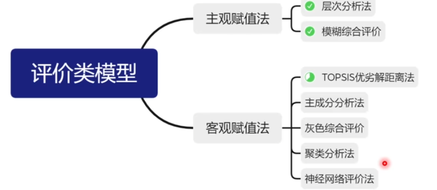

## 1.1层次分析法

用于解决评价类问题，例如师徒四人前往某地开演唱会，有四个评价指标，以及三个候选地，选择一个合适的地方

- 画出层级结构图（目标层，准则层，方案层）

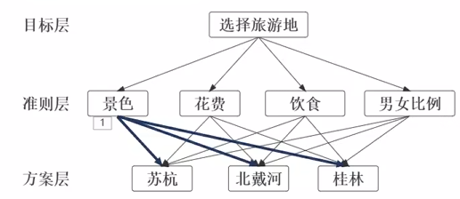

- 构造判断矩阵

对于每个**指标**来说构造一个矩阵，然后打分，注意是否是**一致性**矩阵（每一列是否等比例）

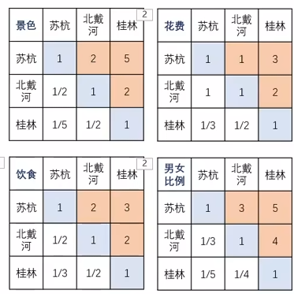

**一致性矩阵**：可以直接归一化作为权重值

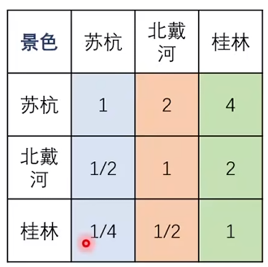

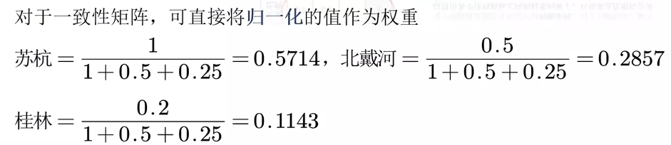

**非一致性矩阵**：采用求算数平均值求权重，每一列求一组，然后求平均值

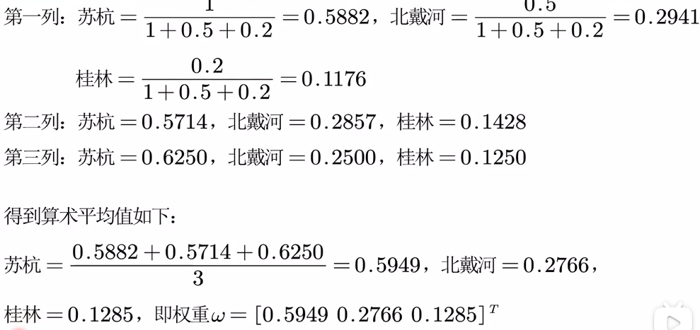

- 依照评价标准对各个方案进行打分

对于每个评价标准也需要构造矩阵，然后打分

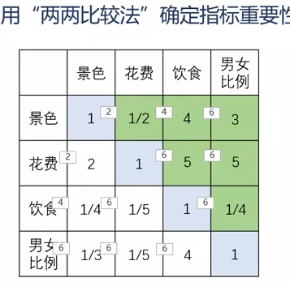

- 求出权重，填表，最后打分

将计算结果填入表格，然后总体打分

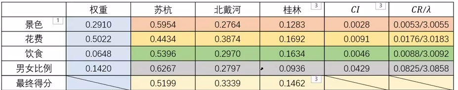

其中CI是一致性指标，CR是一致性比例，RI可以通过查表得到

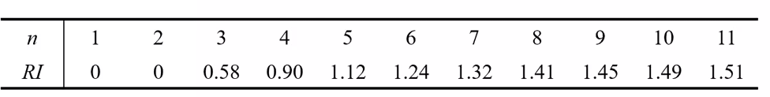
$$
( CI = \frac{\lambda_{\text{max}} - n}{n - 1} )
( CR = \frac{CI}{RI} \left\{
\begin{array}{ll}
< 0.1, & \text{判断矩阵一致} \\
\geq 0.1, & \text{判断矩阵不一致}
\end{array}
\right. )
$$

- 层次总排序一致性检验（**在求具体权重之前先进行检验！！！**）

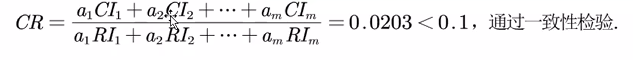

## 1.2模糊综合评价

 模糊集合用于形容**高矮胖瘦**这种模糊问题，没有具体划分，不具有传统集合的互异性

模糊综合评级就是把一些不易定量的因素定量化

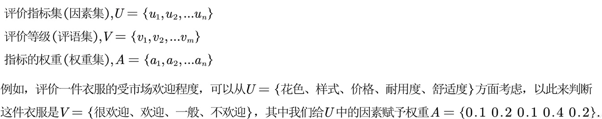

确定隶属函数的方法

1. 模糊统计法：发放问卷统计调查，（m个好隶属度就是m/n）
2. F分布确定隶属函数：先看问题大体服从什么分布，然后查询分布函数确定隶属函数（具体数据自己推测）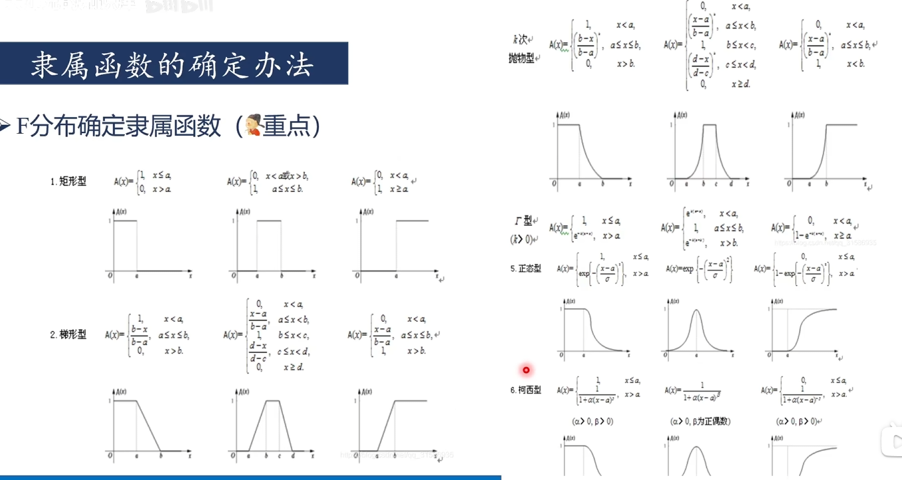

- **一级模糊评价**

评语带有评价色彩，例如好，坏，差等 

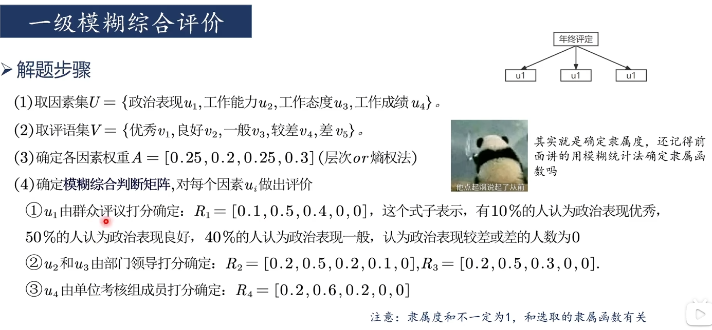

将Ri拼接起来得到判断矩阵R，最后进行模糊综合评价，需要与权重向量相乘，取**数值最大评语**作为结果

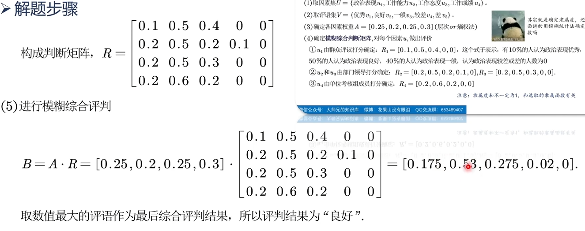

评语不带模糊色彩，例如对优劣进行排序

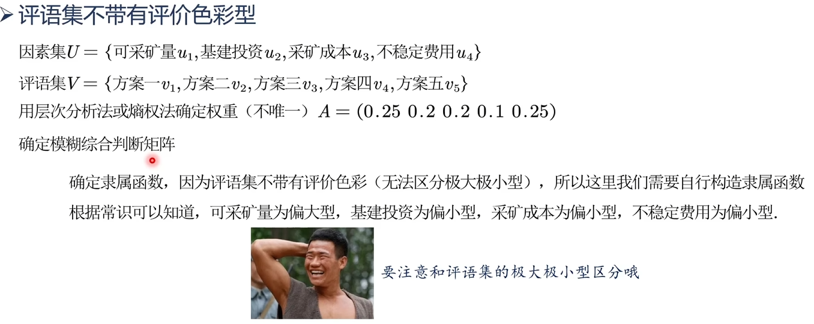

这里需要自姓构造隶属函数，基本按照下述构造

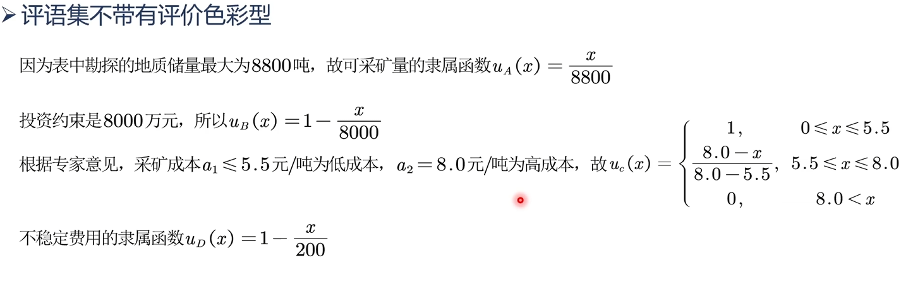

- **多级模糊综合评价**

就是对二级指标先进行模糊评价，然后再拼接所有的矩阵获得一级矩阵，再对一级矩阵进行模糊评级

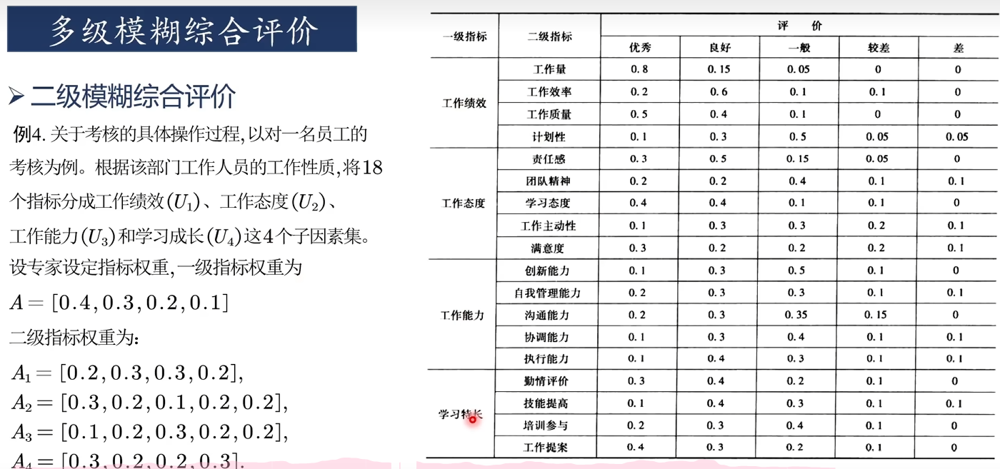

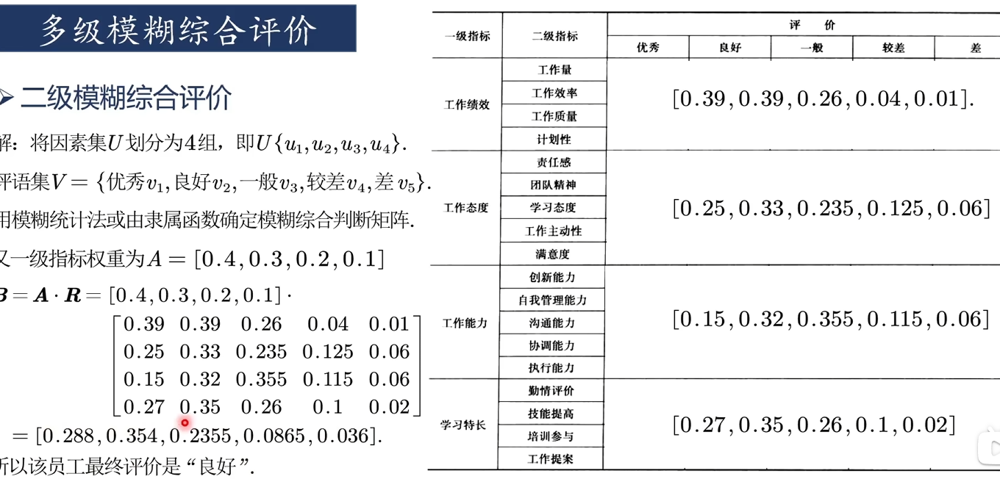

## 1.3熵权法

根据数据获取权重大小，适合自身不知道具体权重的情况

- **正向化处理**，目的是把所有数据转换成极大型

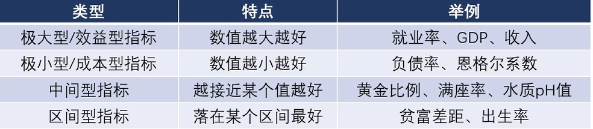

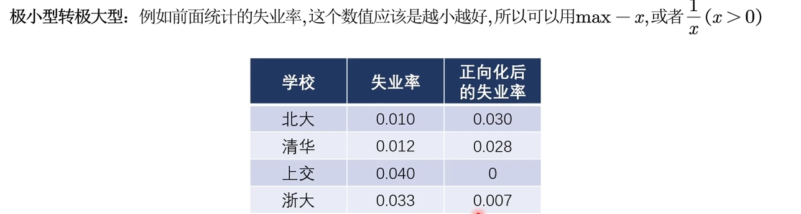

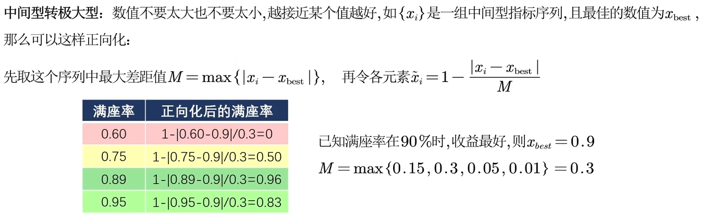

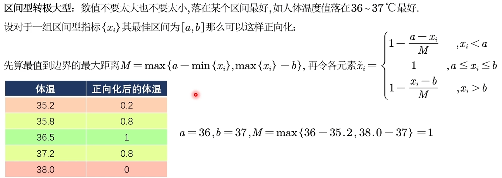

- **标准化处理**

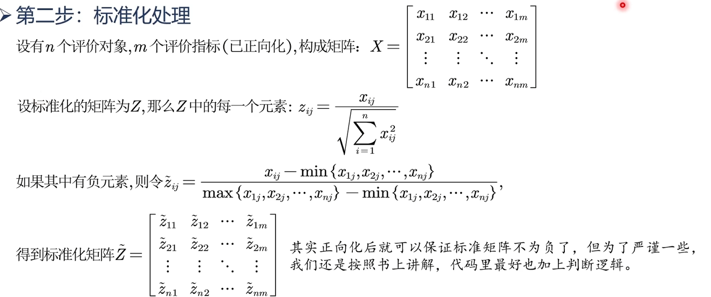

- **计算信息熵和熵权**

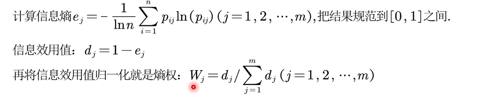

## 1.4 优劣解距离法-TOPSIS

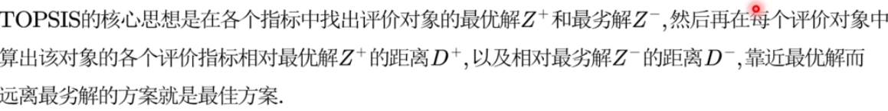

- 指标**正向化**，与熵权法类似
- **标准化**得到标准化矩阵
- 用**优劣解**打分

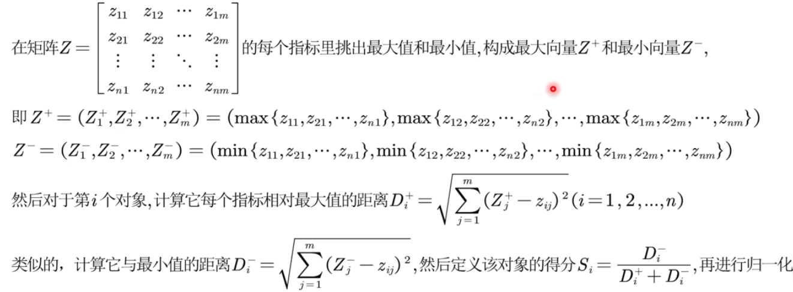

- 考虑到不同指标有不同权重，可以用熵权法获得权重

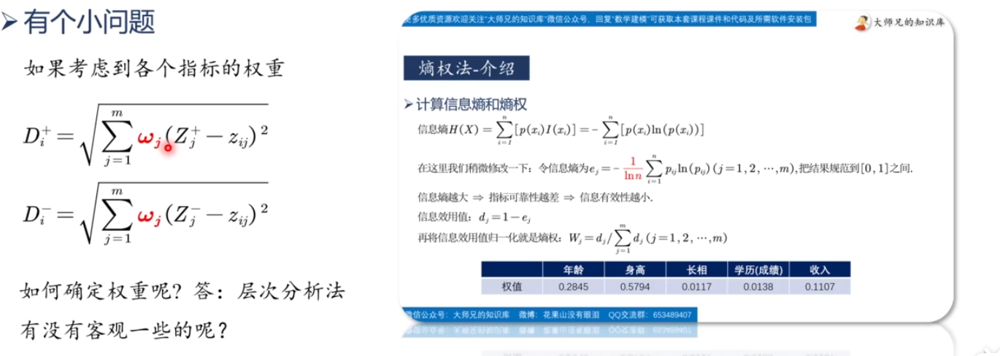

## 1.5灰色关联分析

 灰色关联分析是用来确定一个系统中哪些因素是**主要因素**，哪些是**次要因素**，从而强化推动因素，抑制阻碍因素。

原理类似于观察序列曲线的**几何形状**联系是否紧密，曲线越**接近**，序列关联度越**大**

- 数据预处理：正向化，标准化
- 确定母序列和子序列
- 将母序列与子序列两两相减，计算**两级最小差**和**两级最大差**
- 对每个元素计算**灰色关联系数**，$\rho$取0.5

$$
\gamma(x_0(k), x_i(k)) = \frac{a + \rho b}{|x_0(k) - x_i(k)| + \rho b}
$$

- 将各指标的灰色关联系数求平均值作为**灰色关联度**
- 根据灰色关联度大小得到结论

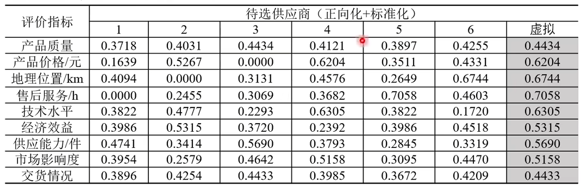

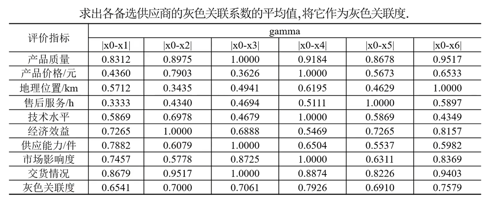