# 1.评价类模型

## 1.1层次分析法

用于解决评价类问题，例如师徒四人前往某地开演唱会，有四个评价指标，以及三个候选地，选择一个合适的地方

- 画出层级结构图（目标层，准则层，方案层）

- 构造判断矩阵

对于每个**指标**来说构造一个矩阵，然后打分，注意是否是**一致性**矩阵（每一列是否等比例）

**一致性矩阵**：可以直接归一化作为权重值

**非一致性矩阵**：采用求算数平均值求权重，每一列求一组，然后求平均值

- 依照评价标准对各个方案进行打分

对于每个评价标准也需要构造矩阵，然后打分

- 求出权重，填表，最后打分

将计算结果填入表格，然后总体打分

其中CI是一致性指标，CR是一致性比例，RI可以通过查表得到

$$
( CI = \frac{\lambda_{\text{max}} - n}{n - 1} )
( CR = \frac{CI}{RI} \left\{
\begin{array}{ll}
< 0.1, & \text{判断矩阵一致} \\
\geq 0.1, & \text{判断矩阵不一致}
\end{array}
\right. )
$$

- 层次总排序一致性检验（**在求具体权重之前先进行检验！！！**）

## 1.2模糊综合评价

 模糊集合用于形容**高矮胖瘦**这种模糊问题，没有具体划分，不具有传统集合的互异性

模糊综合评级就是把一些不易定量的因素定量化

确定隶属函数的方法

1. 模糊统计法：发放问卷统计调查，（m个好隶属度就是m/n）
2. F分布确定隶属函数：先看问题大体服从什么分布，然后查询分布函数确定隶属函数（具体数据自己推测）

- **一级模糊评价**

评语带有评价色彩，例如好，坏，差等 

将Ri拼接起来得到判断矩阵R，最后进行模糊综合评价，需要与权重向量相乘，取**数值最大评语**作为结果

评语不带模糊色彩，例如对优劣进行排序

这里需要自姓构造隶属函数，基本按照下述构造

- **多级模糊综合评价**

就是对二级指标先进行模糊评价，然后再拼接所有的矩阵获得一级矩阵，再对一级矩阵进行模糊评级

## 1.3熵权法

根据数据获取权重大小，适合自身不知道具体权重的情况

- **正向化处理**，目的是把所有数据转换成极大型

- **标准化处理**

- **计算信息熵和熵权**

## 1.4优劣解距离法-TOPSIS

- 指标**正向化**，与熵权法类似
- **标准化**得到标准化矩阵
- 用**优劣解**打分

- 考虑到不同指标有不同权重，可以用熵权法获得权重

## 1.5灰色关联分析

 灰色关联分析是用来确定一个系统中哪些因素是**主要因素**，哪些是**次要因素**，从而强化推动因素，抑制阻碍因素。

原理类似于观察序列曲线的**几何形状**联系是否紧密，曲线越**接近**，序列关联度越**大**

- 数据预处理：正向化，标准化
- 确定母序列和子序列
- 将母序列与子序列两两相减，计算**两级最小差**和**两级最大差**
- 对每个元素计算**灰色关联系数**，$\rho$取0.5

$$
\gamma(x_0(k), x_i(k)) = \frac{a + \rho b}{|x_0(k) - x_i(k)| + \rho b}
$$

- 将各指标的灰色关联系数求平均值作为**灰色关联度**
- 根据灰色关联度大小得到结论

# 2.规划问题

## 2.1线性规划

目标函数是**线性**的，存在若干个**线性约束条件**，要求找到约束内最合适的目标函数大小

使用拉格朗日乘法运算，Matlab有专门的函数运算，需要转换成标准型

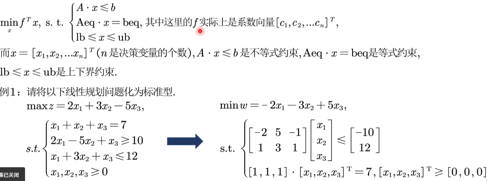

## 2.2整数规划

强制要求目标变量为整数，分为整数**线性**规划和整数**非线性**规划

- 整数线性规划

使用Matlab求解，只需加上一个新变量intcon=[1,2,3]

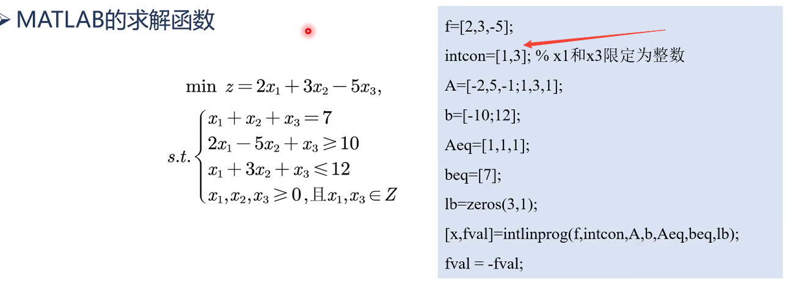

**PS**：特殊情况，0-1背包，0-1指派问题

**0-1背包问题**：单目标，有或无，在数学上表示为单下标

**0-1指派问题**：多目标，先选再干，两个过程在数学上表示为双下标

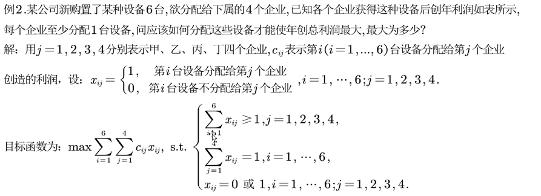

- 整数非线性规划

蒙特卡洛模拟，就是暴力求解方法，典型例题**蒲峰投针实验**

## 2.3非线性规划

仍使用Matlab求解，只是函数名和参数有所不同

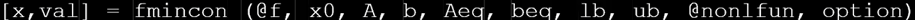

其中带有@的是外部函数，需要再统一目录下

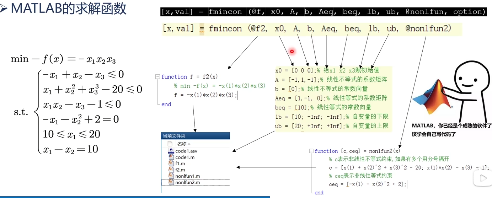

# 3.图论

- 最短路径->迪杰斯特拉算法
- 贝尔曼算法，弗洛伊德算法

Matlab求解函数：

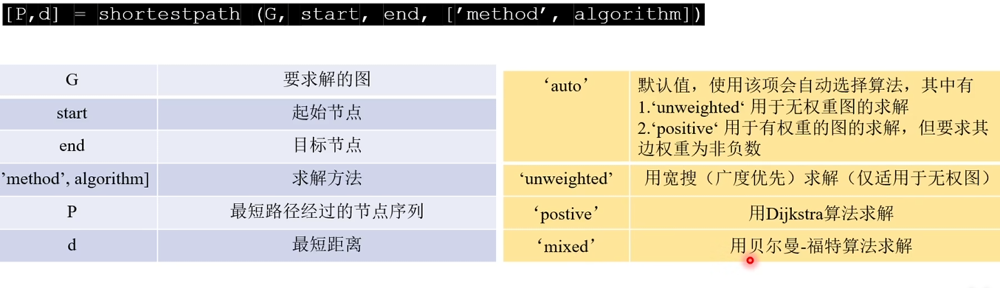

## 3.1网络最大流

**流量图**：将标注了**流量**和**容量**的图称为流量图

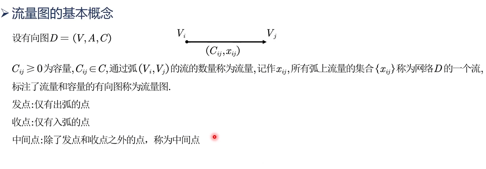

**可行流**：满足以下两个条件的流称为可行流

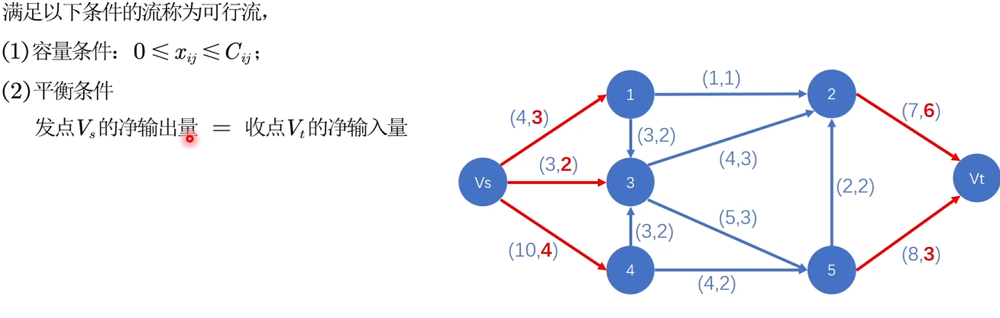

**增广链**：能使流增大的一条链，包括前向弧和反向弧

**最大流解法-Ford Fulkerson算法**

1. 初始化标号
2. 针对某一条弧开始标号，找到最大增加量与前驱节点相比找最小，然后填入前驱节点和变化量，到达目标节点后将流上所有节点的变化量取最小值然后增加到每条边上
3. 重复步骤2，知道没有标号为止

## 3.2最小费用最大流

1. 以费用为标准找到最短路径（迪杰斯特拉）
2. 找到最短路径上的增广链，没有记录的弧从零流开始，有记录的延续下来
3. 设置反向弧，能减少的画反向弧，不能减少的用反向弧代替正向弧

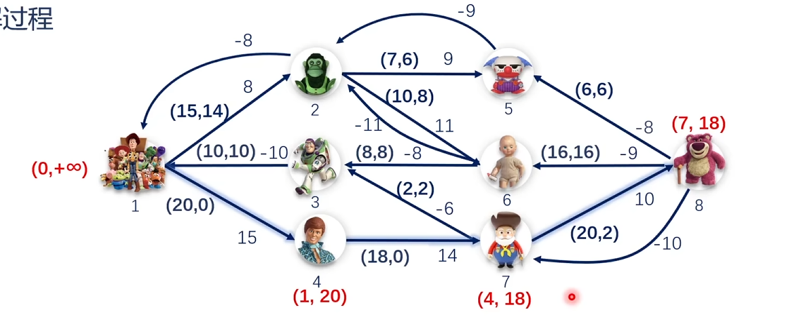

## 3.3TSP-旅行商

旅行商就是图中每个节点去且只去一次，然后要回到起点，使用改良圈算法

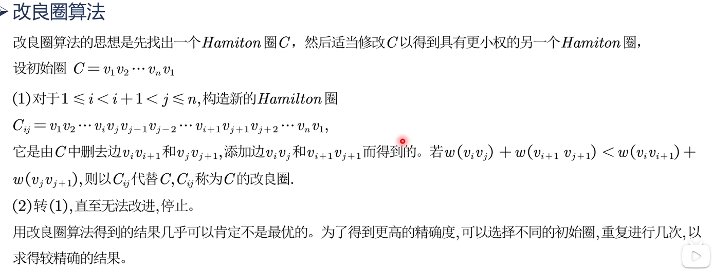

# 4.插值算法

根据已知点通过插值运算得到目标函数图像

常用算法：一维算法，二维算法，N维算法

- 一维算法

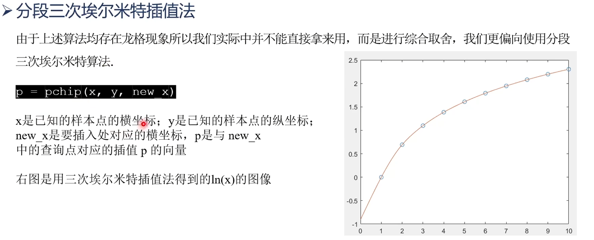

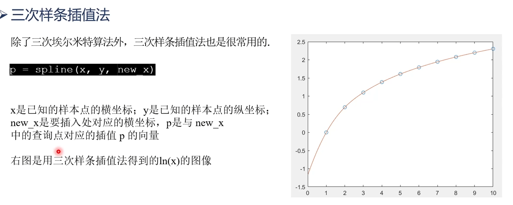

- 二维算法

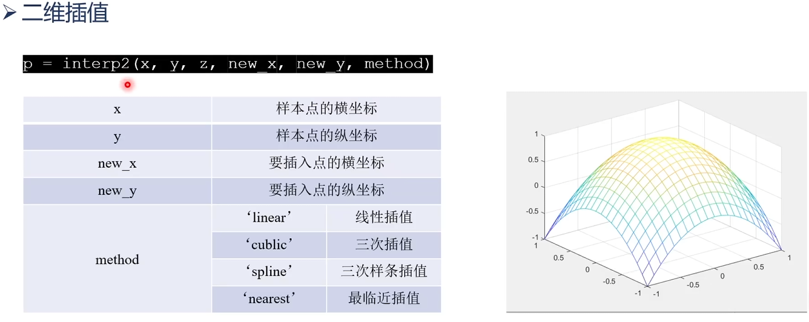

- N维算法

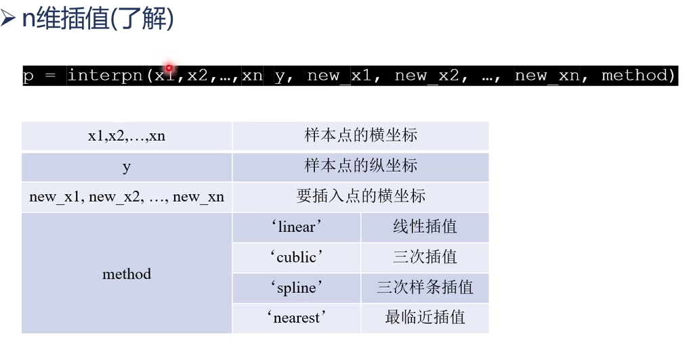

# 5.拟合算法

拟合算法不必将每个点都安置在图像上，而是尽可能拟合即可

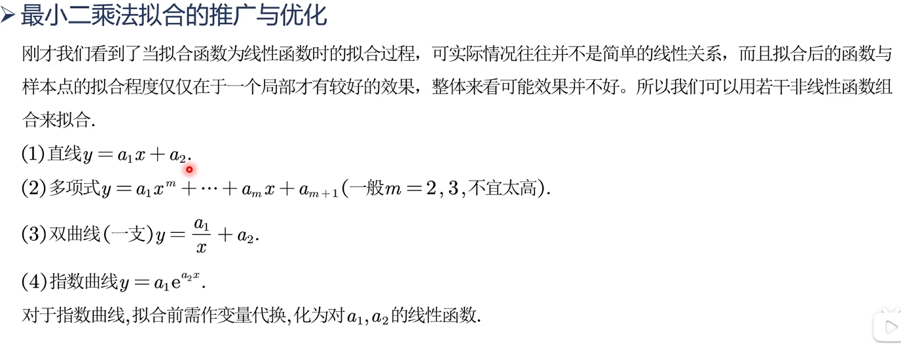

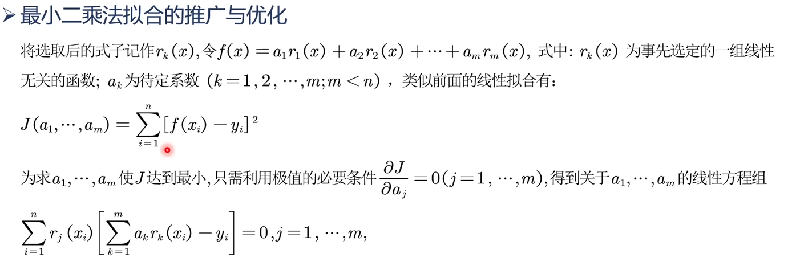

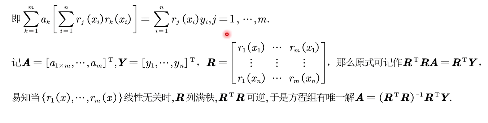

- 拟合优度

又称为拟合系数，只能用于拟合函数是**线性**，对于其他函数则是看SSE大小

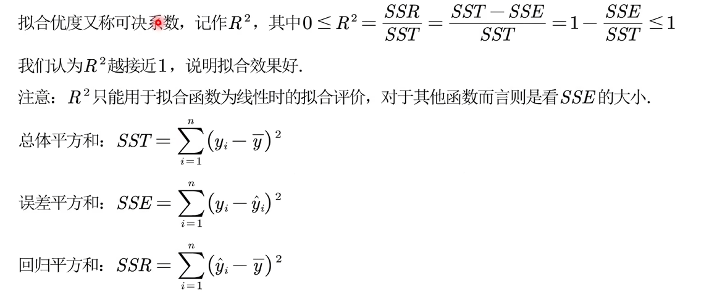
