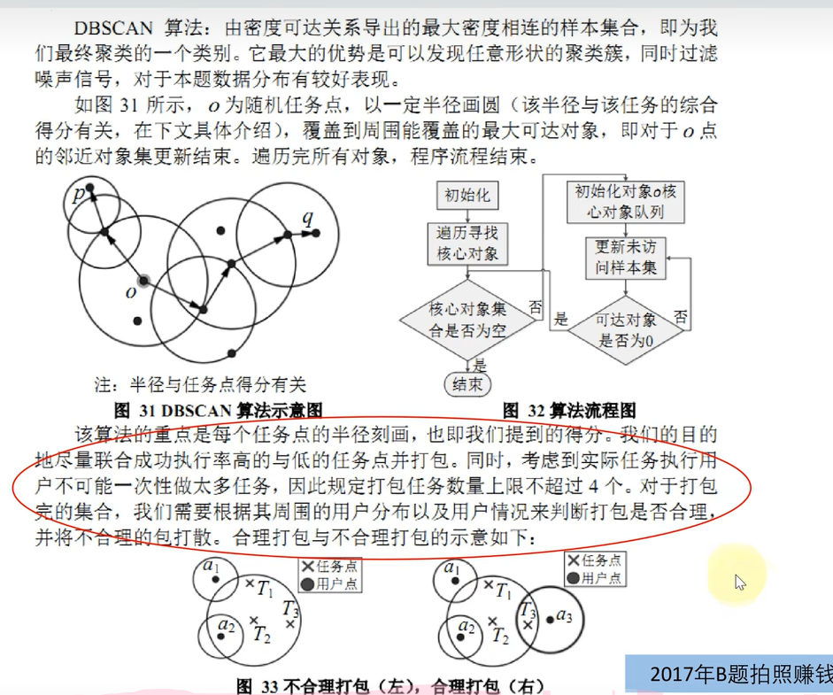
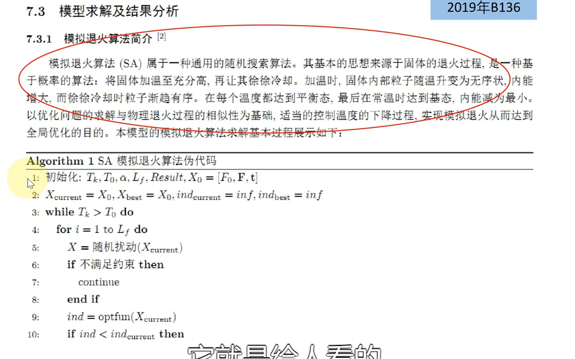
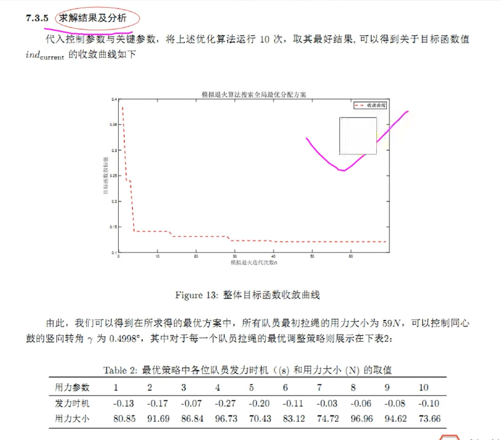

# 数学建模

## 1.标题

基于所使用的**主要模型**或者**方法**作为标题

**例如**：基于回归分析的长江水质预测与控制

## 2.摘要（超级重要！！！）

### 2.1三要素

1.解决什么问题

2.应用什么方法

3.得到什么结果

### 2.2写作特点

摘要需**充分概括**论文内容，文字必须简练；书写时要突出论文的**新见解，新方法**。

### 2.3三部分（1000字左右）

#### 2.3.1开头段

需要充分概括论文内容，一般两到三句话，三到五行即可。

第一句简单交代**题目背景**。（可选）

第二句交代**使用了什么模型，解决什么问题**（必须！！！）

第三句交代**实际意义**。（可选）

#### 2.3.2中间段

需要对每个问题分别进行叙述，一般包含**三要素**：解决什么问题；应用什么方法；得到什么结果

**1.解决什么问题**

不单独提出我们要解决什么问题，因为在后面的要素也会提出来

**2.应用什么方法**

写出求解思路，并说明应用的模型。**一定要紧扣题目本身**

**3.得到什么结果**

（1）需要计算出**数值答案**，例如物理题，规划优化类，预测类等

​	**直接回答该答案**（如果模型中有重要参数，可以做**灵敏度分析**；如果设计概率统计，可以加上**置信区间**；如果是预测类或者数值计算类，可以加上**误差分析**）

****

（2）**开放问题**。例如评价类，提建议类，设计方案策略类等

​	只需写出**主要结论**，在下结论一定要有**明确支持的观点**，不要模棱两可。如果有**数值描述**的结果更好。例如：采取某种建议后方案提高了多少。

​	此外，有时候问题的答案很长，这时只需要在摘要中说出**最主要的一部分结果**，然后加一句话来引导读者在正文中查看完整结果

#### 2.3.3结尾段

可以**总结全文**，也可以介绍**论文亮点**

#### 2.3.4反面废话

## 3.关键词

一般放**四到六**个，可以放论文中使用的**主要模型**；也可以方论文中出现**次数较多**，体现主要内容的词

## 4.问题重述

将原问题进行整理，将问题背景和题目分开陈述即可绝对**不可以抄原题**

（1）常规方法，删除，修改，替换

（2）进阶方法：丰富题目背景，结合自己的分析思路来重新描述问题

## 5.问题分析

**题目中信息与条件**，**利用信息和条件进行分析**，**确定用什么方法建立模型**，一般是每个问题单独分析一段，分析过程要简明扼要。建议在文字说明同时用**图形或图标**列思维过程（流程图）

一般占据正文不超过一页，问题较多不超过两页。

## 6.模型假设

**（1）如何保证合理性**

第一：可以引用别人的文献或者资料；第二：如果要对模型中的参数形式进行假设，可以在正文中使用实际数据进行绘图或者进行假设检验来支持你的假设。

**（2）设置的太强怎么办**

可以在论文后买你的模型评价与改进部分加上想法。

### 6.1题目明确给出假设情况

例如：假设玩家知道每天天气状况

### 6.2排除生活中小概率事件

例如：交通问题假设不存在地质灾难，交通事故；金融相关问题假设不存在经济危机，系统风险；生产制造问题假设不存在设备故障，生产事故。

### 6.3仅考虑问题核心，不考虑次要因素

例如：传染病问题课忽略性别，年龄；交通拥堵状况可只考虑机动车，不考虑非机动车和行人；考虑人口预测问题，课不考虑移民，大规模人口迁移等因素。

### 6.4使用模型中要求的假设

例如：使用博弈论模型可以假设参与博弈者都是“理性人”；使用回归模型可以假设扰动项服从独立的正态分布。

### 6.5对模型中的参数形式（或者分布）进行假设

例如：假设人口增长服从阻滞增长模型；假设不考虑环境变动时，某鱼群的自然死亡率服从指数分布；假设单位时间内排队的人数服从泊松分布。（如果能在论文中**用数据验证假设**更好）

### 6.6和题目联系很紧密的假设

结合题目条件进行挖掘。为了简化模型

## 7.符号说明

第一，不要把所有的变量都放在表里，临时变量可以不放。第二，下文中首次出现这些变量时也要解释。（**三线表**）

## 8.模型建立与求解

**模型建立**：使用别人已经建好的模型；对已有模型进行优化；运用多个模型

**模型求解**：使用计算软件解决；结果要规范醒目。

### 8.1模型建立

**优化类问题（目标函数+约束条件）**

**使用已经建好的模型（紧密联系问题）**

### 8.2模型求解

1.优化类问题如果用到启发式算法求解，一定要简明写算法步骤，并要结合具体问题来阐明计算思路。

2.求解的结果应该在论文中突出展示出来，数值计算直接贴上；如果是开放类问题的话，一定要对结果进行阐明和解释，如果能加上美观整洁的图标就更好了。

## 9.模型分析与检验（加分项）

### 9.1模型分析

**1.灵敏度分析**：研究一个系统的状态对**系统参数**或**周围环境变化**的敏感程度的方法。

其通用步骤是（**控制变量法**）：控制其他参数**不变**的情况下，改变模型中某个**重要参数**的值，然后观察和模型结果的变化情况

**2.误差分析**：分析模型中误差的来源，或者估算模型中存在的误差，一般用于**预测问题**或者**数值计算类问题**

### 9.2模型检验

1.**使用模型之前**应该进行的检验，例如层次分析法中的一致性检验，灰色预测中的准指数规律检验，这部分应该放在**模型的建立部分**。

2.**稳定性检验（最常见）**：类似灵敏度分析

## 10.模型的评价，改进与推广

**注：**本部分内容需根据论文内容进行调整，例如：如果没有写论文推广，就直接把标题改为**模型的评价与改进**，也可以直接改成“**模型评价**”。

### 10.1模型的评价（必写！！！）

写模型的优缺点

### 10.2模型的改进

主要是针对模型中缺点有哪些可以改进的地方

### 10.3模型的推广

将原题的要求进行扩展，进一步讨论模型的实用性和可行性

## 11.参考文献

**1.引用内容需要在正文标注**

**2.不要引用别人的博客**

**3.不能引用前辈文献！！！**

## 12.附录

### 12.1支撑材料的文件列表

### 12.2源程序代码

Excel，Spss等软件的交互命令以及各类编程语言的代码。