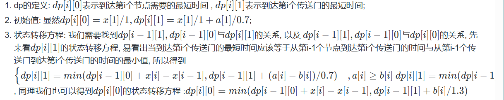
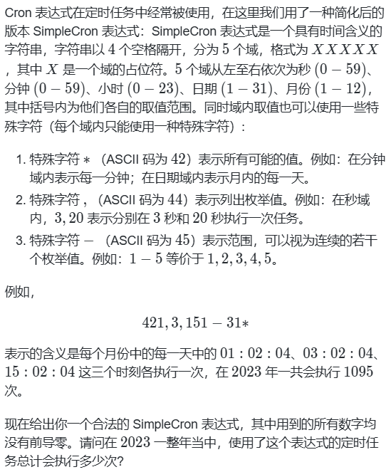
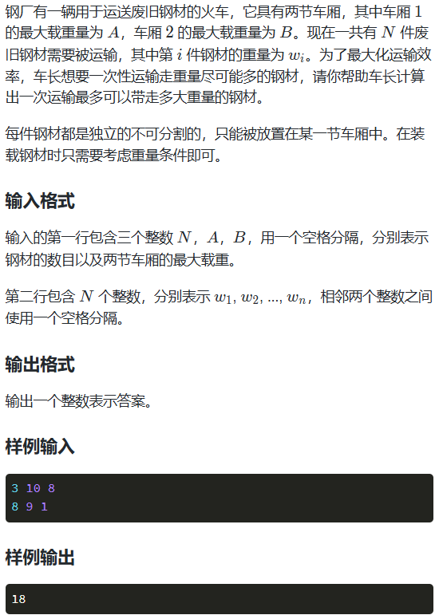
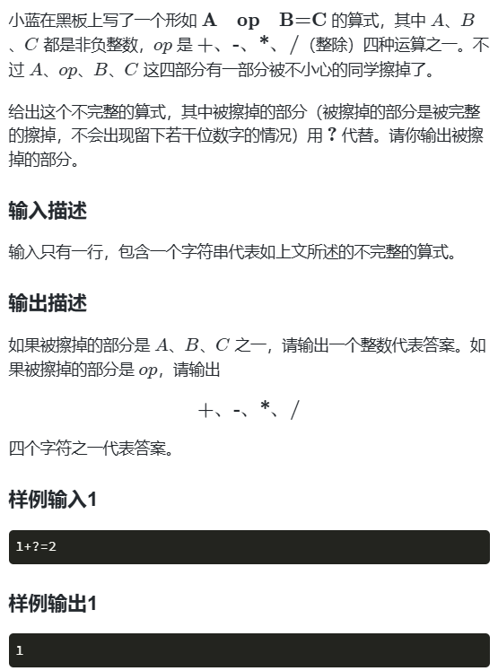
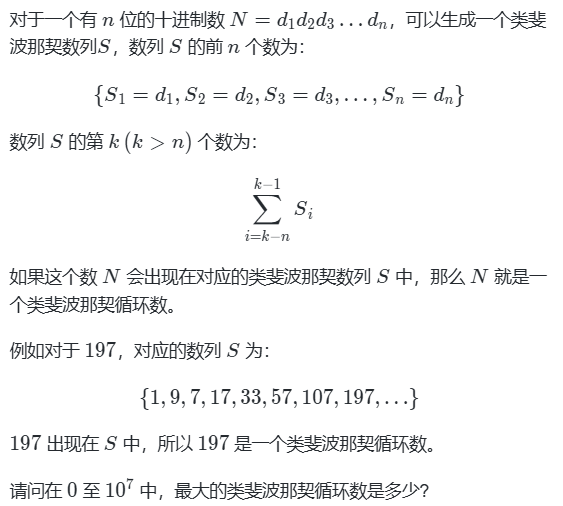
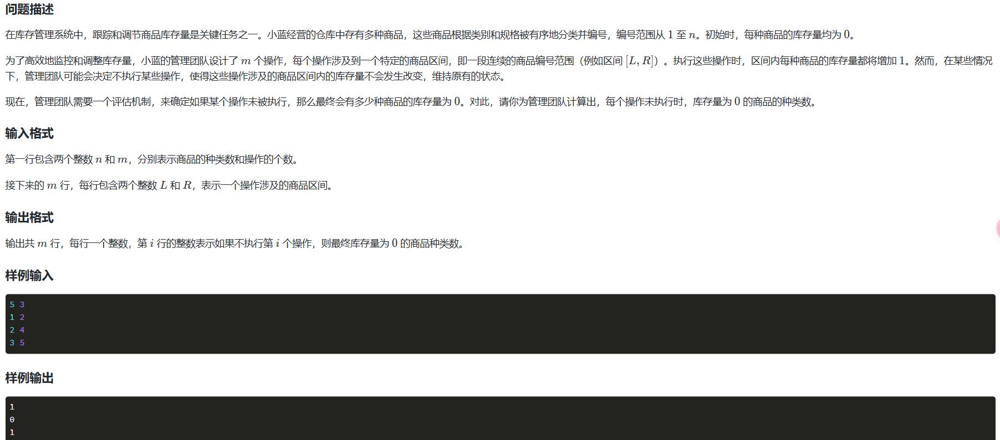

# 例题

## 1.最长回文子串

~~~properties
示例 1：

输入：s = "babad"
输出："bab"
解释："aba" 同样是符合题意的答案。
示例 2：

输入：s = "cbbd"
输出："bb"
 

提示：

1 <= s.length <= 1000
s 仅由数字和英文字母组成
~~~

~~~java
//中间拓展法
class Solution {
    public String longestPalindrome(String s) {
        int start=0;
		int end=0;
		for(int i=0;i<s.length();i++) {
			int len1=expand(s,i,i);
			int len2=expand(s,i,i+1);
			int len=Math.max(len1, len2);
			if(len>end-start) {
				start=i-(len-1)/2;
				end=i+len/2;
			}
		}
		
		
		return s.substring(start, end+1);
		
	}
	
	public int expand(String s,int left,int right) {
		while(left>=0&&right<s.length()&&s.charAt(left)==s.charAt(right)) {
			left--;
			right++;
		}
		
		return right-left-1;

    }
}
~~~

## 2.寻找两个数组的中位数

~~~properties
给定两个大小分别为 m 和 n 的正序（从小到大）数组 nums1 和 nums2。请你找出并返回这两个正序数组的 中位数 。

算法的时间复杂度应该为 O(log (m+n)) 。

 
示例 1：

输入：nums1 = [1,3], nums2 = [2]
输出：2.00000
解释：合并数组 = [1,2,3] ，中位数 2
示例 2：

输入：nums1 = [1,2], nums2 = [3,4]
输出：2.50000
解释：合并数组 = [1,2,3,4] ，中位数 (2 + 3) / 2 = 2.5
 

 

提示：

nums1.length == m
nums2.length == n
0 <= m <= 1000
0 <= n <= 1000
1 <= m + n <= 2000
-106 <= nums1[i], nums2[i] <= 106
~~~

~~~java
//寻找分割点
public double findMedianSortedArrays(int[] nums1, int[] nums2) {
	int m=nums1.length;
	int n=nums2.length;
	if(m>n)return findMedianSortedArrays(nums2,nums1);
	
	int totalLeft=(m+n+1)/2;
	int left=0;
	int right=m;
	
	while(left<right) {
		int i=left+(right-left+1)/2;
		int j=totalLeft-i;
		if(nums1[i-1]<nums2[j]) {
			left=i;
		}else {
			right=i-1;
		}
	}
	
	int i=left;
	int j=totalLeft-i;
	
	
	int nums1LeftMax=i==0?Integer.MIN_VALUE:nums1[i-1];
	int nums2LeftMax=j==0?Integer.MIN_VALUE:nums2[j-1];
	int nums1RightMin=i==m?Integer.MAX_VALUE:nums1[i];
	int nums2RightMin=j==n?Integer.MAX_VALUE:nums2[j];
	
	if((m+n)%2==1) {
		return Math.max(nums1LeftMax, nums2LeftMax);
	}else {
		return (Math.max(nums1LeftMax, nums2LeftMax)+Math.min(nums1RightMin, nums2RightMin))/2.0;
	}
~~~

## 3.无重复最长字串

~~~properties
给定一个字符串 s ，请你找出其中不含有重复字符的最长子串的长度。

 

示例 1:

输入: s = "abcabcbb"
输出: 3 
解释: 因为无重复字符的最长子串是 "abc"，所以其长度为 3。
示例 2:

输入: s = "bbbbb"
输出: 1
解释: 因为无重复字符的最长子串是 "b"，所以其长度为 1。
示例 3:

输入: s = "pwwkew"
输出: 3
解释: 因为无重复字符的最长子串是 "wke"，所以其长度为 3。
     请注意，你的答案必须是 子串 的长度，"pwke" 是一个子序列，不是子串。
~~~

~~~java
//滑动窗口
public int lengthOfLongestSubstring(String s) {
	
	if(s.length()==0)	return 0;
    Map<Character,Integer> map=new HashMap<>();
    int left=0;
    int right=0;
    for(int i=0;i<s.length();i++) {
    	if(map.containsKey(s.charAt(i))) {
    		left=Math.max(left, map.get(s.charAt(i))+1);
    	}
    	map.put(s.charAt(i), i);
    	right=Math.max(right, i-left+1);
    }
	return right;
}
~~~

## 4.N型存储字符串

~~~properties
将一个给定字符串 s 根据给定的行数 numRows ，以从上往下、从左到右进行 Z 字形排列。

比如输入字符串为 "PAYPALISHIRING" 行数为 3 时，排列如下：

P   A   H   N
A P L S I I G
Y   I   R
之后，你的输出需要从左往右逐行读取，产生出一个新的字符串，比如："PAHNAPLSIIGYIR"。
~~~

~~~java
public String convert(String s, int numRows) {
		if(numRows==1)return s;
		
		int len=Math.min(s.length(), numRows);
		String[] rows=new String[len];
		
		boolean down=false;
		int loc=0;
		for(int i=0;i<s.length();i++) {
			rows[loc] +=s.substring(i, i+1);//+=运算符表示追加
			if(loc==0||loc==(numRows-1)) {
				down=!down;
			}
			loc+=down?1:-1;
		}
						
		
		String ans="";
		for(String row:rows) {
			ans+=row;
		}
		
		return ans;		

}
~~~

## 5.K个一组反转链表

~~~java
class Solution {
    public ListNode reverseKGroup(ListNode head, int k) {
        int n=0;
        ListNode a=head;
        while(a!=null){
            n++;
            a=a.next;
        }
        ListNode dummy = new ListNode(0);
        dummy.next = head;
        ListNode p=dummy,pre=null,cur=p.next,nxt=null;
        while(n>=k){
            n-=k;
            for(int i=0;i<k;i++){
                nxt=cur.next;
                cur.next=pre;
                pre=cur;
                cur=nxt;
            }
            nxt=p.next;
            p.next.next=cur;
            p.next=pre;
            p=nxt;

        }
        return dummy.next;
    }
}
~~~

## 6.最大正方形

小蓝正在玩拼图游戏，他有 7385137888721个 2×2的方块和 10470245个 1×1 的方块，他需要从中挑出一些来拼出一个正方形，比如用 33 个 2×2和 44 个 1×1的方块可以拼出一个 4×4 的正方形，用 9个 2×2的方块可以拼出一个 6×6的正方形，请问小蓝能拼成的最大的正方形的边长为多少。

~~~java
import java.util.Scanner;
// 1:无需package
// 2: 类名必须Main, 不可修改

public class Main {
    public static void main(String[] args) {
        Scanner scan = new Scanner(System.in);
        long a1=10470245;
        long a2=7385137888721L;
        long a=a2+a1/4;
        long L=1;
        while(a>2*L+1){
          a-=2*L+1;
          L++;
        }
        System.out.println(2*L);

        scan.close();
    }
}
~~~

## 7,K连击

小蓝最近迷上了一款名为 “劲舞团” 的游戏，具体来说，只要按照游戏中给出的键位提示依次按出对应的键位，游戏人物便可以跟随节奏跳舞。对于连续的 K 次正确敲击，如果任意连续的两次敲击间间隔时间都小于等于 1s1*s*，那么我们称这是一次K 连击。现在给出一局小蓝的游戏记录文件，[log.txt](https://labfile.oss.aliyuncs.com/courses/40544/log.txt) 中记录了 NN 条记录，每条记录有三个字段，依次为正确的敲击字符、小蓝打出的字符、 打出字符的时间对应的毫秒时间戳。现在请你计算下最长的 KK 连击是多少，你只需要输出 K 的值

~~~java
import java.io.BufferedReader;
import java.io.FileNotFoundException;
import java.io.FileReader;
import java.io.IOException;
import java.io.InputStreamReader;
import java.util.ArrayList;
import java.util.List;

public class Main {

	public static void main(String[] args) {
		List<String[]> list = new ArrayList<>();
    BufferedReader br = new BufferedReader(new InputStreamReader(System.in));
		try{
			String line;
			while((line = br.readLine())!=null) {
				String[] parts=line.split("\\s+");
				list.add(parts);
			}
		} catch (IOException e) {
            System.err.println("读取文件时发生错误！");
            e.printStackTrace();
        }
		int ans=0,temp=0;
		long lasttime=0;
		
		for(String[] r:list) {
			if(r[0].equals(r[1])&&(Long.parseLong(r[2])-lasttime)<=1000) {
				temp++;
			}else {
				temp=1;
			}
			ans=Math.max(ans, temp);
			lasttime=Long.parseLong(r[2]);
		}
		System.out.println(ans);
	}
}
~~~

## 8.DFS算法应用

小蓝准备在一个空旷的场地里面滑行，这个场地的高度不一，小蓝用一个 n 行 m 列的矩阵来表示场地，矩阵中的数值表示场地的高度。

如果小蓝在某个位置，而他上、下、左、右中有一个位置的高度（严格）低于当前的高度，小蓝就可以滑过去，滑动距离为 1 。

如果小蓝在某个位置，而他上、下、左、右中所有位置的高度都大于等于当前的高度，小蓝的滑行就结束了。

小蓝不能滑出矩阵所表示的场地。

小蓝可以任意选择一个位置开始滑行，请问小蓝最多能滑行多远距离。

**输入格式**

输入第一行包含两个整数 n, m，用一个空格分隔。

接下来 n 行，每行包含 m 个整数，相邻整数之间用一个空格分隔，依次表示每个位置的高度。

**输出格式**

输出一行包含一个整数，表示答案。

**样例输入**

```text
4 5
1 4 6 3 1 
11 8 7 3 1 
9 4 5 2 1 
1 3 2 2 1
```

**样例输出**

```text
7
```

**样例说明**

滑行的位置一次为 (2,1),(2,2),(2,3),(3,3),(3,2),(4,2),(4,3)(2,1),(2,2),(2,3),(3,3),(3,2),(4,2),(4,3)

~~~java
public class Test303 {
	static int[] dx= {-1,1,0,0};
	static int[] dy= {0,0,1,-1};
	static int[][] fx;
	public static void main(String[] args) {
		Scanner scan = new Scanner(System.in);
		int m=scan.nextInt();
		int n=scan.nextInt();
		int ans=0;
		fx=new int[m][n];
		int[][] v=new int[m][n];
		int[][] num=new int[m][n];
		
		for(int i=0;i<m;i++) {
			for(int j=0;j<n;j++) {
				num[i][j]=scan.nextInt();
			}
		}
		
		for(int i=0;i<m;i++) {
			for(int j=0;j<n;j++) {
				ans=Math.max(ans, dfs(i,j,v,m,n,num));
			}
		}
		System.out.println(ans);

	}
	public static int dfs(int x,int y,int[][]v,int m,int n,int[][] num) {
		if(v[x][y]==1)return fx[x][y];
		v[x][y]=1;
		fx[x][y]=1;
		
		for(int i=0;i<4;i++) {
			int nx=x+dx[i];
			int ny=y+dy[i];
			if(nx<0||nx>=m||ny<0||ny>=n||num[nx][ny]>=num[x][y])continue;
			else fx[x][y]=Math.max(dfs(nx,ny,v,m,n,num)+1, fx[x][y]);
		}
		
		return fx[x][y];
	}

}
~~~

## 9.旧币兑换

小蓝手中有 2023种不同面值的硬币，这些硬币全部是新版硬币，其中第 i(1≤*i*≤2023) 种硬币的面值为 *i*，数量也为 i* 个。硬币兑换机可以进行硬币兑换，兑换规则为：交给硬币兑换机两个新版硬币 coin1和 coin2，硬币兑换机会兑换成一个面值为 coin1+coin2 的旧版硬币。

小蓝可以用自己已有的硬币进行任意次数兑换，假设最终小蓝手中有 K* 种不同面值的硬币（只看面值，不看新旧）并且第 i(1≤i≤K) 种硬币的个数为 sumi。小蓝想要使得 max⁡sum1,sum2,…,sumK的值达到最大，请你帮他计算这个值最大是多少。

注意硬币兑换机只接受新版硬币进行兑换，并且兑换出的硬币全部是旧版硬币。

~~~java
public static void main(String[] args) {
		int ans=0;
		int[] res=new int[4047];
		for(int i=1;i<=2023;i++) {
			for(int j=i+1;j<=2023;j++) {
                //对于每个面值来说都会把所有机会用完
				res[i+j]+=i;
			}
		}
		
		for(int i:res) {
			ans=Math.max(ans, i);
		}
		System.out.println(ans);

	}
~~~

## 10.平方差

给定 L,R，问 L≤x≤R中有多少个数 x*x* 满足存在整数 y,z 使得 x=y2−z2。

**输入格式**

输入一行包含两个整数 L,R*L*,*R*，用一个空格分隔。

**输出格式**

输出一行包含一个整数，表示满足题目给定条件的 x*x* 的数量。

**样例输入**

```
1 5
```

**样例输出**

```
4
```

~~~java
public class Main {
    /*
    因为y和z是整数，那么y+z和 y-z也都是整数，并且y+z与y-z的奇偶性相同
    (两数相加和相减的奇偶性规律:偶数 +偶数=偶数，奇数+奇数=偶数，偶数-偶数=偶数，奇数-奇数=偶数;
    偶数+奇数=奇数，偶数-奇数=奇数)。由此可知，满足æ= y’-z’的«要么是奇数(奇数x奇数=奇数)，
    要么是4的倍数(偶数x偶数，且这两个偶数相差 2z，当z为整数时，乘积是4的倍数)。
    */
     public static void main(String[] args) {
        Scanner scanner = new Scanner(System.in);
        long L = scanner.nextLong();
        long R = scanner.nextLong();

        long oddCount = (R + 1) / 2 - L / 2; 
        long multipleOfFourCount = R / 4 - (L - 1) / 4; 

        long result = oddCount + multipleOfFourCount;

        System.out.println(result);

        scanner.close();
    }
}
~~~

## 11.买二赠一

某商场有 N件商品，其中第 i*i* 件的价格是 Ai。现在该商场正在进行 “买二赠一” 的优惠活动，具体规则是：每购买 2件商品，假设其中较便宜的价格是 P（如果两件商品价格一样，则 P*P* 等于其中一件商品的价格），就可以从剩余商品中任选一件价格不超过 P2的商品，免费获得这一件商品。可以通过反复购买 2件商品来获得多件免费商品，但是每件商品只能被购买或免费获得一次。

小明想知道如果要拿下所有商品（包含购买和免费获得），至少要花费多少钱？

~~~java
import java.util.Arrays;
import java.util.LinkedList;
import java.util.Queue;
import java.util.Scanner;

//1:无需package
//2: 类名必须Main, 不可修改
public class Main {
    public static void main(String[] args) {
        Scanner scan = new Scanner(System.in);
        // 在此输入您的代码...
        Main m = new Main();
        int N = scan.nextInt();
        int[] prices = new int[N];// int足以存放商品单价的大小
        for (int i = 0; i < N; i++) {
            prices[i] = scan.nextInt();
        }
        System.out.println(m.minimum_cost(prices));
        scan.close();
    }

    /**
     * 贪心算法计算，最优解为优先赠送现存最贵的商品，无法赠送时优先购买最贵的商品，以获取最大赠送金额
     * 
     * @param prices 单价数组
     * @return 最低花费金额
     */
    public long minimum_cost(int[] prices) {
        long cost = 0;// 存放总花费金额，数值较大用long
        boolean second = false;// 判断是否为第二件购买的商品
        Queue<Integer> queue = new LinkedList<Integer>();// 创建队列存放可免费赠送商品的最大价格
        Arrays.sort(prices);// 对价格数组进行升序排序
        int len = prices.length - 1;// 存放数组最大下标，进行逆序访问
        while (len >= 0) {
            if (!queue.isEmpty() && prices[len] <= queue.peek()) {
                // 当队列不为空且当前商品满足免费赠送条件时，对赠送商品进行出队操作
                queue.poll();
            } else {
                // 当当前商品无法赠送时，进行购买操作
                cost += prices[len];
                if (second) {
                    // 当商品是第二件购买的商品，符合赠送条件，入队可赠送价格
                    queue.add(prices[len] / 2);
                    second = false;
                } else {
                    second = true;
                }
            }
            len--;
        }
        return cost;
    }
}
~~~

## 12.动态规划

这天，一只蜗牛来到了二维坐标系的原点。

在 x轴上长有 n根竹竿。它们平行于 y轴，底部纵坐标为 0，横坐标分别为 x1,x2,...,xn。竹竿的高度均为无限高，宽度可忽略。蜗牛想要从原点走到第 n个竹竿的底部也就是坐标 (xn,0)。它只能在 x*x* 轴上或者竹竿上爬行，在 x轴上爬行速度为 1 单位每秒；由于受到引力影响，蜗牛在竹竿上向上和向下爬行的速度分别为 0.7单位每秒和 1.3单位每秒。

为了快速到达目的地，它施展了魔法，在第 i和 i+1根竹竿之间建立了传送门（0<i<n），如果蜗牛位于第 i根竹竿的高度为 ai的位置 (xi,ai)，就可以瞬间到达第 i+1根竹竿的高度为 bi+1的位置 (xi+1,bi+1)，请计算蜗牛最少需要多少秒才能到达目的地。

**输入格式**

输入共 1+n行，第一行为一个正整数 n；

第二行为 n个正整数 x1,x2,...,xn；

后面 n−1行，每行两个正整数 ai,bi+1 。

**输出格式**

输出共一行，一个浮点数表示答案（四舍五入保留两位小数）。

**样例输入**

```text
3
1 10 11
1 1
2 1
```

**样例输出**

```text
4.20
```



~~~java
import java.util.Scanner;
// 1:无需package
// 2: 类名必须Main, 不可修改

public class Main {
    public static void main(String[] args) {
        Scanner sc = new Scanner(System.in);
        int n = sc.nextInt();
        int[] x = new int[n+1];
        int[] a = new int[n+1];
        int[] b = new int[n+1];
        for(int i = 1;i<=n;i++){
            x[i] = sc.nextInt();
        }
        for(int i = 1;i<n;i++){
            a[i] = sc.nextInt();
            b[i+1] = sc.nextInt();
        }

        double[][] dp = new double[n+1][2];
        dp[1][0] = x[1];
        dp[1][1] = x[1] + a[1]/0.7;


        for(int i = 2;i <= n;i++){
            if(a[i]>b[i]){
                dp[i][1] = Math.min(dp[i-1][0] + x[i]-x[i-1] + a[i]/0.7, dp[i-1][1] + (a[i]-b[i])/0.7);
            }else {
                dp[i][1] = Math.min(dp[i-1][0] + x[i]-x[i-1] + a[i]/0.7,dp[i-1][1] + (b[i]-a[i]) /1.3);
            }
            dp[i][0] = Math.min(dp[i-1][1] +b[i]/1.3 ,dp[i-1][0]+x[i]-x[i-1]);

        }


        System.out.printf("%.2f",dp[n][0]);
        //在此输入您的代码...
        sc.close();
    }
}
~~~

## 13.第三小

给定一个序列 a[1],a[2],…,a[n]，对于 3≤i≤n，请求出前 i个数中的第 3小值。

**输入格式**

输入的第一行包含一个整数 n，表示序列的长度。

第二行包含 n 个整数，相邻的整数之间使用一个空格分隔，表示给定的序列。

**输出格式**

输出一行包含 n−2 个整数，相邻两个数之间使用一个空格分隔，第 i个整数表示 a[1],a[2],...,a[i+2]中的第 3小值。

**样例输入**

```
9
9 9 8 2 4 4 3 5 3
```

**样例输出**

```
9 9 8 4 4 4 3
```

~~~java
//使用各种方法优化
public static void main(String[] args) {
		Scanner scan =new Scanner(System.in);
		int n=scan.nextInt();
		int[] real=new int[n];
		for(int i=0;i<n;i++) {
			real[i]=scan.nextInt();
		}
		List<Integer> list =new ArrayList<>();
		List<Integer> ans =new ArrayList<>();
		list.add(real[0]);
		list.add(real[1]);
    	//每次只加一个
		for(int i=2;i<n;i++) {
			list.add(real[i]);
			Collections.sort(list);
			ans.add(list.get(2));
            //多了就删了
			if(list.size()>3)list.remove(3);
		}
		for(int i=0;i<ans.size();i++) {
			System.out.print(ans.get(i)+" ");
		}
	}
~~~

## 14.三整数分解

如果一个正整数 n可以表示为三个整数的乘积，且这三个数的差都不超过 2 ，则称n可以进行相近分解。即 n*n* 可以写为 *a*⋅*b*⋅*c* 的形式，而且∣*a*−*b*∣≤2, ∣*a*−*c*∣≤2, ∣*b*−*c*∣≤2。请问第23 小的可以进行相近分解的正整数是多少？

~~~java
public class Main {
    public static void main(String[] args) {
        int count = 0 ;
      for(int a=1;a<=20;a++){
        for(int b=a;b<=a+2;b++){
          for(int c=b;c<=a+2;c++){
            count++;
            if(count==23){
              System.out.print(a*b*c);
            }
          }
        }
      }
    }
}
~~~

## 15.求余数

求一个特别大的数的余数，使用`BigInteger`

~~~java
public class Main {
    public static void main(String[] args) {
        Scanner scan = new Scanner(System.in);
        //在此输入您的代码...
        String str="12345678901234567890123456789012345678901234567890";
        BigInteger bt=new BigInteger(str);
        BigInteger ans=bt.mod(BigInteger.valueOf(2023));
        System.out.println(ans);
        scan.close();
    }
}
~~~

## 16.子序列个数

小蓝在黑板上连续写下从 1 到 2023之间所有的整数，得到了一个数字序列： S=12345678910111213...20222023。 小蓝想知道 S中有多少种子序列恰好等于 2023？

这题不考虑是否有重复项，只求子序列最大个数，前序相加

~~~java
public static void main(String[] args) {
        n = 2023;
//        n = 23;
        StringBuilder ss = new StringBuilder();
        for (int i = 1; i <= n; i++) {
            ss.append(i);
        }
        char[] cs = ss.toString().toCharArray();
        int two = 0, zero = 0, two2 = 0, three = 0;
        long res = 0;
        for (char c : cs) {
            if (c == '2') {
                two2 += zero;
                two++;
            }
            if (c == '0') {
                zero += two;
            }
            if (c == '3') {
                res += two2;
            }
        }
        System.out.println(res);
    }
~~~

## 17.字符串分隔



~~~java
import java.util.ArrayList;
import java.util.Arrays;
import java.util.Scanner;

public class Main {
    public  static int[] level={59,59,23,31,12};
    public static  int[] months={0,31,28,31,30,31,30,31,31,30,31,30,31};
    public static void main(String[] args) {
        long ant=0;
        Scanner sc=new Scanner(System.in);
//    将SimpleCron 进行分割
        String[] date=sc.nextLine().split(" ");
        ArrayList<Integer>[] a=new ArrayList[5];

////        遍历
        for(int i=0;i<5;i++)
        {
            a[i]=new ArrayList<>();
            if(date[i].contains("*"))
            {
                for(int j=i==4||i==3?1:0;j<=level[i];j++)
                {
                    a[i].add(j);
                }
            }
            else if(date[i].contains("-"))
            {
                String[] s=date[i].split("-");
                int left=Integer.parseInt(s[0]);
                int right=Integer.parseInt(s[1]);
                for(int k=left;k<=right;k++)
                {
                    a[i].add(k);
                }
            }
            else if(date[i].contains(","))
            {
                String[] s=date[i].split(",");
                int k=0;
                while(k<s.length)
                {
                    a[i].add(Integer.parseInt(s[k]));
                    k++;
                }
            }
            else{
                a[i].add(Integer.parseInt(date[i]));
            }
        }
        for(int i=0;i<a[4].size();i++)
        {
            for(int j=0;j<a[3].size()&&a[3].get(j)<=months[a[4].get(i)];j++)
            {
                ant+=a[0].size()*a[1].size()*a[2].size();
            }
        }
        System.out.println(ant);

    }
}
~~~

## 18.动态规划载重



~~~java
import java.util.Scanner;

public class Main {
    public static void main(String[] args) {
        Scanner sc = new Scanner(System.in);
        
        // 读取输入
        int n = sc.nextInt();  // n是物品的数量
        int v1 = sc.nextInt(); // v1是背包1的容量
        int v2 = sc.nextInt(); // v2是背包2的容量
        
        int[] a = new int[n + 1]; // 存储每个物品的重量
        for (int i = 1; i <= n; i++) {
            a[i] = sc.nextInt();
        }
        
        // dp[i][j] 表示在背包1容量为 i，背包2容量为 j 的情况下，能够获得的最大价值
        int[][] dp = new int[v1 + 1][v2 + 1];
        
        // 动态规划求解
        for (int i = 1; i <= n; i++) {
            // 注意要倒着遍历背包容量，避免重复使用同一个物品
            for (int j = v1; j >= 0; j--) {
                for (int k = v2; k >= 0; k--) {
                    if (j >= a[i]) {  // 如果背包1能够装下当前物品
                        dp[j][k] = Math.max(dp[j][k], dp[j - a[i]][k] + a[i]);
                    }
                    if (k >= a[i]) {  // 如果背包2能够装下当前物品
                        dp[j][k] = Math.max(dp[j][k], dp[j][k - a[i]] + a[i]);
                    }
                }
            }
        }
        
        // 输出结果：最终背包1容量为v1，背包2容量为v2时的最大价值
        System.out.println(dp[v1][v2]);
        sc.close();
    }
}
~~~

## 19.字符串转整数



整形方法

~~~java


import java.util.Scanner;

public class Main {

	public static void main(String[] args) {
	Scanner scan=new Scanner(System.in);
	String s=scan.next();
	
	//缺ABC
	if(s.contains("+")||s.contains("-")||s.contains("*")||s.contains("/")) {
		String[] s1=s.split("=");
		//缺C
		if(s1[1].equals("?")) {
			int id=0;
			for(int i=0;i<s1[0].length();i++) {
				if(s1[0].charAt(i)<'0'||s1[0].charAt(i)>'9') {
					id=i;
					break;
				}
			}
			int a=Integer.parseInt(s1[0].substring(0, id));
			int b=Integer.parseInt(s1[0].substring(id+1,s1[0].length()));
			if(s.contains("+"))System.out.println(a+b);
			if(s.contains("-"))System.out.println(a-b);
			if(s.contains("*"))System.out.println(a*b);
			if(s.contains("/"))System.out.println(a/b);
		//缺AB	
		}else {
			int c=Integer.parseInt(s1[1]);
			//缺B
			if(s1[0].charAt(s1[0].length()-1)=='?') {
				int id=0;
				for(int i=0;i<s1[0].length();i++) {
					if(s1[0].charAt(i)<'0'||s1[0].charAt(i)>'9') {
						id=i;
						break;
					}
				}
				int a=Integer.parseInt(s1[0].substring(0,id));
				if(s.contains("+"))System.out.println(c-a);
				if(s.contains("-"))System.out.println(a-c);
				if(s.contains("*"))System.out.println(c/a);
				if(s.contains("/"))System.out.println(a/c);
			//缺A	
			}else {
				int b=Integer.parseInt(s1[0].substring(2,s1[0].length()));
				if(s.contains("+"))System.out.println(c-b);
				if(s.contains("-"))System.out.println(c+b);
				if(s.contains("*"))System.out.println(c/b);
				if(s.contains("/"))System.out.println(c*b);
			}
		}
	}else {
		String s1[]=s.split("=");
        int c=Integer.parseInt(s1[1]);
        String s2=s1[0];
        int id=0;
        for(int i=0;i<s2.length();i++) {
            if(s2.charAt(i)<'0'||s2.charAt(i)>'9') {
                id=i;
                break;
            }
        }
        int a=Integer.parseInt(s2.substring(0, id));
        int b=Integer.parseInt(s2.substring(id+1, s2.length()));
        if(a+b==c)System.out.println("+");
        if(a-b==c)System.out.println("-");
        if(a*b==c)System.out.println("*");
        if(a/b==c)System.out.println("/");
	}
	
	scan.close();

	}

}
~~~

## 20.类斐波那契数



~~~java
public class Main {
    public static void main(String[] args) {
		for(int i=10000000;i>0;i--) {
			if(check(i)) {
				System.out.println(i);
				return ;
			}
		}
		
	}
	
	public static boolean check(int a) {
		String s=a+"";
		int l=s.length();
		int[]dp=new int[l];
		for(int i=0;i<l;i++) {
			dp[i]=s.charAt(i)-'0';
		}
		int sum=0;
		for(int i=l;sum<a;i++) {
			sum=Arrays.stream(dp).sum();
			dp[i%l]=sum;
		}
		return sum==a;
	}
}
~~~

## 21.暴力暴力



~~~java
package train;

import java.util.Scanner;

public class Test329 {

	public static void main(String[] args) {
		Scanner scan=new Scanner(System.in);
		int origin=0;
		int n=scan.nextInt();
		int m=scan.nextInt();
		int[] nums=new int[n];
		int[] numsl=new int[m];
		int[] numsr=new int[m];
		for(int i=0;i<m;i++) {
			numsl[i]=scan.nextInt()-1;
			numsr[i]=scan.nextInt()-1;
		}
		for(int i=0;i<m;i++) {
			for(int j=numsl[i];j<=numsr[i];j++) {
				nums[j]++;
			}
		}
		for(int x:nums) {
			if(x==0)origin++;
		}
		for(int i=0;i<m;i++) {
			int ans=0;
			for(int j=numsl[i];j<=numsr[i];j++) {
				if(nums[j]==1)ans++;
			}
			System.out.println(ans+origin);
		}
		scan.close();

	}

}
~~~
