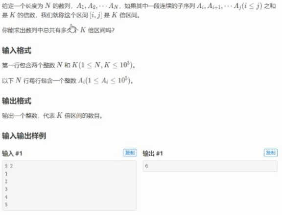
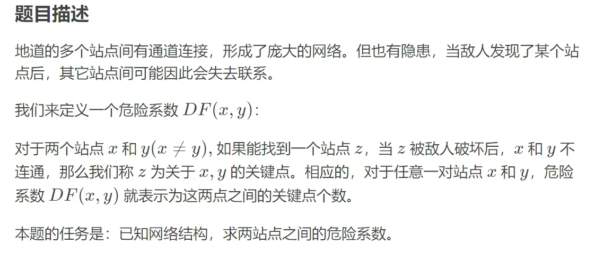
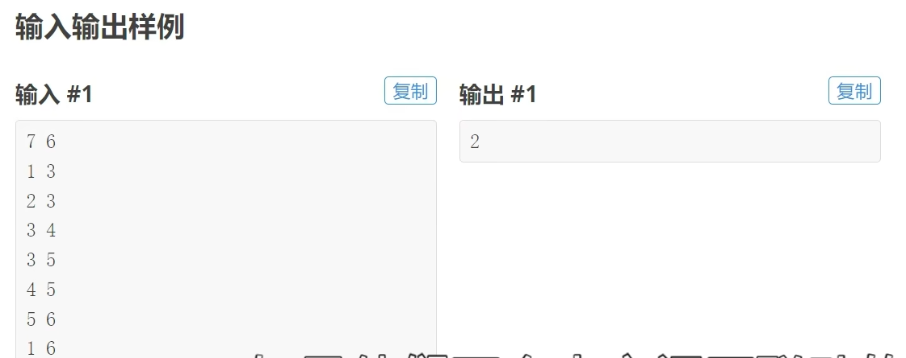
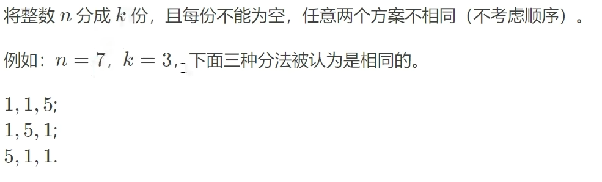

# 蓝桥杯

## 1.二分查找

### 1.1模板

~~~java
int []arr=[1,2,2,3,5,6];
int left=0,right=5;
int k=3;
//模板1 arr[left]>=k
while(left<right){
    int mid=(left+right)/2;
    if(arr[mid]>=k)right=mid;
    else left=mid+1;
}

//模板2 arr[left]<=k
while(left<right){
    int mid=(left+right+1);
    if(arr[mid]>k)right=mid-1;
    else left=mid;
}

~~~

### 1.2例题

1.给定三个整数组A,B,C，请计算有多少三元组（i,j,k）满足：

1. 1<=i,j,k<=N
2. Ai<Bj<Ck

~~~java
public int findGroup() {
		 
		 Scanner scan=new Scanner(System.in);
		 int n=scan.nextInt();
		 int[] A=new int[n];
		 int[] B=new int[n];
		 int[] C=new int[n];
		 for(int i=0;i<n;i++)A[i]=scan.nextInt();
		 for(int i=0;i<n;i++)B[i]=scan.nextInt();
		 for(int i=0;i<n;i++)C[i]=scan.nextInt();
		 Arrays.sort(A);
		 Arrays.sort(B);
		 Arrays.sort(C);
		 
		 int[] b=new int[n];//存储比B[i]大的C元素
		 		 
		 for(int i=0;i<n;i++) {
			 int left=0,right=n-1;
			 while(left<right) {
				 int mid=(left+right)/2;
				 if(B[i]<C[mid])right=mid;
				 else left=mid+1;
			 }
			 if(B[i]<C[left])b[i]=n-left;
		 }
		 
		 long[] sum=new long[n+1];
		 for(int i=1;i<n;i++) {
			 sum[i]=sum[i-1]+b[i-1];//存储前b[i]个的和
		 }
		 int ans=0;
		 for(int i=0;i<n;i++) {
			 int left=0,right=n-1;
			 while(left<right) {
				 int mid=(left+right)/2;
				 if(A[i]<B[mid])right=mid;
				 else left=mid+1;
			 }
			 if(A[i]<B[left])ans+=sum[n]-sum[left];//总的-小的
		 }

		return ans;
		 
	 }
~~~

2. 小明有N块巧克力，其中第i块是Hi*Wi的方块，一共有K位小朋友，如何分到K块正方形巧克力，并且每块尽可能大。

~~~java
	 public int  divide() {
		 Scanner scan=new Scanner(System.in);
		 int n=scan.nextInt();
		 int k=scan.nextInt();
		 int[] h=new int[n];
		 int[] w=new int[n];
		 for(int i=0;i<n;i++) {
			 h[i]=scan.nextInt();
			 w[i]=scan.nextInt();
		 }
		 int left=0,right=(int)1e5;//10的五次方
		 while(left<right) {
			 int mid=(left+right+1)/2;
			 if(check(mid,h,w,k))left=mid;
			 else right=mid-1;
		 }
		 return left;
	 }

	public boolean check(int mid, int[] h, int[] w, int k) {
		int ans=0;
		for(int i=0;i<h.length;i++) {
			int res=h[i]/mid*w[i]/mid;
			ans+=res;		}
		return ans>=k;
	}

~~~

~~~properties
搜索排序旋转数组
整数数组 nums 按升序排列，数组中的值 互不相同 。

在传递给函数之前，nums 在预先未知的某个下标 k（0 <= k < nums.length）上进行了 旋转，使数组变为 [nums[k], nums[k+1], ..., nums[n-1], nums[0], nums[1], ..., nums[k-1]]（下标 从 0 开始 计数）。例如， [0,1,2,4,5,6,7] 在下标 3 处经旋转后可能变为 [4,5,6,7,0,1,2] 。

给你 旋转后 的数组 nums 和一个整数 target ，如果 nums 中存在这个目标值 target ，则返回它的下标，否则返回 -1 。

你必须设计一个时间复杂度为 O(log n) 的算法解决此问题。

 

示例 1：

输入：nums = [4,5,6,7,0,1,2], target = 0
输出：4
示例 2：

输入：nums = [4,5,6,7,0,1,2], target = 3
输出：-1
示例 3：

输入：nums = [1], target = 0
输出：-1
~~~

~~~java
class Solution {
    public int search(int[] nums,int target) {
	int left=-1,right=nums.length;
	int mid=0;
	int end=nums[right-1];
	while(left+1<right) {
		mid=(left+right)/2;
		if(is_blue(end,nums[mid],target))right=mid;
		else left=mid;
	}
	if(nums[right]!=target||right==nums.length)return -1;
	else return right;
}
public boolean is_blue(int end,int i,int target) {
	if(i>end)return target>end&&i>=target;
	else return target>end||i>=target;
}
}
~~~


### 1.3浮点数二分查找例题

有N条绳子，长度分别是Li，如果从他们中切割出K条长度相同的绳子，那么这K条绳子最长能有多长，保留到小数点后两位。

~~~java
public int divideRope() {
		Scanner scan=new Scanner(System.in);
		int n=scan.nextInt();
		int k=scan.nextInt();
		double[] L=new double[n];
		for(int i=0;i<n;i++) {
			L[i]=scan.nextDouble();
		}
		double left=0,right=(int)1e9;
		while(right-left>1e-2) {
			double mid=(left+right+1)/2;
			if(check(L,mid,k))left=mid;
			else left=mid-1;
		}
		
		
		return 0;
	}

public boolean check(double[] L, double mid, int k) {
	int ans=0;
	for(double x:L) {
		ans+=(int)x/mid;
	}
	return ans>=k;
}

~~~

### 1.4摆动排序

~~~properties
给你一个整数数组 nums，将它重新排列成 nums[0] < nums[1] > nums[2] < nums[3]... 的顺序。

你可以假设所有输入数组都可以得到满足题目要求的结果。

 

示例 1：

输入：nums = [1,5,1,1,6,4]
输出：[1,6,1,5,1,4]
解释：[1,4,1,5,1,6] 同样是符合题目要求的结果，可以被判题程序接受。
示例 2：

输入：nums = [1,3,2,2,3,1]
输出：[2,3,1,3,1,2]
 

提示：

1 <= nums.length <= 5 * 104
0 <= nums[i] <= 5000
题目数据保证，对于给定的输入 nums ，总能产生满足题目要求的结果
~~~

~~~java
class Solution {
    public void wiggleSort(int[] nums) {
    int[] nums2=nums.clone();
    Arrays.sort(nums2);
    int left=(nums.length-1)/2,right=nums.length-1;
    for(int i=0;i<nums.length;i++) {
    	if(i%2==0) {
    		nums[i]=nums2[left];
    		left--;
    	}else {
    		nums[i]=nums2[right];
    		right--;
    	}
    }

} 
}
~~~


## 2.动态规划

### 2.1线性动态规划

主要思路是推出**状态转移方程**，即dp[i]=dp[i-1]+dp[i-2]

### 2.2例题

1.程序员爬n级楼梯，可以爬一级或三级，请问一共有多少种方法

~~~java
public int floor() {
    	Scanner scan=new Scanner(System.in);
    	int n=scan.nextInt();
    	if(n<3) return 1;
    	else {
    		int[] dp=new int[n+1];
    		dp[1]=1;
    		dp[2]=2;
    		dp[3]=2;
    		for(int i=4;i<=n;i++) {
    			dp[i]=dp[i-1]+dp[i-3];
    		}
    		return dp[n];
    	}    	
    }
~~~

2.最长上升子序列，要求按顺序递增。

~~~java
    public int upNumber() {
    	Scanner scan=new Scanner(System.in);
    	int n=scan.nextInt();
    	int[] a=new int[n];
    	for(int i=0;i<n;i++) {
    		a[i]=scan.nextInt();
    	}
    	int[] dp=new int[n+1];
    	dp[0]=1;
    	int max=1;
    	for(int i=1;i<n;i++) {
            dp[i]=1;
    		for(int j=0;j<i;j++) {
    			if(a[i]>a[j])dp[i]=Math.max(dp[i], dp[j]+1);
    			
    		}
    		max=Math.max(max, dp[i]);
    	}
    	
    	return max;
    }
~~~

3.接龙数列

## 3.暴力搜索

递归调用 比如1到n的全排列

~~~java
public class Main{
    static List<List<Intger>> list=new ArrayList<>();
    public void dfs(int n,int[] v,List<Integer> t){
        if(t.size()==n){
            list.add(new Arraylist<>(t));
            return ;
        }else{
            for(int i=1;i<=n;i++){
                if(v[i]==1)continue;
                v[i]=1;
                t.add(i);
                dfs(n,v,t);
                t.remove(t.size()-1);
                v[i]=0;
            }
        }
    }
}
~~~

## 4.双指针

### 4.1快慢指针（滑动窗口）

~~~properties
给你一个整数数组 nums 和一个 正整数 k 。

请你统计有多少满足 「 nums 中的 最大 元素」至少出现 k 次的子数组，并返回满足这一条件的子数组的数目。

子数组是数组中的一个连续元素序列。

 

示例 1：

输入：nums = [1,3,2,3,3], k = 2
输出：6
解释：包含元素 3 至少 2 次的子数组为：[1,3,2,3]、[1,3,2,3,3]、[3,2,3]、[3,2,3,3]、[2,3,3] 和 [3,3] 。
示例 2：

输入：nums = [1,4,2,1], k = 3
输出：0
解释：没有子数组包含元素 4 至少 3 次。
 

提示：

1 <= nums.length <= 105
1 <= nums[i] <= 106
1 <= k <= 105
~~~

~~~java
public long countSubarrays(int[] nums, int k) {
	int mx=0;
	for(int x:nums) {
		mx=Math.max(mx, x);
	}
	int left=0,right=0;
	long ans=0;
	for(int x:nums) {
		if(x==mx)right++;
		while(right==k) {
			if(nums[left++]==mx) {
				right--;
			}
		}
		ans+=left;
	}
	return ans;
}
~~~

~~~java
//最小连续子数组长度 给定target 要求输出最小连续的子数组长度
public int minNum(int[] height,int target) {
	int n=height.length;
	int ans=n+1;
	int s=0;
	int left=0,right=0;
	for(right=0;right<n;right++) {
		s+=height[right];
		while(s-height[left]>=target) {
			s-=height[left];
			left++;
		}
		if(s>=target)ans=Math.min(ans, right-left+1);
	}
	return ans==n+1?0:ans;
}
~~~

~~~properties
环形链表
给定一个链表，返回链表开始入环的第一个节点。 从链表的头节点开始沿着 next 指针进入环的第一个节点为环的入口节点。如果链表无环，则返回 null。

为了表示给定链表中的环，我们使用整数 pos 来表示链表尾连接到链表中的位置（索引从 0 开始）。 如果 pos 是 -1，则在该链表中没有环。注意，pos 仅仅是用于标识环的情况，并不会作为参数传递到函数中。

说明：不允许修改给定的链表。

 

示例 1：


输入：head = [3,2,0,-4], pos = 1
输出：返回索引为 1 的链表节点
解释：链表中有一个环，其尾部连接到第二个节点。
示例 2：


输入：head = [1,2], pos = 0
输出：返回索引为 0 的链表节点
解释：链表中有一个环，其尾部连接到第一个节点。
示例 3：


输入：head = [1], pos = -1
输出：返回 null
解释：链表中没有环。
~~~

~~~java
public class Solution {
    public ListNode detectCycle(ListNode head) {
    ListNode fast=head,slow=head;
    while(fast!=null&&fast.next!=null) {
    	slow=slow.next;
    	fast=fast.next.next;
    	if(slow==fast) {
    		while(slow!=head) {
    			slow=slow.next;
    			head=head.next;
    		}
    		return slow;
    	}
    }
    return null;
}
}
~~~

~~~properties
重排链表

给定一个单链表 L 的头节点 head ，单链表 L 表示为：

 L0 → L1 → … → Ln-1 → Ln 
请将其重新排列后变为：

L0 → Ln → L1 → Ln-1 → L2 → Ln-2 → …

不能只是单纯的改变节点内部的值，而是需要实际的进行节点交换。

 

示例 1:


输入: head = [1,2,3,4]
输出: [1,4,2,3]
示例 2:


输入: head = [1,2,3,4,5]
输出: [1,5,2,4,3]
 

提示：

链表的长度范围为 [1, 5 * 104]
1 <= node.val <= 1000
~~~

~~~java
class Solution {
    public ListNode midList(ListNode head) {
	ListNode fast=head,slow=head;
    while(fast!=null&&fast.next!=null) {
    	slow=slow.next;
    	fast=fast.next.next;
    }
    return slow;
}
public ListNode reverseList(ListNode head) {
	ListNode cur=head,pre=null,nxt=null;
	while(cur!=null) {
		nxt=cur.next;
		cur.next=pre;
		pre=cur;
		cur=nxt;
	}
	return pre;
}
public void reorderList(ListNode head) {
	ListNode mid=midList(head);
	ListNode head2=reverseList(mid);
	ListNode nxt=null,nxt2=null;
	while(head2.next!=null) {
		nxt=head.next;
		nxt2=head2.next;
		head.next=head2;
		head2.next=nxt;
		head=nxt;
		head2=nxt2;
	}
}
}
~~~

### 4.2左右指针(左右向中心)

~~~properties
给定两个大小分别为 m 和 n 的正序（从小到大）数组 nums1 和 nums2。请你找出并返回这两个正序数组的 中位数 。

算法的时间复杂度应该为 O(log (m+n)) 。

 
示例 1：

输入：nums1 = [1,3], nums2 = [2]
输出：2.00000
解释：合并数组 = [1,2,3] ，中位数 2
示例 2：

输入：nums1 = [1,2], nums2 = [3,4]
输出：2.50000
解释：合并数组 = [1,2,3,4] ，中位数 (2 + 3) / 2 = 2.5
 

 

提示：

nums1.length == m
nums2.length == n
0 <= m <= 1000
0 <= n <= 1000
1 <= m + n <= 2000
-106 <= nums1[i], nums2[i] <= 106
~~~

~~~java
//寻找分割点
public double findMedianSortedArrays(int[] nums1, int[] nums2) {
	int m=nums1.length;
	int n=nums2.length;
	if(m>n)return findMedianSortedArrays(nums2,nums1);
	
	int totalLeft=(m+n+1)/2;
	int left=0;
	int right=m;
	
	while(left<right) {
		int i=left+(right-left+1)/2;
		int j=totalLeft-i;
		if(nums1[i-1]<nums2[j]) {
			left=i;
		}else {
			right=i-1;
		}
	}
	
	int i=left;
	int j=totalLeft-i;
	
	
	int nums1LeftMax=i==0?Integer.MIN_VALUE:nums1[i-1];
	int nums2LeftMax=j==0?Integer.MIN_VALUE:nums2[j-1];
	int nums1RightMin=i==m?Integer.MAX_VALUE:nums1[i];
	int nums2RightMin=j==n?Integer.MAX_VALUE:nums2[j];
	
	if((m+n)%2==1) {
		return Math.max(nums1LeftMax, nums2LeftMax);
	}else {
		return (Math.max(nums1LeftMax, nums2LeftMax)+Math.min(nums1RightMin, nums2RightMin))/2.0;
	}
~~~

~~~properties
两数之和
给定一个已按照 升序排列  的整数数组 numbers ，请你从数组中找出两个数满足相加之和等于目标数 target 。

函数应该以长度为 2 的整数数组的形式返回这两个数的下标值。numbers 的下标 从 0 开始计数 ，所以答案数组应当满足 0 <= answer[0] < answer[1] < numbers.length 。

假设数组中存在且只存在一对符合条件的数字，同时一个数字不能使用两次。

 

示例 1：

输入：numbers = [1,2,4,6,10], target = 8
输出：[1,3]
解释：2 与 6 之和等于目标数 8 。因此 index1 = 1, index2 = 3 。
示例 2：

输入：numbers = [2,3,4], target = 6
输出：[0,2]
示例 3：

输入：numbers = [-1,0], target = -1
输出：[0,1]
 

提示：

2 <= numbers.length <= 3 * 104
-1000 <= numbers[i] <= 1000
numbers 按 非递减顺序 排列
-1000 <= target <= 1000
仅存在一个有效答案
~~~

~~~java
class Solution {
    public int[] twoSum(int[] numbers, int target) {
       
	int left=0,right=numbers.length-1;
	int[] res= new int[2];
	while(left<right) {
		if(numbers[left]+numbers[right]>target)right--;
		else if(numbers[left]+numbers[right]<target)left++;
		else {
			res[0]=left;
			res[1]=right;
            break;
		}
	}
	return res;
}

    }

~~~

~~~properties
给你一个整数数组 nums ，判断是否存在三元组 [nums[i], nums[j], nums[k]] 满足 i != j、i != k 且 j != k ，同时还满足 nums[i] + nums[j] + nums[k] == 0 。请你返回所有和为 0 且不重复的三元组。

注意：答案中不可以包含重复的三元组。

 

 

示例 1：

输入：nums = [-1,0,1,2,-1,-4]
输出：[[-1,-1,2],[-1,0,1]]
解释：
nums[0] + nums[1] + nums[2] = (-1) + 0 + 1 = 0 。
nums[1] + nums[2] + nums[4] = 0 + 1 + (-1) = 0 。
nums[0] + nums[3] + nums[4] = (-1) + 2 + (-1) = 0 。
不同的三元组是 [-1,0,1] 和 [-1,-1,2] 。
注意，输出的顺序和三元组的顺序并不重要。
示例 2：

输入：nums = [0,1,1]
输出：[]
解释：唯一可能的三元组和不为 0 。
示例 3：

输入：nums = [0,0,0]
输出：[[0,0,0]]
解释：唯一可能的三元组和为 0 。
 

提示：

3 <= nums.length <= 3000
-105 <= nums[i] <= 105
~~~

~~~java
class Solution {
    public List<List<Integer>> threeSum(int[] nums) {
        int n = nums.length;
        Arrays.sort(nums);
        List<List<Integer>> l = new ArrayList<>();
        
        for (int i = 0; i < n - 2; i++) {
            // 跳过重复的 i
            if (i > 0 && nums[i] == nums[i - 1]) continue;

            int left = i + 1;
            int right = n - 1;
            while (left < right) {
                int s = nums[i] + nums[left] + nums[right];
                if (s > 0) {
                    right--;
                } else if (s < 0) {
                    left++;
                } else {
                    // 找到一个三元组
                    List<Integer> list = new ArrayList<>(); // 创建新的 list
                    list.add(nums[i]);
                    list.add(nums[left]);
                    list.add(nums[right]);
                    l.add(list);

                    // 跳过重复的 left
                    while (left < right && nums[left] == nums[left + 1]) left++;
                    // 跳过重复的 right
                    while (left < right && nums[right] == nums[right - 1]) right--;

                    left++;
                    right--;
                }
            }
        }
        return l;
    }
}

~~~

~~~java
//接雨水 
class Solution{
public int rain(int height[]) {
	int n=height.length;
	int area=0;
	int left=0,right=n-1;
	int pre=0,sub=0;
	while(left<=right) {
		pre=Math.max(pre, height[left]);
		sub=Math.max(sub, height[right]);
		if(pre<sub) {
			area+=pre-height[left];
			left++;
		}else {
			area+=sub-height[right];
			right--;
		}
	}
	return area;
}
}
~~~

### 4.3虚拟头节点

~~~properties
给定一个已排序的链表的头 head ， 删除原始链表中所有重复数字的节点，只留下不同的数字 。返回 已排序的链表 。

 

示例 1：


输入：head = [1,2,3,3,4,4,5]
输出：[1,2,5]
示例 2：


输入：head = [1,1,1,2,3]
输出：[2,3]
 

提示：

链表中节点数目在范围 [0, 300] 内
-100 <= Node.val <= 100
题目数据保证链表已经按升序 排列
~~~

~~~java
//使用范围：当头节点可能被删除时使用虚拟头节点

//例如删除倒数第N个节点，头节点可能被删除；
//可以用快慢指针fast先走N步，slow再开始走，这样总是隔着N步，slow是倒数N+1节点

class Solution {
    public ListNode deleteDuplicates(ListNode head) {
	ListNode dummy=new ListNode(0);
	dummy.next=head;
	ListNode cur=dummy;
	while(cur.next!=null&&cur.next.next!=null) {
		int val=cur.next.val;
		if(cur.next.next.val==val) {
			while(cur.next!=null&&cur.next.val==val) {
				cur.next=cur.next.next;
			}
		}else {
			cur=cur.next;
		}
	}
	return dummy.next;
}
}
~~~


## 5.贪心（局部最优解）

### 5.1跳跃数组

~~~properties
给你一个非负整数数组 nums ，你最初位于数组的 第一个下标 。数组中的每个元素代表你在该位置可以跳跃的最大长度。

判断你是否能够到达最后一个下标，如果可以，返回 true ；否则，返回 false 。

 

示例 1：

输入：nums = [2,3,1,1,4]
输出：true
解释：可以先跳 1 步，从下标 0 到达下标 1, 然后再从下标 1 跳 3 步到达最后一个下标。
示例 2：

输入：nums = [3,2,1,0,4]
输出：false
解释：无论怎样，总会到达下标为 3 的位置。但该下标的最大跳跃长度是 0 ， 所以永远不可能到达最后一个下标。
 

提示：

1 <= nums.length <= 104
0 <= nums[i] <= 105
~~~

~~~java
class Solution {
  public boolean canJump(int[] nums) {
	int n=nums.length;
	int index=0;
	for(int i=0;i<n;i++) {
		if(i<=index) {
			index=Math.max(index, i+nums[i]);
		}
		if(index>=n-1)return true;
	}	
	return false;
}
}
~~~

### 5.2最小字串

~~~properties
给你一个字符串 s ，请你去除字符串中重复的字母，使得每个字母只出现一次。需保证 返回结果的
字典序最小（要求不能打乱其他字符的相对位置）。

 

示例 1：

输入：s = "bcabc"
输出："abc"
示例 2：

输入：s = "cbacdcbc"
输出："acdb"
 

提示：

1 <= s.length <= 104
s 由小写英文字母组成
~~~

~~~java
class Solution {
    public String removeDuplicateLetters(String S) {
        char[] s = S.toCharArray();
        int[] left = new int[26];
        for (char c : s) {
            left[c - 'a']++; // 统计每个字母的出现次数
        }
        StringBuilder ans = new StringBuilder(26);
        boolean[] inAns = new boolean[26];
        for (char c : s) {
            left[c - 'a']--;
            if (inAns[c - 'a']) { // ans 中不能有重复字母
                continue;
            }
            // 设 x = ans.charAt(ans.length() - 1)，
            // 如果 c < x，且右边还有 x，那么可以把 x 去掉，因为后面可以重新把 x 加到 ans 中
            while (!ans.isEmpty() && c < ans.charAt(ans.length() - 1) && left[ans.charAt(ans.length() - 1) - 'a'] > 0) {
                inAns[ans.charAt(ans.length() - 1) - 'a'] = false; // 标记 x 不在 ans 中
                ans.deleteCharAt(ans.length() - 1);
            }
            ans.append(c); // 把 c 加到 ans 的末尾
            inAns[c - 'a'] = true; // 标记 c 在 ans 中
        }
        return ans.toString();
    }
}

~~~

### 5.3拼接最大数

~~~properties
给你两个整数数组 nums1 和 nums2，它们的长度分别为 m 和 n。数组 nums1 和 nums2 分别代表两个数各位上的数字。同时你也会得到一个整数 k。

请你利用这两个数组中的数字中创建一个长度为 k <= m + n 的最大数，在这个必须保留来自同一数组的数字的相对顺序。

返回代表答案的长度为 k 的数组。

 

示例 1：

输入：nums1 = [3,4,6,5], nums2 = [9,1,2,5,8,3], k = 5
输出：[9,8,6,5,3]
示例 2：

输入：nums1 = [6,7], nums2 = [6,0,4], k = 5
输出：[6,7,6,0,4]
示例 3：

输入：nums1 = [3,9], nums2 = [8,9], k = 3
输出：[9,8,9]
 

提示：

m == nums1.length
n == nums2.length
1 <= m, n <= 500
0 <= nums1[i], nums2[i] <= 9
1 <= k <= m + n
~~~

~~~java
class Solution {
public int[] maxNumber(int[] nums1,int[] nums2,int k) {
	int[] sub=new int[k];
	int start=Math.max(0, k-nums2.length),end=Math.min(k, nums1.length);
	for(int i=start;i<=end;i++) {
		int[] sub1=maxSubsequence(nums1,i);
		int[] sub2=maxSubsequence(nums2,k-i);
		int[] sub3=merge(sub1,sub2);
		if(compare(sub3,0,sub,0)>0) {
			System.arraycopy(sub3, 0, sub, 0, k);
		}
	}
	return sub;
}

public int compare(int[] sub3, int i, int[] sub, int j) {
	int x=sub3.length;
	int y=sub.length;
	int difference=0;
	while(i<x&&j<y) {
		difference=sub3[i]-sub[j];
		if(difference!=0)return difference;
		i++;
		j++;
	}
	
	return (x-i)-(y-j);
}


public int[] maxSubsequence(int[] nums,int k) {
	int[] max=new int[k];
	int n=nums.length;
	int top=-1;
	int res=n-k;
	for(int i=0;i<n;i++){
		int num=nums[i];
		while(top>=0&&max[top]<num&&res>0) {
			top--;
			res--;
		}
		if(top<k-1) {
			max[++top]=num;
		}else {
			res--;
		}
	}
	return max;
}

public int[] merge(int[] nums1,int[] nums2) {
	if(nums1.length==0)return nums2;
	if(nums2.length==0)return nums1;
	int x=nums1.length;
	int y=nums2.length;
	int[] merge=new int[x+y];
	int index1=0,index2=0;
	for(int i=0;i<x+y;i++) {
		if(compare(nums1,index1,nums2,index2)>0) {
			merge[i]=nums1[index1++];
		}else {
			merge[i]=nums2[index2++];
		}
		
	}
	return merge;
}

}

~~~

## 6.二叉树与递归

### 6.1递归

~~~properties
给定一个二叉树，判断它是否是平衡二叉树
~~~

~~~java
class Solution {
     public int get_height(TreeNode node) {
	 if(node==null)return 0;
	 int left=get_height(node.left);
	 if(left==-1)return -1;
	 int right=get_height(node.right);
		 if(right==-1||left-right>1||right-left>1)return -1;
	 return Math.max(left, right)+1;
		
	}
public boolean isBalanced(TreeNode root) {
	return get_height(root)!=-1;

}
}
~~~

~~~properties
二叉树的右视图
~~~

~~~java
class Solution {
    public void rightView(TreeNode node,int depth,List<Integer> list) { 
	if(node==null)return ;
	if(depth==list.size())list.add(node.val);
	rightView(node.right,depth+1,list);
	rightView(node.left,depth+1,list);
}
public List<Integer> rightSideView(TreeNode root) {
	List<Integer> list=new ArrayList<>();
	rightView(root,0,list);
	return list;
}
}
~~~

~~~properties
前中序判断是否为二叉搜索树
~~~

~~~java
//前序遍历  判断是否在开区间
public boolean sonTree(TreeNode node,int left,int right) {
	if (node==null)return true;
	int x=node.val;
	return left<x&&x<right&&sonTree(node.left, left, x)&&sonTree(node.right,x,right);
}

//中序遍历  大于上一个节点
int pre=-10000000;
public boolean searchTree(TreeNode node) {
	if(node==null)return false;
	if(!searchTree(node.left))return false;
	if(node.val<=pre)return false;
	pre=node.val;
	return searchTree(node.right);
}
~~~

~~~properties
二叉树的最近公共祖先
二叉搜索树最近公共祖先
~~~

~~~java
public TreeNode ansTreeNode(TreeNode root,TreeNode p,TreeNode q) {
	if(root==null||root==p||root==q)return root;
	TreeNode left=ansTreeNode(root.left,p,q);
	TreeNode right=ansTreeNode(root.right,p,q);
	if(left!=null&&right!=null)return root;
	if(left!=null)return left;
	else return right;
}

public TreeNode ansTreeNode(TreeNode root,TreeNode p,TreeNode q) {
	int x=root.val;
    if(p.val<x&&q.val<x)return ansTreeNode(root.left,p,q);
    if(p.val>x&&q.val>x)return ansTreeNode(root.right,p,q);
    return root;
}
~~~

~~~properties
给你一个字符串 s 和一个字符规律 p，请你来实现一个支持 '.' 和 '*' 的正则表达式匹配。

'.' 匹配任意单个字符
'*' 匹配零个或多个前面的那一个元素
所谓匹配，是要涵盖 整个 字符串 s 的，而不是部分字符串。

 
示例 1：

输入：s = "aa", p = "a"
输出：false
解释："a" 无法匹配 "aa" 整个字符串。
示例 2:

输入：s = "aa", p = "a*"
输出：true
解释：因为 '*' 代表可以匹配零个或多个前面的那一个元素, 在这里前面的元素就是 'a'。因此，字符串 "aa" 可被视为 'a' 重复了一次。
示例 3：

输入：s = "ab", p = ".*"
输出：true
解释：".*" 表示可匹配零个或多个（'*'）任意字符（'.'）。
 

提示：

1 <= s.length <= 20
1 <= p.length <= 20
s 只包含从 a-z 的小写字母。
p 只包含从 a-z 的小写字母，以及字符 . 和 *。
保证每次出现字符 * 时，前面都匹配到有效的字符
~~~

~~~python
class Solution:
    def isMatch(self, s: str, p: str) -> bool:
        # 如果模式 p 为空，则返回 s 是否为空
        if not p:
            return not s

        # 检查第一个字符是否匹配（s 非空且 p 的第一个字符与 s 的第一个字符相同或为 '.'）
        first_match = bool(s) and p[0] in {s[0], '.'}

        # 如果模式 p 的长度大于等于 2 且第二个字符为 '*'
        if len(p) >= 2 and p[1] == '*':
            # 递归检查两种情况：
            # 1. 跳过模式中的 '*' 和前面的字符
            # 2. 第一个字符匹配且递归检查剩余的字符串和模式
            return self.isMatch(s, p[2:]) or (first_match and self.isMatch(s[1:], p))
        else:
            # 如果没有 '*'，则递归检查下一个字符
            return first_match and self.isMatch(s[1:], p[1:])
~~~


## 7.回溯

### 7.1子集型回溯

~~~properties
给你一个整数数组 nums ，数组中的元素 互不相同 。返回该数组所有可能的
子集
（幂集）。

解集 不能 包含重复的子集。你可以按 任意顺序 返回解集。

 

示例 1：

输入：nums = [1,2,3]
输出：[[],[1],[2],[1,2],[3],[1,3],[2,3],[1,2,3]]
示例 2：

输入：nums = [0]
输出：[[],[0]]
 
~~~

~~~java
选或不选
class Solution {
    private final List<List<Integer>> ans = new ArrayList<>();
    private final List<Integer> path = new ArrayList<>();
    private int[] nums;

    public List<List<Integer>> subsets(int[] nums) {
        this.nums = nums;
        dfs(0);
        return ans;
    }

    private void dfs(int i) {
        if (i == nums.length) { // 子集构造完毕
            ans.add(new ArrayList<>(path)); // 复制 path
            return;
        }
        
        // 不选 nums[i]
        dfs(i + 1);
        
        // 选 nums[i]
        path.add(nums[i]);
        dfs(i + 1);
        path.remove(path.size() - 1); // 恢复现场
    }
}


选哪个
    class Solution {
    private final List<List<Integer>> ans = new ArrayList<>();
    private final List<Integer> path = new ArrayList<>();
    private int[] nums;

    public List<List<Integer>> subsets(int[] nums) {
        this.nums = nums;
        dfs(0);
        return ans;
    }

    private void dfs(int i) {
        ans.add(new ArrayList<>(path)); // 复制 path
        for (int j = i; j < nums.length; j++) { // 枚举选择的数字
            path.add(nums[j]);
            dfs(j + 1);
            path.remove(path.size() - 1); // 恢复现场
        }
    }
}

~~~

~~~properties
给你一个字符串 s，请你将 s 分割成一些子串，使每个子串都是 
回文串
 。返回 s 所有可能的分割方案。

 

示例 1：

输入：s = "aab"
输出：[["a","a","b"],["aa","b"]]
示例 2：

输入：s = "a"
输出：[["a"]]
~~~

~~~java
class Solution {
    private final List<List<String>> ans = new ArrayList<>();
    private final List<String> path = new ArrayList<>();
    private String s;

    public List<List<String>> partition(String s) {
        this.s = s;
        dfs(0, 0);
        return ans;
    }

    // start 表示当前这段回文子串的开始位置
    private void dfs(int i, int start) {
        if (i == s.length()) {
            ans.add(new ArrayList<>(path)); // 复制 path
            return;
        }

        // 不选 i 和 i+1 之间的逗号（i=n-1 时一定要选）
        if (i < s.length() - 1) {
            dfs(i + 1, start);
        }

        // 选 i 和 i+1 之间的逗号（把 s[i] 作为子串的最后一个字符）
        if (isPalindrome(start, i)) {
            path.add(s.substring(start, i + 1));
            dfs(i + 1, i + 1); // 下一个子串从 i+1 开始
            path.remove(path.size() - 1); // 恢复现场
        }
    }

    private boolean isPalindrome(int left, int right) {
        while (left < right) {
            if (s.charAt(left++) != s.charAt(right--)) {
                return false;
            }
        }
        return true;
    }
}


~~~

### 7.2组合型回溯

~~~properties
给定两个整数 n 和 k，返回范围 [1, n] 中所有可能的 k 个数的组合。

你可以按 任何顺序 返回答案。

 

示例 1：

输入：n = 4, k = 2
输出：
[
  [2,4],
  [3,4],
  [2,3],
  [1,2],
  [1,3],
  [1,4],
]
~~~

~~~java
//选哪个
class Solution {
    private int k;
    private final List<List<Integer>> ans = new ArrayList<>();
    private final List<Integer> path = new ArrayList<>();

    public List<List<Integer>> combine(int n, int k) {
        this.k = k;
        dfs(n);
        return ans;
    }

    private void dfs(int i) {
        int d = k - path.size(); // 还要选 d 个数
        if (d == 0) { // 选好了
            ans.add(new ArrayList<>(path));
            return;
        }
        for (int j = i; j >= d; j--) {
            path.add(j);
            dfs(j - 1);
            path.remove(path.size() - 1); // 恢复现场
        }
    }
}

//选或不选
class Solution {
    private int k;
    private final List<Integer> path = new ArrayList<>();
    private final List<List<Integer>> ans = new ArrayList<>();

    public List<List<Integer>> combine(int n, int k) {
        this.k = k;
        dfs(n);
        return ans;
    }

    private void dfs(int i) {
        int d = k - path.size(); // 还要选 d 个数
        if (d == 0) { // 选好了
            ans.add(new ArrayList<>(path));
            return;
        }

        // 如果 i > d，可以不选 i
        if (i > d) {
            dfs(i - 1);
        }

        // 选 i
        path.add(i);
        dfs(i - 1);
        path.remove(path.size() - 1); // 恢复现场
    }
}


~~~

~~~properties
找出所有相加之和为 n 的 k 个数的组合，且满足下列条件：

只使用数字1到9
每个数字 最多使用一次 
返回 所有可能的有效组合的列表 。该列表不能包含相同的组合两次，组合可以以任何顺序返回。

 

示例 1:

输入: k = 3, n = 7
输出: [[1,2,4]]
解释:
1 + 2 + 4 = 7
没有其他符合的组合了。
~~~

~~~java
class Solution {
    public List<List<Integer>> combinationSum3(int k, int n) {
        List<List<Integer>> ans = new ArrayList<>();
        List<Integer> path = new ArrayList<>(k);
        dfs(9, n, k, ans, path);
        return ans;
    }

    private void dfs(int i, int t, int k, List<List<Integer>> ans, List<Integer> path) {
        int d = k - path.size(); // 还要选 d 个数
        if (t < 0 || t > (i * 2 - d + 1) * d / 2) { // 剪枝 等差数列
            return;
        }
        if (d == 0) { // 找到一个合法组合
            ans.add(new ArrayList<>(path));
            return;
        }
        for (int j = i; j >= d; j--) {
            path.add(j);
            dfs(j - 1, t - j, k, ans, path);
            path.remove(path.size() - 1);
        }
    }
}

class Solution {
    public List<List<Integer>> combinationSum3(int k, int n) {
        List<List<Integer>> ans = new ArrayList<>();
        List<Integer> path = new ArrayList<>(k);
        dfs(9, n, k, ans, path);
        return ans;
    }

    private void dfs(int i, int t, int k, List<List<Integer>> ans, List<Integer> path) {
        int d = k - path.size(); // 还要选 d 个数
        if (t < 0 || t > (i * 2 - d + 1) * d / 2) { // 剪枝
            return;
        }
        if (d == 0) { // 找到一个合法组合
            ans.add(new ArrayList<>(path));
            return;
        }

        // 不选 i
        if (i > d) {
            dfs(i - 1, t, k, ans, path);
        }

        // 选 i
        path.add(i);
        dfs(i - 1, t - i, k, ans, path);
        path.remove(path.size() - 1); // 恢复现场
    }
}


~~~

### 7.3排列型回溯

~~~properties
给定一个不含重复数字的数组 nums ，返回其 所有可能的全排列 。你可以 按任意顺序 返回答案。

 

示例 1：

输入：nums = [1,2,3]
输出：[[1,2,3],[1,3,2],[2,1,3],[2,3,1],[3,1,2],[3,2,1]]
示例 2：

输入：nums = [0,1]
输出：[[0,1],[1,0]]
示例 3：

输入：nums = [1]
输出：[[1]]
~~~

~~~java
class Solution {
    public List<List<Integer>> permute(int[] nums) {
        List<List<Integer>> ans = new ArrayList<>();
        List<Integer> path = Arrays.asList(new Integer[nums.length]); // 所有排列的长度都是一样的 n
        boolean[] onPath = new boolean[nums.length];
        dfs(0, nums, ans, path, onPath);
        return ans;
    }

    private void dfs(int i, int[] nums, List<List<Integer>> ans, List<Integer> path, boolean[] onPath) {
        if (i == nums.length) {
            ans.add(new ArrayList<>(path));
            return;
        }
        for (int j = 0; j < nums.length; j++) {
            if (!onPath[j]) {
                path.set(i, nums[j]); // 从没有选的数字中选一个
                onPath[j] = true; // 已选上
                dfs(i + 1, nums, ans, path, onPath);
                onPath[j] = false; // 恢复现场
                // 注意 path 无需恢复现场，因为排列长度固定，直接覆盖就行
            }
        }
    }
}

~~~

~~~properties
按照国际象棋的规则，皇后可以攻击与之处在同一行或同一列或同一斜线上的棋子。

n 皇后问题 研究的是如何将 n 个皇后放置在 n×n 的棋盘上，并且使皇后彼此之间不能相互攻击。

给你一个整数 n ，返回所有不同的 n 皇后问题 的解决方案。

每一种解法包含一个不同的 n 皇后问题 的棋子放置方案，该方案中 'Q' 和 '.' 分别代表了皇后和空位。
~~~

~~~java
class Solution {
    public List<List<String>> solveNQueens(int n) {
        List<List<String>> ans = new ArrayList<>();
        int[] col = new int[n];
        boolean[] onPath = new boolean[n];
        boolean[] diag1 = new boolean[n * 2 - 1];
        boolean[] diag2 = new boolean[n * 2 - 1];
        dfs(0, n, col, onPath, diag1, diag2, ans);
        return ans;
    }

    private void dfs(int r, int n, int[] col, boolean[] onPath, boolean[] diag1, boolean[] diag2, List<List<String>> ans) {
        if (r == n) {
            List<String> board = new ArrayList<>(n);
            for (int c : col) {
                char[] row = new char[n];
                Arrays.fill(row, '.');
                row[c] = 'Q';
                board.add(new String(row));
            }
            ans.add(board);
            return;
        }
        for (int c = 0; c < n; c++) {
            int rc = r - c + n - 1;
            if (!onPath[c] && !diag1[r + c] && !diag2[rc]) {
                col[r] = c;
                onPath[c] = diag1[r + c] = diag2[rc] = true;
                dfs(r + 1, n, col, onPath, diag1, diag2, ans);
                onPath[c] = diag1[r + c] = diag2[rc] = false; // 恢复现场
            }
        }
    }
}

~~~

```properties

```

~~~python

~~~

## 8.前缀和



~~~java
import java.util.Scanner;

public class Qianzhui {

	public static void main(String[] args) {
		Scanner scan = new Scanner(System.in);
		int n = scan.nextInt();
		int k = scan.nextInt();
		int []f=new int[k];
		f[0]=1;
		long sum =0,ans=0;
		for(int i=0;i<n;i++) {
			sum+=scan.nextLong();
			ans+=f[(int)(sum%k)];
			f[(int)(sum%k)]++;
		}
		System.out.println(ans);
	}

}
~~~

## 9.数学篇

### 9.1最大公约数

~~~java
public long gcd(long x.long y){
    return y==0?x:gcd(y,x%y);
}
~~~

三个数就是先求两个的gcd，然后再用gcd和最后一个求gcd

~~~properties
Ps:等差数列两项之间的差的最大公约数就是公差
~~~

### 9.2最小公倍数

~~~java
public long lcm(long x,long y){
    return x/gcd(x,y)*y
}
~~~

## 10.暴力搜索

 以全排列为例，时间复杂量较小的可以直接暴力搜索

~~~java
List<List<Integer>> list = new ArrayList<>();
public void dfs(int n,int[] v,List<Integer> t){
    if(t.size()==n){
        list.add(new ArrayList<>(t));
        return ;
    }
    for(int i=1;i<n;i++){
        if(v[i]==1)continue;
        v[i]==1;
        t.add(i);
        dfs(n,v,t);
        t.remove(t.size()-1);
        v[i]=0;
    }
}
~~~

## 11.API方法

BigInteger大数类，在数据超过长整型的时候（10^18）

~~~java
BigInteger a = new BigInteger("123")
~~~

## 12.图的搜索





~~~java
import java.util.ArrayList;
import java.util.HashSet;
import java.util.List;
import java.util.Scanner;
import java.util.Set;

public class DFS226 {
	static boolean flag = false;
	static List<Integer>[] list;

	public static void main(String[] args) {
		Scanner scan = new Scanner(System.in);
		int n =scan.nextInt();
		int m = scan.nextInt();
		list = new List[n+1];
		for(int i=0;i<=n;i++) {
			list[i]= new ArrayList<>();
		}
		for(int i=0;i<m;i++) {
			int x=scan.nextInt();
			int y= scan.nextInt();
			list[x].add(y);
			list[y].add(x);
		}
		int x=scan.nextInt();
		int y=scan.nextInt();
		flag=false;
		Set<Integer> set= new HashSet<>();
		set.add(x);
		dfs(x,y,x,0,set);
		if(!flag)System.out.println(-1);
		else {
			int ans=0;
			for(int i=1;i<=n;i++) {
				if(i==x||i==y||list[i].size()==0)continue;
				set=new HashSet<>();
				set.add(x);
				flag=false;
				dfs(x,y,x,i,set);
				if(!flag)ans++;
			}
			System.out.println(ans);
		}

	}
	
	public static void dfs(int start,int end,int cur,int p, Set<Integer> set) {
		if(cur==end) {
			flag=true;
			return ;
		}
		for(int x:list[cur]) {
			if(set.contains(x)||x==p)continue;
			set.add(x);
			dfs(start,end,x,p,set);
		}
	}

}
~~~

## 13.剪枝算法



~~~java
import java.util.Scanner;

public class DFS227 {
	static int n,k,ans=0;
	public static void main(String args[]) {
		Scanner scan =new Scanner(System.in);
		n=scan.nextInt();
		k=scan.nextInt();
		dfs(1,0,0);
		System.out.println(ans);
	}
	public static void dfs(int start, int sum, int cut) {
		if(cut==k) {
			if(sum==n)ans++;
			return ;
		}
        //重点减去不必要的计算
		for(int i=start;sum+i*(k-cut)<=n;i++) {
			dfs(i,sum+i,cut+1);
		}
		
	}

}
~~~
