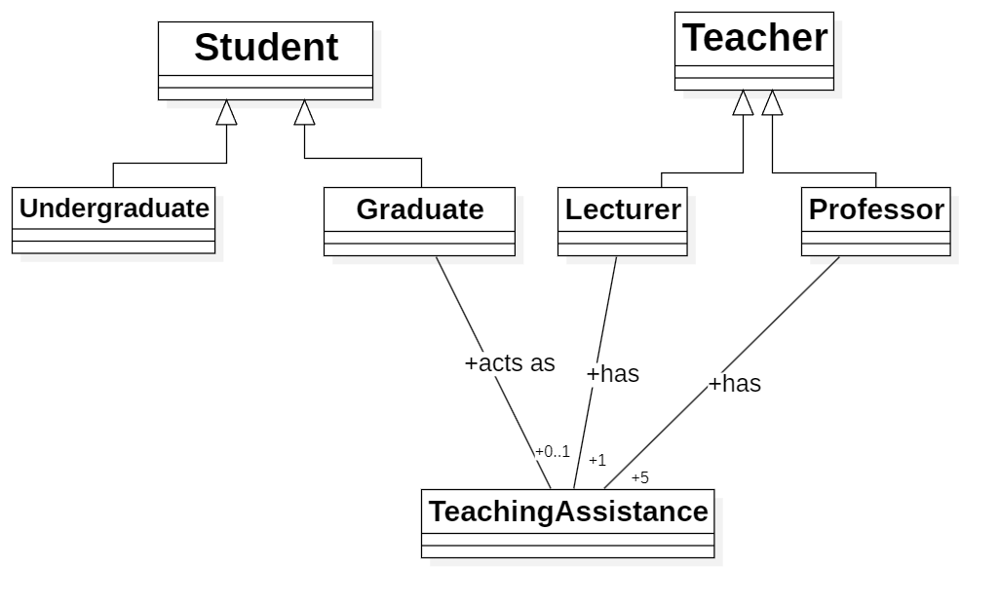
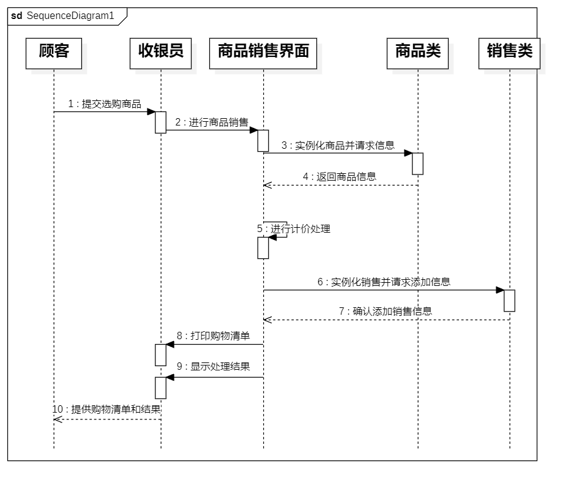
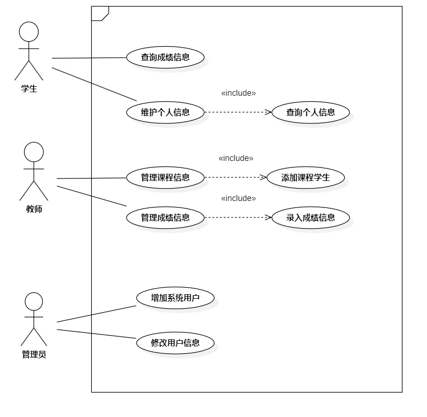
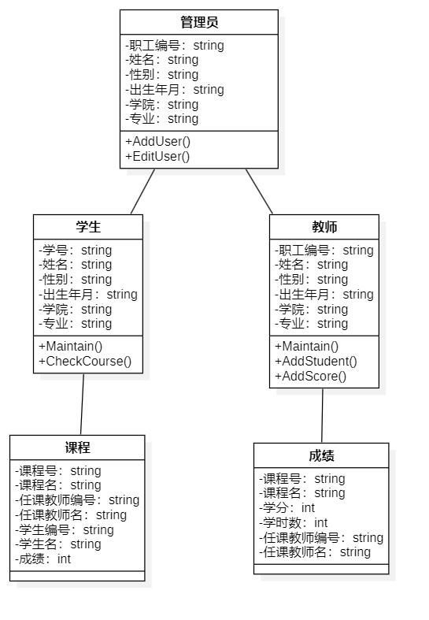
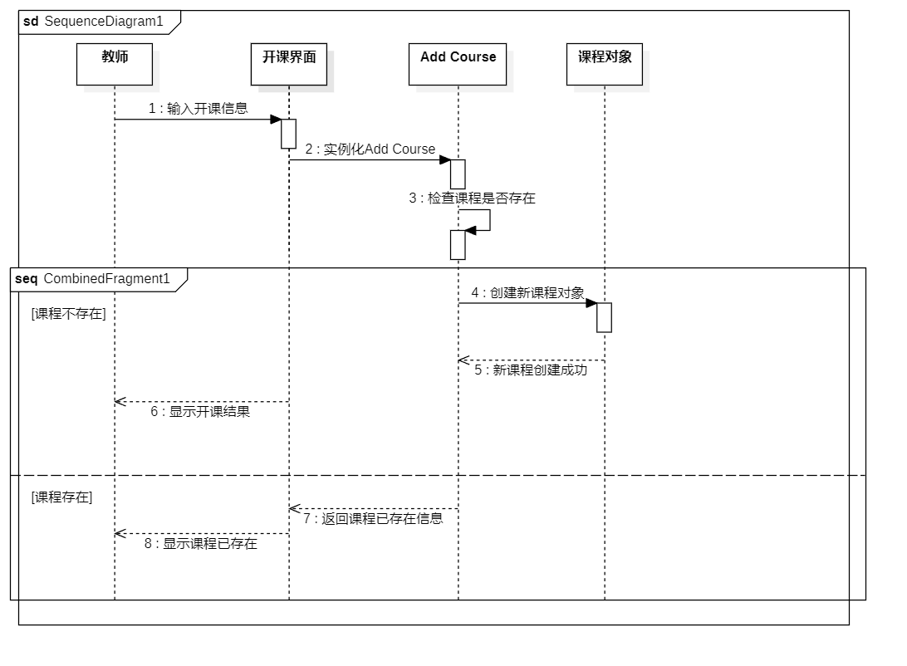

# 软工第五次作业

## **1.软件设计的概念**：

软件设计是软件开发过程中的一个阶段，它发生在需求分析之后，编码实现之前。软件设计的主要任务是确定软件的结构和行为，包括数据结构、软件架构、接口设计、组件划分等。软件设计的目标是创建一个清晰、高效、可维护和可扩展的软件系统。它通常包括高层设计（如架构设计）和低层设计（如详细设计）。

## **2.软件体系结构、软件体系结构风格和设计模式**：

- **软件体系结构**：指的是软件系统的高层结构、行为和属性。它定义了系统的主要组件、它们之间的关系以及它们与环境的交互方式。体系结构为系统的组织提供了一个蓝图，包括软件组件的配置、它们之间的连接、交互和约束。
- **软件体系结构风格**：是一组具有共同结构特点的软件体系结构的集合。常见的体系结构风格包括管道-过滤器风格、事件-驱动风格、分层风格、客户端-服务器风格等。体系结构风格提供了设计复杂软件系统时的指导原则和模式。
- **设计模式**：是在软件工程中被广泛认可的问题解决方案。它们是针对特定问题的通用解决方案，这些问题在软件开发中经常出现。设计模式不是可以直接编码的蓝图，而是描述了在特定情况下如何解决问题的模板。例如，单例模式、工厂模式、观察者模式等。

## **3.抽象和信息隐藏的例子**：

- **抽象**：是指隐藏对象的复杂性，只展示必要的信息。例如，汽车是一个抽象，它隐藏了内部复杂的机械和电子系统，只提供简单的接口（如方向盘、油门、刹车）供驾驶者操作。
- **信息隐藏**：是指保护对象的内部状态和实现细节不被外部访问。例如，在一个银行账户类中，账户余额是一个私有属性，只能通过公开的方法（如存款和取款）来修改，这样隐藏了余额的直接访问和修改，保护了账户的安全性。

## **4.高内聚/低耦合的设计**：

- **高内聚**：是指一个模块或组件内的元素彼此高度相关，共同完成一个明确的功能。高内聚的模块更易于理解和维护。
- **低耦合**：是指模块之间的依赖关系最小化，一个模块的变化对其他模块的影响最小。低耦合有助于减少系统各部分之间的相互影响，使得系统更易于修改和扩展。
强调高内聚低耦合的设计是因为这样的设计可以提高软件的可维护性、可扩展性和可重用性，降低软件的复杂性，减少错误和维护成本。

## **5.软件设计涉及的四类技术**：

- **需求分析技术**：用于理解和定义用户需求的技术，如访谈、问卷调查、用例分析等。
- **架构设计技术**：用于定义软件的高层结构的技术，如架构框架（如MVC）、设计模式的应用、组件和接口的定义等。
- **详细设计技术**：用于确定软件组件的具体实现的技术，如数据结构的选择、算法的设计、接口的详细规范等。
- **验证和测试技术**：用于验证软件设计是否满足需求和预期的技术，如单元测试、集成测试、性能测试等。

## 6.类图

## 7.顺序图

## 8.用例图 类图 顺序图

### 8.1用例图

### 8.2类图

### 8.3顺序图

