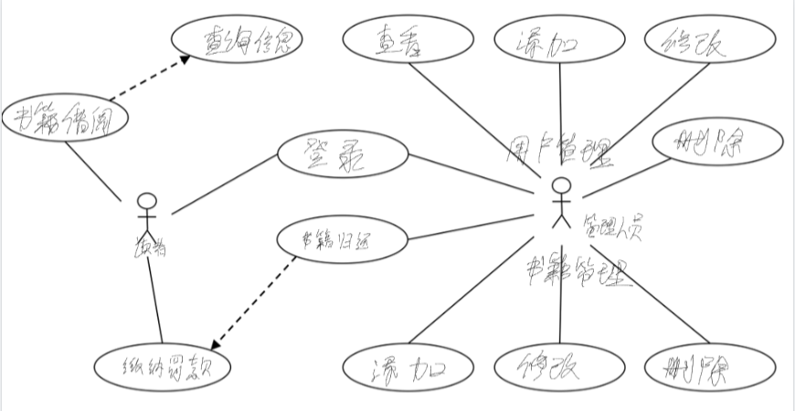

# 软工第四次作业

## 1.补充完善

## 2.新闻中心管理

~~~mermaid
classDiagram
    class 一般用户 {
        <<actor>>
        -浏览新闻
    }
    class 后台管理员 {
        <<actor>>
        -添加新闻
        -修改新闻
        -删除新闻
    }
    class 新闻浏览模块 {
        +显示新闻分类标题
        +显示新闻内容
        +显示其他相关新闻
    }
    class 新闻后台管理模块 {
        +添加新闻
        +修改新闻
        +删除新闻
    }
    
    一般用户 "1" -- "1..*" 新闻浏览模块 : 使用
    后台管理员 "1" -- "1..*" 新闻后台管理模块 : 使用

~~~

~~~mermaid
graph TD
    A[开始] --> B[显示新闻分类标题]
    B --> C[显示新闻内容]
    C --> D[显示其他相关新闻]
    D --> E[结束]

~~~

## 3.远程网络教学系统

~~~mermaid
graph TD
    subgraph 学生
        A[开始] --> B[学生登录]
        B -->|验证通过| C[显示所有可选服务]
        C --> D[选择下载服务]
        D --> E[下载课件]
        E --> F[退出系统]
        F --> G[系统注销用户信息]
        G --> H[结束]
    end

    subgraph 系统
        B -->|验证失败| I[登录失败]
        I --> H
    end

~~~

## 4.停车收费管理

~~~mermaid
graph TD
    A[开始] --> B[管理员检查停车位]
    B --> C{车位类型}
    C -->|私家停车位| D[检查是否有违规停放车辆]
    D -->|是| E[贴违规停车通知单]
    E --> F[电话通知车主]
    F --> G[记录违规时间]
    G --> H{违规停车时间}
    H -->|超过0.5小时| I[按每小时20元收费]
    H -->|不超过0.5小时| J[不收费]
    I --> K[车主根据通知单交停车费]
    J --> K
    K --> L[结束]
    
    C -->|公共停车位| M[按每小时2元收费]
    M --> L

~~~

